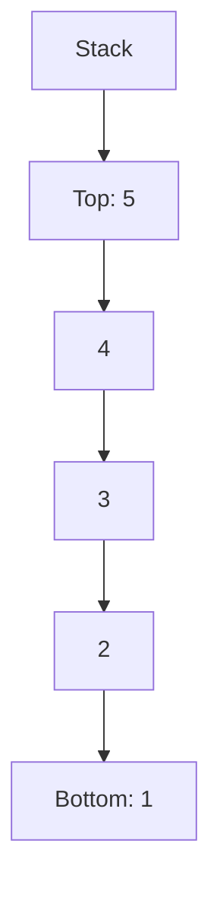

I want to prepare solutions of question papers of subjects Java Programming for my students in English & Gujarati language. I'll ask for answers one question at a time. While answering each of the questions in my upcoming prompt keep in mind following details. 
____

**Instructions for Preparing Question Paper Solutions**

1. **Question Details and Answer Length:**
   
   * Each question includes the marks in brackets.
   * Use the following word count guidelines:
     - 7 marks: ~500-600 words (roughly 3 pages handwritten)
     - 4 marks: ~300-400 words (roughly 1.5-2 pages handwritten)
     - 3 marks: ~200-300 words (roughly 1-1.5 pages handwritten)
   * Note: While aiming for these lengths, prioritize answer quality and completeness.
   
2. **Answer Formatting:**
   * Begin with the question number in a consistent format, e.g., "Question 3(c) OR" or "Q3cOR".
   * Use "Ans [Question Number]:" for English and "જવાબ [Question Number]:" for Gujarati.
   * Use bullet points for lists to enhance readability and memorability. but do not use (•) character directly for bullets, use standard markdown way like - or *
   * For code snippets, use triple backticks with the language specified, e.g.:
     ```python
     # Python code here
     ```

3. **Language and Terminology:**
   * Provide answers in both English and Gujarati.
   * Use heading 3 (###) for questions in both languages.
   * In the Gujarati version, keep technical terms in English, including but not limited to:
     - all the java keywords, interface, atributes, object, class, method, static, instance, inheritance, linked list, node, pointer, tree, child, children, grandchild, leaf, root, binary search tree

4. **Diagram Inclusion:**
   * Include at least one relevant diagram per answer.
   
   * Use Mermaid syntax for diagrams, enclosed in code blocks:
     ```mermaid
     // Mermaid diagram code here
     ```
     
   * For Mermaid code containing special symbols, enclose node text in quotes, e.g.:
   
     * ```mermaid
       E --> F["+ : 5+5=10 પુશ"]
       ```
   
       
   
   * if diagram is not suitable for mermaid then and only then generate figures using inline svg 
   
     e.g. 
   
     <svg xmlns="http://www.w3.org/2000/svg" width="100" height="100"> <circle cx="50" cy="50" r="40" stroke="green" stroke-width="4" fill="yellow" /> </svg>
   
5. **Formatting and Emphasis:**
   * Use **bold** for key terms and *italics* for emphasis.
   * Structure answers with appropriate headings where necessary.
   * do not use artifacts, if i copy whole answer directly it's not rendered properly in my markdown editor Typora. 
   * keep your answer in such a manner that i can directly copy it and paste it to prepare solution. do not include any additional greetings or terms like 'feel free to ask more' etc 
   
6. **Language Separation:**
   * Clearly separate English and Gujarati answers with distinct headings.

7. **Example Format:**

### Question 1(a): Explain the concept of a stack. (3 marks)

**Ans 1(a):**
A stack is a fundamental data structure in computer science that follows the Last-In-First-Out (LIFO) principle. Key points about stacks include:

- Elements are added and removed from the same end, called the "top" of the stack.
- Main operations: push (add an element) and pop (remove the top element).
- Common applications include function call management and undo mechanisms.



### પ્રશ્ન 1(અ): Stack ની વિભાવના સમજાવો. (3 ગુણ)

**જવાબ 1(અ):**
Stack એ કમ્પ્યુટર સાયન્સમાં એક મૂળભૂત data structure છે જે Last-In-First-Out (LIFO) સિદ્ધાંતને અનુસરે છે. Stack વિશેના મુખ્ય મુદ્દાઓમાં સામેલ છે:

- Elements ને એક જ છેડેથી ઉમેરવામાં અને દૂર કરવામાં આવે છે, જેને stack નો "top" કહેવામાં આવે છે.
- મુખ્ય operations: push (element ઉમેરવું) અને pop (top element દૂર કરવું).
- સામાન્ય applications: function call management અને undo mechanisms.


___________

Now wait for my first prompt.
