# 4343203 Summer 2024 Solution - Gujarati

## પ્રશ્ન ૧(અ): જાવામાં Garbage collection સમજાવો. (ગુણ: ૩)

### જવાબ ૧(અ)

**Garbage Collection** જાવામાં એક ઓટોમેટિક મેમરી મેનેજમેન્ટ પ્રક્રિયા છે જે:

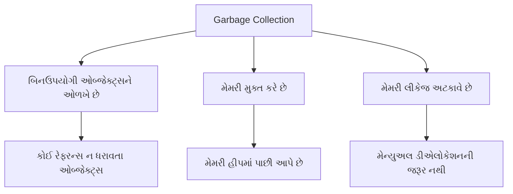

* **હેતુ**: ઓટોમેટિક રીતે **બિનઉપયોગી ઓબ્જેક્ટ્સને** મેમરીમાંથી દૂર કરે છે
* **પ્રક્રિયા**: 
  * JVM **સમયાંતરે ચેક કરે છે** કે કયા ઓબ્જેક્ટ્સને હવે રેફરન્સ નથી
  * બિનઉપયોગી ઓબ્જેક્ટ્સની **મેમરી મુક્ત કરે છે**
  * મુક્ત થયેલી મેમરી **હીપમાં પાછી આપે છે**
* **ટ્રિગર**: જ્યારે **હીપ મેમરી ઓછી થાય** અથવા **એક્સપ્લિસિટલી કોલ** થાય ત્યારે થાય છે

**યાદ રાખવા માટે**: "**ART**" - Automatic, Reclaims memory, Tracks unused objects

## પ્રશ્ન ૧(બ): JVM વિગતવાર સમજાવો. (ગુણ: ૪)

### જવાબ ૧(બ)

**Java Virtual Machine (JVM)** જાવા આર્કિટેક્ચરનો મુખ્ય ભાગ છે:

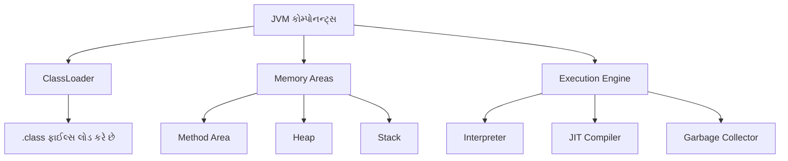

**મુખ્ય કોમ્પોનન્ટ્સ**:

* **ClassLoader**: ક્લાસ ફાઈલ્સને મેમરીમાં લોડ કરે છે
* **Memory Areas**:
  * **Method Area**: ક્લાસ સ્ટ્રક્ચર સ્ટોર કરે છે
  * **Heap**: ઓબ્જેક્ટ્સ સંગ્રહ (garbage collection)
  * **Stack**: મેથડ ફ્રેમ્સ, લોકલ વેરિએબલ્સ
* **Execution Engine**:
  * **Interpreter**: બાઇટકોડ એક્ઝિક્યુટ કરે છે
  * **JIT Compiler**: એક્ઝિક્યુશન ઓપ્ટિમાઈઝ કરે છે
  * **Garbage Collector**: મેમરી મેનેજ કરે છે

**મુખ્ય ફીચર્સ**:

* **પ્લેટફોર્મ ઇન્ડિપેન્ડન્સ** પ્રદાન કરે છે ("Write Once, Run Anywhere")
* સેન્ડબોક્સ એક્ઝિક્યુશન દ્વારા **સિક્યોરિટી** સુનિશ્ચિત કરે છે
* **મેમરી ઓટોમેટિકલી** મેનેજ કરે છે

**યાદ રાખવા માટે**: "**CLME**" - ClassLoader, Memory Areas, Execution Engine

## પ્રશ્ન ૧(ક): Fibonacci series પ્રિન્ટ કરવા માટેનો જાવા પ્રોગ્રામ લખો. (ગુણ: ૭)

### જવાબ ૧(ક)

**Fibonacci Series**: એક શ્રેણી જેમાં દરેક સંખ્યા તેની અગાઉની બે સંખ્યાઓના સરવાળા બરાબર હોય છે.


**જાવા પ્રોગ્રામ**:

```java
import java.util.Scanner;

public class FibonacciSeries {
    public static void main(String[] args) {
        // Scanner ઓબ્જેક્ટ બનાવો
        Scanner input = new Scanner(System.in);
        
        // ટર્મ્સની સંખ્યા મેળવો
        System.out.print("ટર્મ્સની સંખ્યા દાખલ કરો: ");
        int n = input.nextInt();
        
        // પ્રથમ બે ટર્મ્સ ઇનિશિયલાઇઝ કરો
        int firstTerm = 0;
        int secondTerm = 1;
        
        System.out.println(n + " ટર્મ્સ માટે Fibonacci શ્રેણી:");
        
        // પ્રથમ બે ટર્મ્સ પ્રિન્ટ કરો
        if (n >= 1) System.out.print(firstTerm + " ");
        if (n >= 2) System.out.print(secondTerm + " ");
        
        // બાકીના ટર્મ્સ જનરેટ કરો
        for (int i = 3; i <= n; i++) {
            // આગળનો ટર્મ શોધો
            int nextTerm = firstTerm + secondTerm;
            System.out.print(nextTerm + " ");
            
            // ટર્મ્સ અપડેટ કરો
            firstTerm = secondTerm;
            secondTerm = nextTerm;
        }
        
        input.close();
    }
}
```

**n=8 માટે આઉટપુટ**:

```
ટર્મ્સની સંખ્યા દાખલ કરો: 8
8 ટર્મ્સ માટે Fibonacci શ્રેણી:
0 1 1 2 3 5 8 13
```

**મુખ્ય મુદ્દાઓ**:

* પ્રથમ બે ટર્મ્સ **ઇનિશિયલાઇઝ** કરો (0, 1)
* બાકીના ટર્મ્સ જનરેટ કરવા માટે **લૂપ**નો ઉપયોગ કરો
* દરેક નવો ટર્મ = **અગાઉના બે ટર્મ્સનો સરવાળો**
* આગળના ટર્મ માટે વેરિએબલ્સ **અપડેટ** કરો

**યાદ રાખવા માટે**: "**IFLU**" - Initialize, First two terms, Loop, Update

## પ્રશ્ન ૧(ક OR): કમાન્ડ લાઇન arguments નો ઉપયોગ કરીને કોઈપણ દસ સંખ્યાઓ માંથી ન્યૂનતમ શોધવા માટે જાવા પ્રોગ્રામ લખો. (ગુણ: ૭)

### જવાબ ૧(ક OR)

**Command Line Arguments** જાવામાં પ્રોગ્રામ એક્ઝિક્યુટ થાય ત્યારે પાસ કરવામાં આવતા પેરામીટર્સ છે.


**જાવા પ્રોગ્રામ**:

```java
public class MinimumFinder {
    public static void main(String[] args) {
        // ચેક કરો કે ચોક્કસ 10 આર્ગ્યુમેન્ટ્સ આપેલા છે કે નહી
        if (args.length != 10) {
            System.out.println("કૃપા કરીને ચોક્કસ 10 નંબર કમાન્ડ લાઈન આર્ગ્યુમેન્ટ્સ તરીકે આપો");
            System.out.println("ઉદાહરણ: java MinimumFinder 45 12 67 89 23 5 78 90 34 56");
            return;
        }
        
        // પ્રથમ નંબરથી min ઇનિશિયલાઇઝ કરો
        int min = Integer.parseInt(args[0]);
        
        // બધા આર્ગ્યુમેન્ટ્સમાંથી ન્યૂનતમ શોધો
        for (int i = 1; i < args.length; i++) {
            // સ્ટ્રિંગ આર્ગ્યુમેન્ટને ઇન્ટિજરમાં રૂપાંતરિત કરો
            int num = Integer.parseInt(args[i]);
            
            // જો વર્તમાન નંબર નાનો હોય તો min અપડેટ કરો
            if (num < min) {
                min = num;
            }
        }
        
        // પરિણામ પ્રદર્શિત કરો
        System.out.println("દાખલ કરેલા નંબર્સ:");
        for (String num : args) {
            System.out.print(num + " ");
        }
        System.out.println("\nન્યૂનતમ મૂલ્ય: " + min);
    }
}
```

**એક્ઝિક્યુશન**:

```
> java MinimumFinder 45 12 67 89 23 5 78 90 34 56
દાખલ કરેલા નંબર્સ:
45 12 67 89 23 5 78 90 34 56
ન્યૂનતમ મૂલ્ય: 5
```

**મુખ્ય મુદ્દાઓ**:

* **Command-line arguments** `String[] args`માં પાસ થાય છે
* સ્ટ્રિંગ આર્ગ્યુમેન્ટ્સને `Integer.parseInt()`નો ઉપયોગ કરીને **ઇન્ટિજરમાં રૂપાંતરિત** કરો
* પ્રથમ નંબરથી **ન્યૂનતમ ઇનિશિયલાઇઝ** કરો
* દરેક નંબરને **સરખાવો** અને જો નાનો હોય તો ન્યૂનતમ અપડેટ કરો
* ઇનપુટ આર્ગ્યુમેન્ટ્સ માટે **વેલિડેશન હેન્ડલ** કરો

**યાદ રાખવા માટે**: "**ACCIH**" - Arguments, Convert, Compare, Initialize, Handle validation

## પ્રશ્ન ૨(અ): જાવા OPP ના મૂળભૂત ખ્યાલોની યાદી બનાવો. કોઈપણ એક વિગતવાર સમજાવો. (ગુણ: ૩)

### જવાબ ૨(અ)

**જાવા OOP ના મૂળભૂત ખ્યાલો**:

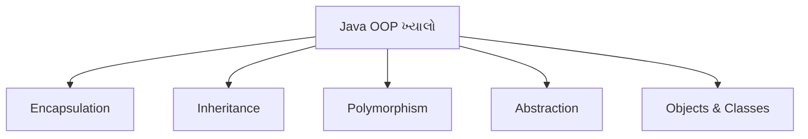

* **Encapsulation**: ડેટા અને મેથડ્સને એક એકમ તરીકે બાંધવા, ઇમ્પ્લિમેન્ટેશન છુપાવવી
* **Inheritance**: હાલના વર્ગોમાંથી નવા વર્ગો બનાવવા
* **Polymorphism**: એક ઇન્ટરફેસ, ઘણા ઇમ્પ્લિમેન્ટેશન્સ
* **Abstraction**: જટિલ ઇમ્પ્લિમેન્ટેશન વિગતો છુપાવવી
* **Objects & Classes**: મૂળભૂત બિલ્ડિંગ બ્લોક્સ

**Inheritance સમજાવટ**:

* Inheritance એ **હાલના વર્ગો**માંથી **નવા વર્ગો** બનાવવાની પ્રક્રિયા છે
* નવો વર્ગ (સબક્લાસ/ચાઇલ્ડ) હાલના વર્ગ (સુપરક્લાસ/પેરેન્ટ)માંથી **લક્ષણો અને વર્તણૂંક વારસામાં મેળવે** છે
* **extends** કીવર્ડનો ઉપયોગ કરીને અમલમાં મૂકવામાં આવે છે
* **કોડ રીયુઝેબિલિટી**ને પ્રોત્સાહન આપે છે અને **IS-A સંબંધ** સ્થાપિત કરે છે
* ઉદાહરણ: Car IS-A Vehicle, Dog IS-A Animal

**યાદ રાખવા માટે**: "**EIOPA**" - Encapsulation, Inheritance, Objects, Polymorphism, Abstraction

## પ્રશ્ન ૨(બ): final કી-વર્ડ ઉદાહરણ સાથે સમજાવો. (ગુણ: ૪)

### જવાબ ૨(બ)

**Final Keyword** જાવામાં:

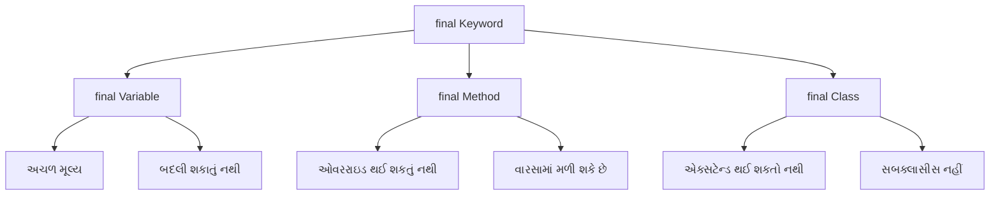

**final keyword ના ઉપયોગો**:

* **final variable**: અચળ (constant) બનાવે છે જે બદલી શકાતા નથી
* **final method**: સબક્લાસમાં ઓવરરાઇડ થઈ શકતી નથી
* **final class**: એક્સટેન્ડ થઈ શકતો નથી (ઇન્હેરિટન્સ નહીં)

**ઉદાહરણ**:

```java
public class FinalDemo {
    // final variable (constant)
    final double PI = 3.14159;
    
    // final method
    final void display() {
        System.out.println("આ મેથડ ઓવરરાઇડ થઈ શકતી નથી");
    }
    
    public static void main(String[] args) {
        FinalDemo obj = new FinalDemo();
        
        // final variable નો ઉપયોગ
        System.out.println("PI નું મૂલ્ય: " + obj.PI);
        
        // final variable ને બદલી શકાતું નથી
        // obj.PI = 3.14;  // કમ્પાઇલેશન એરર
        
        // final method ને કોલ કરવી
        obj.display();
    }
}

// Final class
final class SecureClass {
    void show() {
        System.out.println("આ ક્લાસ એક્સટેન્ડ થઈ શકતો નથી");
    }
}

// final class ને એક્સટેન્ડ કરી શકાતું નથી
// class ChildClass extends SecureClass {} // કમ્પાઇલેશન એરર
```

**યાદ રાખવા માટે**: "**VCM**" - Variables (constant), Cannot extend, Methods (no override)

## પ્રશ્ન ૨(ક): કન્સ્ટ્રક્ટર શું છે? Parameterized કન્સ્ટ્રક્ટર ને ઉદાહરણ સાથે સમજાવો. (ગુણ: ૭)

### જવાબ ૨(ક)

**Constructor**: એક વિશેષ મેથડ જે **ઑબ્જેક્ટ્સને ઇનિશિયલાઇઝ** કરવા માટે વપરાય છે. તે **ક્લાસના નામ જેવું જ નામ** ધરાવે છે અને **કોઈ રિટર્ન ટાઈપ નથી**.


**લક્ષણો**:

* ક્લાસ જેવું **સમાન નામ**
* **કોઈ રિટર્ન ટાઈપ નહીં**
* ઑબ્જેક્ટ બનાવવામાં આવે ત્યારે **આપોઆપ કૉલ** થાય છે
* ઇન્સ્ટન્સ વેરીએબલ્સ **ઇનિશિયલાઇઝ** કરે છે

**Parameterized Constructor નું ઉદાહરણ**:

```java
public class Student {
    // ઇન્સ્ટન્સ વેરીએબલ્સ
    private int rollNo;
    private String name;
    private double percentage;
    
    // Parameterized constructor
    public Student(int roll, String studentName, double marks) {
        rollNo = roll;
        name = studentName;
        percentage = marks;
    }
    
    // વિદ્યાર્થી વિગતો દર્શાવવા માટેની મેથડ
    public void displayDetails() {
        System.out.println("રોલ નંબર: " + rollNo);
        System.out.println("નામ: " + name);
        System.out.println("ટકાવારી: " + percentage + "%");
    }
    
    public static void main(String[] args) {
        // Parameterized constructor નો ઉપયોગ કરીને ઑબ્જેક્ટ્સ બનાવવા
        Student s1 = new Student(101, "રાહુલ", 85.7);
        Student s2 = new Student(102, "પ્રિયા", 92.3);
        
        // વિગતો દર્શાવવી
        System.out.println("પ્રથમ વિદ્યાર્થી:");
        s1.displayDetails();
        
        System.out.println("\nદ્વિતીય વિદ્યાર્થી:");
        s2.displayDetails();
    }
}
```

**મુખ્ય મુદ્દાઓ**:

* **ચોક્કસ મૂલ્યો** સાથે ઇનિશિયલાઇઝેશનની મંજૂરી આપે છે
* **ઑબ્જેક્ટ ક્રિએશન** દરમિયાન પેરામીટર્સ પાસ કરવામાં આવે છે
* **વિવિધ સ્થિતિઓ** સાથે ઘણા ઑબ્જેક્ટ્સ બનાવે છે
* વેરીએબલ્સ ઇનિશિયલાઇઝ કરવા માટે **setter મેથડ્સની જરૂર નથી**

**યાદ રાખવા માટે**: "**PINS**" - Parameters, Initialize, No return type, Same name

## પ્રશ્ન ૨(અ OR): ઉદાહરણ સાથે જાવા પ્રોગ્રામ સ્ટ્રક્ચર સમજાવો. (ગુણ: ૩)

### જવાબ ૨(અ OR)

**જાવા પ્રોગ્રામ સ્ટ્રક્ચર**:

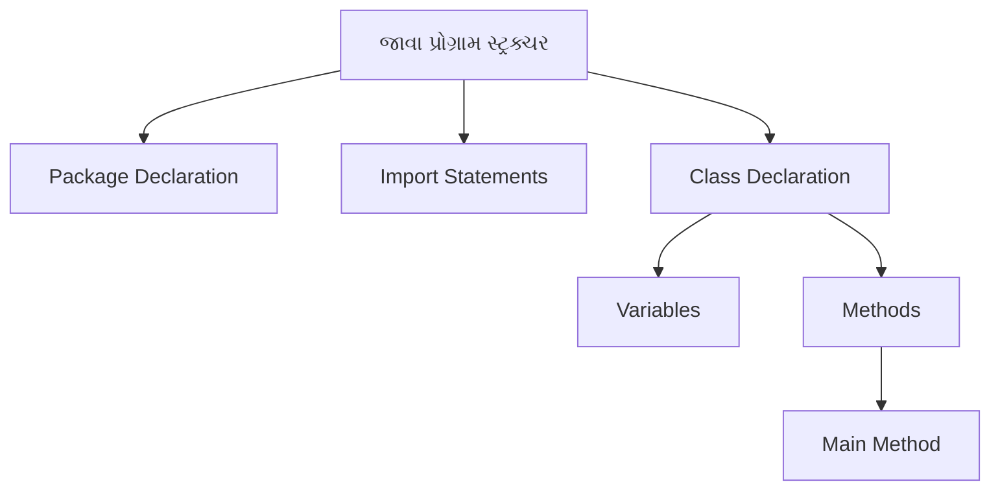

**જાવા પ્રોગ્રામના ઘટકો**:

* **Package Declaration**: (વૈકલ્પિક) સંબંધિત ક્લાસીસને ઓર્ગેનાઇઝ કરે છે
* **Import Statements**: (વૈકલ્પિક) અન્ય પેકેજમાંથી ક્લાસીસને એક્સેસ કરે છે
* **Class Declaration**: (જરૂરી) કોડનો કન્ટેનર
* **Variables**: ડેટા સ્ટોર કરે છે
* **Methods**: વર્તણૂંક વ્યાખ્યાયિત કરે છે, main method સહિત
* **Main Method**: પ્રોગ્રામ એક્ઝિક્યુશનનું પ્રવેશ બિંદુ

**ઉદાહરણ**:

```java
// 1. Package Declaration (વૈકલ્પિક)
package com.example;

// 2. Import Statements (વૈકલ્પિક)
import java.util.Scanner;

// 3. Class Declaration (જરૂરી)
public class HelloWorld {
    // 4. Variables
    String message = "Hello, World!";
    
    // 5. Methods
    public void displayMessage() {
        System.out.println(message);
    }
    
    // 6. Main Method (પ્રવેશ બિંદુ)
    public static void main(String[] args) {
        // ક્લાસનો ઑબ્જેક્ટ બનાવો
        HelloWorld obj = new HelloWorld();
        
        // મેથડને કૉલ કરો
        obj.displayMessage();
    }
}
```

**યાદ રાખવા માટે**: "**PICVM**" - Package, Import, Class, Variables, Methods

## પ્રશ્ન ૨(બ OR): યોગ્ય ઉદાહરણ સાથે static કી-વર્ડ સમજાવો. (ગુણ: ૪)

### જવાબ ૨(બ OR)

**Static Keyword** જાવામાં:

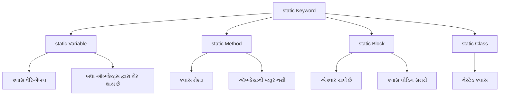

**static ના ઉપયોગો**:

* **static variable**: ક્લાસના બધા જ ઇન્સ્ટન્સીસ વચ્ચે શેર થાય છે
* **static method**: ઑબ્જેક્ટ્સ બનાવ્યા વગર કૉલ થઈ શકે છે
* **static block**: ક્લાસ લોડ થાય ત્યારે એક્ઝિક્યુટ થાય છે
* **static nested class**: ઇન્સ્ટન્સને બદલે ક્લાસને જ સંબંધિત હોય છે

**ઉદાહરણ**:

```java
public class CounterDemo {
    // Static variable - બધા ઑબ્જેક્ટ્સ દ્વારા શેર થાય છે
    static int count = 0;
    
    // ઇન્સ્ટન્સ વેરિએબલ - દરેક ઑબ્જેક્ટ માટે અનન્ય
    int instanceNumber;
    
    // Static block - ક્લાસ લોડ થાય ત્યારે ચાલે છે
    static {
        System.out.println("Static block એક્ઝિક્યુટ થયો");
        count = 10; // static variable ઇનિશિયલાઇઝ કરો
    }
    
    // Constructor
    public CounterDemo() {
        count++;          // કાઉન્ટર વધારો
        instanceNumber = count;  // ઇન્સ્ટન્સ નંબર એસાઇન કરો
    }
    
    // Static method
    public static void displayCount() {
        System.out.println("કુલ ઑબ્જેક્ટ્સ: " + count);
        // ઇન્સ્ટન્સ વેરિએબલ્સ સીધા એક્સેસ કરી શકાતા નથી
        // System.out.println(instanceNumber); // એરર!
    }
    
    // ઇન્સ્ટન્સ મેથડ
    public void displayInfo() {
        System.out.println("આ ઑબ્જેક્ટ #" + instanceNumber + " છે");
        System.out.println("કુલ કાઉન્ટ: " + count); // static variables એક્સેસ કરી શકે છે
    }
    
    public static void main(String[] args) {
        // ઑબ્જેક્ટ વગર static method કૉલ કરવી
        CounterDemo.displayCount(); // આઉટપુટ: કુલ ઑબ્જેક્ટ્સ: 10
        
        // ઑબ્જેક્ટ્સ બનાવો
        CounterDemo obj1 = new CounterDemo();
        CounterDemo obj2 = new CounterDemo();
        
        // ઇન્સ્ટન્સ મેથડ્સ કૉલ કરો
        obj1.displayInfo(); // આઉટપુટ: આ ઑબ્જેક્ટ #11 છે, કુલ કાઉન્ટ: 12
        obj2.displayInfo(); // આઉટપુટ: આ ઑબ્જેક્ટ #12 છે, કુલ કાઉન્ટ: 12
        
        // ફરીથી static method કૉલ કરો
        CounterDemo.displayCount(); // આઉટપુટ: કુલ ઑબ્જેક્ટ્સ: 12
    }
}
```

**મુખ્ય મુદ્દાઓ**:

* Static members **ક્લાસને સંબંધિત** છે (ઑબ્જેક્ટ્સ નહીં)
* તેઓ ક્લાસ લોડ થાય ત્યારે **મેમરીમાં લોડ** થાય છે
* Static methods **ઇન્સ્ટન્સ વેરિએબલ્સ/મેથડ્સને સીધા એક્સેસ** કરી શકતી નથી
* **યુટિલિટી મેથડ્સ**, **અચળ અંકો**, અને **કાઉન્ટર્સ** માટે વપરાય છે

**યાદ રાખવા માટે**: "**BCCS**" - Belongs to Class, Class-level, Shared memory, Static methods

## પ્રશ્ન ૨(ક OR): ઇનહેરીટન્સ વ્યાખ્યાયિત કરો. તેના પ્રકારોની યાદી બનાવો. Multilevel અને Hierarchical ઇનહેરીટન્સ ને યોગ્ય ઉદાહરણ સાથે સમજાવો. (ગુણ: ૭)

### જવાબ ૨(ક OR)

**Inheritance**: એક પ્રક્રિયા જેમાં એક ક્લાસ બીજા ક્લાસના ગુણધર્મો અને વર્તણૂંક મેળવે છે.

**Inheritance ના પ્રકારો**:

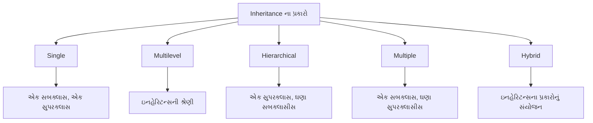

| પ્રકાર | વર્ણન |
|------|-------------|
| **Single** | એક સબક્લાસ એક સુપરક્લાસમાંથી વારસો મેળવે છે |
| **Multilevel** | ઇનહેરિટન્સની શ્રેણી (A → B → C) |
| **Hierarchical** | ઘણા ક્લાસીસ એક સુપરક્લાસમાંથી વારસો મેળવે છે |
| **Multiple** | એક ક્લાસ ઘણા ક્લાસમાંથી વારસો મેળવે છે (જાવામાં ઇન્ટરફેસ દ્વારા) |
| **Hybrid** | ઘણા ઇનહેરિટન્સ પ્રકારોનું સંયોજન |

**Multilevel Inheritance ઉદાહરણ**:

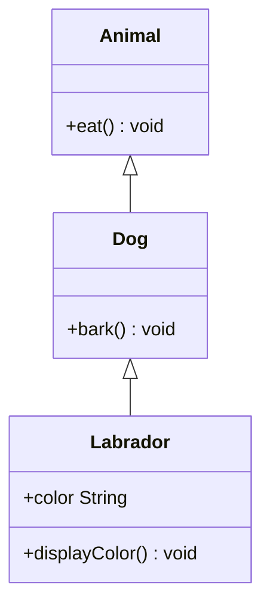

```java
// બેઇઝ ક્લાસ
class Animal {
    void eat() {
        System.out.println("પ્રાણી ખાય છે");
    }
}

// મધ્યવર્તી ક્લાસ
class Dog extends Animal {
    void bark() {
        System.out.println("કૂતરો ભસે છે");
    }
}

// ડેરાઇવ્ડ ક્લાસ
class Labrador extends Dog {
    String color;
    
    Labrador(String color) {
        this.color = color;
    }
    
    void displayColor() {
        System.out.println("રંગ " + color + " છે");
    }
}

// મેઇન ક્લાસ
public class MultilevelDemo {
    public static void main(String[] args) {
        Labrador lab = new Labrador("ગોલ્ડન");
        
        // Animal ક્લાસની મેથડ્સ
        lab.eat();  
        
        // Dog ક્લાસની મેથડ્સ
        lab.bark(); 
        
        // Labrador ક્લાસની મેથડ્સ
        lab.displayColor();
    }
}
```

**Hierarchical Inheritance ઉદાહરણ**:

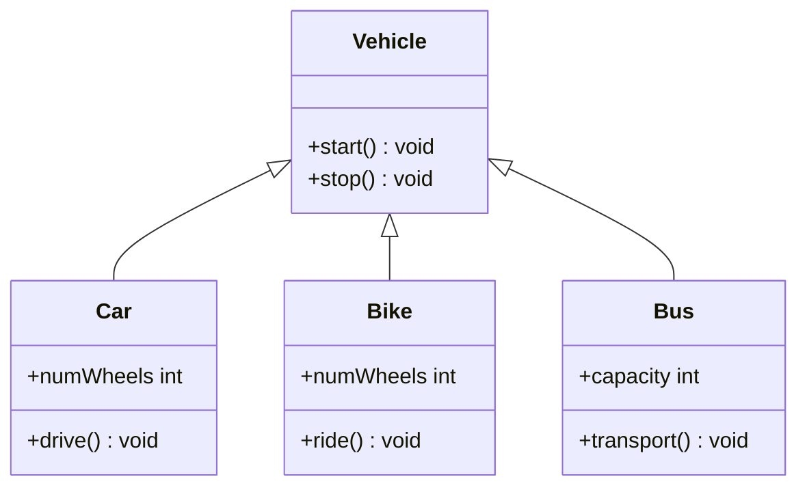

```java
// બેઇઝ ક્લાસ
class Vehicle {
    void start() {
        System.out.println("વાહન શરૂ થયું");
    }
    
    void stop() {
        System.out.println("વાહન બંધ થયું");
    }
}

// ડેરાઇવ્ડ ક્લાસ 1
class Car extends Vehicle {
    int numWheels = 4;
    
    void drive() {
        System.out.println("કાર " + numWheels + " પૈડા સાથે ચાલી રહી છે");
    }
}

// ડેરાઇવ્ડ ક્લાસ 2
class Bike extends Vehicle {
    int numWheels = 2;
    
    void ride() {
        System.out.println("બાઇક " + numWheels + " પૈડા સાથે ચાલી રહી છે");
    }
}

// ડેરાઇવ્ડ ક્લાસ 3
class Bus extends Vehicle {
    int capacity = 40;
    
    void transport() {
        System.out.println("બસ " + capacity + " મુસાફરોને લઈ જઈ રહી છે");
    }
}

// મેઇન ક્લાસ
public class HierarchicalDemo {
    public static void main(String[] args) {
        Car car = new Car();
        Bike bike = new Bike();
        Bus bus = new Bus();
        
        // Car મેથડ્સ
        car.start();  // Vehicle માંથી
        car.drive();  // Car માંથી
        car.stop();   // Vehicle માંથી
        
        System.out.println();
        
        // Bike મેથડ્સ
        bike.start(); // Vehicle માંથી
        bike.ride();  // Bike માંથી
        bike.stop();  // Vehicle માંથી
        
        System.out.println();
        
        // Bus મેથડ્સ
        bus.start();     // Vehicle માંથી
        bus.transport(); // Bus માંથી
        bus.stop();      // Vehicle માંથી
    }
}
```

**મુખ્ય મુદ્દાઓ**:

* **Multilevel Inheritance**: **ઇનહેરિટન્સની શ્રેણી** બનાવે છે (દા.ત. Animal → Dog → Labrador)
* **Hierarchical Inheritance**: ઘણા ક્લાસીસ **એક બેઝ ક્લાસમાંથી** વારસો મેળવે છે (દા.ત. Vehicle → Car/Bike/Bus)
* બંને **કોડ રીયુઝેબિલિટી**ને પ્રોત્સાહન આપે છે
* જાવા ક્લાસીસ સાથે **મલ્ટિપલ ઇનહેરિટન્સનું સમર્થન કરતું નથી** (તેના બદલે ઇન્ટરફેસનો ઉપયોગ કરે છે)

**યાદ રાખવા માટે**: "**MASH**" - Multilevel (chain), Acquire properties, Single superclass, Hierarchical (tree)

## પ્રશ્ન ૩(અ): this કી-વર્ડને યોગ્ય ઉદાહરણ સાથે સમજાવો. (ગુણ: ૩)

### જવાબ ૩(અ)

**'this' keyword** જાવામાં વર્તમાન ઑબ્જેક્ટ ઇન્સ્ટન્સનો સંદર્ભ આપે છે.

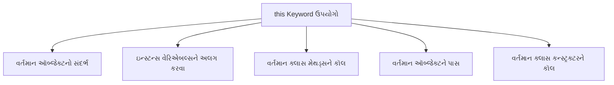

**'this' keyword ના મુખ્ય ઉપયોગો**:

* **વેરિએબલ શેડોઇંગ નિવારવા**: પેરામીટર્સથી ઇન્સ્ટન્સ વેરિએબલ્સને અલગ પાડવા
* **કન્સ્ટ્રક્ટર કૉલ**: એ જ ક્લાસમાં બીજા કન્સ્ટ્રક્ટરને કૉલ કરવા (`this()`)
* **વર્તમાન ઑબ્જેક્ટ રિટર્ન**: મેથડ ચેઇનિંગ માટે વર્તમાન ઇન્સ્ટન્સ પાછું આપવું
* **વર્તમાન ઑબ્જેક્ટ પાસ**: પેરામીટર તરીકે વર્તમાન ઑબ્જેક્ટને પાસ કરવું

**ઉદાહરણ**:

```java
public class Person {
    // ઇન્સ્ટન્સ વેરિએબલ્સ
    private String name;
    private int age;
    
    // પેરામીટર્સ સાથે કન્સ્ટ્રક્ટર
    public Person(String name, int age) {
        // ઇન્સ્ટન્સ વેરિએબલ્સને સંદર્ભિત કરવા 'this' નો ઉપયોગ
        this.name = name;  // 'this' વગર, name પેરામીટરને રેફર કરશે
        this.age = age;    // 'this' વગર, age પેરામીટરને રેફર કરશે
    }
    
    // 'this' નો ઉપયોગ કરીને બીજી મેથડને કૉલ કરતી મેથડ
    public void display() {
        System.out.println("નામ: " + this.name);
        System.out.println("ઉંમર: " + this.age);
        this.greet();  // અહીં 'this' વૈકલ્પિક છે
    }
    
    // કૉલ કરવા માટેની મેથડ
    public void greet() {
        System.out.println(this.name + " તરફથી નમસ્કાર");
    }
    
    public static void main(String[] args) {
        Person person = new Person("જોન", 25);
        person.display();
    }
}
```

**યાદ રાખવા માટે**: "**RICP**" - Reference variables, Instance methods, Constructor call, Pass object

## પ્રશ્ન ૩(બ): જાવામાં વિવિધ એક્સેસ કંટ્રોલ સમજાવો. (ગુણ: ૪)

### જવાબ ૩(બ)

**Access Modifiers** જાવામાં ક્લાસ, મેથડ્સ, અને વેરિએબલ્સની એક્સેસ અને દૃશ્યતાને નિયંત્રિત કરે છે.

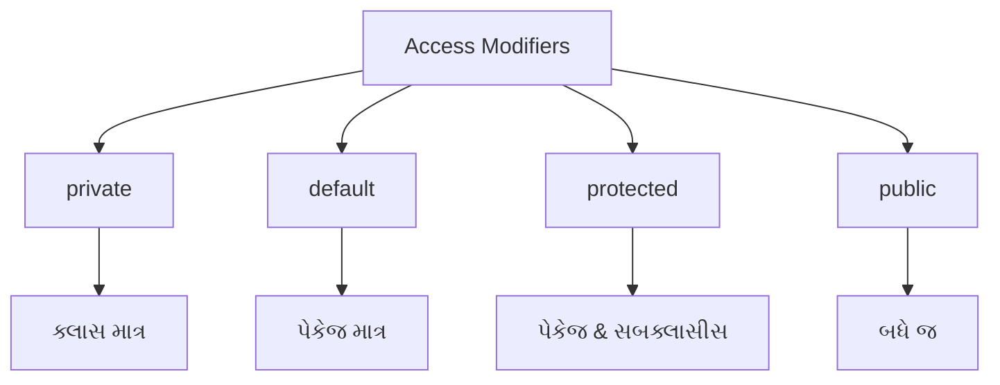

**જાવા એક્સેસ કંટ્રોલ લેવલ્સ**:

| Modifier | Class | Package | Subclass | World |
|----------|-------|---------|----------|-------|
| **private** | હા | ના | ના | ના |
| **default** | હા | હા | ના | ના |
| **protected** | હા | હા | હા | ના |
| **public** | હા | હા | હા | હા |

**ઉદાહરણ**:

```java
public class AccessDemo {
    private int privateVar = 10;      // ક્લાસ માત્ર
    int defaultVar = 20;              // પેકેજ
    protected int protectedVar = 30;  // પેકેજ & સબક્લાસીસ
    public int publicVar = 40;        // બધે જ
    
    public void showValues() {
        // પોતાની ક્લાસમાં બધા જ વેરિએબલ્સને એક્સેસ કરી શકે
        System.out.println("Private: " + privateVar);
        System.out.println("Default: " + defaultVar);
        System.out.println("Protected: " + protectedVar);
        System.out.println("Public: " + publicVar);
    }
}
```

**ફાયદાઓ**:

* **Encapsulation**: ઇમ્પ્લિમેન્ટેશન વિગતો છુપાવવી
* **Security**: અનધિકૃત એક્સેસ અટકાવવી
* **Maintainability**: શું સુધારી શકાય તેનું નિયંત્રણ રાખવું

**યાદ રાખવા માટે**: "**PDPP**" - Private, Default, Protected, Public

## પ્રશ્ન ૩(ક): ઈન્ટરફેસ શું છે? ઈન્ટરફેસ દ્વારા ઉદાહરણ સાથે multiple inheritance સમજાવો. (ગુણ: ૭)

### જવાબ ૩(ક)

**Interface**: એક ક્લાસનો બ્લુપ્રિન્ટ જેમાં abstract methods અને constants હોય છે.

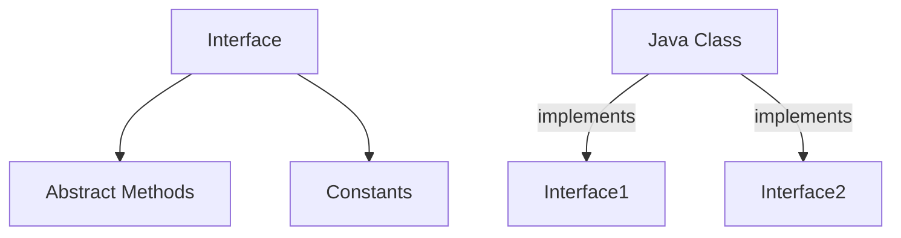

**મુખ્ય લક્ષણો**:

* મેથડ્સ ડિફોલ્ટ રીતે **public** અને **abstract** હોય છે
* વેરિએબલ્સ **public**, **static**, અને **final** હોય છે
* ક્લાસ ઇન્ટરફેસને **implement** કરે છે
* ક્લાસ **ઘણા ઇન્ટરફેસીસ** implement કરી શકે છે

**Multiple Inheritance ઉદાહરણ**:

```java
// પ્રથમ ઇન્ટરફેસ
interface Drawable {
    void draw();  // Abstract method
    int SIZE = 10;  // Constant
}

// બીજો ઇન્ટરફેસ
interface Colorable {
    void setColor(String color);
    String getColor();
}

// ઘણા ઇન્ટરફેસીસ implement કરતો ક્લાસ
class Circle implements Drawable, Colorable {
    private String color;
    
    @Override
    public void draw() {
        System.out.println(SIZE + " સાઇઝનો સર્કલ દોરી રહ્યા છીએ");
    }
    
    @Override
    public void setColor(String color) {
        this.color = color;
        System.out.println("સર્કલનો રંગ " + color + " સેટ કર્યો");
    }
    
    @Override
    public String getColor() {
        return color;
    }
}

// મેઇન ક્લાસ
public class InterfaceDemo {
    public static void main(String[] args) {
        Circle c = new Circle();
        
        // બંને ઇન્ટરફેસીસની મેથડ્સનો ઉપયોગ
        c.draw();
        c.setColor("લાલ");
        System.out.println("રંગ: " + c.getColor());
        
        // ઇન્ટરફેસ સાથે પોલિમોર્ફિઝમ
        Drawable d = new Circle();
        d.draw();  // માત્ર Drawable મેથડ્સને જ એક્સેસ કરી શકે
        
        Colorable col = new Circle();
        col.setColor("વાદળી");  // માત્ર Colorable મેથડ્સને જ એક્સેસ કરી શકે
    }
}
```

**ઇન્ટરફેસ સાથે Multiple Inheritance**:

* જાવા ક્લાસીસ સાથે **મલ્ટિપલ ઇન્હેરિટન્સની મંજૂરી આપતું નથી**
* ક્લાસ **ઘણા ઇન્ટરફેસીસ** implement કરી શકે છે
* દરેક ઇન્ટરફેસ અલગ અલગ **વર્તણૂકો** પ્રદાન કરે છે
* મલ્ટિપલ ઇન્હેરિટન્સમાં મળતી **ડાયમંડ પ્રોબ્લેમ**નું સમાધાન કરે છે

**યાદ રાખવા માટે**: "**CALM**" - Constants, Abstract methods, Like multiple inheritance, Methods without implementation

## પ્રશ્ન ૩(અ OR): super કી-વર્ડ ઉદાહરણ સાથે સમજાવો. (ગુણ: ૩)

### જવાબ ૩(અ OR)

**'super' keyword** જાવામાં વર્તમાન ઑબ્જેક્ટના પેરેન્ટ ક્લાસ (સુપરક્લાસ)નો સંદર્ભ આપે છે.

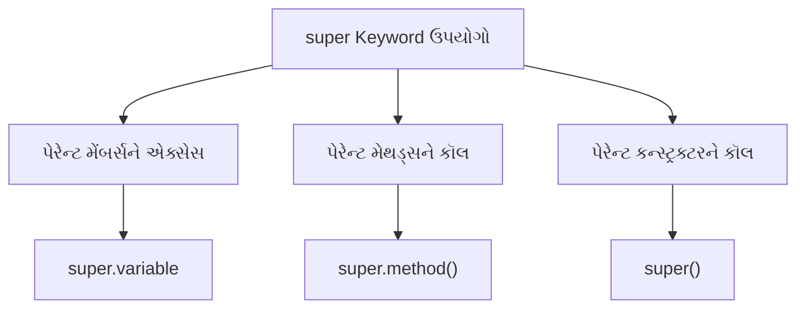

**'super' keyword ના મુખ્ય ઉપયોગો**:

* **પેરેન્ટ ક્લાસ વેરિએબલ્સને એક્સેસ**: `super.variable`
* **પેરેન્ટ ક્લાસ મેથડ્સને કૉલ**: `super.method()`
* **પેરેન્ટ ક્લાસ કન્સ્ટ્રક્ટરને કૉલ**: `super()` અથવા `super(parameters)`

**ઉદાહરણ**:

```java
// પેરેન્ટ ક્લાસ
class Animal {
    String color = "સફેદ";
    
    void eat() {
        System.out.println("પ્રાણી ખાઈ રહ્યું છે");
    }
    
    Animal() {
        System.out.println("Animal કન્સ્ટ્રક્ટર કૉલ થયો");
    }
}

// ચાઇલ્ડ ક્લાસ
class Dog extends Animal {
    String color = "કાળો";
    
    void printColor() {
        // એક જ નામના પેરેન્ટ વેરિએબલને એક્સેસ
        System.out.println("પેરેન્ટ રંગ: " + super.color);
        System.out.println("ચાઇલ્ડ રંગ: " + color);
    }
    
    void eat() {
        // પેરેન્ટ મેથડને કૉલ
        super.eat();
        System.out.println("કૂતરો ખાઈ રહ્યો છે");
    }
    
    Dog() {
        // પેરેન્ટ કન્સ્ટ્રક્ટરને કૉલ
        super();
        System.out.println("Dog કન્સ્ટ્રક્ટર કૉલ થયો");
    }
}

// મેઇન ક્લાસ
public class SuperDemo {
    public static void main(String[] args) {
        Dog dog = new Dog();
        dog.printColor();
        dog.eat();
    }
}
```

**આઉટપુટ**:

```
Animal કન્સ્ટ્રક્ટર કૉલ થયો
Dog કન્સ્ટ્રક્ટર કૉલ થયો
પેરેન્ટ રંગ: સફેદ
ચાઇલ્ડ રંગ: કાળો
પ્રાણી ખાઈ રહ્યું છે
કૂતરો ખાઈ રહ્યો છે
```

**યાદ રાખવા માટે**: "**VCM**" - Variables (parent), Call methods, Method overriding

## પ્રશ્ન ૩(બ OR): પેકેજ શું છે? પેકેજ બનાવવાના પગલાં લખો અને તેનું ઉદાહરણ આપો. (ગુણ: ૪)

### જવાબ ૩(બ OR)

**Package**: એક નેમસ્પેસ જે સંબંધિત ક્લાસ અને ઇન્ટરફેસીસને ઓર્ગેનાઇઝ કરે છે.

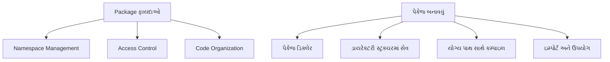

**પેકેજ બનાવવાના પગલાં**:

1. સોર્સ ફાઇલની શરૂઆતમાં **પેકેજ ડિક્લેર** કરો
2. ફાઇલને પેકેજ નામ સાથે મેળ ખાતા ડાયરેક્ટરી સ્ટ્રક્ચરમાં **સેવ** કરો
3. યોગ્ય ડાયરેક્ટરી સ્ટ્રક્ચર સાથે ફાઇલને **કમ્પાઇલ** કરો
4. અન્ય ક્લાસમાં પેકેજને **ઇમ્પોર્ટ** અને ઉપયોગ કરો

**ઉદાહરણ**:

**પગલું 1**: પેકેજ ડિક્લેરેશન સાથે ક્લાસ બનાવો

```java
// ફાઇલ: Calculator.java
package com.mymath.util;

public class Calculator {
    // મેથડ્સ
    public int add(int a, int b) {
        return a + b;
    }
    
    public int subtract(int a, int b) {
        return a - b;
    }
    
    public int multiply(int a, int b) {
        return a * b;
    }
    
    public double divide(int a, int b) {
        if (b == 0) {
            System.out.println("શૂન્ય વડે ભાગી શકાતું નથી");
            return 0;
        }
        return (double)a / b;
    }
}
```

**પગલું 2**: ફાઇલને યોગ્ય ડાયરેક્ટરી સ્ટ્રક્ચરમાં સેવ કરો

```
project_root/
└── com/
    └── mymath/
        └── util/
            └── Calculator.java
```

**પગલું 3**: ફાઇલને કમ્પાઇલ કરો

```bash
# project_root પર નેવિગેટ કરો
cd project_root

# કમ્પાઇલ
javac com/mymath/util/Calculator.java
```

**પગલું 4**: પેકેજનો ઉપયોગ કરતો ક્લાસ બનાવો

```java
// ફાઇલ: PackageDemo.java
// પેકેજ ઇમ્પોર્ટ
import com.mymath.util.Calculator;

public class PackageDemo {
    public static void main(String[] args) {
        // Calculator ક્લાસનો ઑબ્જેક્ટ બનાવો
        Calculator calc = new Calculator();
        
        // મેથડ્સનો ઉપયોગ
        System.out.println("10 + 5 = " + calc.add(10, 5));
        System.out.println("10 - 5 = " + calc.subtract(10, 5));
        System.out.println("10 * 5 = " + calc.multiply(10, 5));
        System.out.println("10 / 5 = " + calc.divide(10, 5));
    }
}
```

**પગલું 5**: મેઇન ક્લાસને કમ્પાઇલ અને ચલાવો

```bash
# કમ્પાઇલ
javac -classpath . PackageDemo.java

# ચલાવો
java -classpath . PackageDemo
```

**આઉટપુટ**:

```
10 + 5 = 15
10 - 5 = 5
10 * 5 = 50
10 / 5 = 2.0
```

**યાદ રાખવા માટે**: "**SCIR**" - Save in structure, Compile with path, Import package, Run with classpath

## પ્રશ્ન ૩(ક OR): વ્યાખ્યાયિત કરો: Method Overriding. Method overriding માટેના નિયમોની યાદી બનાવો. Method overriding ને ઇમ્પ્લિમેન્ટ કરતો java પ્રોગ્રામ લખો. (ગુણ: ૭)

### જવાબ ૩(ક OR)

**Method Overriding**: સબક્લાસમાં પેરેન્ટ ક્લાસમાં પહેલેથી જ વ્યાખ્યાયિત મેથડ માટે અલગ ઇમ્પ્લિમેન્ટેશન પ્રદાન કરવું.

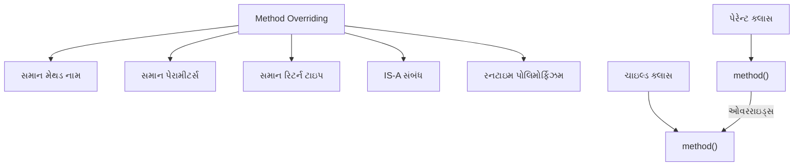

**Method Overriding માટેના નિયમો**:

* મેથડ પેરેન્ટ ક્લાસ મેથડ જેવું **સમાન નામ** ધરાવતી હોવી જોઈએ
* મેથડમાં **સમાન પેરામીટર્સ** (સંખ્યા, પ્રકાર, ક્રમ) હોવા જોઈએ
* રિટર્ન ટાઇપ પેરેન્ટ મેથડના રિટર્ન ટાઇપનો **સમાન અથવા સબટાઇપ** હોવો જોઈએ
* એક્સેસ મોડિફાયર પેરેન્ટ મેથડ કરતાં **સમાન અથવા ઓછો પ્રતિબંધિત** હોવો જોઈએ
* **static** મેથડ્સને ઓવરરાઇડ કરી શકાતી નથી (method hiding થાય છે)
* **final** મેથડ્સને ઓવરરાઇડ કરી શકાતી નથી
* **private** મેથડ્સને ઓવરરાઇડ કરી શકાતી નથી (સબક્લાસને દેખાતી નથી)
* ઓવરરાઇડ થયેલી મેથડ પેરેન્ટ મેથડની સરખામણીમાં **સમાન, સબટાઇપ, અથવા કોઈ પણ એક્સેપ્શન્સ ફેંકી** શકે છે

**Method Overriding નું ઉદાહરણ**:

```java
// પેરેન્ટ ક્લાસ
class Vehicle {
    // ઓવરરાઇડ થનારી મેથડ
    public void move() {
        System.out.println("વાહન ચાલી રહ્યું છે");
    }
    
    // final મેથડ - ઓવરરાઇડ થઈ શકતી નથી
    public final void stop() {
        System.out.println("વાહન રોકાઈ ગયું");
    }
    
    // રિટર્ન ટાઇપ ધરાવતી મેથડ
    public int getMaxSpeed() {
        return 100;
    }
    
    // static મેથડ - ઓવરરાઇડ થઈ શકતી નથી (હાઇડ થઈ શકે છે)
    public static void displayInfo() {
        System.out.println("આ એક વાહન છે");
    }
}

// ચાઇલ્ડ ક્લાસ
class Car extends Vehicle {
    // move() મેથડને ઓવરરાઇડ
    @Override
    public void move() {
        System.out.println("કાર ચલાવાઈ રહી છે");
    }
    
    // final મેથડને ઓવરરાઇડ કરી શકાતી નથી
    // public void stop() { } // એરર!
    
    // સમાન રિટર્ન ટાઇપ સાથે ઓવરરાઇડ
    @Override
    public int getMaxSpeed() {
        return 200; // અલગ ઇમ્પ્લિમેન્ટેશન
    }
    
    // મેથડ હાઇડિંગ (ઓવરરાઇડિંગ નહીં) - static મેથડ
    public static void displayInfo() {
        System.out.println("આ એક કાર છે");
    }
}

// વધુ એક ચાઇલ્ડ ક્લાસ
class Bike extends Vehicle {
    // move() મેથડને ઓવરરાઇડ
    @Override
    public void move() {
        // પ્રથમ પેરેન્ટ મેથડને કૉલ
        super.move();
        System.out.println("બાઇક ચલાવાઈ રહી છે");
    }
    
    // covariant રિટર્ન ટાઇપ સાથે ઓવરરાઇડ
    @Override
    public int getMaxSpeed() {
        return 120;
    }
}

// મેઇન ક્લાસ
public class OverridingDemo {
    public static void main(String[] args) {
        // પેરેન્ટ ક્લાસનો ઑબ્જેક્ટ બનાવો
        Vehicle vehicle = new Vehicle();
        vehicle.move();
        System.out.println("મહત્તમ ગતિ: " + vehicle.getMaxSpeed());
        Vehicle.displayInfo();
        
        System.out.println("\n----- કાર -----");
        // ચાઇલ્ડ ક્લાસનો ઑબ્જેક્ટ બનાવો
        Car car = new Car();
        car.move();
        car.stop(); // પેરેન્ટની મેથડનો ઉપયોગ
        System.out.println("મહત્તમ ગતિ: " + car.getMaxSpeed());
        Car.displayInfo();
        
        System.out.println("\n----- બાઇક -----");
        // અન્ય ચાઇલ્ડ ક્લાસનો ઑબ્જેક્ટ બનાવો
        Bike bike = new Bike();
        bike.move();
        System.out.println("મહત્તમ ગતિ: " + bike.getMaxSpeed());
        
        System.out.println("\n----- રનટાઇમ પોલિમોર્ફિઝમ -----");
        // રનટાઇમ પોલિમોર્ફિઝમ (ડાયનેમિક મેથડ ડિસ્પેચ)
        Vehicle v1 = new Car();
        Vehicle v2 = new Bike();
        
        v1.move(); // Car ની move મેથડને કૉલ કરે છે
        v2.move(); // Bike ની move મેથડને કૉલ કરે છે
        
        // Static મેથડ રેફરન્સ ટાઇપ અનુસાર કૉલ થાય છે (ઑબ્જેક્ટ ટાઇપ નહીં)
        v1.displayInfo(); // Vehicle ની displayInfo કૉલ કરે છે
    }
}
```

**આઉટપુટ**:

```
વાહન ચાલી રહ્યું છે
મહત્તમ ગતિ: 100
આ એક વાહન છે

----- કાર -----
કાર ચલાવાઈ રહી છે
વાહન રોકાઈ ગયું
મહત્તમ ગતિ: 200
આ એક કાર છે

----- બાઇક -----
વાહન ચાલી રહ્યું છે
બાઇક ચલાવાઈ રહી છે
મહત્તમ ગતિ: 120

----- રનટાઇમ પોલિમોર્ફિઝમ -----
કાર ચલાવાઈ રહી છે
વાહન ચાલી રહ્યું છે
બાઇક ચલાવાઈ રહી છે
આ એક વાહન છે
```

**મુખ્ય મુદ્દાઓ**:

* Method overriding **રનટાઇમ પોલિમોર્ફિઝમ**નો આધાર છે
* કૉલ થતી મેથડ **રેફરન્સ ટાઇપ** નહીં પણ **વાસ્તવિક ઑબ્જેક્ટ ટાઇપ** અનુસાર નક્કી થાય છે
* `@Override` એનોટેશન મેથડ ખરેખર ઓવરરાઇડ થાય છે કે નહીં તે ચકાસવામાં મદદ કરે છે
* ઓવરરાઇડેડ મેથડમાંથી `super.methodName()` દ્વારા પેરેન્ટ મેથડને કૉલ કરો

**યાદ રાખવા માટે**: "**SPAN**" - Same name, Parameters same, Access same/wider, No static/final/private

## પ્રશ્ન ૪(અ): યોગ્ય ઉદાહરણ સાથે abstract class સમજાવો. (ગુણ: ૩)

### જવાબ ૪(અ)

**Abstract Class**: એક ક્લાસ જેનું ઇન્સ્ટન્શિયેશન કરી શકાતું નથી અને જેમાં abstract મેથડ્સ હોઈ શકે છે.

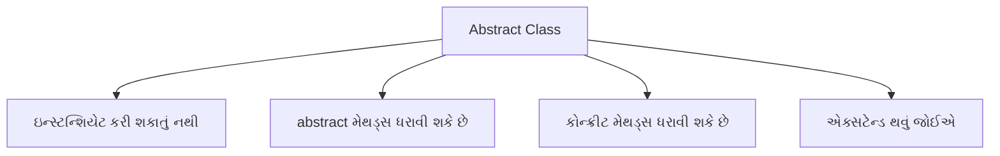

**મુખ્ય લક્ષણો**:

* **abstract** કીવર્ડ સાથે ડિક્લેર થાય છે
* **abstract મેથડ્સ** (ઇમ્પ્લિમેન્ટેશન વગર) ધરાવી શકે છે
* સબક્લાસીસે **બધી abstract મેથડ્સ ઇમ્પ્લિમેન્ટ** કરવી જોઈએ
* **કન્સ્ટ્રક્ટર્સ**, **ઇન્સ્ટન્સ વેરિએબલ્સ**, અને **કોન્ક્રીટ મેથડ્સ** ધરાવી શકે છે

**ઉદાહરણ**:

```java
// Abstract class
abstract class Shape {
    // Abstract method - કોઈ ઇમ્પ્લિમેન્ટેશન નથી
    abstract double calculateArea();
    
    // Concrete method
    void display() {
        System.out.println("ક્ષેત્રફળ: " + calculateArea());
    }
}

// Concrete subclass
class Circle extends Shape {
    double radius;
    
    Circle(double radius) {
        this.radius = radius;
    }
    
    // abstract method ઇમ્પ્લિમેન્ટ કરવી
    @Override
    double calculateArea() {
        return Math.PI * radius * radius;
    }
}
```

**યાદ રાખવા માટે**: "**CPAI**" - Cannot instantiate, Partial implementation, Abstract methods, Inherited

## પ્રશ્ન ૪(બ): Thread શું છે? Thread જીવનચક્ર સમજાવો. (ગુણ: ૪)

### જવાબ ૪(બ)

**Thread**: એક હલકા વજનનું સબપ્રોસેસ જે પ્રોગ્રામના એક ભાગને સમાંતર રીતે એક્ઝિક્યુટ કરે છે.

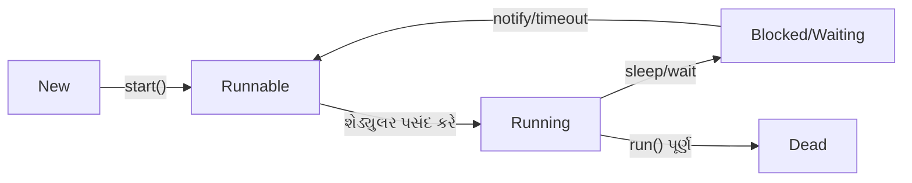

**Thread લાઇફ સાયકલના તબક્કા**:

1. **New**: Thread ઑબ્જેક્ટ બનાવ્યો છે પરંતુ શરૂ થયો નથી
2. **Runnable**: Thread ચાલવા માટે તૈયાર, CPU માટે રાહ જુએ છે
3. **Running**: Thread CPU માં એક્ઝિક્યુટ થઈ રહ્યો છે
4. **Blocked/Waiting**: Thread થોડા સમય માટે અસક્રિય
   * **sleep()**: નિશ્ચિત સમય માટે ફરજિયાત નિષ્ક્રિય
   * **wait()**: નોટિફિકેશનની રાહ જોવી
   * **join()**: બીજી thread પૂર્ણ થવાની રાહ જોવી
   * **I/O blocking**: I/O ઓપરેશનની રાહ જોવી
5. **Dead**: Thread એક્ઝિક્યુશન પૂર્ણ થયું

**Java Thread મેથડ્સ**:

* **start()**: thread એક્ઝિક્યુશન શરૂ કરો
* **sleep()**: નિશ્ચિત સમય માટે thread પોઝ કરો
* **yield()**: બીજા threads ને ચલાવવા વર્તમાન thread પોઝ કરો
* **join()**: બીજી thread પૂર્ણ થાય ત્યાં સુધી રાહ જુઓ

**યાદ રાખવા માટે**: "**NRWBD**" - New, Runnable, Running, Waiting/Blocked, Dead

## પ્રશ્ન ૪(ક): Thread Class નો અમલ કરીને બહુવિધ થ્રેડો બનાવે તેવો java પ્રોગ્રામ લખો. (ગુણ: ૭)

### જવાબ ૪(ક)

```java
// Runnable interface ઇમ્પ્લિમેન્ટ કરીને thread બનાવવી
class CounterThread implements Runnable {
    private String threadName;
    private int counter;
    
    // Constructor
    public CounterThread(String name, int count) {
        this.threadName = name;
        this.counter = count;
    }
    
    // Run મેથડમાં thread લોજિક હોય છે
    @Override
    public void run() {
        try {
            for (int i = 1; i <= counter; i++) {
                System.out.println(threadName + ": ગણતરી " + i);
                
                // ડેમોન્સ્ટ્રેશન માટે પોઝ
                Thread.sleep(500);
            }
            
            System.out.println(threadName + " પૂર્ણ થઈ.");
        } catch (InterruptedException e) {
            System.out.println(threadName + " વિક્ષેપિત થઈ.");
        }
    }
}

// મેઇન ક્લાસ
public class MultiThreadDemo {
    public static void main(String[] args) {
        System.out.println("થ્રેડ્સ બનાવી રહ્યા છીએ...");
        
        // પહેલી thread બનાવો
        Thread thread1 = new Thread(new CounterThread("થ્રેડ-1", 5));
        
        // બીજી thread બનાવો
        Thread thread2 = new Thread(new CounterThread("થ્રેડ-2", 3));
        
        // ત્રીજી thread બનાવો
        Thread thread3 = new Thread(new CounterThread("થ્રેડ-3", 4));
        
        // threads શરૂ કરો
        thread1.start();
        thread2.start();
        thread3.start();
        
        System.out.println("મેઇન થ્રેડ ચાલુ રહે છે...");
        
        try {
            // બધી threads પૂર્ણ થાય ત્યાં સુધી રાહ જુઓ
            thread1.join();
            thread2.join();
            thread3.join();
        } catch (InterruptedException e) {
            System.out.println("મેઇન થ્રેડ વિક્ષેપિત થઈ.");
        }
        
        System.out.println("બધી થ્રેડ્સ પૂર્ણ થઈ. મેઇન થ્રેડ બહાર નીકળી રહી છે.");
    }
}
```

**આઉટપુટ** (thread શેડ્યૂલિંગ ને કારણે બદલાઈ શકે છે):

```
થ્રેડ્સ બનાવી રહ્યા છીએ...
મેઇન થ્રેડ ચાલુ રહે છે...
થ્રેડ-1: ગણતરી 1
થ્રેડ-2: ગણતરી 1
થ્રેડ-3: ગણતરી 1
થ્રેડ-1: ગણતરી 2
થ્રેડ-2: ગણતરી 2
થ્રેડ-3: ગણતરી 2
થ્રેડ-1: ગણતરી 3
થ્રેડ-2: ગણતરી 3
થ્રેડ-3: ગણતરી 3
થ્રેડ-2 પૂર્ણ થઈ.
થ્રેડ-1: ગણતરી 4
થ્રેડ-3: ગણતરી 4
થ્રેડ-1: ગણતરી 5
થ્રેડ-3 પૂર્ણ થઈ.
થ્રેડ-1 પૂર્ણ થઈ.
બધી થ્રેડ્સ પૂર્ણ થઈ. મેઇન થ્રેડ બહાર નીકળી રહી છે.
```

**મુખ્ય ખ્યાલો**:

* **Runnable Interface**: run() મેથડમાં thread વર્તણુક વ્યાખ્યાયિત કરો
* **Thread Object**: runnable કાર્ય માટે રેપર
* **start()**: thread એક્ઝિક્યુશન શરૂ કરો
* **join()**: thread પૂર્ણતાની રાહ જુઓ
* **sleep()**: ઓપરેશન વચ્ચે વિલંબ

**યાદ રાખવા માટે**: "**CROSS**" - Create, Runnable, Override run(), Start threads, Sleep for delay

## પ્રશ્ન ૪(અ OR): યોગ્ય ઉદાહરણ સાથે final class સમજાવો. (ગુણ: ૩)

### જવાબ ૪(અ OR)

**Final Class**: એક ક્લાસ જેને એક્સટેન્ડ (ઇન્હેરિટ) કરી શકાતો નથી.

```mermaid
graph TD
    A[final class] --> B[એક્સટેન્ડ થઈ શકતું નથી]
    A --> C[સબક્લાસીસ નહીં]
    A --> D[પૂર્ણ ઇમ્પ્લિમેન્ટેશન]
    A --> E[સિક્યુરિટી અને અપરિવર્તનશીલતા]
```

**મુખ્ય લક્ષણો**:

* **final** કીવર્ડ સાથે ડિક્લેર થાય છે
* **સબક્લાસીસ ધરાવી શકતું નથી**
* **સિક્યુરિટી** અને **અપરિવર્તનશીલતા** માટે વપરાય છે
* સામાન્ય ઉદાહરણો: **String**, **Integer**, **Math** ક્લાસીસ

**ઉદાહરણ**:

```java
// Final class
final class SecureData {
    private String data;
    
    public SecureData(String data) {
        this.data = data;
    }
    
    public String getData() {
        return data;
    }
    
    public void display() {
        System.out.println("સુરક્ષિત ડેટા: " + data);
    }
}

// Final class એક્સટેન્ડ કરવાનો પ્રયાસ - કોમ્પાઇલેશન એરર થશે
// class DataExtension extends SecureData {
//     DataExtension(String data) {
//         super(data);
//     }
// }

// મેઇન ક્લાસ
public class FinalClassDemo {
    public static void main(String[] args) {
        SecureData sd = new SecureData("ગોપનીય");
        sd.display();
    }
}
```

**યાદ રાખવા માટે**: "**NICE**" - No inheritance, Immutable design, Complete implementation, Enhanced security

## પ્રશ્ન ૪(બ OR): યોગ્ય ઉદાહરણ સાથે thread ની પ્રાથમિકતાઓ સમજાવો. (ગુણ: ૪)

### જવાબ ૪(બ OR)

**Thread Priority**: એક મૂલ્ય જે threads ને એક્ઝિક્યુશન માટે શેડ્યૂલ કરવાના ક્રમને પ્રભાવિત કરે છે.

```mermaid
graph TD
    A[Thread Priorities] --> B[MIN_PRIORITY = 1]
    A --> C[NORM_PRIORITY = 5]
    A --> D[MAX_PRIORITY = 10]
    
    E["setPriority()"] --> F[Thread priority બદલો]
    G["getPriority()"] --> H[વર્તમાન priority મેળવો]
```

**મુખ્ય મુદ્દાઓ**:

* જાવા thread priorities **1 (સૌથી ઓછી)** થી **10 (સૌથી વધુ)** સુધી હોય છે
* ડિફોલ્ટ priority **5 (સામાન્ય)** છે
* ઉચ્ચ priority threads એક્ઝિક્યુશન માટે **પસંદ** કરવામાં આવે છે
* Priorities એ **શેડ્યુલર માટે સૂચનો** છે, ગેરંટી નથી
* વાસ્તવિક વર્તણૂક **ઓપરેટિંગ સિસ્ટમ** પર આધાર રાખે છે

**ઉદાહરણ**:

```java
class PriorityThread extends Thread {
    public PriorityThread(String name) {
        super(name);
    }
    
    public void run() {
        System.out.println("ચાલી રહ્યું છે: " + getName() + 
                           " priority સાથે: " + getPriority());
        for (int i = 1; i <= 3; i++) {
            System.out.println(getName() + ": " + i);
            try {
                Thread.sleep(100);
            } catch (InterruptedException e) {
                System.out.println(getName() + " વિક્ષેપિત થઈ.");
            }
        }
        System.out.println(getName() + " પૂર્ણ થઈ.");
    }
}

public class ThreadPriorityDemo {
    public static void main(String[] args) {
        // Threads બનાવો
        PriorityThread low = new PriorityThread("નીચી Priority");
        PriorityThread norm = new PriorityThread("સામાન્ય Priority");
        PriorityThread high = new PriorityThread("ઉચ્ચ Priority");
        
        // Priorities સેટ કરો
        low.setPriority(Thread.MIN_PRIORITY);     // 1
        // norm ડિફોલ્ટ priority (5) વાપરે છે
        high.setPriority(Thread.MAX_PRIORITY);    // 10
        
        // Threads શરૂ કરો
        low.start();
        norm.start();
        high.start();
    }
}
```

**યાદ રાખવા માટે**: "**HOPS**" - Higher values get preference, OS dependent, Priority 1-10, Scheduling hint

## પ્રશ્ન ૪(ક OR): Exception શું છે? Arithmetic Exception નો ઉપયોગ દર્શાવતો પ્રોગ્રામ લખો. (ગુણ: ૭)

### જવાબ ૪(ક OR)

**Exception**: એક ઘટના જે પ્રોગ્રામના સામાન્ય પ્રવાહને વિક્ષેપિત કરે છે.

```mermaid
graph TD
    A[Exception પ્રકારો] --> B[Checked Exceptions]
    A --> C[Unchecked Exceptions]
    A --> D[Errors]
    
    C --> E[ArithmeticException]
    C --> F[NullPointerException]
    C --> G[ArrayIndexOutOfBoundsException]
```

**ArithmeticException**: જ્યારે અસાધારણ ગાણિતિક સ્થિતિ ઉદ્ભવે છે, જેમ કે શૂન્ય વડે વિભાજન, ત્યારે થ્રો થાય છે.

**ArithmeticException દર્શાવતો પ્રોગ્રામ**:

```java
import java.util.Scanner;

public class ArithmeticExceptionDemo {
    public static void main(String[] args) {
        Scanner input = new Scanner(System.in);
        
        try {
            // વપરાશકર્તા પાસેથી બે નંબર મેળવો
            System.out.print("પ્રથમ નંબર દાખલ કરો: ");
            int num1 = input.nextInt();
            
            System.out.print("બીજો નંબર દાખલ કરો: ");
            int num2 = input.nextInt();
            
            // વિભાજન કરો
            System.out.println("\nવિભાજન કરી રહ્યા છીએ...");
            int result = divideNumbers(num1, num2);
            System.out.println(num1 + " / " + num2 + " = " + result);
            
        } catch (ArithmeticException e) {
            // શૂન્ય વડે વિભાજનને હેન્ડલ કરો
            System.out.println("\nException પકડાયું: " + e.getMessage());
            System.out.println("શૂન્ય વડે વિભાજિત કરી શકાતું નથી!");
            
        } catch (Exception e) {
            // અન્ય exceptions હેન્ડલ કરો
            System.out.println("\nભૂલ: " + e.getMessage());
            
        } finally {
            // રિસોર્સીસ ક્લીન અપ કરો
            System.out.println("\nFinally બ્લોક એક્ઝિક્યુટ થયો.");
            input.close();
        }
        
        System.out.println("પ્રોગ્રામ પૂર્ણ થયો.");
    }
    
    // મેથડ જે ArithmeticException થ્રો કરી શકે છે
    public static int divideNumbers(int a, int b) {
        return a / b;  // જો b 0 હોય તો ArithmeticException થ્રો થાય છે
    }
}
```

**સેમ્પલ આઉટપુટ 1** (માન્ય ઇનપુટ સાથે):

```
પ્રથમ નંબર દાખલ કરો: 10
બીજો નંબર દાખલ કરો: 2

વિભાજન કરી રહ્યા છીએ...
10 / 2 = 5

Finally બ્લોક એક્ઝિક્યુટ થયો.
પ્રોગ્રામ પૂર્ણ થયો.
```

**સેમ્પલ આઉટપુટ 2** (શૂન્ય વડે વિભાજન સાથે):

```
પ્રથમ નંબર દાખલ કરો: 10
બીજો નંબર દાખલ કરો: 0

વિભાજન કરી રહ્યા છીએ...

Exception પકડાયું: / by zero
શૂન્ય વડે વિભાજિત કરી શકાતું નથી!

Finally બ્લોક એક્ઝિક્યુટ થયો.
પ્રોગ્રામ પૂર્ણ થયો.
```

**Exception હેન્ડલિંગ ઘટકો**:

* **try**: કોડ જે exceptions થ્રો કરી શકે છે
* **catch**: ચોક્કસ exceptions ને હેન્ડલ કરે છે 
* **finally**: હંમેશા એક્ઝિક્યુટ થાય છે (ક્લીનઅપ માટે)
* **throw**: સ્પષ્ટપણે exception થ્રો કરે છે
* **throws**: જાહેર કરે છે કે મેથડ કઈ exceptions થ્રો કરી શકે છે

**યાદ રાખવા માટે**: "**ATCF**" - ArithmeticException, Try-catch blocks, Cleanup in finally, Flow control

## પ્રશ્ન ૫(અ): એરેની 10 સંખ્યાઓનો સરવાળો અને સરેરાશ શોધવા માટેનો જાવા પ્રોગ્રામ લખો. (ગુણ: ૩)

### જવાબ ૫(અ)

```java
public class ArraySumAverage {
    public static void main(String[] args) {
        // એરે ડિક્લેર અને ઇનિશિયલાઇઝ કરો
        int[] numbers = {23, 45, 67, 89, 10, 12, 34, 56, 78, 90};
        
        // સરવાળા અને સરેરાશ માટે વેરિએબલ્સ
        int sum = 0;
        double average;
        
        // સરવાળો શોધો
        for (int i = 0; i < numbers.length; i++) {
            sum += numbers[i];
        }
        
        // સરેરાશ શોધો
        average = (double) sum / numbers.length;
        
        // પરિણામો પ્રદર્શિત કરો
        System.out.println("એરેના તત્વો: ");
        for (int num : numbers) {
            System.out.print(num + " ");
        }
        System.out.println("\nસરવાળો: " + sum);
        System.out.println("સરેરાશ: " + average);
    }
}
```

**આઉટપુટ**:

```
એરેના તત્વો: 
23 45 67 89 10 12 34 56 78 90 
સરવાળો: 504
સરેરાશ: 50.4
```

**યાદ રાખવા માટે**: "**SALI**" - Sum Array Loop, Initialize array, Iterate through elements

## પ્રશ્ન ૫(બ): 'Divide by Zero' એરર માટે યુઝર ડિફાઈન્ડ Exception હેન્ડલ કરવા માટે જાવા પ્રોગ્રામ લખો. (ગુણ: ૪)

### જવાબ ૫(બ)

```mermaid
graph TD
    A[Custom Exception] --> B[exception ક્લાસ બનાવો]
    A --> C[exception ફેંકો]
    A --> D[exception પકડો]
    A --> E[exception હેન્ડલ કરો]
```

```java
// Custom exception ક્લાસ
class DivideByZeroException extends Exception {
    public DivideByZeroException(String message) {
        super(message);
    }
}

public class CustomExceptionDemo {
    // Custom exception ફેંકતી મેથડ
    public static double divide(int a, int b) throws DivideByZeroException {
        if (b == 0) {
            throw new DivideByZeroException("શૂન્ય વડે ભાગી શકાતું નથી!");
        }
        return (double) a / b;
    }
    
    public static void main(String[] args) {
        try {
            // ટેસ્ટ કેસીસ
            System.out.println("10 / 2 = " + divide(10, 2)); // સફળ થશે
            System.out.println("10 / 0 = " + divide(10, 0)); // exception ફેંકશે
        } catch (DivideByZeroException e) {
            System.out.println("ભૂલ: " + e.getMessage());
        } finally {
            System.out.println("પ્રોગ્રામ પૂર્ણ થયો.");
        }
    }
}
```

**આઉટપુટ**:

```
10 / 2 = 5.0
ભૂલ: શૂન્ય વડે ભાગી શકાતું નથી!
પ્રોગ્રામ પૂર્ણ થયો.
```

**યાદ રાખવા માટે**: "**CETH**" - Create exception class, Extend Exception, Throw when condition met, Handle with try-catch

## પ્રશ્ન ૫(ક): ટેક્સ્ટ ફાઇલ બનાવવા માટે જાવા પ્રોગ્રામ લખો અને ટેક્સ્ટ ફાઇલ પર રીડ ઑપરેશન કરો. (ગુણ: ૭)

### જવાબ ૫(ક)

```mermaid
graph LR
    A[ફાઇલ બનાવો] --> B[ફાઇલમાં લખો]
    B --> C[રાઇટર બંધ કરો]
    C --> D[ફાઇલ વાંચો]
    D --> E[કન્ટેન્ટ પ્રદર્શિત કરો]
```

```java
import java.io.BufferedReader;
import java.io.BufferedWriter;
import java.io.FileReader;
import java.io.FileWriter;
import java.io.IOException;

public class FileReadWriteDemo {
    public static void main(String[] args) {
        // ફાઇલ નામ
        String fileName = "sample.txt";
        
        try {
            // ભાગ 1: ફાઇલ બનાવો અને લખો
            System.out.println("ફાઇલ બનાવી અને લખી રહ્યા છીએ: " + fileName);
            
            // FileWriter અને BufferedWriter બનાવો
            FileWriter fileWriter = new FileWriter(fileName);
            BufferedWriter bufferedWriter = new BufferedWriter(fileWriter);
            
            // ફાઇલમાં કન્ટેન્ટ લખો
            bufferedWriter.write("નમસ્તે, આ એક સેમ્પલ ટેક્સ્ટ ફાઇલ છે.");
            bufferedWriter.newLine();
            bufferedWriter.write("જાવા ફાઇલ I/O રસપ્રદ છે!");
            bufferedWriter.newLine();
            bufferedWriter.write("ફાઇલનો અંત.");
            
            // રાઇટર્સ બંધ કરો
            bufferedWriter.close();
            System.out.println("ફાઇલ સફળતાપૂર્વક બનાવવામાં આવી.\n");
            
            // ભાગ 2: ફાઇલમાંથી વાંચો
            System.out.println("ફાઇલમાંથી વાંચી રહ્યા છીએ: " + fileName);
            
            // FileReader અને BufferedReader બનાવો
            FileReader fileReader = new FileReader(fileName);
            BufferedReader bufferedReader = new BufferedReader(fileReader);
            
            // ફાઇલ કન્ટેન્ટ વાંચો અને પ્રદર્શિત કરો
            String line;
            System.out.println("--- ફાઇલ કન્ટેન્ટ ---");
            while ((line = bufferedReader.readLine()) != null) {
                System.out.println(line);
            }
            System.out.println("--------------------");
            
            // રીડર્સ બંધ કરો
            bufferedReader.close();
            
        } catch (IOException e) {
            System.out.println("ભૂલ: " + e.getMessage());
        }
    }
}
```

**આઉટપુટ**:

```
ફાઇલ બનાવી અને લખી રહ્યા છીએ: sample.txt
ફાઇલ સફળતાપૂર્વક બનાવવામાં આવી.

ફાઇલમાંથી વાંચી રહ્યા છીએ: sample.txt
--- ફાઇલ કન્ટેન્ટ ---
નમસ્તે, આ એક સેમ્પલ ટેક્સ્ટ ફાઇલ છે.
જાવા ફાઇલ I/O રસપ્રદ છે!
ફાઇલનો અંત.
--------------------
```

**મુખ્ય સ્ટેપ્સ**:

* **ફાઇલ બનાવો**: FileWriter/BufferedWriter વાપરો
* **કન્ટેન્ટ લખો**: write() અને newLine() મેથડ્સ વાપરો
* **રાઇટર બંધ કરો**: હંમેશા સ્ટ્રીમ્સ બંધ કરો
* **ફાઇલ વાંચો**: FileReader/BufferedReader વાપરો
* **કન્ટેન્ટ પ્રોસેસ કરો**: readLine() સાથે લાઇન બાય લાઇન વાંચો

**યાદ રાખવા માટે**: "**CROWN**" - Create file, Read content, Open streams, Write content, Nullify (close) streams

## પ્રશ્ન ૫(અ OR): Java I/O પ્રક્રિયા સમજાવો. (ગુણ: ૩)

### જવાબ ૫(અ OR)

**Java I/O Process** ઇનપુટ અને આઉટપુટ ઓપરેશન્સ હેન્ડલ કરવા માટે ક્લાસીસ પ્રદાન કરે છે.

```mermaid
graph TD
    A[Java I/O Classes] --> B[Stream-based]
    A --> C[Reader/Writer-based]
    
    B --> B1[Byte Streams]
    B1 --> B1a[InputStream]
    B1 --> B1b[OutputStream]
    
    C --> C1[Character Streams]
    C1 --> C1a[Reader]
    C1 --> C1b[Writer]
    
    D[Byte vs Character] --> D1[Bytes: Binary data]
    D --> D2[Characters: Text data]
```

**મુખ્ય ઘટકો**:

* **Streams**: સ્ત્રોત અને લક્ષ્ય વચ્ચે ડેટા ફ્લો
* **બે પ્રકાર**:
  * **Byte Streams**: બાઇનરી ડેટા (ઇમેજીસ, ઑડિયો) હેન્ડલ કરે છે
  * **Character Streams**: ટેક્સ્ટ ડેટા (ફાઇલ્સ, ડોક્યુમેન્ટ્સ) હેન્ડલ કરે છે
* **મૂળભૂત પ્રક્રિયા**:
  1. ડેટા સ્ત્રોત/લક્ષ્ય સાથે **કનેક્શન ખોલો**
  2. ડેટા **વાંચો/લખો**
  3. રિસોર્સીસ છોડવા માટે **કનેક્શન બંધ** કરો

**સામાન્ય ક્લાસીસ**:

* **Byte Streams**: FileInputStream, FileOutputStream
* **Character Streams**: FileReader, FileWriter
* **Buffered Operations**: BufferedReader, BufferedWriter

**યાદ રાખવા માટે**: "**IOBC**" - Input/Output, Open connection, Binary/Character streams, Close resources

## પ્રશ્ન ૫(બ OR): Exception Handling માં throw અને finally ઉદાહરણ સાથે સમજાવો. (ગુણ: ૪)

### જવાબ ૫(બ OR)

**throw**: એક્સપ્લિસિટલી exception ફેંકે છે.
**finally**: exception થાય કે ન થાય, ત્યારે પણ હંમેશા એક્ઝિક્યુટ થનારો કોડ ધરાવે છે.

```mermaid
graph TD
    A[try] --> B[exception થઈ શકે તેવો કોડ]
    B --> C{Exception?}
    C -->|હા| D[throw]
    D --> E[catch]
    C -->|ના| F[ચાલુ રાખો]
    E --> G[finally]
    F --> G
```

**ઉદાહરણ**:

```java
public class ThrowFinallyDemo {
    public static void main(String[] args) {
        try {
            int age = -5;
            
            // ઉંમર વેલિડેટ કરો
            if (age < 0) {
                // એક્સપ્લિસિટલી exception ફેંકો
                throw new IllegalArgumentException("ઉંમર નકારાત્મક ન હોઈ શકે");
            }
            
            System.out.println("ઉંમર " + age + " છે");
            
        } catch (IllegalArgumentException e) {
            // exception હેન્ડલ કરો
            System.out.println("Exception: " + e.getMessage());
            
        } finally {
            // હંમેશા એક્ઝિક્યુટ થાય છે
            System.out.println("Finally બ્લોક એક્ઝિક્યુટ થયો");
            System.out.println("આ exception થાય કે ન થાય ચાલે છે");
        }
        
        System.out.println("પ્રોગ્રામ ચાલુ રહે છે...");
    }
}
```

**આઉટપુટ**:

```
Exception: ઉંમર નકારાત્મક ન હોઈ શકે
Finally બ્લોક એક્ઝિક્યુટ થયો
આ exception થાય કે ન થાય ચાલે છે
પ્રોગ્રામ ચાલુ રહે છે...
```

**મુખ્ય મુદ્દાઓ**:

* **throw**: નવા exception ઑબ્જેક્ટ બનાવે છે
* **finally**: ક્લીનઅપ ઓપરેશન્સ માટે વપરાય છે
* **finally** બ્લોક try/catch માં **return** સ્ટેટમેન્ટ હોય તો પણ એક્ઝિક્યુટ થાય છે

**યાદ રાખવા માટે**: "**CAFE**" - Create exception, Always execute finally, Finish cleanup, Exception propagation

## પ્રશ્ન ૫(ક OR): ટેક્સ્ટ ફાઇલ ના કન્ટેન્ટ ડિસ્પ્લે કરવા અને ટેક્સ્ટ ફાઇલ પર એપેન્ડ ઓપરેશન કરવા માટે જાવા પ્રોગ્રામ લખો. (ગુણ: ૭)

### જવાબ ૫(ક OR)

```mermaid
graph LR
    A[ફાઇલ વાંચો] --> B[કન્ટેન્ટ ડિસ્પ્લે]
    B --> C[ફાઇલમાં એપેન્ડ]
    C --> D[ફરીથી વાંચો]
    D --> E[અપડેટેડ કન્ટેન્ટ ડિસ્પ્લે]
```

```java
import java.io.BufferedReader;
import java.io.BufferedWriter;
import java.io.FileReader;
import java.io.FileWriter;
import java.io.IOException;

public class FileAppendDemo {
    public static void main(String[] args) {
        // ફાઇલ નામ
        String fileName = "sample.txt";
        String appendData = "\nઆ લાઇન પછીથી ઉમેરવામાં આવી હતી.";
        
        try {
            // ભાગ 1: જો ફાઇલ ન હોય તો બનાવો
            boolean fileExists = true;
            try {
                FileReader testReader = new FileReader(fileName);
                testReader.close();
            } catch (IOException e) {
                fileExists = false;
                // પ્રારંભિક કન્ટેન્ટ સાથે ફાઇલ બનાવો
                FileWriter writer = new FileWriter(fileName);
                writer.write("આ એક સેમ્પલ ફાઇલ છે.\nતેમાં થોડો ટેક્સ્ટ છે.");
                writer.close();
                System.out.println("પ્રારંભિક કન્ટેન્ટ સાથે ફાઇલ બનાવી.");
            }
            
            // ભાગ 2: મૂળ કન્ટેન્ટ વાંચો અને ડિસ્પ્લે
            System.out.println("\nમૂળ ફાઇલ કન્ટેન્ટ:");
            System.out.println("---------------------");
            displayFileContent(fileName);
            
            // ભાગ 3: ફાઇલમાં એપેન્ડ
            System.out.println("\nફાઇલમાં એપેન્ડ કરી રહ્યા છીએ...");
            FileWriter fileWriter = new FileWriter(fileName, true); // true = append મોડ
            BufferedWriter bufferedWriter = new BufferedWriter(fileWriter);
            
            bufferedWriter.write(appendData);
            bufferedWriter.close();
            System.out.println("કન્ટેન્ટ સફળતાપૂર્વક એપેન્ડ થયું.");
            
            // ભાગ 4: અપડેટેડ કન્ટેન્ટ વાંચો અને ડિસ્પ્લે
            System.out.println("\nઅપડેટેડ ફાઇલ કન્ટેન્ટ:");
            System.out.println("---------------------");
            displayFileContent(fileName);
            
        } catch (IOException e) {
            System.out.println("ભૂલ: " + e.getMessage());
        }
    }
    
    // ફાઇલ કન્ટેન્ટ વાંચવા અને ડિસ્પ્લે કરવા માટેની મેથડ
    public static void displayFileContent(String fileName) throws IOException {
        FileReader fileReader = new FileReader(fileName);
        BufferedReader bufferedReader = new BufferedReader(fileReader);
        
        String line;
        while ((line = bufferedReader.readLine()) != null) {
            System.out.println(line);
        }
        
        bufferedReader.close();
    }
}
```

**આઉટપુટ** (જો ફાઇલ પહેલેથી ન હોય):

```
પ્રારંભિક કન્ટેન્ટ સાથે ફાઇલ બનાવી.

મૂળ ફાઇલ કન્ટેન્ટ:
---------------------
આ એક સેમ્પલ ફાઇલ છે.
તેમાં થોડો ટેક્સ્ટ છે.

ફાઇલમાં એપેન્ડ કરી રહ્યા છીએ...
કન્ટેન્ટ સફળતાપૂર્વક એપેન્ડ થયું.

અપડેટેડ ફાઇલ કન્ટેન્ટ:
---------------------
આ એક સેમ્પલ ફાઇલ છે.
તેમાં થોડો ટેક્સ્ટ છે.
આ લાઇન પછીથી ઉમેરવામાં આવી હતી.
```

**મુખ્ય મુદ્દાઓ**:

* **Append મોડ**: `FileWriter(fileName, true)` નો ઉપયોગ કરો
* **ફાઇલ વાંચો**: BufferedReader સાથે readLine() વાપરો
* **અલગ મેથડ બનાવો**: કોડ રીયુઝ માટે
* **યોગ્ય એરર હેન્ડલિંગ**: try-catch બ્લોક્સ વાપરો
* **રિસોર્સીસ બંધ કરો**: હંમેશા સ્ટ્રીમ્સ બંધ કરો

**યાદ રાખવા માટે**: "**ARCS**" - Append mode, Read content, Close resources, Separate concerns