# 4343203 Summer 2024 Solution - English

## Question 1(a): Explain Garbage collection in java. (Marks: 03)

### Answer 1(a)

**Garbage Collection** in Java is an automatic memory management process that:

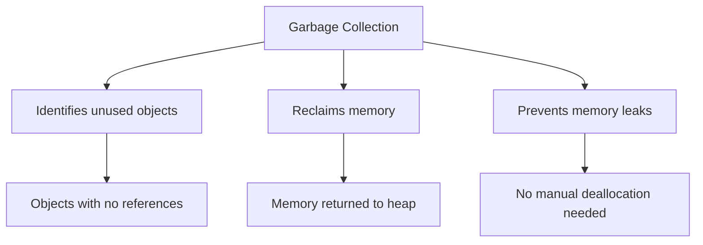

* **Purpose**: Automatically **removes unused objects** from memory
* **Process**: 
  * JVM **periodically checks** which objects are no longer referenced
  * **Reclaims memory** occupied by unreferenced objects
  * **Returns memory** to heap for future allocation
* **Trigger**: Occurs when **heap memory is low** or when **explicitly called**

**Mnemonic**: "**ART**" - Automatic, Reclaims memory, Tracks unused objects

## Question 1(b): Explain JVM in detail. (Marks: 04)

### Answer 1(b)

**Java Virtual Machine (JVM)** is the core component of Java's architecture:

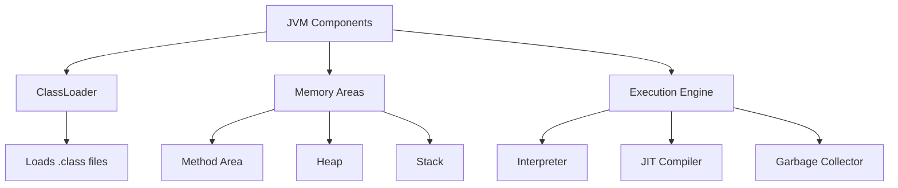

**Key Components**:

* **ClassLoader**: Loads class files into memory
* **Memory Areas**:
  * **Method Area**: Stores class structures
  * **Heap**: Objects storage (garbage collection)
  * **Stack**: Method frames, local variables
* **Execution Engine**:
  * **Interpreter**: Executes bytecode
  * **JIT Compiler**: Optimizes execution
  * **Garbage Collector**: Manages memory

**Key Features**:

* Provides **platform independence** ("Write Once, Run Anywhere")
* Ensures **security** through sandbox execution
* Manages **memory automatically**

**Mnemonic**: "**CLME**" - ClassLoader, Memory Areas, Execution Engine

## Question 1(c): Write a program in java to print Fibonacci series for N terms. (Marks: 07)

### Answer 1(c)

**Fibonacci Series**: A sequence where each number is the sum of the two preceding ones.

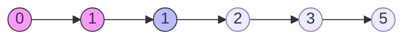

**Java Program**:

```java
import java.util.Scanner;

public class FibonacciSeries {
    public static void main(String[] args) {
        // Create Scanner object for input
        Scanner input = new Scanner(System.in);
        
        // Get number of terms
        System.out.print("Enter number of terms: ");
        int n = input.nextInt();
        
        // Initialize first two terms
        int firstTerm = 0;
        int secondTerm = 1;
        
        System.out.println("Fibonacci Series for " + n + " terms:");
        
        // Print first two terms
        if (n >= 1) System.out.print(firstTerm + " ");
        if (n >= 2) System.out.print(secondTerm + " ");
        
        // Generate remaining terms
        for (int i = 3; i <= n; i++) {
            // Calculate next term
            int nextTerm = firstTerm + secondTerm;
            System.out.print(nextTerm + " ");
            
            // Update terms
            firstTerm = secondTerm;
            secondTerm = nextTerm;
        }
        
        input.close();
    }
}
```

**Output for n=8**:

```
Enter number of terms: 8
Fibonacci Series for 8 terms:
0 1 1 2 3 5 8 13
```

**Key Points**:

* **Initialize** first two terms (0, 1)
* **Loop** to generate remaining terms
* Each new term = **sum of previous two**
* **Update** variables for next iteration

**Mnemonic**: "**IFLU**" - Initialize, First two terms, Loop, Update

## Question 1(c OR): Write a program in java to find out minimum from any ten numbers using command line argument. (Marks: 07)

### Answer 1(c OR)

**Command Line Arguments** in Java are parameters passed to a program when it's executed.


**Java Program**:

```java
public class MinimumFinder {
    public static void main(String[] args) {
        // Check if exactly 10 arguments are provided
        if (args.length != 10) {
            System.out.println("Please provide exactly 10 numbers as command line arguments");
            System.out.println("Example: java MinimumFinder 45 12 67 89 23 5 78 90 34 56");
            return;
        }
        
        // Initialize min with first number
        int min = Integer.parseInt(args[0]);
        
        // Find minimum from all arguments
        for (int i = 1; i < args.length; i++) {
            // Convert string argument to integer
            int num = Integer.parseInt(args[i]);
            
            // Update min if current number is smaller
            if (num < min) {
                min = num;
            }
        }
        
        // Display result
        System.out.println("Numbers entered:");
        for (String num : args) {
            System.out.print(num + " ");
        }
        System.out.println("\nMinimum value: " + min);
    }
}
```

**Execution**:

```
> java MinimumFinder 45 12 67 89 23 5 78 90 34 56
Numbers entered:
45 12 67 89 23 5 78 90 34 56
Minimum value: 5
```

**Key Points**:

* **Command-line arguments** are passed in `String[] args`
* **Convert** string arguments to integers using `Integer.parseInt()`
* **Initialize** minimum with first number
* **Compare** each number and update minimum if smaller
* **Handle validation** for input arguments

**Mnemonic**: "**ACCIH**" - Arguments, Convert, Compare, Initialize, Handle validation

## Question 2(a): List out basic concepts of Java OOP. Explain any one in details. (Marks: 03)

### Answer 2(a)

**Basic OOP Concepts in Java**:

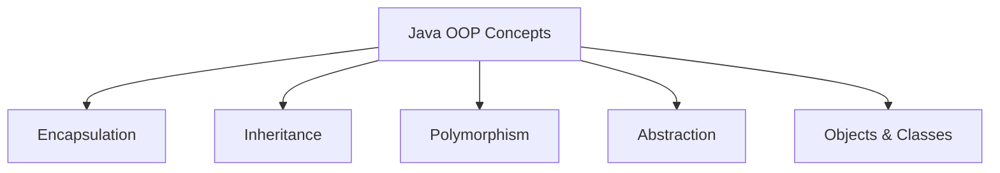

* **Encapsulation**: Binding data and methods together, hiding implementation
* **Inheritance**: Creating new classes from existing ones
* **Polymorphism**: One interface, multiple implementations
* **Abstraction**: Hiding complex implementation details
* **Objects & Classes**: Basic building blocks

**Inheritance Explained**:

* Inheritance is the mechanism of **creating new classes** from **existing classes**
* The new class (subclass/child) **inherits attributes and behaviors** from existing class (superclass/parent)
* Implemented using the **extends** keyword
* Promotes **code reusability** and establishes **IS-A relationship**
* Example: Car IS-A Vehicle, Dog IS-A Animal

**Mnemonic**: "**EIOPA**" - Encapsulation, Inheritance, Objects, Polymorphism, Abstraction

## Question 2(b): Explain final keyword with example. (Marks: 04)

### Answer 2(b)

**Final Keyword** in Java:

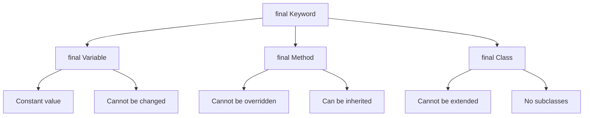

**Uses of final keyword**:

* **final variable**: Creates constants that cannot be changed
* **final method**: Cannot be overridden in subclasses
* **final class**: Cannot be extended (no inheritance)

**Example**:

```java
public class FinalDemo {
    // final variable (constant)
    final double PI = 3.14159;
    
    // final method
    final void display() {
        System.out.println("This method cannot be overridden");
    }
    
    public static void main(String[] args) {
        FinalDemo obj = new FinalDemo();
        
        // Using final variable
        System.out.println("Value of PI: " + obj.PI);
        
        // Cannot modify final variable
        // obj.PI = 3.14;  // Compilation error
        
        // Calling final method
        obj.display();
    }
}

// Final class
final class SecureClass {
    void show() {
        System.out.println("This class cannot be extended");
    }
}

// Cannot extend final class
// class ChildClass extends SecureClass {} // Compilation error
```

**Mnemonic**: "**VCM**" - Variables (constant), Cannot extend, Methods (no override)

## Question 2(c): What is constructor? Explain parameterized constructor with example. (Marks: 07)

### Answer 2(c)

**Constructor**: A special method used to **initialize objects** when created. It has the **same name as the class** and **no return type**.


**Characteristics**:

* **Same name** as the class
* **No return type**
* **Automatically called** when object is created
* **Initializes** instance variables

**Example of Parameterized Constructor**:

```java
public class Student {
    // Instance variables
    private int rollNo;
    private String name;
    private double percentage;
    
    // Parameterized constructor
    public Student(int roll, String studentName, double marks) {
        rollNo = roll;
        name = studentName;
        percentage = marks;
    }
    
    // Method to display student details
    public void displayDetails() {
        System.out.println("Roll No: " + rollNo);
        System.out.println("Name: " + name);
        System.out.println("Percentage: " + percentage + "%");
    }
    
    public static void main(String[] args) {
        // Creating objects using parameterized constructor
        Student s1 = new Student(101, "Rahul", 85.7);
        Student s2 = new Student(102, "Priya", 92.3);
        
        // Displaying details
        System.out.println("First Student:");
        s1.displayDetails();
        
        System.out.println("\nSecond Student:");
        s2.displayDetails();
    }
}
```

**Key Points**:

* Allows **initialization with specific values**
* Parameters passed during **object creation**
* Creates **multiple objects with different states**
* **No setter methods** needed to initialize variables

**Mnemonic**: "**PINS**" - Parameters, Initialize, No return type, Same name

## Question 2(a OR): Explain the Java Program Structure with example. (Marks: 03)

### Answer 2(a OR)

**Java Program Structure**:

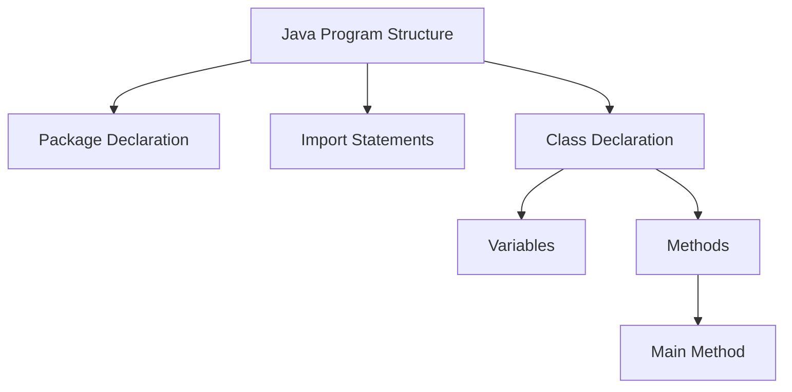

**Components of Java Program**:

* **Package Declaration**: (Optional) Organizes related classes
* **Import Statements**: (Optional) Access classes from other packages
* **Class Declaration**: (Required) Container for code
* **Variables**: Store data
* **Methods**: Define behavior, including main method
* **Main Method**: Entry point for program execution

**Example**:

```java
// 1. Package Declaration (Optional)
package com.example;

// 2. Import Statements (Optional)
import java.util.Scanner;

// 3. Class Declaration (Required)
public class HelloWorld {
    // 4. Variables
    String message = "Hello, World!";
    
    // 5. Methods
    public void displayMessage() {
        System.out.println(message);
    }
    
    // 6. Main Method (Entry point)
    public static void main(String[] args) {
        // Create object of class
        HelloWorld obj = new HelloWorld();
        
        // Call method
        obj.displayMessage();
    }
}
```

**Mnemonic**: "**PICVM**" - Package, Import, Class, Variables, Methods

## Question 2(b OR): Explain static keyword with suitable example. (Marks: 04)

### Answer 2(b OR)

**Static Keyword** in Java:

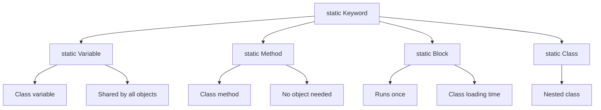

**Uses of static**:

* **static variable**: Shared across all instances of the class
* **static method**: Can be called without creating objects
* **static block**: Executes when class is loaded
* **static nested class**: Belongs to the class rather than an instance

**Example**:

```java
public class CounterDemo {
    // Static variable - shared by all objects
    static int count = 0;
    
    // Instance variable - unique to each object
    int instanceNumber;
    
    // Static block - runs when class is loaded
    static {
        System.out.println("Static block executed");
        count = 10; // Initialize static variable
    }
    
    // Constructor
    public CounterDemo() {
        count++;          // Increment counter
        instanceNumber = count;  // Assign instance number
    }
    
    // Static method
    public static void displayCount() {
        System.out.println("Total objects: " + count);
        // Cannot access instance variables directly
        // System.out.println(instanceNumber); // Error!
    }
    
    // Instance method
    public void displayInfo() {
        System.out.println("This is object #" + instanceNumber);
        System.out.println("Total count: " + count); // Can access static variables
    }
    
    public static void main(String[] args) {
        // Static method called without object
        CounterDemo.displayCount(); // Output: Total objects: 10
        
        // Create objects
        CounterDemo obj1 = new CounterDemo();
        CounterDemo obj2 = new CounterDemo();
        
        // Call instance methods
        obj1.displayInfo(); // Output: This is object #11, Total count: 12
        obj2.displayInfo(); // Output: This is object #12, Total count: 12
        
        // Call static method again
        CounterDemo.displayCount(); // Output: Total objects: 12
    }
}
```

**Key Points**:

* Static members **belong to the class** (not objects)
* They are **loaded into memory** when the class is loaded
* Static methods **cannot access instance variables/methods** directly
* Used for **utility methods**, **constants**, and **counters**

**Mnemonic**: "**BCCS**" - Belongs to Class, Class-level, Shared memory, Static methods

## Question 2(c OR): Define Inheritance. List out types of it. Explain multilevel and hierarchical inheritance with suitable example. (Marks: 07)

### Answer 2(c OR)

**Inheritance**: The process where one class acquires the properties and behaviors of another class.

**Types of Inheritance**:

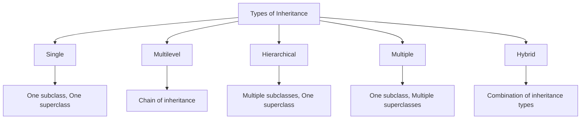

| Type | Description |
|------|-------------|
| **Single** | One subclass inherits from one superclass |
| **Multilevel** | Chain of inheritance (A → B → C) |
| **Hierarchical** | Multiple classes inherit from one superclass |
| **Multiple** | One class inherits from multiple classes (through interfaces in Java) |
| **Hybrid** | Combination of multiple inheritance types |

**Multilevel Inheritance Example**:

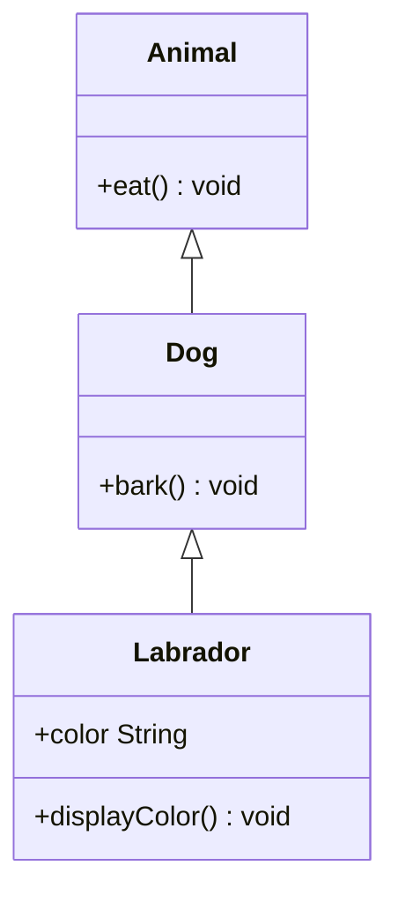

```java
// Base class
class Animal {
    void eat() {
        System.out.println("Animal is eating");
    }
}

// Intermediate class
class Dog extends Animal {
    void bark() {
        System.out.println("Dog is barking");
    }
}

// Derived class
class Labrador extends Dog {
    String color;
    
    Labrador(String color) {
        this.color = color;
    }
    
    void displayColor() {
        System.out.println("Color is " + color);
    }
}

// Main class
public class MultilevelDemo {
    public static void main(String[] args) {
        Labrador lab = new Labrador("Golden");
        
        // Methods from Animal class
        lab.eat();  
        
        // Methods from Dog class
        lab.bark(); 
        
        // Methods from Labrador class
        lab.displayColor();
    }
}
```

**Hierarchical Inheritance Example**:

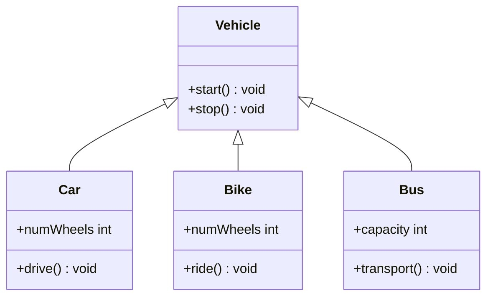

```java
// Base class
class Vehicle {
    void start() {
        System.out.println("Vehicle started");
    }
    
    void stop() {
        System.out.println("Vehicle stopped");
    }
}

// Derived class 1
class Car extends Vehicle {
    int numWheels = 4;
    
    void drive() {
        System.out.println("Car is driving with " + numWheels + " wheels");
    }
}

// Derived class 2
class Bike extends Vehicle {
    int numWheels = 2;
    
    void ride() {
        System.out.println("Bike is riding with " + numWheels + " wheels");
    }
}

// Derived class 3
class Bus extends Vehicle {
    int capacity = 40;
    
    void transport() {
        System.out.println("Bus is transporting " + capacity + " passengers");
    }
}

// Main class
public class HierarchicalDemo {
    public static void main(String[] args) {
        Car car = new Car();
        Bike bike = new Bike();
        Bus bus = new Bus();
        
        // Car methods
        car.start();  // From Vehicle
        car.drive();  // From Car
        car.stop();   // From Vehicle
        
        System.out.println();
        
        // Bike methods
        bike.start(); // From Vehicle
        bike.ride();  // From Bike
        bike.stop();  // From Vehicle
        
        System.out.println();
        
        // Bus methods
        bus.start();     // From Vehicle
        bus.transport(); // From Bus
        bus.stop();      // From Vehicle
    }
}
```

**Key Points**:

* **Multilevel Inheritance**: Forms a **chain of inheritance** (e.g., Animal → Dog → Labrador)
* **Hierarchical Inheritance**: Multiple classes **inherit from one base class** (e.g., Vehicle → Car/Bike/Bus)
* Both promote **code reusability**
* Java **doesn't support multiple inheritance** with classes (uses interfaces instead)

**Mnemonic**: "**MASH**" - Multilevel (chain), Acquire properties, Single superclass, Hierarchical (tree)

## Question 3(a): Explain this keyword with suitable example. (Marks: 03)

### Answer 3(a)

**'this' keyword** in Java refers to the current object instance.

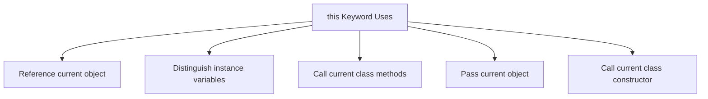

**Main uses of 'this' keyword**:

* **Resolve variable shadowing**: Differentiate instance variables from parameters
* **Call constructor**: Call another constructor in same class (`this()`)
* **Return current object**: Return current instance for method chaining
* **Pass current object**: Pass current object as parameter

**Example**:

```java
public class Person {
    // Instance variables
    private String name;
    private int age;
    
    // Constructor with parameters
    public Person(String name, int age) {
        // Use 'this' to refer to instance variables
        this.name = name;  // Without 'this', name would refer to parameter
        this.age = age;    // Without 'this', age would refer to parameter
    }
    
    // Method that uses 'this' to call another method
    public void display() {
        System.out.println("Name: " + this.name);
        System.out.println("Age: " + this.age);
        this.greet();  // 'this' is optional here
    }
    
    // Method to be called
    public void greet() {
        System.out.println("Hello from " + this.name);
    }
    
    public static void main(String[] args) {
        Person person = new Person("John", 25);
        person.display();
    }
}
```

**Mnemonic**: "**RICP**" - Reference variables, Instance methods, Constructor call, Pass object

## Question 3(b): Explain different access controls in Java. (Marks: 04)

### Answer 3(b)

**Access Modifiers** in Java control the accessibility and visibility of classes, methods, and variables.

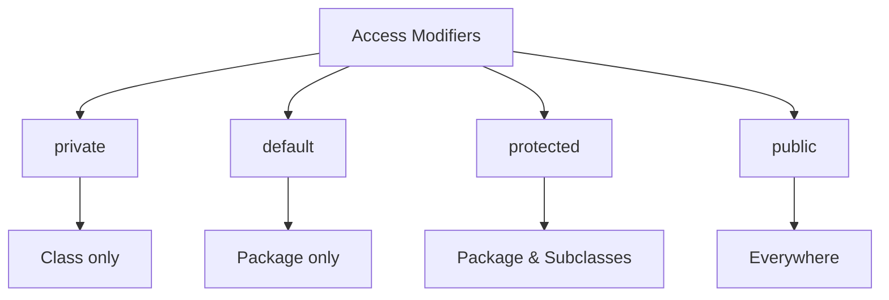

**Java Access Control Levels**:

| Modifier | Class | Package | Subclass | World |
|----------|-------|---------|----------|-------|
| **private** | Yes | No | No | No |
| **default** | Yes | Yes | No | No |
| **protected** | Yes | Yes | Yes | No |
| **public** | Yes | Yes | Yes | Yes |

**Example**:

```java
public class AccessDemo {
    private int privateVar = 10;      // Class only
    int defaultVar = 20;              // Package
    protected int protectedVar = 30;  // Package & subclasses
    public int publicVar = 40;        // Everywhere
    
    public void showValues() {
        // Can access all variables inside its own class
        System.out.println("Private: " + privateVar);
        System.out.println("Default: " + defaultVar);
        System.out.println("Protected: " + protectedVar);
        System.out.println("Public: " + publicVar);
    }
}
```

**Benefits**:

* **Encapsulation**: Hide implementation details
* **Security**: Prevent unauthorized access 
* **Maintainability**: Control what can be modified

**Mnemonic**: "**PDPP**" - Private, Default, Protected, Public

## Question 3(c): What is interface? Explain multiple inheritance using interface with example. (Marks: 07)

### Answer 3(c)

**Interface**: A blueprint of a class that contains abstract methods and constants.

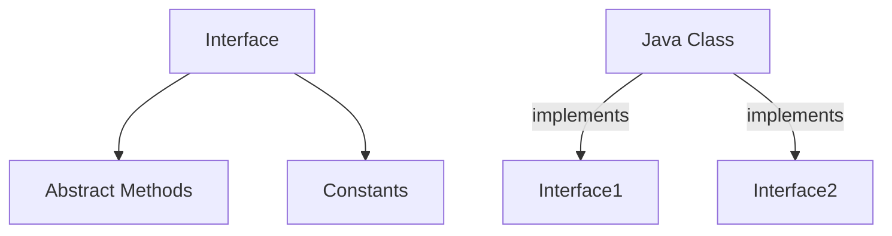

**Key Features**:

* Methods are **public** and **abstract** by default
* Variables are **public**, **static**, and **final**
* Class **implements** interface
* Class can implement **multiple interfaces**

**Example of Multiple Inheritance**:

```java
// First interface
interface Drawable {
    void draw();  // Abstract method
    int SIZE = 10;  // Constant
}

// Second interface
interface Colorable {
    void setColor(String color);
    String getColor();
}

// Class implementing multiple interfaces
class Circle implements Drawable, Colorable {
    private String color;
    
    @Override
    public void draw() {
        System.out.println("Drawing a circle with size " + SIZE);
    }
    
    @Override
    public void setColor(String color) {
        this.color = color;
        System.out.println("Circle color set to " + color);
    }
    
    @Override
    public String getColor() {
        return color;
    }
}

// Main class
public class InterfaceDemo {
    public static void main(String[] args) {
        Circle c = new Circle();
        
        // Using methods from both interfaces
        c.draw();
        c.setColor("Red");
        System.out.println("Color: " + c.getColor());
        
        // Polymorphism with interfaces
        Drawable d = new Circle();
        d.draw();  // Can only access Drawable methods
        
        Colorable col = new Circle();
        col.setColor("Blue");  // Can only access Colorable methods
    }
}
```

**Multiple Inheritance with Interfaces**:

* Java **doesn't allow multiple inheritance** with classes
* Class can **implement multiple interfaces**
* Each interface provides different **behaviors**
* Solves **diamond problem** found in multiple inheritance

**Mnemonic**: "**CALM**" - Constants, Abstract methods, Like multiple inheritance, Methods without implementation

## Question 3(a OR): Explain super keyword with example. (Marks: 03)

### Answer 3(a OR)

**'super' keyword** in Java refers to the parent class (superclass) of the current object.

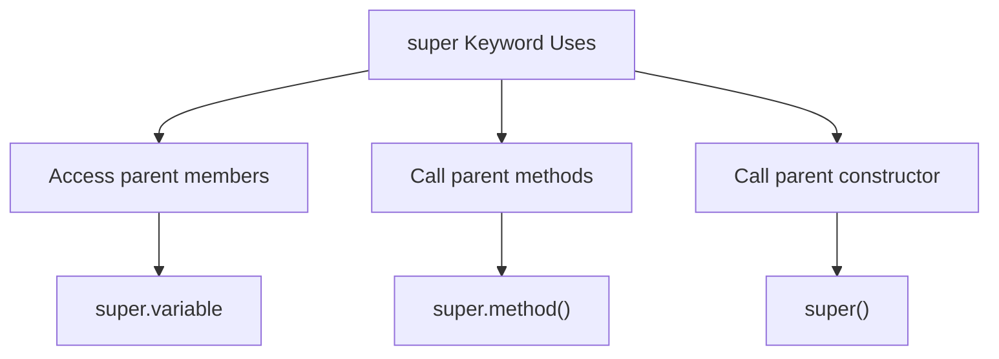

**Main uses of 'super' keyword**:

* **Access parent class variables**: `super.variable`
* **Call parent class methods**: `super.method()`
* **Call parent class constructor**: `super()` or `super(parameters)`

**Example**:

```java
// Parent class
class Animal {
    String color = "white";
    
    void eat() {
        System.out.println("Animal is eating");
    }
    
    Animal() {
        System.out.println("Animal constructor called");
    }
}

// Child class
class Dog extends Animal {
    String color = "black";
    
    void printColor() {
        // Access parent variable with same name
        System.out.println("Parent color: " + super.color);
        System.out.println("Child color: " + color);
    }
    
    void eat() {
        // Call parent method
        super.eat();
        System.out.println("Dog is eating");
    }
    
    Dog() {
        // Call parent constructor
        super();
        System.out.println("Dog constructor called");
    }
}

// Main class
public class SuperDemo {
    public static void main(String[] args) {
        Dog dog = new Dog();
        dog.printColor();
        dog.eat();
    }
}
```

**Output**:

```
Animal constructor called
Dog constructor called
Parent color: white
Child color: black
Animal is eating
Dog is eating
```

**Mnemonic**: "**VCM**" - Variables (parent), Call methods, Method overriding

## Question 3(b OR): What is package? Write steps to create a package and give example of it. (Marks: 04)

### Answer 3(b OR)

**Package**: A namespace that organizes a set of related classes and interfaces.

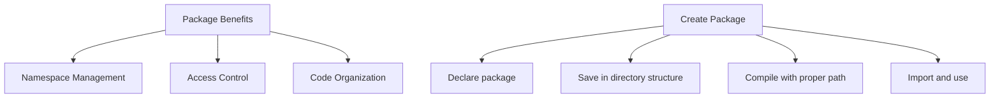

**Steps to Create a Package**:

1. **Declare** the package at the beginning of source file
2. **Save** the file in directory structure matching package name
3. **Compile** the file using proper directory structure
4. **Import** and use the package in other classes

**Example**:

**Step 1**: Create a class with package declaration

```java
// File: Calculator.java
package com.mymath.util;

public class Calculator {
    // Methods
    public int add(int a, int b) {
        return a + b;
    }
    
    public int subtract(int a, int b) {
        return a - b;
    }
    
    public int multiply(int a, int b) {
        return a * b;
    }
    
    public double divide(int a, int b) {
        if (b == 0) {
            System.out.println("Cannot divide by zero");
            return 0;
        }
        return (double)a / b;
    }
}
```

**Step 2**: Save file in proper directory structure

```
project_root/
└── com/
    └── mymath/
        └── util/
            └── Calculator.java
```

**Step 3**: Compile the file

```bash
# Navigate to project_root
cd project_root

# Compile
javac com/mymath/util/Calculator.java
```

**Step 4**: Create a class that uses the package

```java
// File: PackageDemo.java
// Import the package
import com.mymath.util.Calculator;

public class PackageDemo {
    public static void main(String[] args) {
        // Create object of the Calculator class
        Calculator calc = new Calculator();
        
        // Use methods
        System.out.println("10 + 5 = " + calc.add(10, 5));
        System.out.println("10 - 5 = " + calc.subtract(10, 5));
        System.out.println("10 * 5 = " + calc.multiply(10, 5));
        System.out.println("10 / 5 = " + calc.divide(10, 5));
    }
}
```

**Step 5**: Compile and run the main class

```bash
# Compile
javac -classpath . PackageDemo.java

# Run
java -classpath . PackageDemo
```

**Output**:

```
10 + 5 = 15
10 - 5 = 5
10 * 5 = 50
10 / 5 = 2.0
```

**Mnemonic**: "**SCIR**" - Save in structure, Compile with path, Import package, Run with classpath

## Question 3(c OR): Define: Method Overriding. List out Rules for method overriding. Write a java program that implements method overriding. (Marks: 07)

### Answer 3(c OR)

**Method Overriding**: Providing a different implementation for a method in a subclass that is already defined in the parent class.

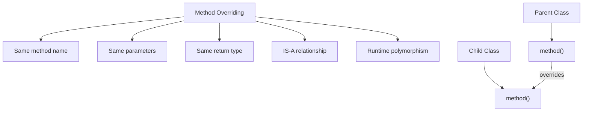

**Rules for Method Overriding**:

* Method must have **same name** as parent class method
* Method must have **same parameters** (number, type, order)
* Return type must be **same or subtype** of parent method's return type
* Access modifier must be **same or less restrictive** than parent method
* Cannot override **static** methods (method hiding occurs instead)
* Cannot override **final** methods
* Cannot override **private** methods (not visible to subclass)
* Overridden method can throw **same, subtype, or no exceptions** compared to parent

**Example of Method Overriding**:

```java
// Parent class
class Vehicle {
    // Method to be overridden
    public void move() {
        System.out.println("Vehicle is moving");
    }
    
    // Final method - cannot be overridden
    public final void stop() {
        System.out.println("Vehicle stopped");
    }
    
    // Method with return type
    public int getMaxSpeed() {
        return 100;
    }
    
    // Static method - cannot be overridden (can be hidden)
    public static void displayInfo() {
        System.out.println("This is a vehicle");
    }
}

// Child class
class Car extends Vehicle {
    // Overriding move() method
    @Override
    public void move() {
        System.out.println("Car is driving");
    }
    
    // Cannot override final method
    // public void stop() { } // Error!
    
    // Overriding with same return type
    @Override
    public int getMaxSpeed() {
        return 200; // Different implementation
    }
    
    // Method hiding (not overriding) - static method
    public static void displayInfo() {
        System.out.println("This is a car");
    }
}

// Another child class
class Bike extends Vehicle {
    // Overriding move() method
    @Override
    public void move() {
        // Call parent method first
        super.move();
        System.out.println("Bike is riding");
    }
    
    // Overriding with covariant return type
    @Override
    public int getMaxSpeed() {
        return 120;
    }
}

// Main class
public class OverridingDemo {
    public static void main(String[] args) {
        // Create parent class object
        Vehicle vehicle = new Vehicle();
        vehicle.move();
        System.out.println("Max speed: " + vehicle.getMaxSpeed());
        Vehicle.displayInfo();
        
        System.out.println("\n----- Car -----");
        // Create child class object
        Car car = new Car();
        car.move();
        car.stop(); // Using parent's method
        System.out.println("Max speed: " + car.getMaxSpeed());
        Car.displayInfo();
        
        System.out.println("\n----- Bike -----");
        // Create another child class object
        Bike bike = new Bike();
        bike.move();
        System.out.println("Max speed: " + bike.getMaxSpeed());
        
        System.out.println("\n----- Runtime Polymorphism -----");
        // Runtime polymorphism (dynamic method dispatch)
        Vehicle v1 = new Car();
        Vehicle v2 = new Bike();
        
        v1.move(); // Calls Car's move method
        v2.move(); // Calls Bike's move method
        
        // Static method called using reference type (not object type)
        v1.displayInfo(); // Calls Vehicle's displayInfo
    }
}
```

**Output**:

```
Vehicle is moving
Max speed: 100
This is a vehicle

----- Car -----
Car is driving
Vehicle stopped
Max speed: 200
This is a car

----- Bike -----
Vehicle is moving
Bike is riding
Max speed: 120

----- Runtime Polymorphism -----
Car is driving
Vehicle is moving
Bike is riding
This is a vehicle
```

**Key Points**:

* Method overriding is the basis for **runtime polymorphism**
* The method called is determined by the **actual object type**, not reference type
* `@Override` annotation helps catch errors if method doesn't actually override
* Use `super.methodName()` to call parent method from overriding method

**Mnemonic**: "**SPAN**" - Same name, Parameters same, Access same/wider, No static/final/private

## Question 4(a): Explain abstract class with suitable example. (Marks: 03)

### Answer 4(a)

**Abstract Class**: A class that cannot be instantiated and may contain abstract methods.

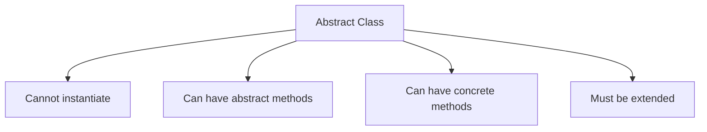

**Key Features**:

* Declared with **abstract** keyword
* May contain **abstract methods** (without implementation)
* Subclasses must **implement all abstract methods**
* Can have **constructors**, **instance variables**, and **concrete methods**

**Example**:

```java
// Abstract class
abstract class Shape {
    // Abstract method - no implementation
    abstract double calculateArea();
    
    // Concrete method
    void display() {
        System.out.println("Area: " + calculateArea());
    }
}

// Concrete subclass
class Circle extends Shape {
    double radius;
    
    Circle(double radius) {
        this.radius = radius;
    }
    
    // Implementing abstract method
    @Override
    double calculateArea() {
        return Math.PI * radius * radius;
    }
}
```

**Mnemonic**: "**CPAI**" - Cannot instantiate, Partial implementation, Abstract methods, Inherited

## Question 4(b): What is Thread? Explain Thread life cycle. (Marks: 04)

### Answer 4(b)

**Thread**: A lightweight subprocess that executes a portion of a program concurrently.

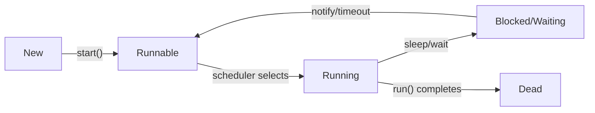

**Thread Life Cycle Stages**:

1. **New**: Thread object created but not started
2. **Runnable**: Thread ready to run, waiting for CPU
3. **Running**: Thread executing in CPU
4. **Blocked/Waiting**: Thread temporarily inactive
   * **sleep()**: Forced inactive for specified time
   * **wait()**: Waiting for notification
   * **join()**: Waiting for another thread to complete
   * **I/O blocking**: Waiting for I/O operation
5. **Dead**: Thread execution completed

**Java Thread Methods**:

* **start()**: Begin thread execution
* **sleep()**: Pause thread for specified time
* **yield()**: Pause current thread to let others execute
* **join()**: Wait for another thread to complete

**Mnemonic**: "**NRWBD**" - New, Runnable, Running, Waiting/Blocked, Dead

## Question 4(c): Write a program in java that creates the multiple threads by implementing the Thread class. (Marks: 07)

### Answer 4(c)

```java
// Thread creation by implementing Runnable interface
class CounterThread implements Runnable {
    private String threadName;
    private int counter;
    
    // Constructor
    public CounterThread(String name, int count) {
        this.threadName = name;
        this.counter = count;
    }
    
    // Run method contains the thread logic
    @Override
    public void run() {
        try {
            for (int i = 1; i <= counter; i++) {
                System.out.println(threadName + ": Count " + i);
                
                // Pause for demonstration
                Thread.sleep(500);
            }
            
            System.out.println(threadName + " completed.");
        } catch (InterruptedException e) {
            System.out.println(threadName + " interrupted.");
        }
    }
}

// Main class
public class MultiThreadDemo {
    public static void main(String[] args) {
        System.out.println("Creating threads...");
        
        // Create first thread
        Thread thread1 = new Thread(new CounterThread("Thread-1", 5));
        
        // Create second thread
        Thread thread2 = new Thread(new CounterThread("Thread-2", 3));
        
        // Create third thread
        Thread thread3 = new Thread(new CounterThread("Thread-3", 4));
        
        // Start threads
        thread1.start();
        thread2.start();
        thread3.start();
        
        System.out.println("Main thread continues...");
        
        try {
            // Wait for all threads to complete
            thread1.join();
            thread2.join();
            thread3.join();
        } catch (InterruptedException e) {
            System.out.println("Main thread interrupted.");
        }
        
        System.out.println("All threads completed. Exiting main thread.");
    }
}
```

**Output** (will vary due to thread scheduling):

```
Creating threads...
Main thread continues...
Thread-1: Count 1
Thread-2: Count 1
Thread-3: Count 1
Thread-1: Count 2
Thread-2: Count 2
Thread-3: Count 2
Thread-1: Count 3
Thread-2: Count 3
Thread-3: Count 3
Thread-2 completed.
Thread-1: Count 4
Thread-3: Count 4
Thread-1: Count 5
Thread-3 completed.
Thread-1 completed.
All threads completed. Exiting main thread.
```

**Key Concepts**:

* **Runnable Interface**: Define thread behavior in run() method
* **Thread Object**: Wrapper for runnable task
* **start()**: Begin thread execution
* **join()**: Wait for thread completion
* **sleep()**: Introduce delay between operations

**Mnemonic**: "**CROSS**" - Create, Runnable, Override run(), Start threads, Sleep for delay

## Question 4(a OR): Explain final class with suitable example. (Marks: 03)

### Answer 4(a OR)

**Final Class**: A class that cannot be extended (inherited).

```mermaid
graph TD
    A[final class] --> B[Cannot be extended]
    A --> C[No subclasses]
    A --> D[Complete implementation]
    A --> E[Security and immutability]
```

**Key Characteristics**:

* Declared with **final** keyword
* Cannot have **subclasses**
* Used for **security** and **immutability**
* Common examples: **String**, **Integer**, **Math** classes

**Example**:

```java
// Final class
final class SecureData {
    private String data;
    
    public SecureData(String data) {
        this.data = data;
    }
    
    public String getData() {
        return data;
    }
    
    public void display() {
        System.out.println("Secure data: " + data);
    }
}

// Attempt to extend final class - will cause compilation error
// class DataExtension extends SecureData {
//     DataExtension(String data) {
//         super(data);
//     }
// }

// Main class
public class FinalClassDemo {
    public static void main(String[] args) {
        SecureData sd = new SecureData("Confidential");
        sd.display();
    }
}
```

**Mnemonic**: "**NICE**" - No inheritance, Immutable design, Complete implementation, Enhanced security

## Question 4(b OR): Explain thread priorities with suitable example. (Marks: 04)

### Answer 4(b OR)

**Thread Priority**: A value that influences the order in which threads are scheduled for execution.

```mermaid
graph TD
    A[Thread Priorities] --> B[MIN_PRIORITY = 1]
    A --> C[NORM_PRIORITY = 5]
    A --> D[MAX_PRIORITY = 10]
    
    E["setPriority()"] --> F[Change thread priority]
    G["getPriority()"] --> H[Get current priority]
```

**Key Points**:

* Java thread priorities range from **1 (lowest)** to **10 (highest)**
* Default priority is **5 (normal)**
* Higher priority threads are **preferred** for execution
* Priorities are **hints to scheduler**, not guarantees
* Actual behavior depends on the **operating system**

**Example**:

```java
class PriorityThread extends Thread {
    public PriorityThread(String name) {
        super(name);
    }
    
    public void run() {
        System.out.println("Running: " + getName() + 
                           " with priority: " + getPriority());
        for (int i = 1; i <= 3; i++) {
            System.out.println(getName() + ": " + i);
            try {
                Thread.sleep(100);
            } catch (InterruptedException e) {
                System.out.println(getName() + " interrupted.");
            }
        }
        System.out.println(getName() + " finished.");
    }
}

public class ThreadPriorityDemo {
    public static void main(String[] args) {
        // Create threads
        PriorityThread low = new PriorityThread("Low Priority");
        PriorityThread norm = new PriorityThread("Normal Priority");
        PriorityThread high = new PriorityThread("High Priority");
        
        // Set priorities
        low.setPriority(Thread.MIN_PRIORITY);     // 1
        // norm uses default priority (5)
        high.setPriority(Thread.MAX_PRIORITY);    // 10
        
        // Start threads
        low.start();
        norm.start();
        high.start();
    }
}
```

**Mnemonic**: "**HOPS**" - Higher values get preference, OS dependent, Priority 1-10, Scheduling hint

## Question 4(c OR): What is Exception? Write a program that shows the use of Arithmetic Exception. (Marks: 07)

### Answer 4(c OR)

**Exception**: An event that disrupts the normal flow of program execution.

```mermaid
graph TD
    A[Exception Types] --> B[Checked Exceptions]
    A --> C[Unchecked Exceptions]
    A --> D[Errors]
    
    C --> E[ArithmeticException]
    C --> F[NullPointerException]
    C --> G[ArrayIndexOutOfBoundsException]
```

**ArithmeticException**: Thrown when an exceptional arithmetic condition occurs, like division by zero.

**Program demonstrating ArithmeticException**:

```java
import java.util.Scanner;

public class ArithmeticExceptionDemo {
    public static void main(String[] args) {
        Scanner input = new Scanner(System.in);
        
        try {
            // Get two numbers from user
            System.out.print("Enter first number: ");
            int num1 = input.nextInt();
            
            System.out.print("Enter second number: ");
            int num2 = input.nextInt();
            
            // Perform division
            System.out.println("\nPerforming division...");
            int result = divideNumbers(num1, num2);
            System.out.println(num1 + " / " + num2 + " = " + result);
            
        } catch (ArithmeticException e) {
            // Handle division by zero
            System.out.println("\nException caught: " + e.getMessage());
            System.out.println("Cannot divide by zero!");
            
        } catch (Exception e) {
            // Handle other exceptions
            System.out.println("\nError: " + e.getMessage());
            
        } finally {
            // Clean up resources
            System.out.println("\nFinally block executed.");
            input.close();
        }
        
        System.out.println("Program completed.");
    }
    
    // Method that may throw ArithmeticException
    public static int divideNumbers(int a, int b) {
        return a / b;  // Throws ArithmeticException if b is 0
    }
}
```

**Sample Output 1** (with valid input):

```
Enter first number: 10
Enter second number: 2

Performing division...
10 / 2 = 5

Finally block executed.
Program completed.
```

**Sample Output 2** (with division by zero):

```
Enter first number: 10
Enter second number: 0

Performing division...

Exception caught: / by zero
Cannot divide by zero!

Finally block executed.
Program completed.
```

**Key Exception Handling Components**:

* **try**: Contains code that might throw exceptions
* **catch**: Handles specific exceptions 
* **finally**: Always executes (for cleanup)
* **throw**: Explicitly throw an exception
* **throws**: Declare exceptions a method may throw

**Mnemonic**: "**ATCF**" - ArithmeticException, Try-catch blocks, Cleanup in finally, Flow control

## Question 5(a): Write a Java Program to find sum and average of 10 numbers of an array. (Marks: 03)

### Answer 5(a)

```java
public class ArraySumAverage {
    public static void main(String[] args) {
        // Declare and initialize array
        int[] numbers = {23, 45, 67, 89, 10, 12, 34, 56, 78, 90};
        
        // Variables for sum and average
        int sum = 0;
        double average;
        
        // Calculate sum
        for (int i = 0; i < numbers.length; i++) {
            sum += numbers[i];
        }
        
        // Calculate average
        average = (double) sum / numbers.length;
        
        // Display results
        System.out.println("Array elements: ");
        for (int num : numbers) {
            System.out.print(num + " ");
        }
        System.out.println("\nSum: " + sum);
        System.out.println("Average: " + average);
    }
}
```

**Output**:

```
Array elements: 
23 45 67 89 10 12 34 56 78 90 
Sum: 504
Average: 50.4
```

**Mnemonic**: "**SALI**" - Sum Array Loop, Initialize array, Iterate through elements

## Question 5(b): Write a Java program to handle user defined exception for 'Divide by Zero' error. (Marks: 04)

### Answer 5(b)

```mermaid
graph TD
    A[Custom Exception] --> B[Create exception class]
    A --> C[Throw exception]
    A --> D[Catch exception]
    A --> E[Handle exception]
```

```java
// Custom exception class
class DivideByZeroException extends Exception {
    public DivideByZeroException(String message) {
        super(message);
    }
}

public class CustomExceptionDemo {
    // Method that throws custom exception
    public static double divide(int a, int b) throws DivideByZeroException {
        if (b == 0) {
            throw new DivideByZeroException("Cannot divide by zero!");
        }
        return (double) a / b;
    }
    
    public static void main(String[] args) {
        try {
            // Test cases
            System.out.println("10 / 2 = " + divide(10, 2)); // Works fine
            System.out.println("10 / 0 = " + divide(10, 0)); // Throws exception
        } catch (DivideByZeroException e) {
            System.out.println("Error: " + e.getMessage());
        } finally {
            System.out.println("Program completed.");
        }
    }
}
```

**Output**:

```
10 / 2 = 5.0
Error: Cannot divide by zero!
Program completed.
```

**Mnemonic**: "**CETH**" - Create exception class, Extend Exception, Throw when condition met, Handle with try-catch

## Question 5(c): Write a java program to create a text file and perform read operation on the text file. (Marks: 07)

### Answer 5(c)

```mermaid
graph LR
    A[Create File] --> B[Write to File]
    B --> C[Close Writer]
    C --> D[Read from File]
    D --> E[Display Content]
```

```java
import java.io.BufferedReader;
import java.io.BufferedWriter;
import java.io.FileReader;
import java.io.FileWriter;
import java.io.IOException;

public class FileReadWriteDemo {
    public static void main(String[] args) {
        // File name
        String fileName = "sample.txt";
        
        try {
            // PART 1: CREATE AND WRITE TO FILE
            System.out.println("Creating and writing to file: " + fileName);
            
            // Create FileWriter and BufferedWriter
            FileWriter fileWriter = new FileWriter(fileName);
            BufferedWriter bufferedWriter = new BufferedWriter(fileWriter);
            
            // Write content to file
            bufferedWriter.write("Hello, this is a sample text file.");
            bufferedWriter.newLine();
            bufferedWriter.write("Java File I/O is interesting!");
            bufferedWriter.newLine();
            bufferedWriter.write("End of file.");
            
            // Close writers
            bufferedWriter.close();
            System.out.println("File created successfully.\n");
            
            // PART 2: READ FROM FILE
            System.out.println("Reading from file: " + fileName);
            
            // Create FileReader and BufferedReader
            FileReader fileReader = new FileReader(fileName);
            BufferedReader bufferedReader = new BufferedReader(fileReader);
            
            // Read and display file content
            String line;
            System.out.println("--- File Content ---");
            while ((line = bufferedReader.readLine()) != null) {
                System.out.println(line);
            }
            System.out.println("--------------------");
            
            // Close readers
            bufferedReader.close();
            
        } catch (IOException e) {
            System.out.println("Error: " + e.getMessage());
        }
    }
}
```

**Output**:

```
Creating and writing to file: sample.txt
File created successfully.

Reading from file: sample.txt
--- File Content ---
Hello, this is a sample text file.
Java File I/O is interesting!
End of file.
--------------------
```

**Key Steps**:

* **Create file**: Use FileWriter/BufferedWriter
* **Write content**: Use write() and newLine() methods
* **Close writer**: Always close streams
* **Read file**: Use FileReader/BufferedReader
* **Process content**: Read line by line with readLine()

**Mnemonic**: "**CROWN**" - Create file, Read content, Open streams, Write content, Nullify (close) streams

## Question 5(a OR): Explain java I/O process. (Marks: 03)

### Answer 5(a OR)

**Java I/O Process** provides classes to handle input and output operations.

```mermaid
graph TD
    A[Java I/O Classes] --> B[Stream-based]
    A --> C[Reader/Writer-based]
    
    B --> B1[Byte Streams]
    B1 --> B1a[InputStream]
    B1 --> B1b[OutputStream]
    
    C --> C1[Character Streams]
    C1 --> C1a[Reader]
    C1 --> C1b[Writer]
    
    D[Byte vs Character] --> D1[Bytes: Binary data]
    D --> D2[Characters: Text data]
```

**Key Components**:

* **Streams**: Sequence of data flow between source and destination
* **Two Types**:
  * **Byte Streams**: Handle binary data (images, audio)
  * **Character Streams**: Handle text data (files, documents)
* **Basic Process**:
  1. **Open** connection to data source/destination
  2. **Read/Write** data
  3. **Close** connection to release resources

**Common Classes**:

* **Byte Streams**: FileInputStream, FileOutputStream
* **Character Streams**: FileReader, FileWriter
* **Buffered Operations**: BufferedReader, BufferedWriter

**Mnemonic**: "**IOBC**" - Input/Output, Open connection, Binary/Character streams, Close resources

## Question 5(b OR): Explain throw and finally in Exception Handling with example. (Marks: 04)

### Answer 5(b OR)

**throw**: Explicitly throws an exception.
**finally**: Contains code that always executes regardless of exception.

```mermaid
graph TD
    A[try] --> B[Code that may cause exception]
    B --> C{Exception?}
    C -->|Yes| D[throw]
    D --> E[catch]
    C -->|No| F[Continue]
    E --> G[finally]
    F --> G
```

**Example**:

```java
public class ThrowFinallyDemo {
    public static void main(String[] args) {
        try {
            int age = -5;
            
            // Validate age
            if (age < 0) {
                // Explicitly throw exception
                throw new IllegalArgumentException("Age cannot be negative");
            }
            
            System.out.println("Age is " + age);
            
        } catch (IllegalArgumentException e) {
            // Handle the exception
            System.out.println("Exception: " + e.getMessage());
            
        } finally {
            // Always executes
            System.out.println("Finally block executed");
            System.out.println("This runs whether exception occurs or not");
        }
        
        System.out.println("Program continues...");
    }
}
```

**Output**:

```
Exception: Age cannot be negative
Finally block executed
This runs whether exception occurs or not
Program continues...
```

**Key Points**:

* **throw**: Creates a new exception object
* **finally**: Used for cleanup operations
* **finally** block executes even if **return** statement exists in try/catch

**Mnemonic**: "**CAFE**" - Create exception, Always execute finally, Finish cleanup, Exception propagation

## Question 5(c OR): Write a java program to display the content of a text file and perform append operation on the text file. (Marks: 07)

### Answer 5(c OR)

```mermaid
graph LR
    A[Read File] --> B[Display Content]
    B --> C[Append to File]
    C --> D[Read Again]
    D --> E[Display Updated Content]
```

```java
import java.io.BufferedReader;
import java.io.BufferedWriter;
import java.io.FileReader;
import java.io.FileWriter;
import java.io.IOException;

public class FileAppendDemo {
    public static void main(String[] args) {
        // File name
        String fileName = "sample.txt";
        String appendData = "\nThis line was appended later.";
        
        try {
            // PART 1: CREATE FILE IF IT DOESN'T EXIST
            boolean fileExists = true;
            try {
                FileReader testReader = new FileReader(fileName);
                testReader.close();
            } catch (IOException e) {
                fileExists = false;
                // Create file with initial content
                FileWriter writer = new FileWriter(fileName);
                writer.write("This is a sample file.\nIt contains some text.");
                writer.close();
                System.out.println("File created with initial content.");
            }
            
            // PART 2: READ AND DISPLAY ORIGINAL CONTENT
            System.out.println("\nOriginal file content:");
            System.out.println("---------------------");
            displayFileContent(fileName);
            
            // PART 3: APPEND TO FILE
            System.out.println("\nAppending to file...");
            FileWriter fileWriter = new FileWriter(fileName, true); // true = append mode
            BufferedWriter bufferedWriter = new BufferedWriter(fileWriter);
            
            bufferedWriter.write(appendData);
            bufferedWriter.close();
            System.out.println("Content appended successfully.");
            
            // PART 4: READ AND DISPLAY UPDATED CONTENT
            System.out.println("\nUpdated file content:");
            System.out.println("---------------------");
            displayFileContent(fileName);
            
        } catch (IOException e) {
            System.out.println("Error: " + e.getMessage());
        }
    }
    
    // Method to read and display file content
    public static void displayFileContent(String fileName) throws IOException {
        FileReader fileReader = new FileReader(fileName);
        BufferedReader bufferedReader = new BufferedReader(fileReader);
        
        String line;
        while ((line = bufferedReader.readLine()) != null) {
            System.out.println(line);
        }
        
        bufferedReader.close();
    }
}
```

**Output** (if file didn't exist previously):

```
File created with initial content.

Original file content:
---------------------
This is a sample file.
It contains some text.

Appending to file...
Content appended successfully.

Updated file content:
---------------------
This is a sample file.
It contains some text.
This line was appended later.
```

**Key Points**:

* **Append mode**: Use `FileWriter(fileName, true)`
* **Read file**: Use BufferedReader with readLine()
* **Create separate method**: For code reuse
* **Proper error handling**: Use try-catch blocks
* **Close resources**: Always close streams

**Mnemonic**: "**ARCS**" - Append mode, Read content, Close resources, Separate concerns
