# 4343203 Winter 2024 Solution - Gujarati

## પ્રશ્ન 1(a): જાવામાં વિવિધ પ્રિમિટિવ ડેટા ટાઇપ્સની યાદી બનાવો. (ગુણ: 03)

### જવાબ 1(a)

જાવામાં 8 પ્રિમિટિવ ડેટા ટાઇપ્સ છે:

| ડેટા ટાઇપ | સાઇઝ | વર્ણન |
|-----------|------|-------------|
| **byte** | 1 byte | -128 થી 127 સુધીના પૂર્ણાંક સંગ્રહ કરે છે |
| **short** | 2 bytes | -32,768 થી 32,767 સુધીના પૂર્ણાંક સંગ્રહ કરે છે |
| **int** | 4 bytes | -2³¹ થી 2³¹-1 સુધીના પૂર્ણાંક સંગ્રહ કરે છે |
| **long** | 8 bytes | -2⁶³ થી 2⁶³-1 સુધીના પૂર્ણાંક સંગ્રહ કરે છે |
| **float** | 4 bytes | 6-7 દશાંશ અંકો સાથે અપૂર્ણાંક સંખ્યાઓ સંગ્રહ કરે છે |
| **double** | 8 bytes | 15 દશાંશ અંકો સાથે અપૂર્ણાંક સંખ્યાઓ સંગ્રહ કરે છે |
| **boolean** | 1 bit | true અથવા false કિંમતો સંગ્રહ કરે છે |
| **char** | 2 bytes | એકલ અક્ષર/કેરેક્ટર અથવા ASCII કિંમત સંગ્રહ કરે છે |

**યાદ રાખવા માટેની ટ્રિક**: "**I See Bears Drinking Chocolate Foam Latte**" (Int, Char, Boolean, Double, Character, Float, Long)

## પ્રશ્ન 1(b): યોગ્ય ઉદાહરણ સાથે જાવા પ્રોગ્રામનું માળખું સમજાવો. (ગુણ: 04)

### જવાબ 1(b)

જાવા પ્રોગ્રામનું માળખું કેટલાક મુખ્ય ઘટકોથી બનેલું છે:

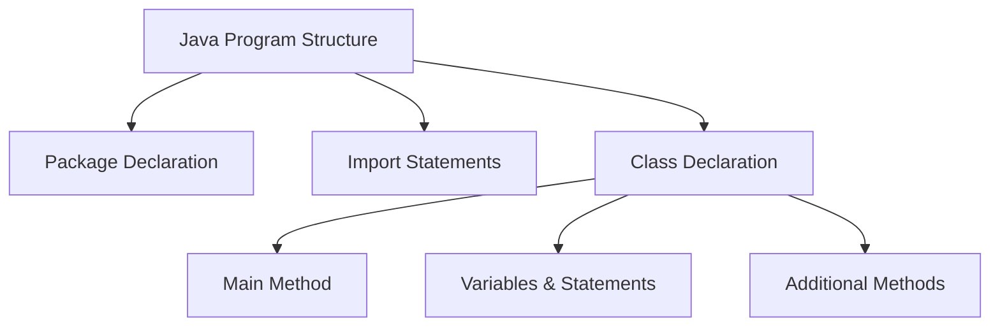

```java
// 1. Package Declaration (વૈકલ્પિક)
package com.example;

// 2. Import Statements (વૈકલ્પિક)
import java.util.Scanner;

// 3. Class Declaration (આવશ્યક)
public class HelloWorld {
    
    // 4. Main Method (એક્ઝિક્યુટેબલ પ્રોગ્રામ માટે આવશ્યક)
    public static void main(String[] args) {
        
        // 5. Variables, Statements, અને Expressions
        String message = "Hello, World!";
        System.out.println(message);
        
    } // End of main method
    
    // 6. Additional Methods (વૈકલ્પિક)
    public static void greet() {
        System.out.println("Welcome!");
    }
    
} // End of class
```

**મુખ્ય ઘટકો**:

* **Package Declaration**: સંબંધિત ક્લાસને વ્યવસ્થિત કરે છે
* **Import Statements**: અન્ય પેકેજમાંથી ક્લાસનો ઉપયોગ કરે છે
* **Class Declaration**: બધા કોડ ધરાવે છે અને ઓબ્જેક્ટના ગુણધર્મો નિર્ધારિત કરે છે
* **Main Method**: પ્રોગ્રામનો શરૂઆતનો બિંદુ (ચોક્કસ જ બતાવ્યા મુજબ હોવો જોઈએ)
* **Statements**: વ્યક્તિગત સૂચનાઓ
* **Methods**: ચોક્કસ કાર્યક્ષમતા સાથે ફરીથી ઉપયોગ કરી શકાય તેવા કોડ બ્લોક્સ

**યાદ રાખવા માટેની ટ્રિક**: "**PICSM**" - Package, Imports, Class, Statements, Methods

## પ્રશ્ન 1(c): જાવામાં એરિથમેટિક ઓપરેટર્સની યાદી બનાવો. કોઈપણ ત્રણ એરિથમેટિક ઓપરેટર્સનો ઉપયોગ કરીને એક જાવા પ્રોગ્રામ બનાવો અને પ્રોગ્રામનું આઉટપુટ બતાવો. (ગુણ: 07)

### જવાબ 1(c)

#### જાવામાં એરિથમેટિક ઓપરેટર્સ
| ઓપરેટર | વર્ણન | ઉદાહરણ |
|----------|-------------|---------|
| **+** | સરવાળો | a + b |
| **-** | બાદબાકી | a - b |
| **\*** | ગુણાકાર | a * b |
| **/** | ભાગાકાર | a / b |
| **%** | મોડ્યુલસ (બાકી) | a % b |
| **++** | ઇન્ક્રિમેન્ટ | a++ અથવા ++a |
| **--** | ડિક્રિમેન્ટ | a-- અથવા --a |

**યાદ રાખવા માટેની ટ્રિક**: "**MASID++**" (Multiply, Add, Subtract, Increment, Decrement, Divide, Modulus)

#### ત્રણ એરિથમેટિક ઓપરેટર્સનો ઉપયોગ કરતો જાવા પ્રોગ્રામ

```java
public class ArithmeticDemo {
    public static void main(String[] args) {
        // વેરિએબલ્સ ડિક્લેર કરો
        int num1 = 20;
        int num2 = 5;
        int result1, result2, result3;
        
        // ત્રણ એરિથમેટિક ઓપરેટર્સનો ઉપયોગ
        result1 = num1 + num2;  // સરવાળો
        result2 = num1 - num2;  // બાદબાકી
        result3 = num1 * num2;  // ગુણાકાર
        
        // આઉટપુટ દર્શાવો
        System.out.println("પ્રથમ સંખ્યા: " + num1);
        System.out.println("બીજી સંખ્યા: " + num2);
        System.out.println("સરવાળો: " + result1);       // આઉટપુટ: 25
        System.out.println("બાદબાકી: " + result2);    // આઉટપુટ: 15
        System.out.println("ગુણાકાર: " + result3); // આઉટપુટ: 100
    }
}
```

## પ્રશ્ન 1(c OR): જાવા for લૂપ સ્ટેટમેન્ટનો સિન્ટેક્સ લખો. 1 થી 10 સુધીના પ્રાઇમ નંબર શોધવા માટે એક જાવા પ્રોગ્રામ બનાવો. (ગુણ: 07)

### જવાબ 1(c OR)

#### જાવા for લૂપનો સિન્ટેક્સ

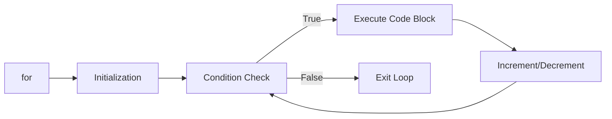

```java
for (initialization; condition; increment/decrement) {
    // કોડ જે execute થશે
}
```

**મુખ્ય ભાગો**:

* **Initialization**: શરૂઆતમાં એક વખત execute થાય છે
* **Condition**: દરેક iteration પહેલાં ચેક થાય છે
* **Increment/Decrement**: દરેક iteration પછી execute થાય છે

#### 1 થી 10 સુધીના પ્રાઇમ નંબર શોધવા માટેનો જાવા પ્રોગ્રામ

```java
public class PrimeNumbers {
    public static void main(String[] args) {
        System.out.println("1 થી 10 સુધીના પ્રાઇમ નંબર:");
        
        // આઉટર લૂપ - 1 થી 10 સુધીની દરેક સંખ્યા ચેક કરો
        for (int num = 1; num <= 10; num++) {
            boolean isPrime = true;
            
            // 1 ને સ્કિપ કરો કારણ કે તે પ્રાઇમ નંબર નથી
            if (num == 1) {
                isPrime = false;
            }
            
            // ઇનર લૂપ - કોઈપણ સંખ્યાથી ભાગી શકાય છે કે નહીં તપાસો
            for (int i = 2; i < num; i++) {
                if (num % i == 0) {
                    isPrime = false;
                    break;
                }
            }
            
            // જો પ્રાઇમ હોય તો પ્રિન્ટ કરો
            if (isPrime) {
                System.out.print(num + " ");
            }
        }
        // આઉટપુટ: 2 3 5 7
    }
}
```

**પ્રાઇમ નંબર માટે યાદ રાખવાની ટ્રિક**: "**2357**" - આ 1 અને 10 વચ્ચેના પ્રાઇમ નંબર છે

## પ્રશ્ન 2(a): પ્રોસીજર-ઓરિએન્ટેડ પ્રોગ્રામિંગ (POP) અને ઓબ્જેક્ટ-ઓરિએન્ટેડ પ્રોગ્રામિંગ (OOP) વચ્ચેના તફાવતો જણાવો. (ગુણ: 03)

### જવાબ 2(a)

| પ્રોસીજર-ઓરિએન્ટેડ પ્રોગ્રામિંગ (POP) | ઓબ્જેક્ટ-ઓરિએન્ટેડ પ્રોગ્રામિંગ (OOP) |
|-------------------------------------|----------------------------------|
| **ફંક્શન-કેન્દ્રિત** અભિગમ | **ઓબ્જેક્ટ-કેન્દ્રિત** અભિગમ |
| ડેટા ફંક્શન્સ વચ્ચે મુક્તપણે હલનચલન કરે છે | ડેટા ઓબ્જેક્ટ્સમાં **એન્કેપ્સ્યુલેટેડ** થયેલ છે |
| **ટોપ-ડાઉન** અભિગમને અનુસરે છે | **બોટમ-અપ** અભિગમને અનુસરે છે |
| **સુરક્ષા** ઓછી છે (ડેટા ગ્લોબલ છે) | **સુરક્ષા** વધુ છે (ડેટા હાઈડિંગ) |
| **ઇન્હેરિટન્સ**નો કોઈ ખ્યાલ નથી | **ઇન્હેરિટન્સ** અને રીયુઝેબિલિટીને સપોર્ટ કરે છે |
| ઉદાહરણો: C, FORTRAN, Pascal | ઉદાહરણો: Java, C++, Python |

**યાદ રાખવા માટેની ટ્રિક**: "**FEED SI**" - Focus, Encapsulation, Execution, Data access, Security, Inheritance

## પ્રશ્ન 2(b): static કીવર્ડ ઉદાહરણ સાથે સમજાવો. (ગુણ: 04)

### જવાબ 2(b)

જાવામાં **static** કીવર્ડ:

* સભ્યને **ઓબ્જેક્ટને બદલે ક્લાસની માલિકી** બનાવે છે
* **વેરિએબલ્સ**, **મેથડ્સ**, **બ્લોક્સ**, અને **નેસ્ટેડ ક્લાસ**માં લાગુ કરી શકાય છે
* Static સભ્યો ક્લાસ લોડ થાય ત્યારે **મેમરીમાં લોડ** થાય છે
* **ઓબ્જેક્ટ્સ બનાવ્યા વિના ઍક્સેસ** કરી શકાય છે

```java
public class StaticDemo {
    // Static વેરિએબલ - બધા ઇન્સ્ટન્સમાં શેર થાય છે
    static int count = 0;
    
    // ઇન્સ્ટન્સ વેરિએબલ - દરેક ઇન્સ્ટન્સ માટે અનન્ય
    int instanceNum;
    
    // કન્સ્ટ્રક્ટર
    StaticDemo() {
        count++;          // Static કાઉન્ટર વધારો
        instanceNum = count;  // ઇન્સ્ટન્સ નંબર અસાઇન કરો
    }
    
    // Static મેથડ
    static void displayCount() {
        System.out.println("કુલ ઓબ્જેક્ટ્સ: " + count);
    }
    
    public static void main(String[] args) {
        // ઓબ્જેક્ટ વિના static મેથડનો ઍક્સેસ કરો
        StaticDemo.displayCount();  // આઉટપુટ: કુલ ઓબ્જેક્ટ્સ: 0
        
        // ઓબ્જેક્ટ્સ બનાવો
        StaticDemo obj1 = new StaticDemo();
        StaticDemo obj2 = new StaticDemo();
        
        // static મેથડ કૉલ કરો
        StaticDemo.displayCount();  // આઉટપુટ: કુલ ઓબ્જેક્ટ્સ: 2
    }
}
```

## પ્રશ્ન 2(c): કન્સ્ટ્રક્ટર વ્યાખ્યાયિત કરો. કન્સ્ટ્રક્ટરના પ્રકારો જણાવો. પેરામીટરાઇઝ્ડ કન્સ્ટ્રક્ટર સમજાવવા માટે એક જાવા કોડ બનાવો. (ગુણ: 07)

### જવાબ 2(c)

**કન્સ્ટ્રક્ટર**: જ્યારે ઓબ્જેક્ટ્સ બનાવવામાં આવે છે ત્યારે તેને **ઇનિશિયલાઇઝ કરવા** માટે વપરાતી મેથડનો વિશેષ પ્રકાર. તે **ક્લાસના નામ જેવું જ નામ** ધરાવે છે અને તેનો **કોઈ રિટર્ન ટાઇપ નથી**.

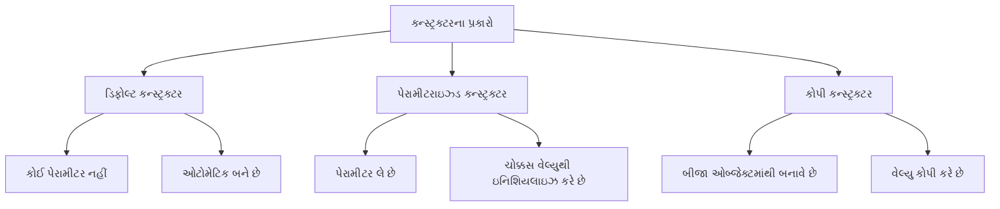

**કન્સ્ટ્રક્ટરના પ્રકારો**:

1. **ડિફોલ્ટ કન્સ્ટ્રક્ટર**: કોઈ પેરામીટર નથી, જો કોઈ કન્સ્ટ્રક્ટર ન હોય તો જાવા દ્વારા બનાવવામાં આવે છે
2. **પેરામીટરાઇઝ્ડ કન્સ્ટ્રક્ટર**: ઓબ્જેક્ટને ચોક્કસ વેલ્યુથી ઇનિશિયલાઇઝ કરવા માટે પેરામીટર લે છે
3. **કોપી કન્સ્ટ્રક્ટર**: બીજા ઓબ્જેક્ટમાંથી વેલ્યુ કોપી કરીને ઓબ્જેક્ટ બનાવે છે

**પેરામીટરાઇઝ્ડ કન્સ્ટ્રક્ટર માટે જાવા કોડ**:

```java
public class Student {
    // ઇન્સ્ટન્સ વેરિએબલ્સ
    private int id;
    private String name;
    private double marks;
    
    // પેરામીટરાઇઝ્ડ કન્સ્ટ્રક્ટર
    public Student(int studentId, String studentName, double studentMarks) {
        id = studentId;
        name = studentName;
        marks = studentMarks;
    }
    
    // વિદ્યાર્થીની વિગતો દર્શાવવા માટેની મેથડ
    public void displayDetails() {
        System.out.println("વિદ્યાર્થી ID: " + id);
        System.out.println("વિદ્યાર્થીનું નામ: " + name);
        System.out.println("વિદ્યાર્થીના માર્ક્સ: " + marks);
    }
    
    public static void main(String[] args) {
        // પેરામીટરાઇઝ્ડ કન્સ્ટ્રક્ટરનો ઉપયોગ કરીને ઓબ્જેક્ટ બનાવવા
        Student s1 = new Student(101, "રાજ", 85.5);
        Student s2 = new Student(102, "પ્રિયા", 92.0);
        
        // વિદ્યાર્થીની વિગતો દર્શાવવી
        System.out.println("પ્રથમ વિદ્યાર્થી:");
        s1.displayDetails();
        
        System.out.println("\nબીજો વિદ્યાર્થી:");
        s2.displayDetails();
    }
}
```

**કન્સ્ટ્રક્ટરના પ્રકારો માટે યાદ રાખવાની ટ્રિક**: "**DPC**" - Default, Parameterized, Copy

## પ્રશ્ન 2(a OR): જાવામાં મૂળભૂત OOP કૉન્સેપ્ટ્સની યાદી બનાવો અને કોઈ એક સમજાવો. (ગુણ: 03)

### જવાબ 2(a OR)

**જાવામાં મૂળભૂત OOP કૉન્સેપ્ટ્સ**:

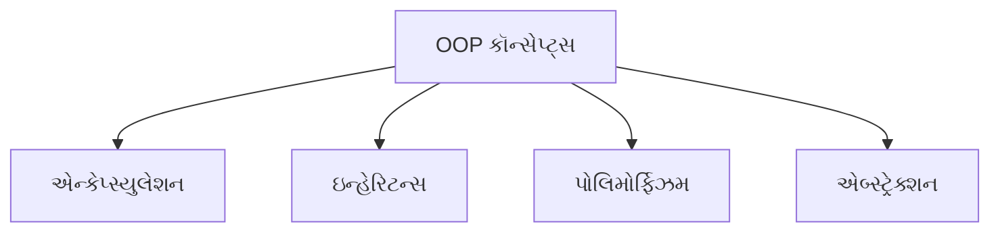

* **એન્કેપ્સ્યુલેશન**: ડેટા અને તેના પર કામ કરતી મેથડ્સને એક સાથે બાંધવાનો પ્રોસેસ
* **ઇન્હેરિટન્સ**: હાલના ક્લાસમાંથી નવા ક્લાસ બનાવવા
* **પોલિમોર્ફિઝમ**: એક જ મેથડ અલગ-અલગ સંદર્ભમાં અલગ રીતે વર્તે છે
* **એબ્સ્ટ્રેક્શન**: જટિલ ઇમ્પ્લિમેન્ટેશન ડિટેલ્સ છુપાવવી, ફક્ત ફંક્શનાલિટી બતાવવી

**એન્કેપ્સ્યુલેશનનું સ્પષ્ટીકરણ**:
એન્કેપ્સ્યુલેશન એ ડેટા અને મેથડ્સને એક એકમ (ક્લાસ) તરીકે **બાંધવાની** અને બહારની દુનિયાથી ડેટાને **છુપાવવાની** પ્રક્રિયા છે. તે આ રીતે હાંસલ થાય છે:

* **પ્રાઇવેટ ડેટા મેમ્બર્સ**: ક્લાસની અંદર એક્સેસ મર્યાદિત
* **પબ્લિક ગેટર/સેટર મેથડ્સ**: પ્રાઇવેટ ડેટાનો નિયંત્રિત એક્સેસ
* **ફાયદા**: વધુ સુરક્ષા, ડેટા છુપાવવો, અને મોડ્યુલર કોડ

**યાદ રાખવા માટેની ટ્રિક**: "**EIPA**" - Encapsulation, Inheritance, Polymorphism, Abstraction

## પ્રશ્ન 2(b OR): final કીવર્ડ ઉદાહરણ સાથે સમજાવો. (ગુણ: 04)

### જવાબ 2(b OR)

જાવામાં **final** કીવર્ડ:

* **કોન્સ્ટન્ટ્સ** બનાવે છે જે બદલી શકાતા નથી
* **વેરિએબલ્સ**, **મેથડ્સ**, અને **ક્લાસ**માં લાગુ કરી શકાય છે
* **Final વેરિએબલ**: ઇનિશિયલાઇઝેશન પછી વેલ્યુ બદલી શકાતી નથી
* **Final મેથડ**: સબક્લાસ દ્વારા ઓવરરાઇડ કરી શકાતી નથી
* **Final ક્લાસ**: એક્સટેન્ડ કરી શકાતી નથી (ઇન્હેરિટન્સ નહીં)

```java
public class FinalDemo {
    // Final વેરિએબલ (કોન્સ્ટન્ટ)
    final double PI = 3.14159;
    
    // Final મેથડ
    final void display() {
        System.out.println("આ મેથડ ઓવરરાઇડ થઈ શકતી નથી");
    }
    
    public static void main(String[] args) {
        FinalDemo obj = new FinalDemo();
        
        // Final વેરિએબલનો ઉપયોગ
        System.out.println("PI ની વેલ્યુ: " + obj.PI);
        
        // Final વેરિએબલ મોડિફાય કરી શકાતી નથી
        // obj.PI = 3.14;  // આ કમ્પાઇલેશન એરર થશે
        
        // Final મેથડ કૉલિંગ
        obj.display();
    }
}

// Final ક્લાસ
final class SecureClass {
    void show() {
        System.out.println("આ ક્લાસ એક્સટેન્ડ થઈ શકતો નથી");
    }
}

// Final ક્લાસ એક્સટેન્ડ કરી શકાતો નથી
// class ChildClass extends SecureClass {} // આ કમ્પાઇલેશન એરર થશે

## પ્રશ્ન 2(c OR): જાવા એક્સેસ મોડિફાયરનો સ્કોપ લખો. public મોડિફાયર સમજાવવા માટે એક જાવા કોડ બનાવો. (ગુણ: 07)

### જવાબ 2(c OR):

**જાવા એક્સેસ મોડિફાયર્સનો સ્કોપ**:

| મોડિફાયર | ક્લાસ | પેકેજ | સબક્લાસ | વર્લ્ડ |
|----------|-------|---------|----------|-------|
| **private** | હા | ના | ના | ના |
| **default** (કોઈ મોડિફાયર નહીં) | હા | હા | ના | ના |
| **protected** | હા | હા | હા | ના |
| **public** | હા | હા | હા | હા |

**યાદ રાખવા માટેની ટ્રિક**: "**Pri-De-Pro-Pub**" (Private-Default-Protected-Public) વધતા એક્સેસિબિલિટી સાથે

**public મોડિફાયર સમજાવવા માટે જાવા કોડ**:

```java
// ફાઇલ: AccessDemo.java
package demo.access;

public class AccessDemo {
    // Public વેરિએબલ
    public int publicVar = 100;
    
    // Public મેથડ
    public void publicMethod() {
        System.out.println("આ એક public મેથડ છે");
        System.out.println("Public વેરિએબલની વેલ્યુ: " + publicVar);
    }
    
    public static void main(String[] args) {
        // એજ ક્લાસનો ઓબ્જેક્ટ બનાવવો
        AccessDemo obj1 = new AccessDemo();
        
        // એજ ક્લાસમાં public મેમ્બર્સ એક્સેસ કરવા
        System.out.println("એજ ક્લાસમાંથી એક્સેસ: " + obj1.publicVar);
        obj1.publicMethod();
    }
}

// ફાઇલ: AccessTester.java
package demo.access;

public class AccessTester {
    public static void main(String[] args) {
        // AccessDemo ક્લાસનો ઓબ્જેક્ટ બનાવવો
        AccessDemo obj = new AccessDemo();
        
        // અલગ ક્લાસમાંથી public મેમ્બર્સ એક્સેસ કરવા
        System.out.println("અલગ ક્લાસમાંથી એક્સેસ: " + obj.publicVar);
        obj.publicMethod();
        
        // કોઈપણ પેકેજ, ક્લાસ, કે સબક્લાસમાંથી એક્સેસ થઈ શકે છે
    }
}
```

**Public મોડિફાયર વિશે મુખ્ય મુદ્દાઓ**:

* **બધે એક્સેસિબલ**: ક્લાસમાં, પેકેજમાં, સબક્લાસમાં, અને પેકેજની બહાર
* **ઇન્ટરફેસ**, **API મેથડ્સ**, અને **જનરલ-પર્પઝ ફંક્શનાલિટી** માટે વપરાય છે
* **મહત્તમ એક્સેસિબિલિટી** ઓછામાં ઓછા પ્રતિબંધ સાથે આપે છે
* **એન્કેપ્સ્યુલેશન** જાળવવા માટે સાવચેતીથી વાપરવું જોઈએ

## પ્રશ્ન 3(a): ઇન્હેરિટન્સના વિવિધ પ્રકારો જણાવો અને ઉદાહરણ સાથે કોઈ એક સમજાવો. (ગુણ: 03)

### જવાબ 3(a)

**જાવામાં ઇન્હેરિટન્સના પ્રકારો**:

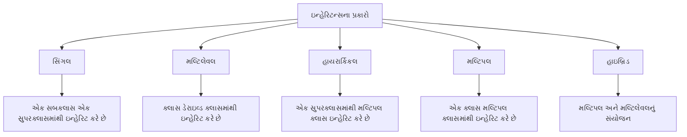

| પ્રકાર | વર્ણન |
|------|-------------|
| **સિંગલ** | એક સબક્લાસ એક સુપરક્લાસમાંથી ઇન્હેરિટ કરે છે |
| **મલ્ટિલેવલ** | ક્લાસ ડેરાઇવ્ડ ક્લાસમાંથી ઇન્હેરિટ કરે છે |
| **હાયરાર્કિકલ** | એક સુપરક્લાસમાંથી મલ્ટિપલ ક્લાસ ઇન્હેરિટ કરે છે |
| **મલ્ટિપલ** | એક ક્લાસ મલ્ટિપલ ક્લાસમાંથી ઇન્હેરિટ કરે છે (જાવામાં ઇન્ટરફેસ દ્વારા) |
| **હાઇબ્રિડ** | મલ્ટિપલ અને મલ્ટિલેવલ ઇન્હેરિટન્સનું સંયોજન |

**સિંગલ ઇન્હેરિટન્સનું ઉદાહરણ**:

```java
// પેરન્ટ ક્લાસ
class Animal {
    void eat() {
        System.out.println("પ્રાણી ખાઈ રહ્યું છે");
    }
}

// Animal ક્લાસમાંથી ઇન્હેરિટ થતો ચાઇલ્ડ ક્લાસ
class Dog extends Animal {
    void bark() {
        System.out.println("કૂતરો ભસી રહ્યો છે");
    }
}

// ઉપયોગ
class InheritanceDemo {
    public static void main(String[] args) {
        Dog d = new Dog();
        d.eat();  // Animal ક્લાસમાંથી ઇન્હેરિટ કરેલ
        d.bark(); // Dog ક્લાસની પોતાની મેથડ
    }
}
```

**યાદ રાખવા માટેની ટ્રિક**: "**SIMHH**" - Single, Inheritance, Multiple, Hierarchical, Hybrid

## પ્રશ્ન 3(b): StringBuffer ક્લાસની કોઈપણ બે મેથડ્સ યોગ્ય ઉદાહરણ સાથે સમજાવો. (ગુણ: 04)

### જવાબ 3(b)

**StringBuffer ક્લાસની મેથડ્સ**:

1. **append()**: StringBufferના અંતમાં કેરેક્ટર્સ ઉમેરે છે
2. **insert()**: ચોક્કસ પોઝિશન પર કેરેક્ટર્સ દાખલ કરે છે

```java
public class StringBufferDemo {
    public static void main(String[] args) {
        // StringBuffer ઓબ્જેક્ટ બનાવો
        StringBuffer sb = new StringBuffer("Hello");
        
        // 1. append() મેથડ
        sb.append(" World");
        System.out.println("append પછી: " + sb);  // આઉટપુટ: Hello World
        
        // 2. insert() મેથડ
        sb.insert(5, " Java");
        System.out.println("insert પછી: " + sb);  // આઉટપુટ: Hello Java World
        
        // StringBuffer વિશે વધારાની માહિતી
        System.out.println("લંબાઈ: " + sb.length());
        System.out.println("કેપેસિટી: " + sb.capacity());
    }
}
```

**અન્ય મહત્વપૂર્ણ StringBuffer મેથડ્સ**:

* **delete(int start, int end)**: કેરેક્ટર્સ દૂર કરે છે
* **reverse()**: કેરેક્ટર્સને ઉલટાવે છે
* **replace(int start, int end, String str)**: કેરેક્ટર્સ બદલે છે
* **capacity()**: વર્તમાન કેપેસિટી પાછી આપે છે

## પ્રશ્ન 3(c): ઇન્ટરફેસ વ્યાખ્યાયિત કરો. ઇન્ટરફેસનો ઉપયોગ કરીને મલ્ટિપલ ઇન્હેરિટન્સ દર્શાવવા માટે એક જાવા પ્રોગ્રામ લખો. (ગુણ: 07)

### જવાબ 3(c)

**ઇન્ટરફેસ**: ક્લાસનો બ્લૂપ્રિન્ટ જેમાં **એબ્સ્ટ્રેક્ટ મેથડ્સ** અને **કોન્સ્ટન્ટ્સ** હોય છે. તે ક્લાસ "શું" કરે છે તે દર્શાવે છે, "કેવી રીતે" નહીં. તે જાવામાં **મલ્ટિપલ ઇન્હેરિટન્સ**ને સપોર્ટ કરે છે.

**લક્ષણો**:

* બધી મેથડ્સ ડિફોલ્ટ રીતે **public** અને **abstract** છે
* બધા વેરિએબલ્સ ડિફોલ્ટ રીતે **public**, **static**, અને **final** છે
* ઇન્સ્ટન્સિએટ કરી શકાતું નથી (ઓબ્જેક્ટ નહીં)
* **implements** કીવર્ડ વડે ઇમ્પ્લિમેન્ટ થાય છે

```java
// પ્રથમ ઇન્ટરફેસ
interface Drawable {
    void draw();  // એબ્સ્ટ્રેક્ટ મેથડ
    
    // કોન્સ્ટન્ટ
    int SIZE = 10;
}

// બીજો ઇન્ટરફેસ
interface Colorable {
    void setColor(String color);  // એબ્સ્ટ્રેક્ટ મેથડ
}

// મલ્ટિપલ ઇન્ટરફેસ ઇમ્પ્લિમેન્ટ કરતો ક્લાસ (મલ્ટિપલ ઇન્હેરિટન્સ)
class Circle implements Drawable, Colorable {
    private String color;
    
    // Drawable ઇન્ટરફેસની મેથડ ઇમ્પ્લિમેન્ટ કરવી
    @Override
    public void draw() {
        System.out.println(SIZE + " સાઇઝ સાથે સર્કલ દોરી રહ્યા છીએ");
    }
    
    // Colorable ઇન્ટરફેસની મેથડ ઇમ્પ્લિમેન્ટ કરવી
    @Override
    public void setColor(String color) {
        this.color = color;
        System.out.println("સર્કલનો કલર " + color + " સેટ કર્યો");
    }
    
    // વધારાની મેથડ
    public void displayInfo() {
        System.out.println("આ એક " + color + " સર્કલ છે");
    }
}

// મુખ્ય ક્લાસ
public class InterfaceDemo {
    public static void main(String[] args) {
        Circle c = new Circle();
        c.draw();          // Drawable ઇન્ટરફેસથી
        c.setColor("લાલ"); // Colorable ઇન્ટરફેસથી
        c.displayInfo();   // Circle ક્લાસની પોતાની મેથડ
        
        // ઇન્ટરફેસ રેફરન્સ વેરિએબલ્સનો ઉપયોગ
        Drawable d = new Circle();
        d.draw();  // ફક્ત Drawable મેથડ્સ જ કૉલ કરી શકાય
        
        Colorable col = new Circle();
        col.setColor("વાદળી");  // ફક્ત Colorable મેથડ્સ જ કૉલ કરી શકાય
    }
}
```

**ઇન્ટરફેસ માટે યાદ રાખવાની ટ્રિક**: "**CAMP**" - Constants, Abstract methods, Multiple inheritance, Public

## પ્રશ્ન 3(a OR): એબ્સ્ટ્રેક્ટ ક્લાસ અને ઇન્ટરફેસ વચ્ચેના તફાવતો આપો. (ગુણ: 03)

### જવાબ 3(a OR)

| એબ્સ્ટ્રેક્ટ ક્લાસ | ઇન્ટરફેસ |
|----------------|-----------|
| **abstract** કીવર્ડનો ઉપયોગ કરે છે | **interface** કીવર્ડનો ઉપયોગ કરે છે |
| **એબ્સ્ટ્રેક્ટ અને નોન-એબ્સ્ટ્રેક્ટ** મેથડ્સ હોઈ શકે છે | બધી મેથડ્સ ડિફોલ્ટ રીતે **એબ્સ્ટ્રેક્ટ** છે (Java 8 પહેલાં) |
| **કન્સ્ટ્રક્ટર્સ** હોઈ શકે છે | કન્સ્ટ્રક્ટર્સ **ન** હોઈ શકે |
| **આંશિક ઇમ્પ્લિમેન્ટેશન**ને સપોર્ટ કરે છે | **સંપૂર્ણ એબ્સ્ટ્રેક્શન** આપે છે |
| ફક્ત **સિંગલ ઇન્હેરિટન્સ** | **મલ્ટિપલ ઇન્હેરિટન્સ**ને સપોર્ટ કરે છે |
| **ઇન્સ્ટન્સ વેરિએબલ્સ** હોઈ શકે છે | વેરિએબલ્સ ફક્ત **static અને final** જ હોય છે |
| મેથડ્સ **કોઈપણ એક્સેસ મોડિફાયર** ધરાવી શકે છે | મેથડ્સ ડિફોલ્ટ રીતે **public** છે |

**યાદ રાખવા માટેની ટ્રિક**: "**CAMP vs SCIM**"

* ઇન્ટરફેસ માટે: Constants, Abstract methods, Multiple inheritance, Public
* એબ્સ્ટ્રેક્ટ માટે: Some implementation, Constructors, Instance variables, Mixed access

## પ્રશ્ન 3(b OR): String ક્લાસની કોઈપણ બે મેથડ્સ યોગ્ય ઉદાહરણ સાથે સમજાવો. (ગુણ: 04)

### જવાબ 3(b OR)

**String ક્લાસની મેથડ્સ**:

1. **substring()**: સ્ટ્રિંગનો એક ભાગ કાઢે છે
2. **equals()**: સ્ટ્રિંગ કન્ટેન્ટ સરખાવે છે

```java
public class StringMethodsDemo {
    public static void main(String[] args) {
        String str = "Hello Java Programming";
        
        // 1. substring() મેથડ
        String sub1 = str.substring(6);       // ઇન્ડેક્સ 6 થી અંત સુધી
        String sub2 = str.substring(6, 10);   // ઇન્ડેક્સ 6 થી 9 સુધી
        
        System.out.println("ઓરિજિનલ: " + str);
        System.out.println("substring(6): " + sub1);      // આઉટપુટ: Java Programming
        System.out.println("substring(6, 10): " + sub2);  // આઉટપુટ: Java
        
        // 2. equals() મેથડ
        String s1 = "Java";
        String s2 = "java";
        String s3 = "Java";
        String s4 = new String("Java");
        
        System.out.println("s1.equals(s2): " + s1.equals(s2));         // false
        System.out.println("s1.equals(s3): " + s1.equals(s3));         // true
        System.out.println("s1.equals(s4): " + s1.equals(s4));         // true
        System.out.println("s1.equalsIgnoreCase(s2): " + s1.equalsIgnoreCase(s2)); // true
        System.out.println("s1 == s3: " + (s1 == s3));                 // true
        System.out.println("s1 == s4: " + (s1 == s4));                 // false (અલગ ઓબ્જેક્ટ્સ)
    }
}
```

**અન્ય મહત્વપૂર્ણ String મેથડ્સ**:

* **length()**: સ્ટ્રિંગની લંબાઈ પાછી આપે છે
* **charAt()**: ચોક્કસ પોઝિશન પર કેરેક્ટર પાછો આપે છે
* **indexOf()**: સબસ્ટ્રિંગનો ઇન્ડેક્સ પાછો આપે છે
* **concat()**: સ્ટ્રિંગ્સને જોડે છે
* **replace()**: કેરેક્ટર્સ/સબસ્ટ્રિંગ્સ બદલે છે

## પ્રશ્ન 3(c OR): પેકેજ સમજાવો અને યોગ્ય ઉદાહરણ સાથે પેકેજ બનાવવાના પગલાં જણાવો. (ગુણ: 07)

### જવાબ 3(c OR)

**પેકેજ**: એક નેમસ્પેસ જે સંબંધિત ક્લાસ અને ઇન્ટરફેસને વ્યવસ્થિત કરે છે. તે **નેમિંગ કોન્ફ્લિક્ટ્સ ટાળવા** અને **એક્સેસ કંટ્રોલ મેનેજ કરવા**માં મદદ કરે છે.

**પેકેજના ફાયદા**:

* **નેમસ્પેસ મેનેજમેન્ટ**: નેમિંગ કોન્ફ્લિક્ટ્સ ટાળે છે
* **એક્સેસ કંટ્રોલ**: ક્લાસની વિઝિબિલિટી નિયંત્રિત કરે છે
* **કોડ ઓર્ગેનાઇઝેશન**: સંબંધિત ક્લાસને સમૂહમાં રાખે છે

**પેકેજ બનાવવા અને વાપરવાના પગલાં**:

1. ફાઇલની શરૂઆતમાં પેકેજ **ડિક્લેર** કરો
2. યોગ્ય ડિરેક્ટરી સ્ટ્રક્ચર સાથે ફાઇલ **સેવ** કરો
3. યોગ્ય પેકેજ સ્ટ્રક્ચર સાથે ફાઇલ **કમ્પાઇલ** કરો
4. પેકેજને ઇમ્પોર્ટ કરીને **ઉપયોગ** કરો

```java
// પગલું 1: પેકેજ ડિક્લેર કરો (Calculator.java તરીકે સેવ કરો)
package com.mymath.util;

public class Calculator {
    // Calculator મેથડ્સ
    public int add(int a, int b) {
        return a + b;
    }
    
    public int subtract(int a, int b) {
        return a - b;
    }
    
    public int multiply(int a, int b) {
        return a * b;
    }
    
    public int divide(int a, int b) {
        if (b == 0) {
            System.out.println("શૂન્યથી ભાગી શકાતું નથી");
            return 0;
        }
        return a / b;
    }
}

// પગલું 4: પેકેજનો ઉપયોગ કરો (PackageDemo.java તરીકે સેવ કરો)
// પેકેજનો ઉપયોગ કરતી અલગ ફાઇલ
import com.mymath.util.Calculator;

public class PackageDemo {
    public static void main(String[] args) {
        // Calculator ક્લાસનો ઓબ્જેક્ટ બનાવો
        Calculator calc = new Calculator();
        
        // મેથડ્સનો ઉપયોગ કરો
        System.out.println("10 + 5 = " + calc.add(10, 5));
        System.out.println("10 - 5 = " + calc.subtract(10, 5));
        System.out.println("10 * 5 = " + calc.multiply(10, 5));
        System.out.println("10 / 5 = " + calc.divide(10, 5));
    }
}
```

**પગલાં 2 & 3 માટે ટર્મિનલ કમાન્ડ્સ**:

```
# ડિરેક્ટરી સ્ટ્રક્ચર બનાવો
mkdir -p com/mymath/util

# સોર્સ ફાઇલને યોગ્ય ડિરેક્ટરીમાં મૂવ કરો
mv Calculator.java com/mymath/util/

# યોગ્ય ડિરેક્ટરી સ્ટ્રક્ચર સાથે કમ્પાઇલ કરો
javac com/mymath/util/Calculator.java

# મુખ્ય ક્લાસ કમ્પાઇલ અને રન કરો
javac PackageDemo.java
java PackageDemo
```

**પેકેજ બનાવવા માટે યાદ રાખવાની ટ્રિક**: "**DCCU**" - Declare, Create directory, Compile, Use/import

## પ્રશ્ન 4(a): જાવામાં એરર્સના પ્રકારો જણાવો. (ગુણ: 03)

### જવાબ 4(a)

**જાવામાં એરર્સના પ્રકારો**:

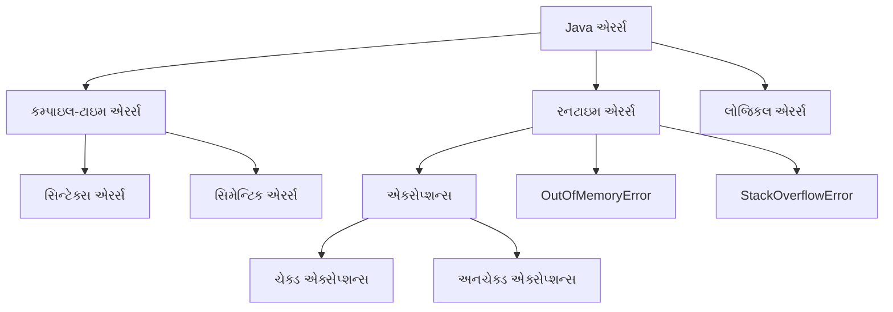

**ટૂંકું વર્ણન**:

* **કમ્પાઇલ-ટાઇમ એરર્સ**: કમ્પાઇલેશન દરમિયાન શોધાય છે
  * **સિન્ટેક્સ એરર્સ**: ખોટો સિન્ટેક્સ/ગ્રામર
  * **સિમેન્ટિક એરર્સ**: ખોટા ટાઇપ્સ, ઘોષિત ન કરેલા વેરિએબલ્સ
* **રનટાઇમ એરર્સ**: પ્રોગ્રામ એક્ઝિક્યુશન દરમિયાન થાય છે
  * **એક્સેપ્શન્સ**: IOException, NullPointerException
* **લોજિકલ એરર્સ**: પ્રોગ્રામ ચાલે છે પરંતુ ખોટાં પરિણામો આપે છે

**યાદ રાખવા માટેની ટ્રિક**: "**CRL**" - Compile-time, Runtime, Logical

## પ્રશ્ન 4(b): try catch બ્લોક ઉદાહરણ સાથે સમજાવો. (ગુણ: 04)

### જવાબ 4(b)

**Try-Catch બ્લોક**: પ્રોગ્રામ એક્ઝિક્યુશન દરમિયાન થઈ શકે તેવા રનટાઇમ એક્સેપ્શન્સને હેન્ડલ કરવાનો એક મેકેનિઝમ.

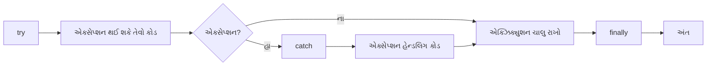

**ઉદાહરણ કોડ**:

```java
public class TryCatchDemo {
    public static void main(String[] args) {
        try {
            // એક્સેપ્શન થઈ શકે તેવો કોડ
            int[] numbers = {1, 2, 3};
            System.out.println("એલિમેન્ટ ઍક્સેસ કરી રહ્યા છીએ: " + numbers[5]); // ArrayIndexOutOfBoundsException
            
            // જો ઉપર એક્સેપ્શન થાય તો આ લાઇન એક્ઝિક્યુટ નહીં થાય
            System.out.println("આ પ્રિન્ટ નહીં થાય");
        } 
        catch (ArrayIndexOutOfBoundsException e) {
            // એક્સેપ્શન હેન્ડલિંગ કોડ
            System.out.println("એક્સેપ્શન પકડાયું: એરે ઇન્ડેક્સ બાઉન્ડ્સની બહાર છે");
            System.out.println("એરર મેસેજ: " + e.getMessage());
        }
        
        // પ્રોગ્રામ એક્ઝિક્યુશન ચાલુ રાખે છે
        System.out.println("એક્સેપ્શન હેન્ડલિંગ પછી પ્રોગ્રામ ચાલુ રહે છે");
    }
}
```

**મુખ્ય મુદ્દાઓ**:

* **try**: એવો કોડ ધરાવે છે જે એક્સેપ્શન થ્રો કરી શકે છે
* **catch**: try બ્લોકમાં થતા ચોક્કસ એક્સેપ્શન્સને હેન્ડલ કરે છે
* **finally**: (વૈકલ્પિક) એક્સેપ્શન થાય કે ન થાય, હંમેશા એક્ઝિક્યુટ થાય છે
* અલગ અલગ એક્સેપ્શન ટાઇપ્સને હેન્ડલ કરવા માટે મલ્ટિપલ catch બ્લોક્સ હોઈ શકે છે

## પ્રશ્ન 4(c): મેથડ ઓવરલોડિંગ અને ઓવરરાઇડિંગ વચ્ચેના કોઈપણ ચાર તફાવતો જણાવો. મેથડ ઓવરરાઇડિંગ સમજાવવા માટે એક જાવા કોડ લખો. (ગુણ: 07)

### જવાબ 4(c)

**મેથડ ઓવરલોડિંગ અને ઓવરરાઇડિંગ વચ્ચેના તફાવતો**:

| મેથડ ઓવરલોડિંગ | મેથડ ઓવરરાઇડિંગ |
|-------------------|-------------------|
| **એક જ ક્લાસ**માં | **પેરન્ટ-ચાઇલ્ડ ક્લાસ**નો સંબંધ |
| **અલગ પેરામીટર્સ** (સંખ્યા, ટાઇપ, ક્રમ) | **સરખા પેરામીટર્સ** અને રિટર્ન ટાઇપ |
| **કમ્પાઇલ-ટાઇમ** પર રિઝોલ્વ થાય છે | **રનટાઇમ** પર રિઝોલ્વ થાય છે |
| મેથડ **રીડેબિલિટી** વધારે છે | **પોલિમોર્ફિઝમ**ને સપોર્ટ કરે છે |

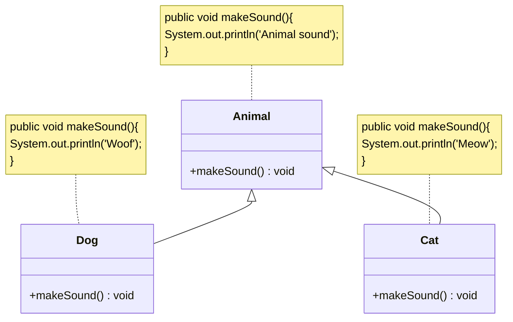

**મેથડ ઓવરરાઇડિંગ સમજાવવા માટે જાવા કોડ**:

```java
// પેરન્ટ ક્લાસ
class Animal {
    // ઓવરરાઇડ થનારી મેથડ
    public void makeSound() {
        System.out.println("પ્રાણી અવાજ કરે છે");
    }
}

// ચાઇલ્ડ ક્લાસ 1
class Dog extends Animal {
    // પેરન્ટ ક્લાસની મેથડ ઓવરરાઇડ કરવી
    @Override
    public void makeSound() {
        System.out.println("કૂતરો ભસે છે: ભૌ! ભૌ!");
    }
}

// ચાઇલ્ડ ક્લાસ 2
class Cat extends Animal {
    // પેરન્ટ ક્લાસની મેથડ ઓવરરાઇડ કરવી
    @Override
    public void makeSound() {
        System.out.println("બિલાડી મ્યાઉં કરે છે: મ્યાઉં!");
    }
}

// મુખ્ય ક્લાસ
public class OverridingDemo {
    public static void main(String[] args) {
        // પેરન્ટ ક્લાસ રેફરન્સ અને ઓબ્જેક્ટ
        Animal a1 = new Animal();
        a1.makeSound();  // આઉટપુટ: પ્રાણી અવાજ કરે છે
        
        // ચાઇલ્ડ ક્લાસ ઓબ્જેક્ટ્સ
        Dog d1 = new Dog();
        d1.makeSound();  // આઉટપુટ: કૂતરો ભસે છે: ભૌ! ભૌ!
        
        Cat c1 = new Cat();
        c1.makeSound();  // આઉટપુટ: બિલાડી મ્યાઉં કરે છે: મ્યાઉં!
        
        // પોલિમોર્ફિક બિહેવિયર - પેરન્ટ રેફરન્સ, ચાઇલ્ડ ઓબ્જેક્ટ્સ
        Animal a2 = new Dog();
        a2.makeSound();  // આઉટપુટ: કૂતરો ભસે છે: ભૌ! ભૌ!
        
        Animal a3 = new Cat();
        a3.makeSound();  // આઉટપુટ: બિલાડી મ્યાઉં કરે છે: મ્યાઉં!
    }
}
```

**મેથડ ઓવરરાઇડિંગ માટે યાદ રાખવાની ટ્રિક**: "**SOAP**" - Same method, Object of child, After inheritance, Polymorphism

## પ્રશ્ન 4(a OR): કોઈપણ ચાર ઇનબિલ્ટ એક્સેપ્શન્સ જણાવો. (ગુણ: 03)

### જવાબ 4(a OR)

**જાવામાં ઇનબિલ્ટ એક્સેપ્શન્સ**:

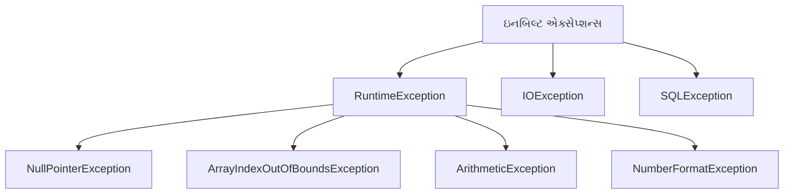

**સામાન્ય ઇનબિલ્ટ એક્સેપ્શન્સ**:

1. **NullPointerException**: જ્યારે null ઓબ્જેક્ટ રેફરન્સનો ઉપયોગ કરવાનો પ્રયાસ કરવામાં આવે
2. **ArrayIndexOutOfBoundsException**: જ્યારે અમાન્ય એરે ઇન્ડેક્સ ઍક્સેસ કરવામાં આવે
3. **ArithmeticException**: શૂન્યથી ભાગાકાર જેવી ગાણિતિક ભૂલો માટે
4. **NumberFormatException**: જ્યારે અમાન્ય સ્ટ્રિંગને નંબરમાં કન્વર્ટ કરવાનો પ્રયાસ કરવામાં આવે
5. **IOException**: જ્યારે I/O ઓપરેશન નિષ્ફળ જાય
6. **ClassNotFoundException**: જ્યારે અસ્તિત્વમાં ન હોય તેવા ક્લાસને ઍક્સેસ કરવાનો પ્રયાસ કરવામાં આવે
7. **IllegalArgumentException**: જ્યારે મેથડમાં અમાન્ય આર્ગ્યુમેન્ટ પાસ કરવામાં આવે

**યાદ રાખવા માટેની ટ્રિક**: "**NANI-CIL**" - NullPointer, ArrayIndexOutOfBounds, NumberFormat, IOException, ClassNotFound, IllegalArgument

## પ્રશ્ન 4(b OR): "throw" કીવર્ડ યોગ્ય ઉદાહરણ સાથે સમજાવો. (ગુણ: 04)

### જવાબ 4(b OR)

**Throw કીવર્ડ**: મેથડ અથવા કોડ બ્લોકમાંથી એક્સેપ્શન સ્પષ્ટપણે થ્રો કરવા માટે વપરાય છે.

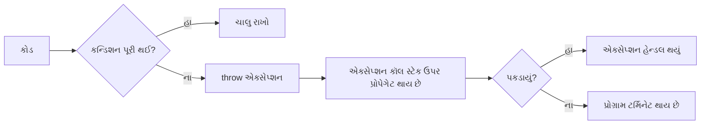

**ઉદાહરણ કોડ**:

```java
public class ThrowDemo {
    // એક્સેપ્શન થ્રો કરતી મેથડ
    static void checkAge(int age) {
        if (age < 18) {
            // સ્પષ્ટપણે એક્સેપ્શન થ્રો કરો
            throw new ArithmeticException("એક્સેસ નામંજૂર - તમારી ઉંમર ઓછામાં ઓછી 18 વર્ષ હોવી જોઈએ.");
        } else {
            System.out.println("એક્સેસ મંજૂર - તમે પૂરતા મોટા છો!");
        }
    }
    
    public static void main(String[] args) {
        try {
            // checkAge મેથડ ટેસ્ટ કરો
            checkAge(15);  // આ એક્સેપ્શન થ્રો કરશે
        } catch (ArithmeticException e) {
            System.out.println("એક્સેપ્શન પકડાયું: " + e.getMessage());
        }
        
        System.out.println("પ્રોગ્રામ ચાલુ રહે છે...");
    }
}
```

**આઉટપુટ**:

```
એક્સેપ્શન પકડાયું: એક્સેસ નામંજૂર - તમારી ઉંમર ઓછામાં ઓછી 18 વર્ષ હોવી જોઈએ.
પ્રોગ્રામ ચાલુ રહે છે...
```

**મુખ્ય મુદ્દાઓ**:

* **throw** નવો એક્સેપ્શન ઓબ્જેક્ટ બનાવે છે અને થ્રો કરે છે
* **બિલ્ટ-ઇન** અથવા **કસ્ટમ એક્સેપ્શન્સ** થ્રો કરી શકાય છે
* **try-catch** દ્વારા હેન્ડલ કરવું જોઈએ અથવા **throws** સાથે ડિક્લેર કરવું જોઈએ
* **કસ્ટમ વેલિડેશન** અને એરર હેન્ડલિંગ માટે વપરાય છે

## પ્રશ્ન 4(c OR): 'this' કીવર્ડ અને 'super' કીવર્ડની તુલના કરો. યોગ્ય ઉદાહરણ સાથે super કીવર્ડ સમજાવો. (ગુણ: 07)

### જવાબ 4(c OR)

**'this' અને 'super' કીવર્ડની તુલના**:

| 'this' કીવર્ડ | 'super' કીવર્ડ |
|----------------|-----------------|
| **વર્તમાન ક્લાસના ઓબ્જેક્ટ**નો સંદર્ભ આપે છે | **પેરન્ટ ક્લાસના ઓબ્જેક્ટ**નો સંદર્ભ આપે છે |
| **વર્તમાન ક્લાસના મેમ્બર્સ** ઍક્સેસ કરવા વપરાય છે | **પેરન્ટ ક્લાસના મેમ્બર્સ** ઍક્સેસ કરવા વપરાય છે |
| **કન્સ્ટ્રક્ટર્સ**, **મેથડ્સ**, **વેરિએબલ્સ** સાથે વપરાય છે | **કન્સ્ટ્રક્ટર્સ**, **મેથડ્સ**, **વેરિએબલ્સ** સાથે વપરાય છે |
| **સ્ટેટિક કોન્ટેક્સ્ટ**માં વાપરી શકાતું નથી | **સ્ટેટિક કોન્ટેક્સ્ટ**માં વાપરી શકાતું નથી |
| **વેરિએબલ શેડોઇંગ દૂર કરવા** વપરાય છે | **ઓવરરાઇડેડ મેથડ્સ ઍક્સેસ** કરવા વપરાય છે |

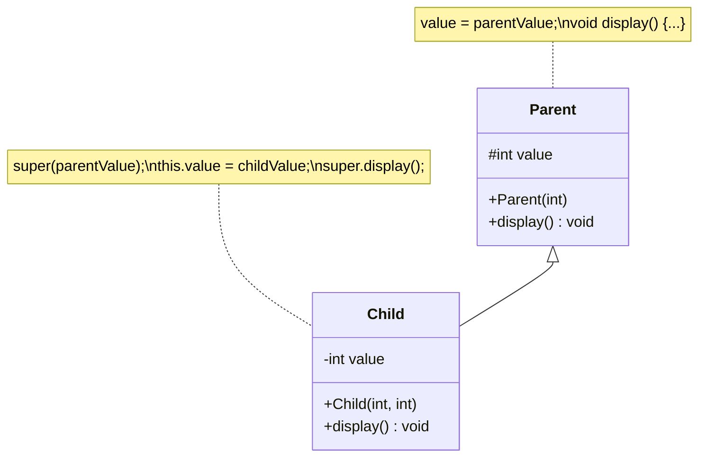

**'super' કીવર્ડ સમજાવવા માટે જાવા કોડ**:

```java
// પેરન્ટ ક્લાસ
class Person {
    // ઇન્સ્ટન્સ વેરિએબલ્સ
    String name;
    int age;
    
    // કન્સ્ટ્રક્ટર
    Person(String name, int age) {
        this.name = name;
        this.age = age;
    }
    
    // મેથડ
    void display() {
        System.out.println("નામ: " + name);
        System.out.println("ઉંમર: " + age);
    }
}

// ચાઇલ્ડ ક્લાસ
class Student extends Person {
    // વધારાનું ઇન્સ્ટન્સ વેરિએબલ
    String course;
    
    // super વાપરતો કન્સ્ટ્રક્ટર
    Student(String name, int age, String course) {
        // પેરન્ટ કન્સ્ટ્રક્ટર કૉલ કરો
        super(name, age);
        this.course = course;
    }
    
    // પેરન્ટ મેથડ ઓવરરાઇડ કરવી
    @Override
    void display() {
        // પેરન્ટ મેથડ કૉલ કરો
        super.display();
        // વધારાની માહિતી ઉમેરો
        System.out.println("કોર્સ: " + course);
    }
    
    // વેરિએબલ શેડોઇંગ બતાવવા માટે મેથડ
    void displayAge(int age) {
        System.out.println("લોકલ ઉંમર: " + age);
        System.out.println("આ ઓબ્જેક્ટની ઉંમર: " + this.age);
        System.out.println("પેરન્ટ ક્લાસની ઉંમર: " + super.age); // આ કેસમાં this.age જેવું જ છે
    }
}

// મુખ્ય ક્લાસ
public class SuperDemo {
    public static void main(String[] args) {
        // Student ઓબ્જેક્ટ બનાવો
        Student s = new Student("જોન", 20, "જાવા પ્રોગ્રામિંગ");
        
        // ઓવરરાઇડેડ મેથડ કૉલ કરો
        s.display();
        
        // લોકલ વેરિએબલ શેડોઇંગ સાથે મેથડ ટેસ્ટ કરો
        s.displayAge(25);
    }
}
```

**આઉટપુટ**:

```
નામ: જોન
ઉંમર: 20
કોર્સ: જાવા પ્રોગ્રામિંગ
લોકલ ઉંમર: 25
આ ઓબ્જેક્ટની ઉંમર: 20
પેરન્ટ ક્લાસની ઉંમર: 20
```

**'super' કીવર્ડના ઉપયોગો**:

* **super()**: પેરન્ટ કન્સ્ટ્રક્ટર કૉલ કરવા
* **super.variable**: પેરન્ટ વેરિએબલ ઍક્સેસ કરવા
* **super.method()**: પેરન્ટ મેથડ કૉલ કરવા

**યાદ રાખવા માટેની ટ્રિક**: "**CVM**" - Constructor, Variables, Methods (this અને super બંને માટે)

## પ્રશ્ન 5(a): વિવિધ સ્ટ્રીમ ક્લાસની યાદી આપો. (ગુણ: 03)

### જવાબ 5(a)

**જાવા સ્ટ્રીમ ક્લાસ**:

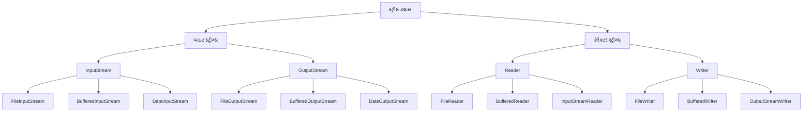

**મુખ્ય સ્ટ્રીમ ક્લાસ**:

* **બાઇટ સ્ટ્રીમ્સ**: ડેટાને બાઇટ બાય બાઇટ (8 બિટ્સ) પ્રોસેસ કરે છે
  * **InputStream**: બાઇટ્સ વાંચવા માટેનો એબ્સ્ટ્રેક્ટ ક્લાસ
  * **OutputStream**: બાઇટ્સ લખવા માટેનો એબ્સ્ટ્રેક્ટ ક્લાસ
* **કેરેક્ટર સ્ટ્રીમ્સ**: ડેટાને કેરેક્ટર બાય કેરેક્ટર (16 બિટ્સ) પ્રોસેસ કરે છે
  * **Reader**: કેરેક્ટર્સ વાંચવા માટેનો એબ્સ્ટ્રેક્ટ ક્લાસ
  * **Writer**: કેરેક્ટર્સ લખવા માટેનો એબ્સ્ટ્રેક્ટ ક્લાસ

**યાદ રાખવા માટેની ટ્રિક**: "**BIOS-RW**" - Byte Input/Output Streams, Reader/Writer

## પ્રશ્ન 5(b): "Divide by zero" એરર માટે યુઝર ડિફાઇન્ડ એક્સેપ્શન ડેવલપ કરવા માટે એક જાવા પ્રોગ્રામ લખો. (ગુણ: 04)

### જવાબ 5(b)

**"Divide by Zero" એરર માટે યુઝર-ડિફાઇન્ડ એક્સેપ્શન**:

```java
// કસ્ટમ એક્સેપ્શન ક્લાસ
class DivideByZeroException extends Exception {
    // કન્સ્ટ્રક્ટર
    public DivideByZeroException(String message) {
        // પેરન્ટ કન્સ્ટ્રક્ટર કૉલ કરો
        super(message);
    }
}

// મુખ્ય ક્લાસ
public class CustomExceptionDemo {
    // કસ્ટમ એક્સેપ્શન થ્રો કરતી મેથડ
    public static double divide(int a, int b) throws DivideByZeroException {
        if (b == 0) {
            // કસ્ટમ એક્સેપ્શન થ્રો કરો
            throw new DivideByZeroException("શૂન્યથી ભાગી શકાતું નથી!");
        }
        return (double) a / b;
    }
    
    public static void main(String[] args) {
        try {
            // divide મેથડ ટેસ્ટ કરો
            System.out.println("10 / 2 = " + divide(10, 2));  // બરાબર કામ કરશે
            System.out.println("10 / 0 = " + divide(10, 0));  // એક્સેપ્શન થ્રો કરશે
        } catch (DivideByZeroException e) {
            System.out.println("કસ્ટમ એક્સેપ્શન: " + e.getMessage());
        } finally {
            System.out.println("પ્રોગ્રામ એક્ઝિક્યુશન પૂર્ણ");
        }
    }
}
```

**આઉટપુટ**:

```
10 / 2 = 5.0
કસ્ટમ એક્સેપ્શન: શૂન્યથી ભાગી શકાતું નથી!
પ્રોગ્રામ એક્ઝિક્યુશન પૂર્ણ
```

**યુઝર-ડિફાઇન્ડ એક્સેપ્શન બનાવવાના પગલાં**:

1. Exception **એક્સટેન્ડ કરતો ક્લાસ બનાવો**
2. પેરન્ટને મેસેજ પાસ કરવા માટે **કન્સ્ટ્રક્ટર ડિફાઇન** કરો
3. જ્યારે કન્ડિશન મળે ત્યારે **એક્સેપ્શન થ્રો** કરો
4. try-catch બ્લોક સાથે **એક્સેપ્શન હેન્ડલ** કરો

## પ્રશ્ન 5(c): જાવામાં એક પ્રોગ્રામ લખો જે ફાઇલની સામગ્રીને બાઇટ બાય બાઇટ વાંચે અને તેને બીજી ફાઇલમાં કોપી કરે. (ગુણ: 07)

### જવાબ 5(c)

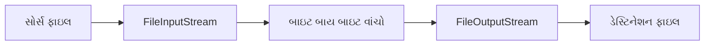

**બાઇટ બાય બાઇટ ફાઇલ કોપી કરવા માટે જાવા પ્રોગ્રામ**:

```java
import java.io.FileInputStream;
import java.io.FileOutputStream;
import java.io.IOException;

public class FileCopyByteByByte {
    public static void main(String[] args) {
        // સોર્સ અને ડેસ્ટિનેશન ફાઇલ પાથ
        String sourceFile = "source.txt";
        String destFile = "destination.txt";
        
        // ફાઇલ સ્ટ્રીમ્સ ડિક્લેર કરો
        FileInputStream fis = null;
        FileOutputStream fos = null;
        
        try {
            // ઇનપુટ સ્ટ્રીમ ઇનિશિયલાઇઝ કરો
            fis = new FileInputStream(sourceFile);
            
            // આઉટપુટ સ્ટ્રીમ ઇનિશિયલાઇઝ કરો
            fos = new FileOutputStream(destFile);
            
            // દરેક બાઇટ સ્ટોર કરવા માટે વેરિએબલ
            int byteData;
            
            // બાઇટ બાય બાઇટ વાંચો અને લખો
            System.out.println("બાઇટ બાય બાઇટ ફાઇલ કોપી કરી રહ્યા છીએ...");
            while ((byteData = fis.read()) != -1) {
                // બાઇટને ડેસ્ટિનેશન ફાઇલમાં લખો
                fos.write(byteData);
            }
            
            System.out.println("ફાઇલ સફળતાપૂર્વક કોપી થઈ ગઈ!");
            
        } catch (IOException e) {
            System.out.println("એરર: " + e.getMessage());
            e.printStackTrace();
        } finally {
            // સ્ટ્રીમ્સ બંધ કરો
            try {
                if (fis != null) {
                    fis.close();
                }
                if (fos != null) {
                    fos.close();
                }
            } catch (IOException e) {
                System.out.println("સ્ટ્રીમ્સ બંધ કરવામાં એરર: " + e.getMessage());
            }
        }
    }
}
```

**ફાઇલ હેન્ડલિંગ વિશે મુખ્ય મુદ્દાઓ**:

* સ્ટ્રીમ્સ **હંમેશા finally બ્લોકમાં બંધ** કરો
* Java 7+ માં ઓટોમેટિક બંધ કરવા માટે **try-with-resources** વાપરો
* **BufferedInputStream/BufferedOutputStream** પરફોર્મન્સ સુધારે છે
* **બાઇટ-બાય-બાઇટ** કોપીઇંગ બધા ફાઇલ ટાઇપ્સ (ટેક્સ્ટ અને બાઇનરી) માટે કામ કરે છે

**ફાઇલ કોપી કરવાના પગલાં માટે યાદ રાખવાની ટ્રિક**: "**CROW**" - Create streams, Read source, Output to destination, Wrap up (close)

## પ્રશ્ન 5(a OR): જાવામાં વિવિધ ફાઇલ ઓપરેશન્સની યાદી આપો. (ગુણ: 03)

### જવાબ 5(a OR)

**જાવામાં ફાઇલ ઓપરેશન્સ**:

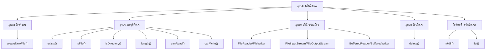

**સામાન્ય ફાઇલ ઓપરેશન્સ**:

* **ફાઇલ ક્રિએશન**: નવી ફાઇલ્સ બનાવવી
* **ફાઇલ ઇન્ફોર્મેશન**: ફાઇલ એટ્રિબ્યુટ્સ ચેક કરવા
* **ફાઇલ રીડિંગ**: ફાઇલમાંથી ડેટા વાંચવો
* **ફાઇલ રાઇટિંગ**: ફાઇલમાં ડેટા લખવો
* **ફાઇલ ડિલીશન**: ફાઇલ્સ ડિલીટ કરવી
* **ડિરેક્ટરી ઓપરેશન્સ**: ડિરેક્ટરી બનાવવી અને મેનેજ કરવી

**ફાઇલ ઓપરેશન્સ માટે મેથડ્સ**:

* **createNewFile()**: નવી ફાઇલ બનાવે છે
* **exists()**: ફાઇલ અસ્તિત્વમાં છે કે નહીં તે ચેક કરે છે
* **delete()**: ફાઇલ ડિલીટ કરે છે
* **mkdir()**: ડિરેક્ટરી બનાવે છે
* **list()**: ડિરેક્ટરીમાં ફાઇલ્સની યાદી આપે છે
* **length()**: ફાઇલનું સાઇઝ મેળવે છે

**યાદ રાખવા માટેની ટ્રિક**: "**CIRDWD**" - Create, Info, Read, Delete, Write, Directory

## પ્રશ્ન 5(b OR): એક્સેપ્શન હેન્ડલિંગમાં finally બ્લોક સમજાવવા માટે એક જાવા પ્રોગ્રામ લખો. (ગુણ: 04)

### જવાબ 5(b OR)

**Finally બ્લોક**: એવો બ્લોક જે એક્સેપ્શન થ્રો થાય કે ન થાય, **હંમેશા એક્ઝિક્યુટ** થાય છે, સામાન્ય રીતે ક્લીનઅપ ઓપરેશન્સ માટે વપરાય છે.

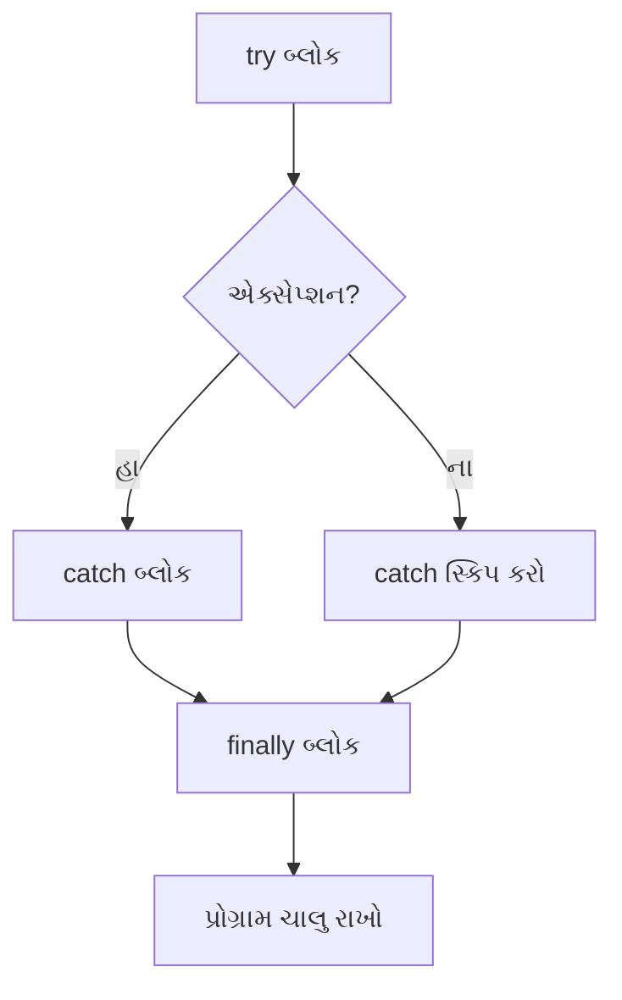

**Finally બ્લોક સમજાવવા માટે જાવા પ્રોગ્રામ**:

```java
import java.io.FileInputStream;
import java.io.FileNotFoundException;
import java.io.IOException;

public class FinallyBlockDemo {
    public static void main(String[] args) {
        FileInputStream fis = null;
        
        try {
            // ફાઇલ ખોલવાનો પ્રયાસ કરો
            System.out.println("try બ્લોકની અંદર");
            fis = new FileInputStream("nonexistent.txt");  // એક્સેપ્શન થ્રો કરશે
            
            // જો ઉપર એક્સેપ્શન થાય તો આ એક્ઝિક્યુટ નહીં થાય
            System.out.println("ફાઇલ સફળતાપૂર્વક ખોલી");
            
        } catch (FileNotFoundException e) {
            // એક્સેપ્શન હેન્ડલ કરો
            System.out.println("catch બ્લોકની અંદર");
            System.out.println("એક્સેપ્શન: " + e.getMessage());
            
        } finally {
            // હંમેશા એક્ઝિક્યુટ થાય છે
            System.out.println("finally બ્લોકની અંદર");
            
            // રિસોર્સ બંધ કરો
            try {
                if (fis != null) {
                    fis.close();
                }
                System.out.println("ફાઇલ સ્ટ્રીમ બંધ કરી");
            } catch (IOException e) {
                System.out.println("ફાઇલ બંધ કરવામાં એરર: " + e.getMessage());
            }
            
            System.out.println("finally બ્લોક એક્ઝિક્યુટ થયો");
        }
        
        System.out.println("try-catch-finally પછી પ્રોગ્રામ ચાલુ રહે છે");
    }
}
```

**આઉટપુટ**:

```
try બ્લોકની અંદર
catch બ્લોકની અંદર
એક્સેપ્શન: nonexistent.txt (આવી કોઈ ફાઇલ કે ડિરેક્ટરી નથી)
finally બ્લોકની અંદર
ફાઇલ સ્ટ્રીમ બંધ કરી
finally બ્લોક એક્ઝિક્યુટ થયો
try-catch-finally પછી પ્રોગ્રામ ચાલુ રહે છે
```

**Finally બ્લોક વિશે મુખ્ય મુદ્દાઓ**:

* એક્સેપ્શન થાય કે ન થાય, **હંમેશા એક્ઝિક્યુટ** થાય છે
* **રિસોર્સ ક્લીનઅપ** (ફાઇલ્સ, કનેક્શન્સ બંધ કરવા) માટે વપરાય છે
* મેથડ રિટર્ન થાય તે **પહેલાં એક્ઝિક્યુટ** થાય છે
* catch બ્લોક **વિના પણ અસ્તિત્વમાં** હોઈ શકે છે (try-finally)

## પ્રશ્ન 5(c OR): ફાઇલ બનાવવા અને તેના પર રાઇટ ઓપરેશન કરવા માટે એક જાવા પ્રોગ્રામ લખો. (ગુણ: 07)

### જવાબ 5(c OR)

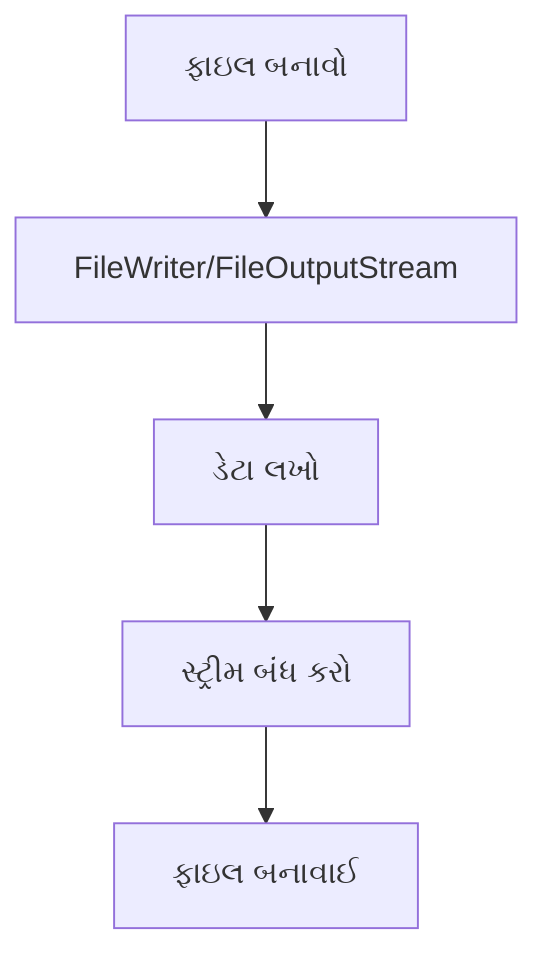

**ફાઇલ બનાવવા અને લખવા માટે જાવા પ્રોગ્રામ**:

```java
import java.io.BufferedWriter;
import java.io.File;
import java.io.FileWriter;
import java.io.IOException;

public class FileCreateAndWrite {
    public static void main(String[] args) {
        // ફાઇલ પાથ
        String filePath = "myfile.txt";
        
        // લખવાની સામગ્રી
        String content = "હેલો, આ સેમ્પલ ટેક્સ્ટ છે.\n";
        content += "આ ફાઇલ જાવા I/O ઓપરેશન્સનો ઉપયોગ કરીને બનાવવામાં આવી છે.\n";
        content += "જાવા ફાઇલ હેન્ડલિંગને સરળ બનાવે છે!";
        
        // ફાઇલ રાઇટર ઓબ્જેક્ટ્સ
        FileWriter fw = null;
        BufferedWriter bw = null;
        
        try {
            // પગલું 1: File ઓબ્જેક્ટ બનાવો
            File file = new File(filePath);
            
            // ચેક કરો કે ફાઇલ પહેલેથી અસ્તિત્વમાં છે કે નહીં
            if (file.exists()) {
                System.out.println("ફાઇલ પહેલેથી અસ્તિત્વમાં છે: " + filePath);
            } else {
                // નવી ફાઇલ બનાવો
                if (file.createNewFile()) {
                    System.out.println("ફાઇલ બનાવી: " + filePath);
                } else {
                    System.out.println("ફાઇલ બનાવવામાં નિષ્ફળતા");
                    return;
                }
            }
            
            // પગલું 2: FileWriter બનાવો
            fw = new FileWriter(file);
            
            // પગલું 3: બેટર પરફોર્મન્સ માટે BufferedWriter બનાવો
            bw = new BufferedWriter(fw);
            
            // પગલું 4: ફાઇલમાં સામગ્રી લખો
            bw.write(content);
            
            System.out.println("ફાઇલમાં સફળતાપૂર્વક લખાણ થયું");
            
        } catch (IOException e) {
            System.out.println("એરર આવી: " + e.getMessage());
            e.printStackTrace();
        } finally {
            try {
                // પગલું 5: રિસોર્સ બંધ કરો
                if (bw != null) {
                    bw.close();
                }
                if (fw != null) {
                    fw.close();
                }
            } catch (IOException e) {
                System.out.println("રિસોર્સ બંધ કરવામાં એરર: " + e.getMessage());
            }
        }
        
        // ફાઇલ ઇન્ફોર્મેશન વેરિફાય કરો
        File file = new File(filePath);
        if (file.exists()) {
            System.out.println("\nફાઇલ ઇન્ફોર્મેશન:");
            System.out.println("પાથ: " + file.getAbsolutePath());
            System.out.println("સાઇઝ: " + file.length() + " બાઇટ્સ");
            System.out.println("વાંચી શકાય: " + file.canRead());
            System.out.println("લખી શકાય: " + file.canWrite());
        }
    }
}
```

**ફાઇલ બનાવવા અને લખવાના પગલાં**:

1. **File ઓબ્જેક્ટ બનાવો**: ફાઇલ પાથનું પ્રતિનિધિત્વ કરે છે
2. **ફાઇલ બનાવો**: createNewFile() મેથડનો ઉપયોગ કરો
3. **રાઇટર ઇનિશિયલાઇઝ કરો**: FileWriter અથવા FileOutputStream
4. **ડેટા લખો**: ફાઇલમાં સામગ્રી લખો
5. **રિસોર્સ બંધ કરો**: સિસ્ટમ રિસોર્સ છોડો

**ફાઇલ રાઇટર મેથડ્સ**:

* **write(String)**: સ્ટ્રિંગને ફાઇલમાં લખે છે
* **write(char[])**: કેરેક્ટર એરેને લખે છે
* **newLine()**: નવી લાઇન ઉમેરે છે (ફક્ત BufferedWriter)
* **append(char)**: અંતમાં કેરેક્ટર જોડે છે
* **flush()**: ડિસ્કમાં લખવા માટે ફોર્સ કરે છે

**ફાઇલ રાઇટિંગના પગલાં માટે યાદ રાખવાની ટ્રિક**: "**FICRW**" - File object, Initialize, Create, Resource, Write