# 4343203 Winter 2024 Solution - English

## Question 1(a): List out various Primitive data types in Java. (Marks: 03)

### Answer 1(a)

Java has 8 primitive data types:

| Data Type | Size | Description |
|-----------|------|-------------|
| **byte** | 1 byte | Stores whole numbers from -128 to 127 |
| **short** | 2 bytes | Stores whole numbers from -32,768 to 32,767 |
| **int** | 4 bytes | Stores whole numbers from -2³¹ to 2³¹-1 |
| **long** | 8 bytes | Stores whole numbers from -2⁶³ to 2⁶³-1 |
| **float** | 4 bytes | Stores fractional numbers with 6-7 decimal digits |
| **double** | 8 bytes | Stores fractional numbers with 15 decimal digits |
| **boolean** | 1 bit | Stores true or false values |
| **char** | 2 bytes | Stores a single character/letter or ASCII value |

**Mnemonic**: "**I See Bears Drinking Chocolate Foam Latte**" (Int, Char, Boolean, Double, Character, Float, Long)

## Question 1(b): Explain Structure of Java Program with suitable example. (Marks: 04)

### Answer 1(b)

The structure of a Java program consists of several key components:

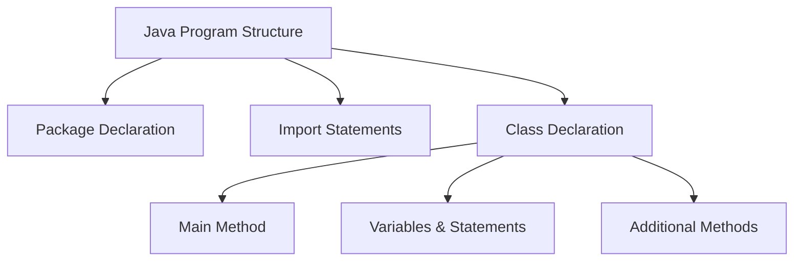

```java
// 1. Package Declaration (Optional)
package com.example;

// 2. Import Statements (Optional)
import java.util.Scanner;

// 3. Class Declaration (Required)
public class HelloWorld {
    
    // 4. Main Method (Required for executable programs)
    public static void main(String[] args) {
        
        // 5. Variables, Statements, and Expressions
        String message = "Hello, World!";
        System.out.println(message);
        
    } // End of main method
    
    // 6. Additional Methods (Optional)
    public static void greet() {
        System.out.println("Welcome!");
    }
    
} // End of class
```

**Key Components**:

* **Package Declaration**: Organizes related classes
* **Import Statements**: Access classes from other packages
* **Class Declaration**: Contains all code and defines object properties
* **Main Method**: Entry point of execution (must be exactly as shown)
* **Statements**: Individual instructions
* **Methods**: Reusable blocks of code with specific functionality

**Mnemonic**: "**PICSM**" - Package, Imports, Class, Statements, Methods

## Question 1(c): List arithmetic operators in Java. Develop a Java program using any three arithmetic operators and show the output of program. (Marks: 07)

### Answer 1(c)

#### Arithmetic Operators in Java

| Operator | Description | Example |
|----------|-------------|---------|
| **+** | Addition | a + b |
| **-** | Subtraction | a - b |
| **\*** | Multiplication | a * b |
| **/** | Division | a / b |
| **%** | Modulus (Remainder) | a % b |
| **++** | Increment | a++ or ++a |
| **--** | Decrement | a-- or --a |

**Mnemonic**: "**MASID++**" (Multiply, Add, Subtract, Increment, Decrement, Divide, Modulus)

#### Java Program using Three Arithmetic Operators

```java
public class ArithmeticDemo {
    public static void main(String[] args) {
        // Declare variables
        int num1 = 20;
        int num2 = 5;
        int result1, result2, result3;
        
        // Using three arithmetic operators
        result1 = num1 + num2;  // Addition
        result2 = num1 - num2;  // Subtraction
        result3 = num1 * num2;  // Multiplication
        
        // Display output
        System.out.println("Number 1: " + num1);
        System.out.println("Number 2: " + num2);
        System.out.println("Addition: " + result1);       // Output: 25
        System.out.println("Subtraction: " + result2);    // Output: 15
        System.out.println("Multiplication: " + result3); // Output: 100
    }
}
```

## Question 1(c OR): Write syntax of Java for loop statement. Develop a Java program to find out prime number between 1 to 10. (Marks: 07)

### Answer 1(c OR)

#### Java for Loop Syntax

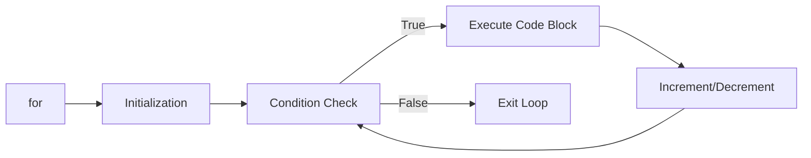

```java
for (initialization; condition; increment/decrement) {
    // code to be executed
}
```

**Key Parts**:

* **Initialization**: Executes once at the beginning
* **Condition**: Checked before each iteration
* **Increment/Decrement**: Executes after each iteration

#### Java Program to Find Prime Numbers between 1 to 10

```java
public class PrimeNumbers {
    public static void main(String[] args) {
        System.out.println("Prime Numbers between 1 and 10:");
        
        // Outer loop - check each number from 1 to 10
        for (int num = 1; num <= 10; num++) {
            boolean isPrime = true;
            
            // Skip 1 as it's not a prime number
            if (num == 1) {
                isPrime = false;
            }
            
            // Inner loop - check if divisible by any number
            for (int i = 2; i < num; i++) {
                if (num % i == 0) {
                    isPrime = false;
                    break;
                }
            }
            
            // Print if prime
            if (isPrime) {
                System.out.print(num + " ");
            }
        }
        // Output: 2 3 5 7
    }
}
```

**Mnemonic for Prime Numbers**: "**2357**" - These are the prime numbers between 1 and 10

## Question 2(a): List the differences between Procedure-Oriented Programming (POP) and Object-Oriented Programming (OOP). (Marks: 03)

### Answer 2(a)

| Procedure-Oriented Programming (POP) | Object-Oriented Programming (OOP) |
|-------------------------------------|----------------------------------|
| **Function-centered** approach | **Object-centered** approach |
| Data moves freely between functions | Data is **encapsulated** within objects |
| Follows **top-down** approach | Follows **bottom-up** approach |
| **Security** is less (data is global) | **Security** is more (data hiding) |
| No concept of **inheritance** | Supports **inheritance** and reusability |
| Examples: C, FORTRAN, Pascal | Examples: Java, C++, Python |

**Mnemonic**: "**FEED SI**" - Focus, Encapsulation, Execution, Data access, Security, Inheritance

## Question 2(b): Explain static keyword with example. (Marks: 04)

### Answer 2(b)

The **static** keyword in Java:

* Makes a member **belong to the class** rather than to instances (objects)
* Can be applied to **variables**, **methods**, **blocks**, and **nested classes**
* Static members are **loaded into memory** when class is loaded
* Can be **accessed without creating objects**

```java
public class StaticDemo {
    // Static variable - shared across all instances
    static int count = 0;
    
    // Instance variable - unique to each instance
    int instanceNum;
    
    // Constructor
    StaticDemo() {
        count++;          // Increment static counter
        instanceNum = count;  // Assign instance number
    }
    
    // Static method
    static void displayCount() {
        System.out.println("Total objects: " + count);
    }
    
    public static void main(String[] args) {
        // Access static method without object
        StaticDemo.displayCount();  // Output: Total objects: 0
        
        // Create objects
        StaticDemo obj1 = new StaticDemo();
        StaticDemo obj2 = new StaticDemo();
        
        // Call static method
        StaticDemo.displayCount();  // Output: Total objects: 2
    }
}
```

## Question 2(c): Define Constructor. List types of Constructors. Develop a java code to explain Parameterized constructor. (Marks: 07)

### Answer 2(c)

**Constructor**: A special type of method used to **initialize objects** when they are created. It has the **same name as the class** and **no return type**.

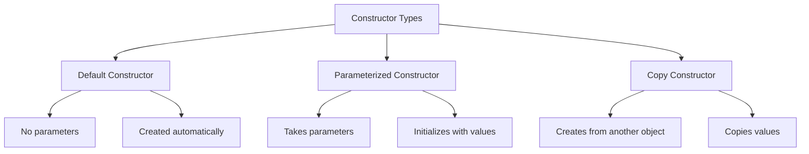

**Types of Constructors**:

1. **Default Constructor**: No parameters, created by Java if no constructor is defined
2. **Parameterized Constructor**: Takes parameters to initialize object with specific values
3. **Copy Constructor**: Creates object by copying values from another object

**Java Code for Parameterized Constructor**:

```java
public class Student {
    // Instance variables
    private int id;
    private String name;
    private double marks;
    
    // Parameterized constructor
    public Student(int studentId, String studentName, double studentMarks) {
        id = studentId;
        name = studentName;
        marks = studentMarks;
    }
    
    // Method to display student details
    public void displayDetails() {
        System.out.println("Student ID: " + id);
        System.out.println("Student Name: " + name);
        System.out.println("Student Marks: " + marks);
    }
    
    public static void main(String[] args) {
        // Creating objects using parameterized constructor
        Student s1 = new Student(101, "Raj", 85.5);
        Student s2 = new Student(102, "Priya", 92.0);
        
        // Displaying student details
        System.out.println("First Student:");
        s1.displayDetails();
        
        System.out.println("\nSecond Student:");
        s2.displayDetails();
    }
}
```

**Mnemonic for Constructor Types**: "**DPC**" - Default, Parameterized, Copy

## Question 2(a OR): List the basic OOP concepts in Java and explain any one. (Marks: 03)

### Answer 2(a OR)

**Basic OOP Concepts in Java**:

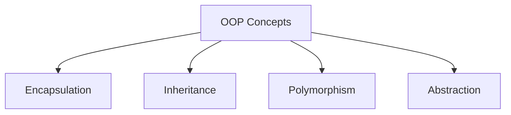

* **Encapsulation**: Bundling data and methods that operate on that data
* **Inheritance**: Creating new classes from existing ones
* **Polymorphism**: Same method behaving differently in different contexts
* **Abstraction**: Hiding complex implementation details, showing only functionality

**Explanation of Encapsulation**:
Encapsulation is the process of **binding data and methods together** as a single unit (class) and **hiding data** from the outside world. It is achieved through:

* **Private data members**: Access restricted within the class
* **Public getter/setter methods**: Controlled access to private data
* **Benefits**: Improved security, data hiding, and modular code

**Mnemonic**: "**EIPA**" - Encapsulation, Inheritance, Polymorphism, Abstraction

## Question 2(b OR): Explain final keyword with example. (Marks: 04)

### Answer 2(b OR)

The **final** keyword in Java:

* Creates **constants** that cannot be changed
* Can be applied to **variables**, **methods**, and **classes**
* **Final variable**: Value cannot be changed after initialization
* **Final method**: Cannot be overridden by subclasses
* **Final class**: Cannot be extended (no inheritance)

```java
public class FinalDemo {
    // Final variable (constant)
    final double PI = 3.14159;
    
    // Final method
    final void display() {
        System.out.println("This method cannot be overridden");
    }
    
    public static void main(String[] args) {
        FinalDemo obj = new FinalDemo();
        
        // Using final variable
        System.out.println("Value of PI: " + obj.PI);
        
        // Cannot modify final variable
        // obj.PI = 3.14;  // This would cause compilation error
        
        // Calling final method
        obj.display();
    }
}

// Final class
final class SecureClass {
    void show() {
        System.out.println("This class cannot be extended");
    }
}

// Cannot extend final class
// class ChildClass extends SecureClass {} // This would cause compilation error
```

## Question 2(c OR): Write scope of java access modifier. Develop a java code to explain public modifier. (Marks: 07)

### Answer 2(c OR)

**Java Access Modifiers Scope**:

| Modifier | Class | Package | Subclass | World |
|----------|-------|---------|----------|-------|
| **private** | Yes | No | No | No |
| **default** (no modifier) | Yes | Yes | No | No |
| **protected** | Yes | Yes | Yes | No |
| **public** | Yes | Yes | Yes | Yes |

**Mnemonic**: "**Pri-De-Pro-Pub**" (Private-Default-Protected-Public) with increasing accessibility

**Java Code to Explain Public Modifier**:

```java
// File: AccessDemo.java
package demo.access;

public class AccessDemo {
    // Public variable
    public int publicVar = 100;
    
    // Public method
    public void publicMethod() {
        System.out.println("This is a public method");
        System.out.println("Public variable value: " + publicVar);
    }
    
    public static void main(String[] args) {
        // Creating object of the same class
        AccessDemo obj1 = new AccessDemo();
        
        // Accessing public members within the same class
        System.out.println("Accessing from same class: " + obj1.publicVar);
        obj1.publicMethod();
    }
}

// File: AccessTester.java
package demo.access;

public class AccessTester {
    public static void main(String[] args) {
        // Creating object of AccessDemo class
        AccessDemo obj = new AccessDemo();
        
        // Accessing public members from different class
        System.out.println("Accessing from different class: " + obj.publicVar);
        obj.publicMethod();
        
        // Can be accessed from any package, class, or subclass
    }
}
```

**Key Points about Public Modifier**:

* **Accessible everywhere**: within class, package, subclass, and outside package
* Used for **interfaces**, **API methods**, and **general-purpose functionality**
* Allows **maximum accessibility** with minimum restriction
* Should be used carefully to maintain **encapsulation**

## Question 3(a): List out different types of inheritance and explain any one with example. (Marks: 03)

### Answer 3(a)

**Types of Inheritance in Java**:

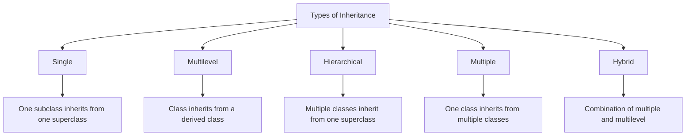

| Type | Description |
|------|-------------|
| **Single** | One subclass inherits from one superclass |
| **Multilevel** | Class inherits from a derived class |
| **Hierarchical** | Multiple classes inherit from one superclass |
| **Multiple** | One class inherits from multiple classes (through interfaces in Java) |
| **Hybrid** | Combination of multiple and multilevel inheritance |

**Single Inheritance Example**:

```java
// Parent class
class Animal {
    void eat() {
        System.out.println("Animal is eating");
    }
}

// Child class inheriting from Animal
class Dog extends Animal {
    void bark() {
        System.out.println("Dog is barking");
    }
}

// Usage
class InheritanceDemo {
    public static void main(String[] args) {
        Dog d = new Dog();
        d.eat();  // Inherited from Animal class
        d.bark(); // Dog's own method
    }
}
```

**Mnemonic**: "**SIMHH**" - Single, Inheritance, Multiple, Hierarchical, Hybrid

## Question 3(b): Explain any two String buffer class methods with suitable example. (Marks: 04)

### Answer 3(b)

**StringBuffer Class Methods**:

1. **append()**: Adds characters to the end of StringBuffer
2. **insert()**: Inserts characters at specified position

```java
public class StringBufferDemo {
    public static void main(String[] args) {
        // Create StringBuffer object
        StringBuffer sb = new StringBuffer("Hello");
        
        // 1. append() method
        sb.append(" World");
        System.out.println("After append: " + sb);  // Output: Hello World
        
        // 2. insert() method
        sb.insert(5, " Java");
        System.out.println("After insert: " + sb);  // Output: Hello Java World
        
        // Additional information about StringBuffer
        System.out.println("Length: " + sb.length());
        System.out.println("Capacity: " + sb.capacity());
    }
}
```

**Other Important StringBuffer Methods**:

* **delete(int start, int end)**: Removes characters
* **reverse()**: Reverses the characters
* **replace(int start, int end, String str)**: Replaces characters
* **capacity()**: Returns current capacity

## Question 3(c): Define Interface. Write a java program to demonstrate multiple inheritance using interface. (Marks: 07)

### Answer 3(c)

**Interface**: A blueprint of a class that contains **abstract methods** and **constants**. It represents "what" a class does, not "how". It supports **multiple inheritance** in Java.

**Characteristics**:

* All methods are **public** and **abstract** by default
* All variables are **public**, **static**, and **final** by default
* Cannot be instantiated (no objects)
* Implemented using the **implements** keyword

```java
// First interface
interface Drawable {
    void draw();  // Abstract method
    
    // Constant
    int SIZE = 10;
}

// Second interface
interface Colorable {
    void setColor(String color);  // Abstract method
}

// Class implementing multiple interfaces (multiple inheritance)
class Circle implements Drawable, Colorable {
    private String color;
    
    // Implementing Drawable interface method
    @Override
    public void draw() {
        System.out.println("Drawing a circle with size " + SIZE);
    }
    
    // Implementing Colorable interface method
    @Override
    public void setColor(String color) {
        this.color = color;
        System.out.println("Circle color set to " + color);
    }
    
    // Additional method
    public void displayInfo() {
        System.out.println("This is a " + color + " circle");
    }
}

// Main class
public class InterfaceDemo {
    public static void main(String[] args) {
        Circle c = new Circle();
        c.draw();          // From Drawable interface
        c.setColor("Red"); // From Colorable interface
        c.displayInfo();   // Circle's own method
        
        // Using interface reference variables
        Drawable d = new Circle();
        d.draw();  // Can call only Drawable methods
        
        Colorable col = new Circle();
        col.setColor("Blue");  // Can call only Colorable methods
    }
}
```

**Mnemonic for Interface**: "**CAMP**" - Constants, Abstract methods, Multiple inheritance, Public

## Question 3(a OR): Give differences between Abstract class and Interface. (Marks: 03)

### Answer 3(a OR)

| Abstract Class | Interface |
|----------------|-----------|
| Uses **abstract** keyword | Uses **interface** keyword |
| Can have **abstract and non-abstract** methods | All methods are **abstract** by default (prior to Java 8) |
| Can have **constructors** | **Cannot** have constructors |
| Supports **partial implementation** | Provides **full abstraction** |
| **Single inheritance** only | Supports **multiple inheritance** |
| Can have **instance variables** | Variables are **static and final** only |
| Methods can have **any access modifier** | Methods are **public** by default |

**Mnemonic**: "**CAMP vs SCIM**"

* For Interface: Constants, Abstract methods, Multiple inheritance, Public
* For Abstract: Some implementation, Constructors, Instance variables, Mixed access

## Question 3(b OR): Explain any two String class methods with suitable example. (Marks: 04)

### Answer 3(b OR)

**String Class Methods**:

1. **substring()**: Extracts a portion of a string
2. **equals()**: Compares string content

```java
public class StringMethodsDemo {
    public static void main(String[] args) {
        String str = "Hello Java Programming";
        
        // 1. substring() method
        String sub1 = str.substring(6);       // From index 6 to end
        String sub2 = str.substring(6, 10);   // From index 6 to 9
        
        System.out.println("Original: " + str);
        System.out.println("substring(6): " + sub1);      // Output: Java Programming
        System.out.println("substring(6, 10): " + sub2);  // Output: Java
        
        // 2. equals() method
        String s1 = "Java";
        String s2 = "java";
        String s3 = "Java";
        String s4 = new String("Java");
        
        System.out.println("s1.equals(s2): " + s1.equals(s2));         // false
        System.out.println("s1.equals(s3): " + s1.equals(s3));         // true
        System.out.println("s1.equals(s4): " + s1.equals(s4));         // true
        System.out.println("s1.equalsIgnoreCase(s2): " + s1.equalsIgnoreCase(s2)); // true
        System.out.println("s1 == s3: " + (s1 == s3));                 // true
        System.out.println("s1 == s4: " + (s1 == s4));                 // false (different objects)
    }
}
```

**Other Important String Methods**:

* **length()**: Returns string length
* **charAt()**: Returns character at specific position
* **indexOf()**: Returns index of a substring
* **concat()**: Concatenates strings
* **replace()**: Replaces characters/substrings

## Question 3(c OR): Explain package and list out steps to create package with suitable example. (Marks: 07)

### Answer 3(c OR)

**Package**: A namespace that organizes a set of related classes and interfaces. It helps in **avoiding naming conflicts** and **managing access control**.

**Benefits of Packages**:

* **Namespace management**: Prevents naming conflicts
* **Access control**: Controls visibility of classes
* **Code organization**: Groups related classes

**Steps to Create and Use Package**:

1. **Declare** the package at the beginning of the file
2. **Save** the file with proper directory structure
3. **Compile** the file with proper package structure
4. **Use** the package by importing it

```java
// Step 1: Declare package (save as Calculator.java)
package com.mymath.util;

public class Calculator {
    // Calculator methods
    public int add(int a, int b) {
        return a + b;
    }
    
    public int subtract(int a, int b) {
        return a - b;
    }
    
    public int multiply(int a, int b) {
        return a * b;
    }
    
    public int divide(int a, int b) {
        if (b == 0) {
            System.out.println("Cannot divide by zero");
            return 0;
        }
        return a / b;
    }
}

// Step 4: Use the package (save as PackageDemo.java)
// Different file that uses the package
import com.mymath.util.Calculator;

public class PackageDemo {
    public static void main(String[] args) {
        // Create object of the Calculator class
        Calculator calc = new Calculator();
        
        // Use methods
        System.out.println("10 + 5 = " + calc.add(10, 5));
        System.out.println("10 - 5 = " + calc.subtract(10, 5));
        System.out.println("10 * 5 = " + calc.multiply(10, 5));
        System.out.println("10 / 5 = " + calc.divide(10, 5));
    }
}
```

**Terminal Commands for Steps 2 & 3**:

```
# Create directory structure
mkdir -p com/mymath/util

# Move source file to appropriate directory
mv Calculator.java com/mymath/util/

# Compile with proper directory structure
javac com/mymath/util/Calculator.java

# Compile and run the main class
javac PackageDemo.java
java PackageDemo
```

**Mnemonic for Package Creation**: "**DCCU**" - Declare, Create directory, Compile, Use/import

## Question 4(a): List types of errors in Java. (Marks: 03)

### Answer 4(a)

**Types of Errors in Java**:

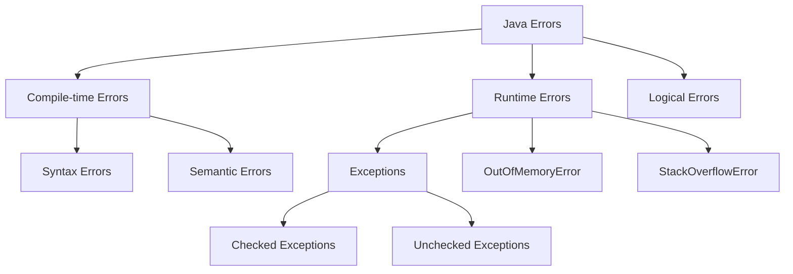

**Brief Description**:

* **Compile-time Errors**: Detected during compilation
  * **Syntax Errors**: Incorrect syntax/grammar
  * **Semantic Errors**: Wrong types, undeclared variables
* **Runtime Errors**: Occur during program execution
  * **Exceptions**: IOException, NullPointerException
* **Logical Errors**: Program runs but produces incorrect results

**Mnemonic**: "**CRL**" - Compile-time, Runtime, Logical

## Question 4(b): Explain try catch block with example. (Marks: 04)

### Answer 4(b)

**Try-Catch Block**: A mechanism to handle runtime exceptions that may occur during program execution.

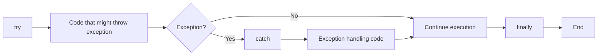

**Example Code**:

```java
public class TryCatchDemo {
    public static void main(String[] args) {
        try {
            // Code that might throw exception
            int[] numbers = {1, 2, 3};
            System.out.println("Accessing element: " + numbers[5]); // ArrayIndexOutOfBoundsException
            
            // This line won't execute if exception occurs above
            System.out.println("This won't be printed");
        } 
        catch (ArrayIndexOutOfBoundsException e) {
            // Exception handling code
            System.out.println("Exception caught: Array index out of bounds");
            System.out.println("Error message: " + e.getMessage());
        }
        
        // Program continues execution
        System.out.println("Program continues after exception handling");
    }
}
```

**Key Points**:

* **try**: Contains code that might throw exceptions
* **catch**: Handles specific exceptions that occur in try block
* **finally**: (optional) Always executes, regardless of exception
* Multiple catch blocks can handle different exception types

## Question 4(c): List out any four differences between method overloading and overriding. Write a java code to explain method overriding. (Marks: 07)

### Answer 4(c)

**Differences between Method Overloading and Overriding**:

| Method Overloading | Method Overriding |
|-------------------|-------------------|
| **Same class** | **Parent-child class** relationship |
| **Different parameters** (number, type, order) | **Same parameters** and return type |
| Resolved at **compile-time** | Resolved at **runtime** |
| Increases method **readability** | Supports **polymorphism** |

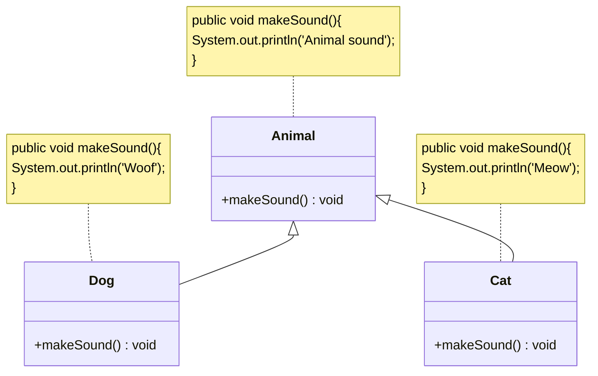

**Java Code to Explain Method Overriding**:

```java
// Parent class
class Animal {
    // Method to be overridden
    public void makeSound() {
        System.out.println("Animal makes a sound");
    }
}

// Child class 1
class Dog extends Animal {
    // Overriding the parent class method
    @Override
    public void makeSound() {
        System.out.println("Dog barks: Woof! Woof!");
    }
}

// Child class 2
class Cat extends Animal {
    // Overriding the parent class method
    @Override
    public void makeSound() {
        System.out.println("Cat meows: Meow!");
    }
}

// Main class
public class OverridingDemo {
    public static void main(String[] args) {
        // Parent class reference and object
        Animal a1 = new Animal();
        a1.makeSound();  // Output: Animal makes a sound
        
        // Child class objects
        Dog d1 = new Dog();
        d1.makeSound();  // Output: Dog barks: Woof! Woof!
        
        Cat c1 = new Cat();
        c1.makeSound();  // Output: Cat meows: Meow!
        
        // Polymorphic behavior - Parent reference, child objects
        Animal a2 = new Dog();
        a2.makeSound();  // Output: Dog barks: Woof! Woof!
        
        Animal a3 = new Cat();
        a3.makeSound();  // Output: Cat meows: Meow!
    }
}
```

**Mnemonic for Method Overriding**: "**SOAP**" - Same method, Object of child, After inheritance, Polymorphism

## Question 4(a OR): List any four inbuilt exceptions. (Marks: 03)

### Answer 4(a OR)

**Inbuilt Exceptions in Java**:

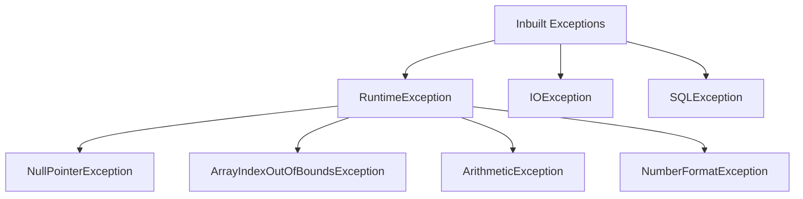

**Common Inbuilt Exceptions**:

1. **NullPointerException**: When attempting to use null object reference
2. **ArrayIndexOutOfBoundsException**: When accessing invalid array index
3. **ArithmeticException**: For arithmetic errors like division by zero
4. **NumberFormatException**: When attempting to convert invalid string to number
5. **IOException**: When I/O operation fails
6. **ClassNotFoundException**: When trying to access a class that doesn't exist
7. **IllegalArgumentException**: When illegal argument is passed to a method

**Mnemonic**: "**NANI-CIL**" - NullPointer, ArrayIndexOutOfBounds, NumberFormat, IOException, ClassNotFound, IllegalArgument

## Question 4(b OR): Explain "throw" keyword with suitable example. (Marks: 04)

### Answer 4(b OR)

**Throw Keyword**: Used to explicitly throw an exception from a method or block of code.

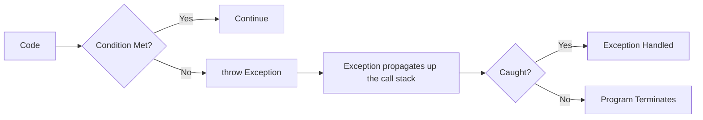

**Example Code**:

```java
public class ThrowDemo {
    // Method that throws an exception
    static void checkAge(int age) {
        if (age < 18) {
            // Explicitly throw exception
            throw new ArithmeticException("Access denied - You must be at least 18 years old.");
        } else {
            System.out.println("Access granted - You are old enough!");
        }
    }
    
    public static void main(String[] args) {
        try {
            // Test the checkAge method
            checkAge(15);  // This will throw exception
        } catch (ArithmeticException e) {
            System.out.println("Exception caught: " + e.getMessage());
        }
        
        System.out.println("Program continues...");
    }
}
```

**Output**:

```
Exception caught: Access denied - You must be at least 18 years old.
Program continues...
```

**Key Points**:

* **throw** creates a new exception object and throws it
* Can throw **built-in** or **custom exceptions**
* Must be handled by **try-catch** or declared with **throws**
* Used for **custom validation** and error handling

## Question 4(c OR): Compare 'this' keyword Vs 'Super' keyword. Explain super keyword with suitable Example. (Marks: 07)

### Answer 4(c OR)

**Comparison between 'this' and 'super' keywords**:

| 'this' Keyword | 'super' Keyword |
|----------------|-----------------|
| Refers to **current class object** | Refers to **parent class object** |
| Used to access **current class members** | Used to access **parent class members** |
| Used with **constructors**, **methods**, **variables** | Used with **constructors**, **methods**, **variables** |
| Cannot be used in **static context** | Cannot be used in **static context** |
| Used to **eliminate variable shadowing** | Used to **access overridden methods** |

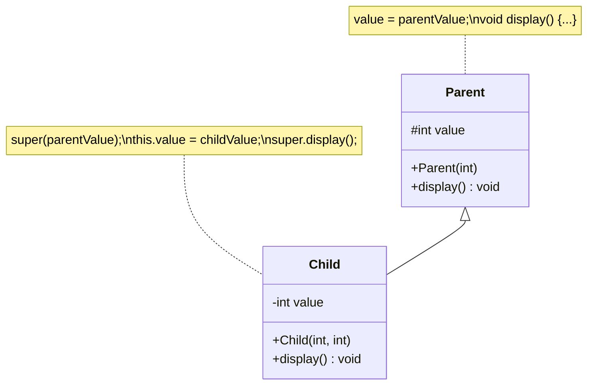

**Java Code to Explain 'super' Keyword**:

```java
// Parent class
class Person {
    // Instance variables
    String name;
    int age;
    
    // Constructor
    Person(String name, int age) {
        this.name = name;
        this.age = age;
    }
    
    // Method
    void display() {
        System.out.println("Name: " + name);
        System.out.println("Age: " + age);
    }
}

// Child class
class Student extends Person {
    // Additional instance variable
    String course;
    
    // Constructor using super
    Student(String name, int age, String course) {
        // Call parent constructor
        super(name, age);
        this.course = course;
    }
    
    // Overriding parent method
    @Override
    void display() {
        // Call parent method
        super.display();
        // Add additional info
        System.out.println("Course: " + course);
    }
    
    // Method to show variable shadowing
    void displayAge(int age) {
        System.out.println("Local age: " + age);
        System.out.println("This object's age: " + this.age);
        System.out.println("Parent class age: " + super.age); // Same as this.age in this case
    }
}

// Main class
public class SuperDemo {
    public static void main(String[] args) {
        // Create Student object
        Student s = new Student("John", 20, "Java Programming");
        
        // Call overridden method
        s.display();
        
        // Test method with local variable shadowing
        s.displayAge(25);
    }
}
```

**Output**:

```
Name: John
Age: 20
Course: Java Programming
Local age: 25
This object's age: 20
Parent class age: 20
```

**Uses of 'super' Keyword**:

* **super()**: Call parent constructor
* **super.variable**: Access parent variable
* **super.method()**: Call parent method

**Mnemonic**: "**CVM**" - Constructor, Variables, Methods (for both this and super)

## Question 5(a): List Different Stream Classes. (Marks: 03)

### Answer 5(a)

**Java Stream Classes**:

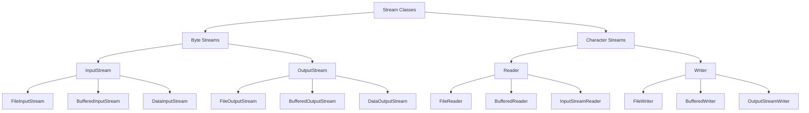

**Key Stream Classes**:

* **Byte Streams**: Process data byte by byte (8 bits)
  * **InputStream**: Abstract class for reading bytes
  * **OutputStream**: Abstract class for writing bytes
* **Character Streams**: Process data character by character (16 bits)
  * **Reader**: Abstract class for reading characters
  * **Writer**: Abstract class for writing characters

**Mnemonic**: "**BIOS-RW**" - Byte Input/Output Streams, Reader/Writer

## Question 5(b): Write a java program to develop user defined exception for "Divide by zero" error. (Marks: 04)

### Answer 5(b)

**User-Defined Exception for "Divide by Zero" Error**:

```java
// Custom exception class
class DivideByZeroException extends Exception {
    // Constructor
    public DivideByZeroException(String message) {
        // Call parent constructor
        super(message);
    }
}

// Main class
public class CustomExceptionDemo {
    // Method that throws custom exception
    public static double divide(int a, int b) throws DivideByZeroException {
        if (b == 0) {
            // Throw custom exception
            throw new DivideByZeroException("Cannot divide by zero!");
        }
        return (double) a / b;
    }
    
    public static void main(String[] args) {
        try {
            // Test the divide method
            System.out.println("10 / 2 = " + divide(10, 2));  // Works fine
            System.out.println("10 / 0 = " + divide(10, 0));  // Throws exception
        } catch (DivideByZeroException e) {
            System.out.println("Custom Exception: " + e.getMessage());
        } finally {
            System.out.println("Program execution complete");
        }
    }
}
```

**Output**:

```
10 / 2 = 5.0
Custom Exception: Cannot divide by zero!
Program execution complete
```

**Steps to Create User-Defined Exception**:

1. **Create class** extending Exception
2. **Define constructor** to pass message to parent
3. **Throw exception** when condition is met
4. **Handle exception** with try-catch block

## Question 5(c): Write a program in Java that reads the content of a file byte by byte and copy it into another file. (Marks: 07)

### Answer 5(c)

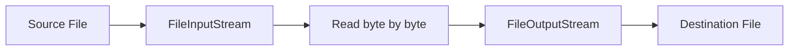

**Java Program to Copy File Byte by Byte**:

```java
import java.io.FileInputStream;
import java.io.FileOutputStream;
import java.io.IOException;

public class FileCopyByteByByte {
    public static void main(String[] args) {
        // Source and destination file paths
        String sourceFile = "source.txt";
        String destFile = "destination.txt";
        
        // Declare file streams
        FileInputStream fis = null;
        FileOutputStream fos = null;
        
        try {
            // Initialize input stream
            fis = new FileInputStream(sourceFile);
            
            // Initialize output stream
            fos = new FileOutputStream(destFile);
            
            // Variable to store each byte
            int byteData;
            
            // Read and write byte by byte
            System.out.println("Copying file byte by byte...");
            while ((byteData = fis.read()) != -1) {
                // Write the byte to destination file
                fos.write(byteData);
            }
            
            System.out.println("File copied successfully!");
            
        } catch (IOException e) {
            System.out.println("Error: " + e.getMessage());
            e.printStackTrace();
        } finally {
            // Close streams
            try {
                if (fis != null) {
                    fis.close();
                }
                if (fos != null) {
                    fos.close();
                }
            } catch (IOException e) {
                System.out.println("Error closing streams: " + e.getMessage());
            }
        }
    }
}
```

**Key Points about File Handling**:

* **Always close** streams in finally block
* Use **try-with-resources** in Java 7+ for automatic closing
* **BufferedInputStream/BufferedOutputStream** improve performance
* **Byte-by-byte** copying works for all file types (text and binary)

**Mnemonic for File Copying Steps**: "**CROW**" - Create streams, Read source, Output to destination, Wrap up (close)

## Question 5(a OR): List different file operations in Java. (Marks: 03)

### Answer 5(a OR)

**File Operations in Java**:

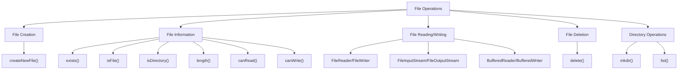

**Common File Operations**:

* **File Creation**: Create new files
* **File Information**: Check file attributes
* **File Reading**: Read data from files
* **File Writing**: Write data to files
* **File Deletion**: Delete files
* **Directory Operations**: Create and manage directories

**Methods for File Operations**:

* **createNewFile()**: Creates new file
* **exists()**: Checks if file exists
* **delete()**: Deletes file
* **mkdir()**: Creates directory
* **list()**: Lists files in directory
* **length()**: Gets file size

**Mnemonic**: "**CIRDWD**" - Create, Info, Read, Delete, Write, Directory

## Question 5(b OR): Write a java program to explain finally block in exception handling. (Marks: 04)

### Answer 5(b OR)

**Finally Block**: A block that **always executes** regardless of whether an exception is thrown or caught, typically used for cleanup operations.

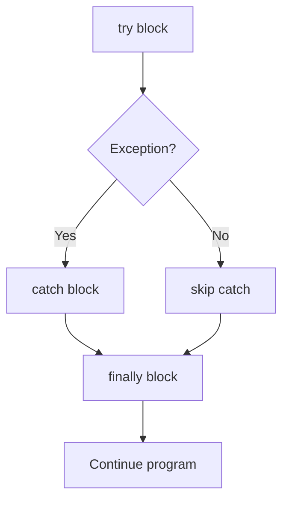

**Java Program to Explain Finally Block**:

```java
import java.io.FileInputStream;
import java.io.FileNotFoundException;
import java.io.IOException;

public class FinallyBlockDemo {
    public static void main(String[] args) {
        FileInputStream fis = null;
        
        try {
            // Try to open file
            System.out.println("Inside try block");
            fis = new FileInputStream("nonexistent.txt");  // Will throw exception
            
            // This won't execute if exception occurs
            System.out.println("File opened successfully");
            
        } catch (FileNotFoundException e) {
            // Handle the exception
            System.out.println("Inside catch block");
            System.out.println("Exception: " + e.getMessage());
            
        } finally {
            // Always executes
            System.out.println("Inside finally block");
            
            // Close resource
            try {
                if (fis != null) {
                    fis.close();
                }
                System.out.println("File stream closed");
            } catch (IOException e) {
                System.out.println("Error closing file: " + e.getMessage());
            }
            
            System.out.println("Finally block executed");
        }
        
        System.out.println("Program continues after try-catch-finally");
    }
}
```

**Output**:

```
Inside try block
Inside catch block
Exception: nonexistent.txt (No such file or directory)
Inside finally block
File stream closed
Finally block executed
Program continues after try-catch-finally
```

**Key Points about Finally Block**:

* **Always executes** whether exception occurs or not
* Used for **cleanup resources** (close files, connections)
* Executes **before method returns**
* Can exist **without catch** block (try-finally)

## Question 5(c OR): Write a java program to create a file and perform write operation on this file. (Marks: 07)

### Answer 5(c OR)

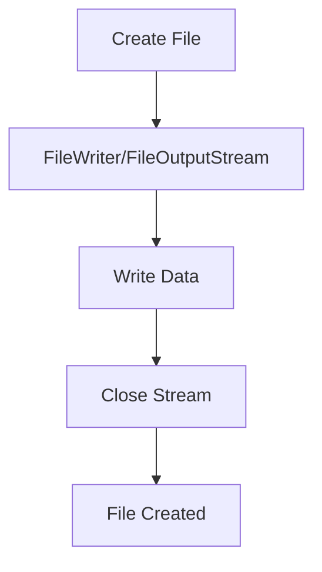

**Java Program to Create and Write to a File**:

```java
import java.io.BufferedWriter;
import java.io.File;
import java.io.FileWriter;
import java.io.IOException;

public class FileCreateAndWrite {
    public static void main(String[] args) {
        // File path
        String filePath = "myfile.txt";
        
        // Content to write
        String content = "Hello, this is a sample text.\n";
        content += "This file was created using Java I/O operations.\n";
        content += "Java makes file handling easy!";
        
        // File writer objects
        FileWriter fw = null;
        BufferedWriter bw = null;
        
        try {
            // Step 1: Create File object
            File file = new File(filePath);
            
            // Check if file already exists
            if (file.exists()) {
                System.out.println("File already exists: " + filePath);
            } else {
                // Create new file
                if (file.createNewFile()) {
                    System.out.println("File created: " + filePath);
                } else {
                    System.out.println("Failed to create file");
                    return;
                }
            }
            
            // Step 2: Create FileWriter
            fw = new FileWriter(file);
            
            // Step 3: Create BufferedWriter for better performance
            bw = new BufferedWriter(fw);
            
            // Step 4: Write content to file
            bw.write(content);
            
            System.out.println("Successfully wrote to the file");
            
        } catch (IOException e) {
            System.out.println("An error occurred: " + e.getMessage());
            e.printStackTrace();
        } finally {
            try {
                // Step 5: Close resources
                if (bw != null) {
                    bw.close();
                }
                if (fw != null) {
                    fw.close();
                }
            } catch (IOException e) {
                System.out.println("Error closing resources: " + e.getMessage());
            }
        }
        
        // Verify file information
        File file = new File(filePath);
        if (file.exists()) {
            System.out.println("\nFile Information:");
            System.out.println("Path: " + file.getAbsolutePath());
            System.out.println("Size: " + file.length() + " bytes");
            System.out.println("Readable: " + file.canRead());
            System.out.println("Writable: " + file.canWrite());
        }
    }
}
```

**Steps to Create and Write to a File**:

1. **Create File object**: Represents the file path
2. **Create file**: Use createNewFile() method
3. **Initialize writer**: FileWriter or FileOutputStream
4. **Write data**: Write content to file
5. **Close resources**: Release system resources

**File Writer Methods**:

* **write(String)**: Writes string to file
* **write(char[])**: Writes character array
* **newLine()**: Adds new line (BufferedWriter only)
* **append(char)**: Appends character to end
* **flush()**: Forces write to disk

**Mnemonic for File Writing Steps**: "**FICRW**" - File object, Initialize, Create, Resource, Write
