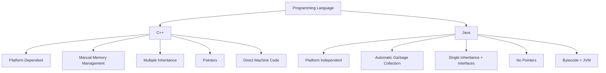

### Question 1(a): What is the difference between C++ and Java? (7 marks)

**Ans 1(a):**

C++ and Java are both popular object-oriented programming languages, but they have several key differences:

1. **Platform Dependency**
   - C++ is platform-dependent, requiring compilation for each specific platform[1][3].
   - Java is platform-independent, as its bytecode can run on any platform with a Java Virtual Machine (JVM)[1][3].

2. **Memory Management**
   - C++ requires manual memory management, giving developers more control but increasing complexity[1][3].
   - Java features automatic garbage collection, simplifying memory management but potentially impacting performance[1][3].

3. **Language Paradigm**
   - C++ supports both procedural and object-oriented programming[1].
   - Java is a pure object-oriented programming language[1][3].

4. **Inheritance**
   - C++ supports multiple inheritance, allowing a class to inherit from multiple base classes[3].
   - Java supports single inheritance for classes but allows multiple interface implementations[3].

5. **Pointers**
   - C++ supports pointers, offering low-level memory access[3].
   - Java does not have pointers, enhancing security but limiting some low-level operations[3].

6. **Compilation and Execution**
   - C++ uses a compiler to generate machine code directly[5].
   - Java uses both a compiler and an interpreter. It compiles to bytecode, which is then interpreted by the JVM[3][5].

7. **Performance and Use Cases**
   - C++ is often used for system programming and large-scale development in industries like banking[2].
   - Java is commonly used for application development, including mobile apps and enterprise software[2].

### પ્રશ્ન 1(અ): C++ અને Java વચ્ચે શું તફાવત છે? (7 ગુણ)

**જવાબ 1(અ):**

C++ અને Java બંને લોકપ્રિય object-oriented programming ભાષાઓ છે, પરંતુ તેમની વચ્ચે કેટલાક મહત્વપૂર્ણ તફાવતો છે:

1. **Platform Dependency**
   - C++ platform-dependent છે, જેને દરેક ચોક્કસ platform માટે compile કરવાની જરૂર પડે છે[1][3].
   - Java platform-independent છે, કારણ કે તેનો bytecode કોઈપણ platform પર Java Virtual Machine (JVM) સાથે ચાલી શકે છે[1][3].

2. **Memory Management**
   - C++ માં manual memory management જરૂરી છે, જે developers ને વધુ નિયંત્રણ આપે છે પરંતુ જટિલતા વધારે છે[1][3].
   - Java માં automatic garbage collection છે, જે memory management ને સરળ બનાવે છે પરંતુ કદાચ performance પર અસર કરી શકે છે[1][3].

3. **Language Paradigm**
   - C++ procedural અને object-oriented programming બંનેને સપોર્ટ કરે છે[1].
   - Java એક શુદ્ધ object-oriented programming ભાષા છે[1][3].

4. **Inheritance**
   - C++ multiple inheritance ને સપોર્ટ કરે છે, જે એક class ને અનેક base classes માંથી inherit કરવાની મંજૂરી આપે છે[3].
   - Java classes માટે single inheritance ને સપોર્ટ કરે છે પરંતુ multiple interface implementations ની મંજૂરી આપે છે[3].

5. **Pointers**
   - C++ pointers ને સપોર્ટ કરે છે, જે low-level memory access આપે છે[3].
   - Java માં pointers નથી, જે સુરક્ષા વધારે છે પરંતુ કેટલાક low-level operations ને મર્યાદિત કરે છે[3].

6. **Compilation અને Execution**
   - C++ compiler નો ઉપયોગ કરીને સીધો machine code બનાવે છે[5].
   - Java compiler અને interpreter બંનેનો ઉપયોગ કરે છે. તે bytecode માં compile થાય છે, જે પછી JVM દ્વારા interpret થાય છે[3][5].

7. **Performance અને Use Cases**
   - C++ ઘણી વાર system programming અને બેંકિંગ જેવા ઉદ્યોગોમાં મોટા પાયે development માટે વપરાય છે[2].
   - Java સામાન્ય રીતે application development માટે વપરાય છે, જેમાં mobile apps અને enterprise software નો સમાવેશ થાય છે[2].

Citations:
[1] https://www.coursereport.com/blog/c-vs-java-a-guide-for-beginners
[2] https://www.coursera.org/in/articles/java-vs-c
[3] https://www.simplilearn.com/tutorials/java-tutorial/java-vs-cpp
[4] https://www.mvpmatch.co/blog/java-vs-c-pp
[5] https://en.wikipedia.org/wiki/Comparison_of_Java_and_C++
[6] https://stackoverflow.blog/2021/02/22/choosing-java-instead-of-c-for-low-latency-systems/
[7] https://www.tpointtech.com/cpp-vs-java
[8] https://www.reddit.com/r/learnprogramming/comments/r0ssuv/how_similar_are_java_and_c/

---
Answer from Perplexity: pplx.ai/share