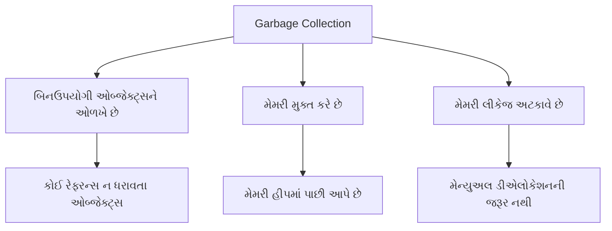
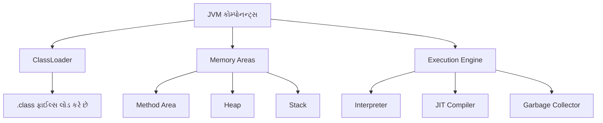
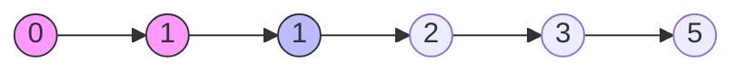
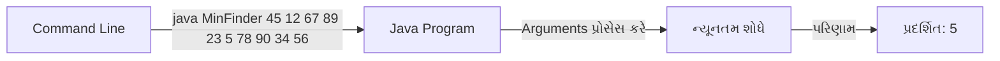

## પ્રશ્ન ૧(અ): જાવામાં Garbage collection સમજાવો. (ગુણ: ૩)

### જવાબ ૧(અ):

**Garbage Collection** જાવામાં એક ઓટોમેટિક મેમરી મેનેજમેન્ટ પ્રક્રિયા છે જે:



* **હેતુ**: ઓટોમેટિક રીતે **બિનઉપયોગી ઓબ્જેક્ટ્સને** મેમરીમાંથી દૂર કરે છે
* **પ્રક્રિયા**: 
  * JVM **સમયાંતરે ચેક કરે છે** કે કયા ઓબ્જેક્ટ્સને હવે રેફરન્સ નથી
  * બિનઉપયોગી ઓબ્જેક્ટ્સની **મેમરી મુક્ત કરે છે**
  * મુક્ત થયેલી મેમરી **હીપમાં પાછી આપે છે**
* **ટ્રિગર**: જ્યારે **હીપ મેમરી ઓછી થાય** અથવા **એક્સપ્લિસિટલી કોલ** થાય ત્યારે થાય છે

**યાદ રાખવા માટે**: "**ART**" - Automatic, Reclaims memory, Tracks unused objects

## પ્રશ્ન ૧(બ): JVM વિગતવાર સમજાવો. (ગુણ: ૪)

### જવાબ ૧(બ):

**Java Virtual Machine (JVM)** જાવા આર્કિટેક્ચરનો મુખ્ય ભાગ છે:



**મુખ્ય કોમ્પોનન્ટ્સ**:
* **ClassLoader**: ક્લાસ ફાઈલ્સને મેમરીમાં લોડ કરે છે
* **Memory Areas**:
  * **Method Area**: ક્લાસ સ્ટ્રક્ચર સ્ટોર કરે છે
  * **Heap**: ઓબ્જેક્ટ્સ સંગ્રહ (garbage collection)
  * **Stack**: મેથડ ફ્રેમ્સ, લોકલ વેરિએબલ્સ
* **Execution Engine**:
  * **Interpreter**: બાઇટકોડ એક્ઝિક્યુટ કરે છે
  * **JIT Compiler**: એક્ઝિક્યુશન ઓપ્ટિમાઈઝ કરે છે
  * **Garbage Collector**: મેમરી મેનેજ કરે છે

**મુખ્ય ફીચર્સ**:
* **પ્લેટફોર્મ ઇન્ડિપેન્ડન્સ** પ્રદાન કરે છે ("Write Once, Run Anywhere")
* સેન્ડબોક્સ એક્ઝિક્યુશન દ્વારા **સિક્યોરિટી** સુનિશ્ચિત કરે છે
* **મેમરી ઓટોમેટિકલી** મેનેજ કરે છે

**યાદ રાખવા માટે**: "**CLME**" - ClassLoader, Memory Areas, Execution Engine

## પ્રશ્ન ૧(ક): Fibonacci series પ્રિન્ટ કરવા માટેનો જાવા પ્રોગ્રામ લખો. (ગુણ: ૭)

### જવાબ ૧(ક):

**Fibonacci Series**: એક શ્રેણી જેમાં દરેક સંખ્યા તેની અગાઉની બે સંખ્યાઓના સરવાળા બરાબર હોય છે.



**જાવા પ્રોગ્રામ**:
```java
import java.util.Scanner;

public class FibonacciSeries {
    public static void main(String[] args) {
        // Scanner ઓબ્જેક્ટ બનાવો
        Scanner input = new Scanner(System.in);
        
        // ટર્મ્સની સંખ્યા મેળવો
        System.out.print("ટર્મ્સની સંખ્યા દાખલ કરો: ");
        int n = input.nextInt();
        
        // પ્રથમ બે ટર્મ્સ ઇનિશિયલાઇઝ કરો
        int firstTerm = 0;
        int secondTerm = 1;
        
        System.out.println(n + " ટર્મ્સ માટે Fibonacci શ્રેણી:");
        
        // પ્રથમ બે ટર્મ્સ પ્રિન્ટ કરો
        if (n >= 1) System.out.print(firstTerm + " ");
        if (n >= 2) System.out.print(secondTerm + " ");
        
        // બાકીના ટર્મ્સ જનરેટ કરો
        for (int i = 3; i <= n; i++) {
            // આગળનો ટર્મ શોધો
            int nextTerm = firstTerm + secondTerm;
            System.out.print(nextTerm + " ");
            
            // ટર્મ્સ અપડેટ કરો
            firstTerm = secondTerm;
            secondTerm = nextTerm;
        }
        
        input.close();
    }
}
```

**n=8 માટે આઉટપુટ**:
```
ટર્મ્સની સંખ્યા દાખલ કરો: 8
8 ટર્મ્સ માટે Fibonacci શ્રેણી:
0 1 1 2 3 5 8 13
```

**મુખ્ય મુદ્દાઓ**:
* પ્રથમ બે ટર્મ્સ **ઇનિશિયલાઇઝ** કરો (0, 1)
* બાકીના ટર્મ્સ જનરેટ કરવા માટે **લૂપ**નો ઉપયોગ કરો
* દરેક નવો ટર્મ = **અગાઉના બે ટર્મ્સનો સરવાળો**
* આગળના ટર્મ માટે વેરિએબલ્સ **અપડેટ** કરો

**યાદ રાખવા માટે**: "**IFLU**" - Initialize, First two terms, Loop, Update

## પ્રશ્ન ૧(ક OR): કમાન્ડ લાઇન arguments નો ઉપયોગ કરીને કોઈપણ દસ સંખ્યાઓ માંથી ન્યૂનતમ શોધવા માટે જાવા પ્રોગ્રામ લખો. (ગુણ: ૭)

### જવાબ ૧(ક OR):

**Command Line Arguments** જાવામાં પ્રોગ્રામ એક્ઝિક્યુટ થાય ત્યારે પાસ કરવામાં આવતા પેરામીટર્સ છે.



**જાવા પ્રોગ્રામ**:
```java
public class MinimumFinder {
    public static void main(String[] args) {
        // ચેક કરો કે ચોક્કસ 10 આર્ગ્યુમેન્ટ્સ આપેલા છે કે નહી
        if (args.length != 10) {
            System.out.println("કૃપા કરીને ચોક્કસ 10 નંબર કમાન્ડ લાઈન આર્ગ્યુમેન્ટ્સ તરીકે આપો");
            System.out.println("ઉદાહરણ: java MinimumFinder 45 12 67 89 23 5 78 90 34 56");
            return;
        }
        
        // પ્રથમ નંબરથી min ઇનિશિયલાઇઝ કરો
        int min = Integer.parseInt(args[0]);
        
        // બધા આર્ગ્યુમેન્ટ્સમાંથી ન્યૂનતમ શોધો
        for (int i = 1; i < args.length; i++) {
            // સ્ટ્રિંગ આર્ગ્યુમેન્ટને ઇન્ટિજરમાં રૂપાંતરિત કરો
            int num = Integer.parseInt(args[i]);
            
            // જો વર્તમાન નંબર નાનો હોય તો min અપડેટ કરો
            if (num < min) {
                min = num;
            }
        }
        
        // પરિણામ પ્રદર્શિત કરો
        System.out.println("દાખલ કરેલા નંબર્સ:");
        for (String num : args) {
            System.out.print(num + " ");
        }
        System.out.println("\nન્યૂનતમ મૂલ્ય: " + min);
    }
}
```

**એક્ઝિક્યુશન**:
```
> java MinimumFinder 45 12 67 89 23 5 78 90 34 56
દાખલ કરેલા નંબર્સ:
45 12 67 89 23 5 78 90 34 56
ન્યૂનતમ મૂલ્ય: 5
```

**મુખ્ય મુદ્દાઓ**:
* **Command-line arguments** `String[] args`માં પાસ થાય છે
* સ્ટ્રિંગ આર્ગ્યુમેન્ટ્સને `Integer.parseInt()`નો ઉપયોગ કરીને **ઇન્ટિજરમાં રૂપાંતરિત** કરો
* પ્રથમ નંબરથી **ન્યૂનતમ ઇનિશિયલાઇઝ** કરો
* દરેક નંબરને **સરખાવો** અને જો નાનો હોય તો ન્યૂનતમ અપડેટ કરો
* ઇનપુટ આર્ગ્યુમેન્ટ્સ માટે **વેલિડેશન હેન્ડલ** કરો

**યાદ રાખવા માટે**: "**ACCIH**" - Arguments, Convert, Compare, Initialize, Handle validation
