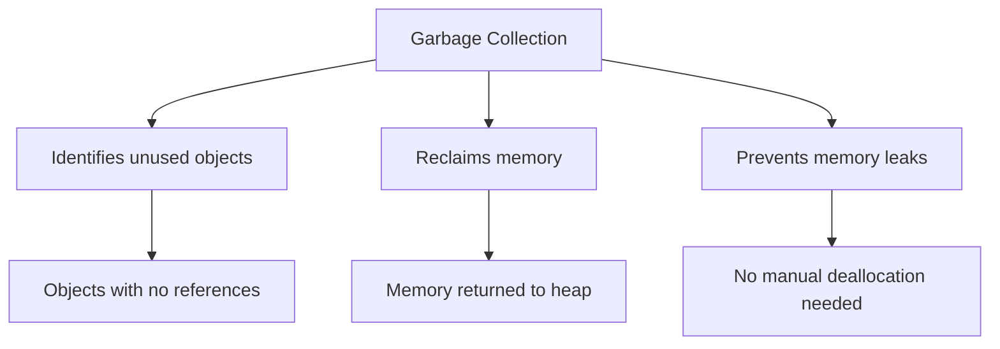
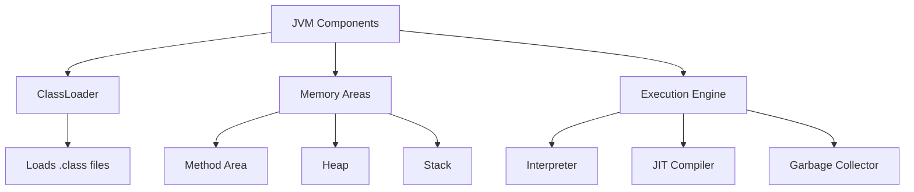
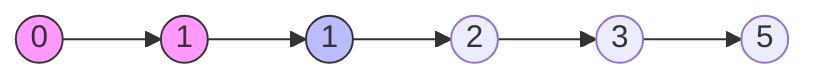
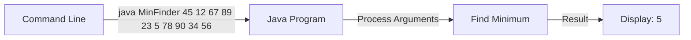

## Question 1(a): Explain Garbage collection in java. (Marks: 03)

### Answer 1(a):

**Garbage Collection** in Java is an automatic memory management process that:



* **Purpose**: Automatically **removes unused objects** from memory
* **Process**: 
  * JVM **periodically checks** which objects are no longer referenced
  * **Reclaims memory** occupied by unreferenced objects
  * **Returns memory** to heap for future allocation
* **Trigger**: Occurs when **heap memory is low** or when **explicitly called**

**Mnemonic**: "**ART**" - Automatic, Reclaims memory, Tracks unused objects

## Question 1(b): Explain JVM in detail. (Marks: 04)

### Answer 1(b):

**Java Virtual Machine (JVM)** is the core component of Java's architecture:



**Key Components**:
* **ClassLoader**: Loads class files into memory
* **Memory Areas**:
  * **Method Area**: Stores class structures
  * **Heap**: Objects storage (garbage collection)
  * **Stack**: Method frames, local variables
* **Execution Engine**:
  * **Interpreter**: Executes bytecode
  * **JIT Compiler**: Optimizes execution
  * **Garbage Collector**: Manages memory

**Key Features**:
* Provides **platform independence** ("Write Once, Run Anywhere")
* Ensures **security** through sandbox execution
* Manages **memory automatically**

**Mnemonic**: "**CLME**" - ClassLoader, Memory Areas, Execution Engine

## Question 1(c): Write a program in java to print Fibonacci series for N terms. (Marks: 07)

### Answer 1(c):

**Fibonacci Series**: A sequence where each number is the sum of the two preceding ones.



**Java Program**:
```java
import java.util.Scanner;

public class FibonacciSeries {
    public static void main(String[] args) {
        // Create Scanner object for input
        Scanner input = new Scanner(System.in);
        
        // Get number of terms
        System.out.print("Enter number of terms: ");
        int n = input.nextInt();
        
        // Initialize first two terms
        int firstTerm = 0;
        int secondTerm = 1;
        
        System.out.println("Fibonacci Series for " + n + " terms:");
        
        // Print first two terms
        if (n >= 1) System.out.print(firstTerm + " ");
        if (n >= 2) System.out.print(secondTerm + " ");
        
        // Generate remaining terms
        for (int i = 3; i <= n; i++) {
            // Calculate next term
            int nextTerm = firstTerm + secondTerm;
            System.out.print(nextTerm + " ");
            
            // Update terms
            firstTerm = secondTerm;
            secondTerm = nextTerm;
        }
        
        input.close();
    }
}
```

**Output for n=8**:
```
Enter number of terms: 8
Fibonacci Series for 8 terms:
0 1 1 2 3 5 8 13
```

**Key Points**:
* **Initialize** first two terms (0, 1)
* **Loop** to generate remaining terms
* Each new term = **sum of previous two**
* **Update** variables for next iteration

**Mnemonic**: "**IFLU**" - Initialize, First two terms, Loop, Update

## Question 1(c OR): Write a program in java to find out minimum from any ten numbers using command line argument. (Marks: 07)

### Answer 1(c OR):

**Command Line Arguments** in Java are parameters passed to a program when it's executed.



**Java Program**:
```java
public class MinimumFinder {
    public static void main(String[] args) {
        // Check if exactly 10 arguments are provided
        if (args.length != 10) {
            System.out.println("Please provide exactly 10 numbers as command line arguments");
            System.out.println("Example: java MinimumFinder 45 12 67 89 23 5 78 90 34 56");
            return;
        }
        
        // Initialize min with first number
        int min = Integer.parseInt(args[0]);
        
        // Find minimum from all arguments
        for (int i = 1; i < args.length; i++) {
            // Convert string argument to integer
            int num = Integer.parseInt(args[i]);
            
            // Update min if current number is smaller
            if (num < min) {
                min = num;
            }
        }
        
        // Display result
        System.out.println("Numbers entered:");
        for (String num : args) {
            System.out.print(num + " ");
        }
        System.out.println("\nMinimum value: " + min);
    }
}
```

**Execution**:
```
> java MinimumFinder 45 12 67 89 23 5 78 90 34 56
Numbers entered:
45 12 67 89 23 5 78 90 34 56
Minimum value: 5
```

**Key Points**:
* **Command-line arguments** are passed in `String[] args`
* **Convert** string arguments to integers using `Integer.parseInt()`
* **Initialize** minimum with first number
* **Compare** each number and update minimum if smaller
* **Handle validation** for input arguments

**Mnemonic**: "**ACCIH**" - Arguments, Convert, Compare, Initialize, Handle validation
