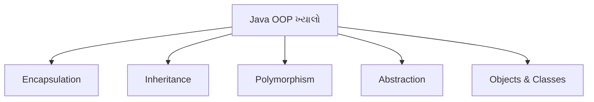
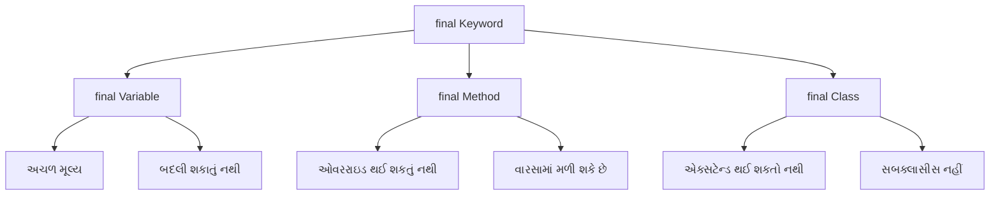
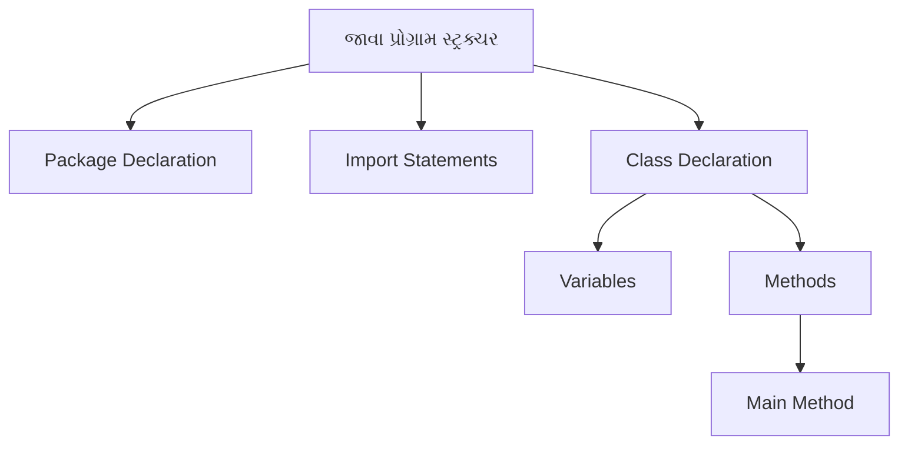
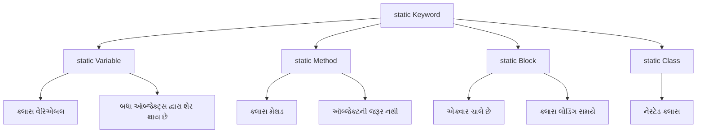
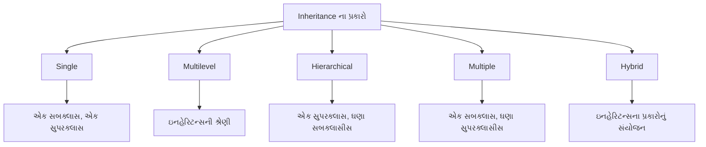
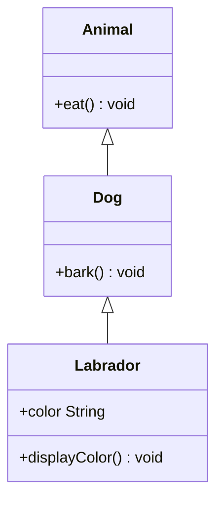
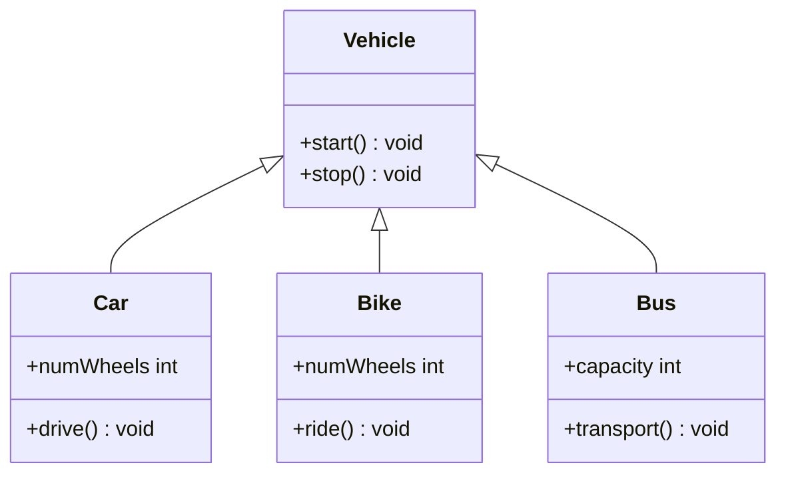

## પ્રશ્ન ૨(અ): જાવા OPP ના મૂળભૂત ખ્યાલોની યાદી બનાવો. કોઈપણ એક વિગતવાર સમજાવો. (ગુણ: ૩)

### જવાબ ૨(અ):

**જાવા OOP ના મૂળભૂત ખ્યાલો**:



* **Encapsulation**: ડેટા અને મેથડ્સને એક એકમ તરીકે બાંધવા, ઇમ્પ્લિમેન્ટેશન છુપાવવી
* **Inheritance**: હાલના વર્ગોમાંથી નવા વર્ગો બનાવવા
* **Polymorphism**: એક ઇન્ટરફેસ, ઘણા ઇમ્પ્લિમેન્ટેશન્સ
* **Abstraction**: જટિલ ઇમ્પ્લિમેન્ટેશન વિગતો છુપાવવી
* **Objects & Classes**: મૂળભૂત બિલ્ડિંગ બ્લોક્સ

**Inheritance સમજાવટ**:
* Inheritance એ **હાલના વર્ગો**માંથી **નવા વર્ગો** બનાવવાની પ્રક્રિયા છે
* નવો વર્ગ (સબક્લાસ/ચાઇલ્ડ) હાલના વર્ગ (સુપરક્લાસ/પેરેન્ટ)માંથી **લક્ષણો અને વર્તણૂંક વારસામાં મેળવે** છે
* **extends** કીવર્ડનો ઉપયોગ કરીને અમલમાં મૂકવામાં આવે છે
* **કોડ રીયુઝેબિલિટી**ને પ્રોત્સાહન આપે છે અને **IS-A સંબંધ** સ્થાપિત કરે છે
* ઉદાહરણ: Car IS-A Vehicle, Dog IS-A Animal

**યાદ રાખવા માટે**: "**EIOPA**" - Encapsulation, Inheritance, Objects, Polymorphism, Abstraction

## પ્રશ્ન ૨(બ): final કી-વર્ડ ઉદાહરણ સાથે સમજાવો. (ગુણ: ૪)

### જવાબ ૨(બ):

**Final Keyword** જાવામાં:



**final keyword ના ઉપયોગો**:
* **final variable**: અચળ (constant) બનાવે છે જે બદલી શકાતા નથી
* **final method**: સબક્લાસમાં ઓવરરાઇડ થઈ શકતી નથી
* **final class**: એક્સટેન્ડ થઈ શકતો નથી (ઇન્હેરિટન્સ નહીં)

**ઉદાહરણ**:
```java
public class FinalDemo {
    // final variable (constant)
    final double PI = 3.14159;
    
    // final method
    final void display() {
        System.out.println("આ મેથડ ઓવરરાઇડ થઈ શકતી નથી");
    }
    
    public static void main(String[] args) {
        FinalDemo obj = new FinalDemo();
        
        // final variable નો ઉપયોગ
        System.out.println("PI નું મૂલ્ય: " + obj.PI);
        
        // final variable ને બદલી શકાતું નથી
        // obj.PI = 3.14;  // કમ્પાઇલેશન એરર
        
        // final method ને કોલ કરવી
        obj.display();
    }
}

// Final class
final class SecureClass {
    void show() {
        System.out.println("આ ક્લાસ એક્સટેન્ડ થઈ શકતો નથી");
    }
}

// final class ને એક્સટેન્ડ કરી શકાતું નથી
// class ChildClass extends SecureClass {} // કમ્પાઇલેશન એરર
```

**યાદ રાખવા માટે**: "**VCM**" - Variables (constant), Cannot extend, Methods (no override)

## પ્રશ્ન ૨(ક): કન્સ્ટ્રક્ટર શું છે? Parameterized કન્સ્ટ્રક્ટર ને ઉદાહરણ સાથે સમજાવો. (ગુણ: ૭)

### જવાબ ૨(ક):

**Constructor**: એક વિશેષ મેથડ જે **ઑબ્જેક્ટ્સને ઇનિશિયલાઇઝ** કરવા માટે વપરાય છે. તે **ક્લાસના નામ જેવું જ નામ** ધરાવે છે અને **કોઈ રિટર્ન ટાઈપ નથી**.


**લક્ષણો**:
* ક્લાસ જેવું **સમાન નામ**
* **કોઈ રિટર્ન ટાઈપ નહીં**
* ઑબ્જેક્ટ બનાવવામાં આવે ત્યારે **આપોઆપ કૉલ** થાય છે
* ઇન્સ્ટન્સ વેરીએબલ્સ **ઇનિશિયલાઇઝ** કરે છે

**Parameterized Constructor નું ઉદાહરણ**:
```java
public class Student {
    // ઇન્સ્ટન્સ વેરીએબલ્સ
    private int rollNo;
    private String name;
    private double percentage;
    
    // Parameterized constructor
    public Student(int roll, String studentName, double marks) {
        rollNo = roll;
        name = studentName;
        percentage = marks;
    }
    
    // વિદ્યાર્થી વિગતો દર્શાવવા માટેની મેથડ
    public void displayDetails() {
        System.out.println("રોલ નંબર: " + rollNo);
        System.out.println("નામ: " + name);
        System.out.println("ટકાવારી: " + percentage + "%");
    }
    
    public static void main(String[] args) {
        // Parameterized constructor નો ઉપયોગ કરીને ઑબ્જેક્ટ્સ બનાવવા
        Student s1 = new Student(101, "રાહુલ", 85.7);
        Student s2 = new Student(102, "પ્રિયા", 92.3);
        
        // વિગતો દર્શાવવી
        System.out.println("પ્રથમ વિદ્યાર્થી:");
        s1.displayDetails();
        
        System.out.println("\nદ્વિતીય વિદ્યાર્થી:");
        s2.displayDetails();
    }
}
```

**મુખ્ય મુદ્દાઓ**:
* **ચોક્કસ મૂલ્યો** સાથે ઇનિશિયલાઇઝેશનની મંજૂરી આપે છે
* **ઑબ્જેક્ટ ક્રિએશન** દરમિયાન પેરામીટર્સ પાસ કરવામાં આવે છે
* **વિવિધ સ્થિતિઓ** સાથે ઘણા ઑબ્જેક્ટ્સ બનાવે છે
* વેરીએબલ્સ ઇનિશિયલાઇઝ કરવા માટે **setter મેથડ્સની જરૂર નથી**

**યાદ રાખવા માટે**: "**PINS**" - Parameters, Initialize, No return type, Same name

## પ્રશ્ન ૨(અ OR): ઉદાહરણ સાથે જાવા પ્રોગ્રામ સ્ટ્રક્ચર સમજાવો. (ગુણ: ૩)

### જવાબ ૨(અ OR):

**જાવા પ્રોગ્રામ સ્ટ્રક્ચર**:



**જાવા પ્રોગ્રામના ઘટકો**:
* **Package Declaration**: (વૈકલ્પિક) સંબંધિત ક્લાસીસને ઓર્ગેનાઇઝ કરે છે
* **Import Statements**: (વૈકલ્પિક) અન્ય પેકેજમાંથી ક્લાસીસને એક્સેસ કરે છે
* **Class Declaration**: (જરૂરી) કોડનો કન્ટેનર
* **Variables**: ડેટા સ્ટોર કરે છે
* **Methods**: વર્તણૂંક વ્યાખ્યાયિત કરે છે, main method સહિત
* **Main Method**: પ્રોગ્રામ એક્ઝિક્યુશનનું પ્રવેશ બિંદુ

**ઉદાહરણ**:
```java
// 1. Package Declaration (વૈકલ્પિક)
package com.example;

// 2. Import Statements (વૈકલ્પિક)
import java.util.Scanner;

// 3. Class Declaration (જરૂરી)
public class HelloWorld {
    // 4. Variables
    String message = "Hello, World!";
    
    // 5. Methods
    public void displayMessage() {
        System.out.println(message);
    }
    
    // 6. Main Method (પ્રવેશ બિંદુ)
    public static void main(String[] args) {
        // ક્લાસનો ઑબ્જેક્ટ બનાવો
        HelloWorld obj = new HelloWorld();
        
        // મેથડને કૉલ કરો
        obj.displayMessage();
    }
}
```

**યાદ રાખવા માટે**: "**PICVM**" - Package, Import, Class, Variables, Methods

## પ્રશ્ન ૨(બ OR): યોગ્ય ઉદાહરણ સાથે static કી-વર્ડ સમજાવો. (ગુણ: ૪)

### જવાબ ૨(બ OR):

**Static Keyword** જાવામાં:



**static ના ઉપયોગો**:
* **static variable**: ક્લાસના બધા જ ઇન્સ્ટન્સીસ વચ્ચે શેર થાય છે
* **static method**: ઑબ્જેક્ટ્સ બનાવ્યા વગર કૉલ થઈ શકે છે
* **static block**: ક્લાસ લોડ થાય ત્યારે એક્ઝિક્યુટ થાય છે
* **static nested class**: ઇન્સ્ટન્સને બદલે ક્લાસને જ સંબંધિત હોય છે

**ઉદાહરણ**:
```java
public class CounterDemo {
    // Static variable - બધા ઑબ્જેક્ટ્સ દ્વારા શેર થાય છે
    static int count = 0;
    
    // ઇન્સ્ટન્સ વેરિએબલ - દરેક ઑબ્જેક્ટ માટે અનન્ય
    int instanceNumber;
    
    // Static block - ક્લાસ લોડ થાય ત્યારે ચાલે છે
    static {
        System.out.println("Static block એક્ઝિક્યુટ થયો");
        count = 10; // static variable ઇનિશિયલાઇઝ કરો
    }
    
    // Constructor
    public CounterDemo() {
        count++;          // કાઉન્ટર વધારો
        instanceNumber = count;  // ઇન્સ્ટન્સ નંબર એસાઇન કરો
    }
    
    // Static method
    public static void displayCount() {
        System.out.println("કુલ ઑબ્જેક્ટ્સ: " + count);
        // ઇન્સ્ટન્સ વેરિએબલ્સ સીધા એક્સેસ કરી શકાતા નથી
        // System.out.println(instanceNumber); // એરર!
    }
    
    // ઇન્સ્ટન્સ મેથડ
    public void displayInfo() {
        System.out.println("આ ઑબ્જેક્ટ #" + instanceNumber + " છે");
        System.out.println("કુલ કાઉન્ટ: " + count); // static variables એક્સેસ કરી શકે છે
    }
    
    public static void main(String[] args) {
        // ઑબ્જેક્ટ વગર static method કૉલ કરવી
        CounterDemo.displayCount(); // આઉટપુટ: કુલ ઑબ્જેક્ટ્સ: 10
        
        // ઑબ્જેક્ટ્સ બનાવો
        CounterDemo obj1 = new CounterDemo();
        CounterDemo obj2 = new CounterDemo();
        
        // ઇન્સ્ટન્સ મેથડ્સ કૉલ કરો
        obj1.displayInfo(); // આઉટપુટ: આ ઑબ્જેક્ટ #11 છે, કુલ કાઉન્ટ: 12
        obj2.displayInfo(); // આઉટપુટ: આ ઑબ્જેક્ટ #12 છે, કુલ કાઉન્ટ: 12
        
        // ફરીથી static method કૉલ કરો
        CounterDemo.displayCount(); // આઉટપુટ: કુલ ઑબ્જેક્ટ્સ: 12
    }
}
```

**મુખ્ય મુદ્દાઓ**:
* Static members **ક્લાસને સંબંધિત** છે (ઑબ્જેક્ટ્સ નહીં)
* તેઓ ક્લાસ લોડ થાય ત્યારે **મેમરીમાં લોડ** થાય છે
* Static methods **ઇન્સ્ટન્સ વેરિએબલ્સ/મેથડ્સને સીધા એક્સેસ** કરી શકતી નથી
* **યુટિલિટી મેથડ્સ**, **અચળ અંકો**, અને **કાઉન્ટર્સ** માટે વપરાય છે

**યાદ રાખવા માટે**: "**BCCS**" - Belongs to Class, Class-level, Shared memory, Static methods

## પ્રશ્ન ૨(ક OR): ઇનહેરીટન્સ વ્યાખ્યાયિત કરો. તેના પ્રકારોની યાદી બનાવો. Multilevel અને Hierarchical ઇનહેરીટન્સ ને યોગ્ય ઉદાહરણ સાથે સમજાવો. (ગુણ: ૭)

### જવાબ ૨(ક OR):

**Inheritance**: એક પ્રક્રિયા જેમાં એક ક્લાસ બીજા ક્લાસના ગુણધર્મો અને વર્તણૂંક મેળવે છે.

**Inheritance ના પ્રકારો**:



| પ્રકાર | વર્ણન |
|------|-------------|
| **Single** | એક સબક્લાસ એક સુપરક્લાસમાંથી વારસો મેળવે છે |
| **Multilevel** | ઇનહેરિટન્સની શ્રેણી (A → B → C) |
| **Hierarchical** | ઘણા ક્લાસીસ એક સુપરક્લાસમાંથી વારસો મેળવે છે |
| **Multiple** | એક ક્લાસ ઘણા ક્લાસમાંથી વારસો મેળવે છે (જાવામાં ઇન્ટરફેસ દ્વારા) |
| **Hybrid** | ઘણા ઇનહેરિટન્સ પ્રકારોનું સંયોજન |

**Multilevel Inheritance ઉદાહરણ**:



```java
// બેઇઝ ક્લાસ
class Animal {
    void eat() {
        System.out.println("પ્રાણી ખાય છે");
    }
}

// મધ્યવર્તી ક્લાસ
class Dog extends Animal {
    void bark() {
        System.out.println("કૂતરો ભસે છે");
    }
}

// ડેરાઇવ્ડ ક્લાસ
class Labrador extends Dog {
    String color;
    
    Labrador(String color) {
        this.color = color;
    }
    
    void displayColor() {
        System.out.println("રંગ " + color + " છે");
    }
}

// મેઇન ક્લાસ
public class MultilevelDemo {
    public static void main(String[] args) {
        Labrador lab = new Labrador("ગોલ્ડન");
        
        // Animal ક્લાસની મેથડ્સ
        lab.eat();  
        
        // Dog ક્લાસની મેથડ્સ
        lab.bark(); 
        
        // Labrador ક્લાસની મેથડ્સ
        lab.displayColor();
    }
}
```

**Hierarchical Inheritance ઉદાહરણ**:



```java
// બેઇઝ ક્લાસ
class Vehicle {
    void start() {
        System.out.println("વાહન શરૂ થયું");
    }
    
    void stop() {
        System.out.println("વાહન બંધ થયું");
    }
}

// ડેરાઇવ્ડ ક્લાસ 1
class Car extends Vehicle {
    int numWheels = 4;
    
    void drive() {
        System.out.println("કાર " + numWheels + " પૈડા સાથે ચાલી રહી છે");
    }
}

// ડેરાઇવ્ડ ક્લાસ 2
class Bike extends Vehicle {
    int numWheels = 2;
    
    void ride() {
        System.out.println("બાઇક " + numWheels + " પૈડા સાથે ચાલી રહી છે");
    }
}

// ડેરાઇવ્ડ ક્લાસ 3
class Bus extends Vehicle {
    int capacity = 40;
    
    void transport() {
        System.out.println("બસ " + capacity + " મુસાફરોને લઈ જઈ રહી છે");
    }
}

// મેઇન ક્લાસ
public class HierarchicalDemo {
    public static void main(String[] args) {
        Car car = new Car();
        Bike bike = new Bike();
        Bus bus = new Bus();
        
        // Car મેથડ્સ
        car.start();  // Vehicle માંથી
        car.drive();  // Car માંથી
        car.stop();   // Vehicle માંથી
        
        System.out.println();
        
        // Bike મેથડ્સ
        bike.start(); // Vehicle માંથી
        bike.ride();  // Bike માંથી
        bike.stop();  // Vehicle માંથી
        
        System.out.println();
        
        // Bus મેથડ્સ
        bus.start();     // Vehicle માંથી
        bus.transport(); // Bus માંથી
        bus.stop();      // Vehicle માંથી
    }
}
```

**મુખ્ય મુદ્દાઓ**:
* **Multilevel Inheritance**: **ઇનહેરિટન્સની શ્રેણી** બનાવે છે (દા.ત. Animal → Dog → Labrador)
* **Hierarchical Inheritance**: ઘણા ક્લાસીસ **એક બેઝ ક્લાસમાંથી** વારસો મેળવે છે (દા.ત. Vehicle → Car/Bike/Bus)
* બંને **કોડ રીયુઝેબિલિટી**ને પ્રોત્સાહન આપે છે
* જાવા ક્લાસીસ સાથે **મલ્ટિપલ ઇનહેરિટન્સનું સમર્થન કરતું નથી** (તેના બદલે ઇન્ટરફેસનો ઉપયોગ કરે છે)

**યાદ રાખવા માટે**: "**MASH**" - Multilevel (chain), Acquire properties, Single superclass, Hierarchical (tree)
