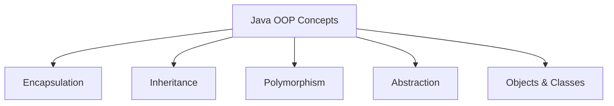
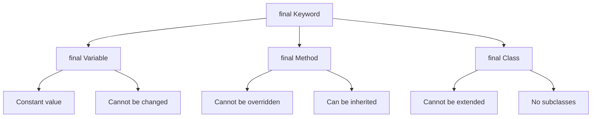
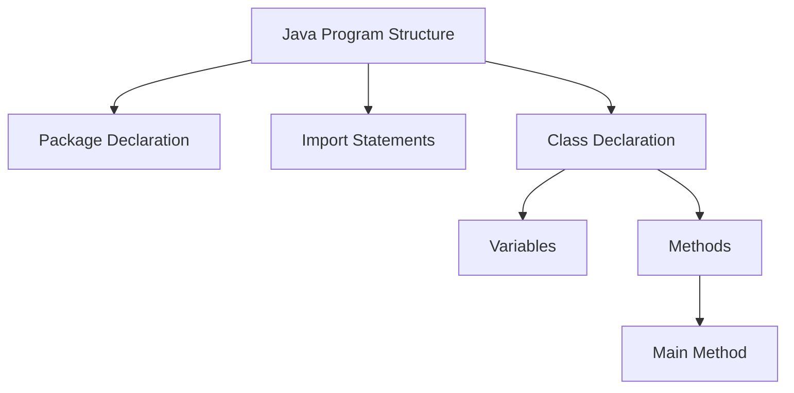
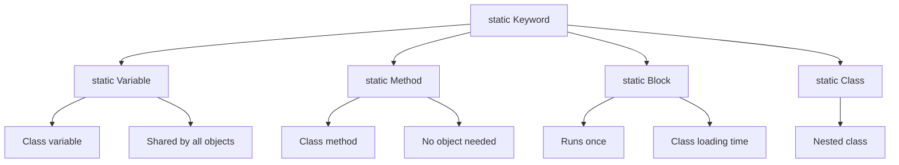
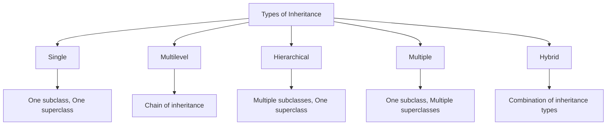
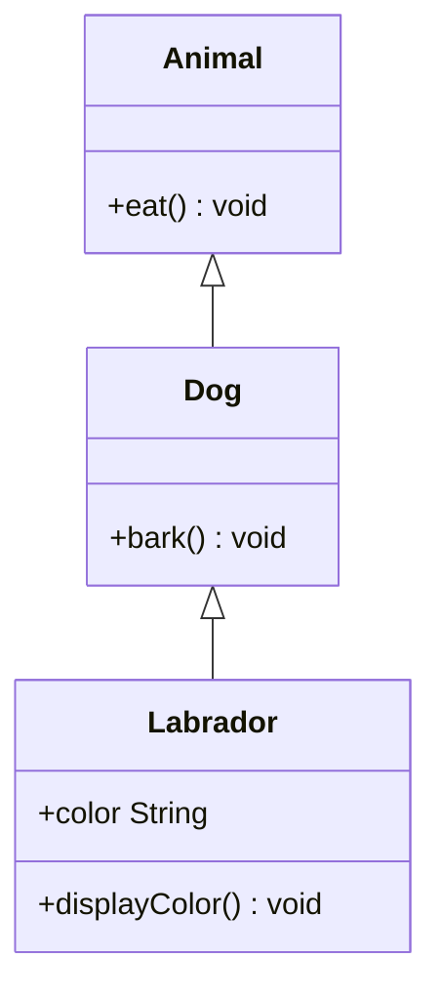
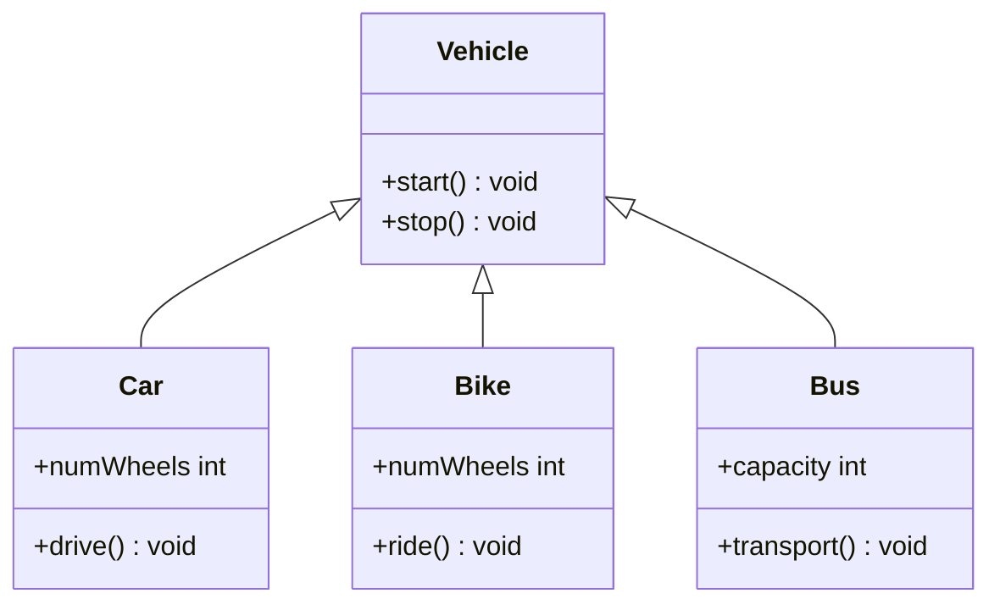

## Question 2(a): List out basic concepts of Java OOP. Explain any one in details. (Marks: 03)

### Answer 2(a):

**Basic OOP Concepts in Java**:



* **Encapsulation**: Binding data and methods together, hiding implementation
* **Inheritance**: Creating new classes from existing ones
* **Polymorphism**: One interface, multiple implementations
* **Abstraction**: Hiding complex implementation details
* **Objects & Classes**: Basic building blocks

**Inheritance Explained**:
* Inheritance is the mechanism of **creating new classes** from **existing classes**
* The new class (subclass/child) **inherits attributes and behaviors** from existing class (superclass/parent)
* Implemented using the **extends** keyword
* Promotes **code reusability** and establishes **IS-A relationship**
* Example: Car IS-A Vehicle, Dog IS-A Animal

**Mnemonic**: "**EIOPA**" - Encapsulation, Inheritance, Objects, Polymorphism, Abstraction

## Question 2(b): Explain final keyword with example. (Marks: 04)

### Answer 2(b):

**Final Keyword** in Java:



**Uses of final keyword**:
* **final variable**: Creates constants that cannot be changed
* **final method**: Cannot be overridden in subclasses
* **final class**: Cannot be extended (no inheritance)

**Example**:
```java
public class FinalDemo {
    // final variable (constant)
    final double PI = 3.14159;
    
    // final method
    final void display() {
        System.out.println("This method cannot be overridden");
    }
    
    public static void main(String[] args) {
        FinalDemo obj = new FinalDemo();
        
        // Using final variable
        System.out.println("Value of PI: " + obj.PI);
        
        // Cannot modify final variable
        // obj.PI = 3.14;  // Compilation error
        
        // Calling final method
        obj.display();
    }
}

// Final class
final class SecureClass {
    void show() {
        System.out.println("This class cannot be extended");
    }
}

// Cannot extend final class
// class ChildClass extends SecureClass {} // Compilation error
```

**Mnemonic**: "**VCM**" - Variables (constant), Cannot extend, Methods (no override)

## Question 2(c): What is constructor? Explain parameterized constructor with example. (Marks: 07)

### Answer 2(c):

**Constructor**: A special method used to **initialize objects** when created. It has the **same name as the class** and **no return type**.


**Characteristics**:
* **Same name** as the class
* **No return type**
* **Automatically called** when object is created
* **Initializes** instance variables

**Example of Parameterized Constructor**:
```java
public class Student {
    // Instance variables
    private int rollNo;
    private String name;
    private double percentage;
    
    // Parameterized constructor
    public Student(int roll, String studentName, double marks) {
        rollNo = roll;
        name = studentName;
        percentage = marks;
    }
    
    // Method to display student details
    public void displayDetails() {
        System.out.println("Roll No: " + rollNo);
        System.out.println("Name: " + name);
        System.out.println("Percentage: " + percentage + "%");
    }
    
    public static void main(String[] args) {
        // Creating objects using parameterized constructor
        Student s1 = new Student(101, "Rahul", 85.7);
        Student s2 = new Student(102, "Priya", 92.3);
        
        // Displaying details
        System.out.println("First Student:");
        s1.displayDetails();
        
        System.out.println("\nSecond Student:");
        s2.displayDetails();
    }
}
```

**Key Points**:
* Allows **initialization with specific values**
* Parameters passed during **object creation**
* Creates **multiple objects with different states**
* **No setter methods** needed to initialize variables

**Mnemonic**: "**PINS**" - Parameters, Initialize, No return type, Same name

## Question 2(a OR): Explain the Java Program Structure with example. (Marks: 03)

### Answer 2(a OR):

**Java Program Structure**:



**Components of Java Program**:
* **Package Declaration**: (Optional) Organizes related classes
* **Import Statements**: (Optional) Access classes from other packages
* **Class Declaration**: (Required) Container for code
* **Variables**: Store data
* **Methods**: Define behavior, including main method
* **Main Method**: Entry point for program execution

**Example**:
```java
// 1. Package Declaration (Optional)
package com.example;

// 2. Import Statements (Optional)
import java.util.Scanner;

// 3. Class Declaration (Required)
public class HelloWorld {
    // 4. Variables
    String message = "Hello, World!";
    
    // 5. Methods
    public void displayMessage() {
        System.out.println(message);
    }
    
    // 6. Main Method (Entry point)
    public static void main(String[] args) {
        // Create object of class
        HelloWorld obj = new HelloWorld();
        
        // Call method
        obj.displayMessage();
    }
}
```

**Mnemonic**: "**PICVM**" - Package, Import, Class, Variables, Methods

## Question 2(b OR): Explain static keyword with suitable example. (Marks: 04)

### Answer 2(b OR):

**Static Keyword** in Java:



**Uses of static**:
* **static variable**: Shared across all instances of the class
* **static method**: Can be called without creating objects
* **static block**: Executes when class is loaded
* **static nested class**: Belongs to the class rather than an instance

**Example**:
```java
public class CounterDemo {
    // Static variable - shared by all objects
    static int count = 0;
    
    // Instance variable - unique to each object
    int instanceNumber;
    
    // Static block - runs when class is loaded
    static {
        System.out.println("Static block executed");
        count = 10; // Initialize static variable
    }
    
    // Constructor
    public CounterDemo() {
        count++;          // Increment counter
        instanceNumber = count;  // Assign instance number
    }
    
    // Static method
    public static void displayCount() {
        System.out.println("Total objects: " + count);
        // Cannot access instance variables directly
        // System.out.println(instanceNumber); // Error!
    }
    
    // Instance method
    public void displayInfo() {
        System.out.println("This is object #" + instanceNumber);
        System.out.println("Total count: " + count); // Can access static variables
    }
    
    public static void main(String[] args) {
        // Static method called without object
        CounterDemo.displayCount(); // Output: Total objects: 10
        
        // Create objects
        CounterDemo obj1 = new CounterDemo();
        CounterDemo obj2 = new CounterDemo();
        
        // Call instance methods
        obj1.displayInfo(); // Output: This is object #11, Total count: 12
        obj2.displayInfo(); // Output: This is object #12, Total count: 12
        
        // Call static method again
        CounterDemo.displayCount(); // Output: Total objects: 12
    }
}
```

**Key Points**:
* Static members **belong to the class** (not objects)
* They are **loaded into memory** when the class is loaded
* Static methods **cannot access instance variables/methods** directly
* Used for **utility methods**, **constants**, and **counters**

**Mnemonic**: "**BCCS**" - Belongs to Class, Class-level, Shared memory, Static methods

## Question 2(c OR): Define Inheritance. List out types of it. Explain multilevel and hierarchical inheritance with suitable example. (Marks: 07)

### Answer 2(c OR):

**Inheritance**: The process where one class acquires the properties and behaviors of another class.

**Types of Inheritance**:



| Type | Description |
|------|-------------|
| **Single** | One subclass inherits from one superclass |
| **Multilevel** | Chain of inheritance (A → B → C) |
| **Hierarchical** | Multiple classes inherit from one superclass |
| **Multiple** | One class inherits from multiple classes (through interfaces in Java) |
| **Hybrid** | Combination of multiple inheritance types |

**Multilevel Inheritance Example**:



```java
// Base class
class Animal {
    void eat() {
        System.out.println("Animal is eating");
    }
}

// Intermediate class
class Dog extends Animal {
    void bark() {
        System.out.println("Dog is barking");
    }
}

// Derived class
class Labrador extends Dog {
    String color;
    
    Labrador(String color) {
        this.color = color;
    }
    
    void displayColor() {
        System.out.println("Color is " + color);
    }
}

// Main class
public class MultilevelDemo {
    public static void main(String[] args) {
        Labrador lab = new Labrador("Golden");
        
        // Methods from Animal class
        lab.eat();  
        
        // Methods from Dog class
        lab.bark(); 
        
        // Methods from Labrador class
        lab.displayColor();
    }
}
```

**Hierarchical Inheritance Example**:



```java
// Base class
class Vehicle {
    void start() {
        System.out.println("Vehicle started");
    }
    
    void stop() {
        System.out.println("Vehicle stopped");
    }
}

// Derived class 1
class Car extends Vehicle {
    int numWheels = 4;
    
    void drive() {
        System.out.println("Car is driving with " + numWheels + " wheels");
    }
}

// Derived class 2
class Bike extends Vehicle {
    int numWheels = 2;
    
    void ride() {
        System.out.println("Bike is riding with " + numWheels + " wheels");
    }
}

// Derived class 3
class Bus extends Vehicle {
    int capacity = 40;
    
    void transport() {
        System.out.println("Bus is transporting " + capacity + " passengers");
    }
}

// Main class
public class HierarchicalDemo {
    public static void main(String[] args) {
        Car car = new Car();
        Bike bike = new Bike();
        Bus bus = new Bus();
        
        // Car methods
        car.start();  // From Vehicle
        car.drive();  // From Car
        car.stop();   // From Vehicle
        
        System.out.println();
        
        // Bike methods
        bike.start(); // From Vehicle
        bike.ride();  // From Bike
        bike.stop();  // From Vehicle
        
        System.out.println();
        
        // Bus methods
        bus.start();     // From Vehicle
        bus.transport(); // From Bus
        bus.stop();      // From Vehicle
    }
}
```

**Key Points**:
* **Multilevel Inheritance**: Forms a **chain of inheritance** (e.g., Animal → Dog → Labrador)
* **Hierarchical Inheritance**: Multiple classes **inherit from one base class** (e.g., Vehicle → Car/Bike/Bus)
* Both promote **code reusability**
* Java **doesn't support multiple inheritance** with classes (uses interfaces instead)

**Mnemonic**: "**MASH**" - Multilevel (chain), Acquire properties, Single superclass, Hierarchical (tree)
