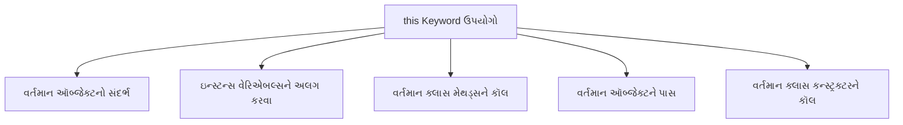
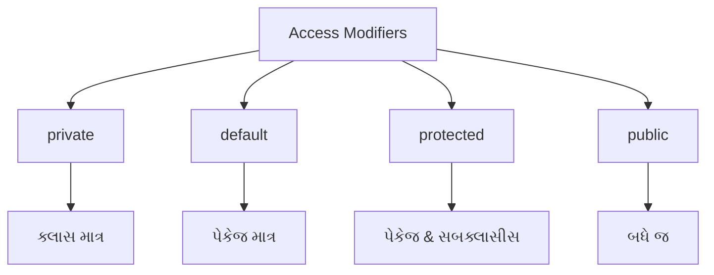
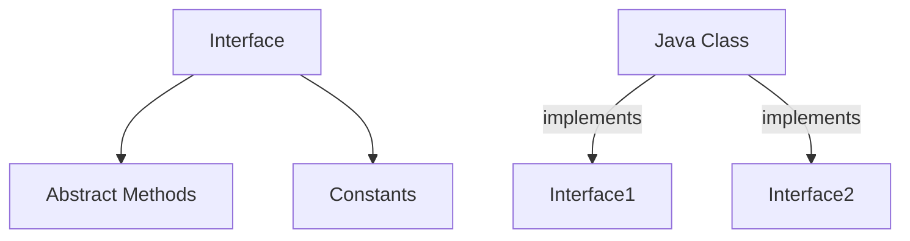
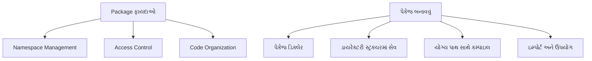

## પ્રશ્ન ૩(અ): this કી-વર્ડને યોગ્ય ઉદાહરણ સાથે સમજાવો. (ગુણ: ૩)

### જવાબ ૩(અ):

**'this' keyword** જાવામાં વર્તમાન ઑબ્જેક્ટ ઇન્સ્ટન્સનો સંદર્ભ આપે છે.



**'this' keyword ના મુખ્ય ઉપયોગો**:
* **વેરિએબલ શેડોઇંગ નિવારવા**: પેરામીટર્સથી ઇન્સ્ટન્સ વેરિએબલ્સને અલગ પાડવા
* **કન્સ્ટ્રક્ટર કૉલ**: એ જ ક્લાસમાં બીજા કન્સ્ટ્રક્ટરને કૉલ કરવા (`this()`)
* **વર્તમાન ઑબ્જેક્ટ રિટર્ન**: મેથડ ચેઇનિંગ માટે વર્તમાન ઇન્સ્ટન્સ પાછું આપવું
* **વર્તમાન ઑબ્જેક્ટ પાસ**: પેરામીટર તરીકે વર્તમાન ઑબ્જેક્ટને પાસ કરવું

**ઉદાહરણ**:
```java
public class Person {
    // ઇન્સ્ટન્સ વેરિએબલ્સ
    private String name;
    private int age;
    
    // પેરામીટર્સ સાથે કન્સ્ટ્રક્ટર
    public Person(String name, int age) {
        // ઇન્સ્ટન્સ વેરિએબલ્સને સંદર્ભિત કરવા 'this' નો ઉપયોગ
        this.name = name;  // 'this' વગર, name પેરામીટરને રેફર કરશે
        this.age = age;    // 'this' વગર, age પેરામીટરને રેફર કરશે
    }
    
    // 'this' નો ઉપયોગ કરીને બીજી મેથડને કૉલ કરતી મેથડ
    public void display() {
        System.out.println("નામ: " + this.name);
        System.out.println("ઉંમર: " + this.age);
        this.greet();  // અહીં 'this' વૈકલ્પિક છે
    }
    
    // કૉલ કરવા માટેની મેથડ
    public void greet() {
        System.out.println(this.name + " તરફથી નમસ્કાર");
    }
    
    public static void main(String[] args) {
        Person person = new Person("જોન", 25);
        person.display();
    }
}
```

**યાદ રાખવા માટે**: "**RICP**" - Reference variables, Instance methods, Constructor call, Pass object

## પ્રશ્ન ૩(બ): જાવામાં વિવિધ એક્સેસ કંટ્રોલ સમજાવો. (ગુણ: ૪)

### જવાબ ૩(બ):

**Access Modifiers** જાવામાં ક્લાસ, મેથડ્સ, અને વેરિએબલ્સની એક્સેસ અને દૃશ્યતાને નિયંત્રિત કરે છે.



**જાવા એક્સેસ કંટ્રોલ લેવલ્સ**:

| Modifier | Class | Package | Subclass | World |
|----------|-------|---------|----------|-------|
| **private** | હા | ના | ના | ના |
| **default** | હા | હા | ના | ના |
| **protected** | હા | હા | હા | ના |
| **public** | હા | હા | હા | હા |

**ઉદાહરણ**:
```java
public class AccessDemo {
    private int privateVar = 10;      // ક્લાસ માત્ર
    int defaultVar = 20;              // પેકેજ
    protected int protectedVar = 30;  // પેકેજ & સબક્લાસીસ
    public int publicVar = 40;        // બધે જ
    
    public void showValues() {
        // પોતાની ક્લાસમાં બધા જ વેરિએબલ્સને એક્સેસ કરી શકે
        System.out.println("Private: " + privateVar);
        System.out.println("Default: " + defaultVar);
        System.out.println("Protected: " + protectedVar);
        System.out.println("Public: " + publicVar);
    }
}
```

**ફાયદાઓ**:
* **Encapsulation**: ઇમ્પ્લિમેન્ટેશન વિગતો છુપાવવી
* **Security**: અનધિકૃત એક્સેસ અટકાવવી
* **Maintainability**: શું સુધારી શકાય તેનું નિયંત્રણ રાખવું

**યાદ રાખવા માટે**: "**PDPP**" - Private, Default, Protected, Public

## પ્રશ્ન ૩(ક): ઈન્ટરફેસ શું છે? ઈન્ટરફેસ દ્વારા ઉદાહરણ સાથે multiple inheritance સમજાવો. (ગુણ: ૭)

### જવાબ ૩(ક):

**Interface**: એક ક્લાસનો બ્લુપ્રિન્ટ જેમાં abstract methods અને constants હોય છે.



**મુખ્ય લક્ષણો**:
* મેથડ્સ ડિફોલ્ટ રીતે **public** અને **abstract** હોય છે
* વેરિએબલ્સ **public**, **static**, અને **final** હોય છે
* ક્લાસ ઇન્ટરફેસને **implement** કરે છે
* ક્લાસ **ઘણા ઇન્ટરફેસીસ** implement કરી શકે છે

**Multiple Inheritance ઉદાહરણ**:

```java
// પ્રથમ ઇન્ટરફેસ
interface Drawable {
    void draw();  // Abstract method
    int SIZE = 10;  // Constant
}

// બીજો ઇન્ટરફેસ
interface Colorable {
    void setColor(String color);
    String getColor();
}

// ઘણા ઇન્ટરફેસીસ implement કરતો ક્લાસ
class Circle implements Drawable, Colorable {
    private String color;
    
    @Override
    public void draw() {
        System.out.println(SIZE + " સાઇઝનો સર્કલ દોરી રહ્યા છીએ");
    }
    
    @Override
    public void setColor(String color) {
        this.color = color;
        System.out.println("સર્કલનો રંગ " + color + " સેટ કર્યો");
    }
    
    @Override
    public String getColor() {
        return color;
    }
}

// મેઇન ક્લાસ
public class InterfaceDemo {
    public static void main(String[] args) {
        Circle c = new Circle();
        
        // બંને ઇન્ટરફેસીસની મેથડ્સનો ઉપયોગ
        c.draw();
        c.setColor("લાલ");
        System.out.println("રંગ: " + c.getColor());
        
        // ઇન્ટરફેસ સાથે પોલિમોર્ફિઝમ
        Drawable d = new Circle();
        d.draw();  // માત્ર Drawable મેથડ્સને જ એક્સેસ કરી શકે
        
        Colorable col = new Circle();
        col.setColor("વાદળી");  // માત્ર Colorable મેથડ્સને જ એક્સેસ કરી શકે
    }
}
```

**ઇન્ટરફેસ સાથે Multiple Inheritance**:
* જાવા ક્લાસીસ સાથે **મલ્ટિપલ ઇન્હેરિટન્સની મંજૂરી આપતું નથી**
* ક્લાસ **ઘણા ઇન્ટરફેસીસ** implement કરી શકે છે
* દરેક ઇન્ટરફેસ અલગ અલગ **વર્તણૂકો** પ્રદાન કરે છે
* મલ્ટિપલ ઇન્હેરિટન્સમાં મળતી **ડાયમંડ પ્રોબ્લેમ**નું સમાધાન કરે છે

**યાદ રાખવા માટે**: "**CALM**" - Constants, Abstract methods, Like multiple inheritance, Methods without implementation

## પ્રશ્ન ૩(અ OR): super કી-વર્ડ ઉદાહરણ સાથે સમજાવો. (ગુણ: ૩)

### જવાબ ૩(અ OR):

**'super' keyword** જાવામાં વર્તમાન ઑબ્જેક્ટના પેરેન્ટ ક્લાસ (સુપરક્લાસ)નો સંદર્ભ આપે છે.

```mermaid
graph TD
    A[super Keyword ઉપયોગો] --> B[પેરેન્ટ મેંબર્સને એક્સેસ]
    A --> C[પેરેન્ટ મેથડ્સને કૉલ]
    A --> D[પેરેન્ટ કન્સ્ટ્રક્ટરને કૉલ]
    
    B --> B1[super.variable]
    C --> C1[super.method()]
    D --> D1[super()]
```

**'super' keyword ના મુખ્ય ઉપયોગો**:
* **પેરેન્ટ ક્લાસ વેરિએબલ્સને એક્સેસ**: `super.variable`
* **પેરેન્ટ ક્લાસ મેથડ્સને કૉલ**: `super.method()`
* **પેરેન્ટ ક્લાસ કન્સ્ટ્રક્ટરને કૉલ**: `super()` અથવા `super(parameters)`

**ઉદાહરણ**:
```java
// પેરેન્ટ ક્લાસ
class Animal {
    String color = "સફેદ";
    
    void eat() {
        System.out.println("પ્રાણી ખાઈ રહ્યું છે");
    }
    
    Animal() {
        System.out.println("Animal કન્સ્ટ્રક્ટર કૉલ થયો");
    }
}

// ચાઇલ્ડ ક્લાસ
class Dog extends Animal {
    String color = "કાળો";
    
    void printColor() {
        // એક જ નામના પેરેન્ટ વેરિએબલને એક્સેસ
        System.out.println("પેરેન્ટ રંગ: " + super.color);
        System.out.println("ચાઇલ્ડ રંગ: " + color);
    }
    
    void eat() {
        // પેરેન્ટ મેથડને કૉલ
        super.eat();
        System.out.println("કૂતરો ખાઈ રહ્યો છે");
    }
    
    Dog() {
        // પેરેન્ટ કન્સ્ટ્રક્ટરને કૉલ
        super();
        System.out.println("Dog કન્સ્ટ્રક્ટર કૉલ થયો");
    }
}

// મેઇન ક્લાસ
public class SuperDemo {
    public static void main(String[] args) {
        Dog dog = new Dog();
        dog.printColor();
        dog.eat();
    }
}
```

**આઉટપુટ**:
```
Animal કન્સ્ટ્રક્ટર કૉલ થયો
Dog કન્સ્ટ્રક્ટર કૉલ થયો
પેરેન્ટ રંગ: સફેદ
ચાઇલ્ડ રંગ: કાળો
પ્રાણી ખાઈ રહ્યું છે
કૂતરો ખાઈ રહ્યો છે
```

**યાદ રાખવા માટે**: "**VCM**" - Variables (parent), Call methods, Method overriding

## પ્રશ્ન ૩(બ OR): પેકેજ શું છે? પેકેજ બનાવવાના પગલાં લખો અને તેનું ઉદાહરણ આપો. (ગુણ: ૪)

### જવાબ ૩(બ OR):

**Package**: એક નેમસ્પેસ જે સંબંધિત ક્લાસ અને ઇન્ટરફેસીસને ઓર્ગેનાઇઝ કરે છે.



**પેકેજ બનાવવાના પગલાં**:
1. સોર્સ ફાઇલની શરૂઆતમાં **પેકેજ ડિક્લેર** કરો
2. ફાઇલને પેકેજ નામ સાથે મેળ ખાતા ડાયરેક્ટરી સ્ટ્રક્ચરમાં **સેવ** કરો
3. યોગ્ય ડાયરેક્ટરી સ્ટ્રક્ચર સાથે ફાઇલને **કમ્પાઇલ** કરો
4. અન્ય ક્લાસમાં પેકેજને **ઇમ્પોર્ટ** અને ઉપયોગ કરો

**ઉદાહરણ**:

**પગલું 1**: પેકેજ ડિક્લેરેશન સાથે ક્લાસ બનાવો
```java
// ફાઇલ: Calculator.java
package com.mymath.util;

public class Calculator {
    // મેથડ્સ
    public int add(int a, int b) {
        return a + b;
    }
    
    public int subtract(int a, int b) {
        return a - b;
    }
    
    public int multiply(int a, int b) {
        return a * b;
    }
    
    public double divide(int a, int b) {
        if (b == 0) {
            System.out.println("શૂન્ય વડે ભાગી શકાતું નથી");
            return 0;
        }
        return (double)a / b;
    }
}
```

**પગલું 2**: ફાઇલને યોગ્ય ડાયરેક્ટરી સ્ટ્રક્ચરમાં સેવ કરો
```
project_root/
└── com/
    └── mymath/
        └── util/
            └── Calculator.java
```

**પગલું 3**: ફાઇલને કમ્પાઇલ કરો
```bash
# project_root પર નેવિગેટ કરો
cd project_root

# કમ્પાઇલ
javac com/mymath/util/Calculator.java
```

**પગલું 4**: પેકેજનો ઉપયોગ કરતો ક્લાસ બનાવો
```java
// ફાઇલ: PackageDemo.java
// પેકેજ ઇમ્પોર્ટ
import com.mymath.util.Calculator;

public class PackageDemo {
    public static void main(String[] args) {
        // Calculator ક્લાસનો ઑબ્જેક્ટ બનાવો
        Calculator calc = new Calculator();
        
        // મેથડ્સનો ઉપયોગ
        System.out.println("10 + 5 = " + calc.add(10, 5));
        System.out.println("10 - 5 = " + calc.subtract(10, 5));
        System.out.println("10 * 5 = " + calc.multiply(10, 5));
        System.out.println("10 / 5 = " + calc.divide(10, 5));
    }
}
```

**પગલું 5**: મેઇન ક્લાસને કમ્પાઇલ અને ચલાવો
```bash
# કમ્પાઇલ
javac -classpath . PackageDemo.java

# ચલાવો
java -classpath . PackageDemo
```

**આઉટપુટ**:
```
10 + 5 = 15
10 - 5 = 5
10 * 5 = 50
10 / 5 = 2.0
```

**યાદ રાખવા માટે**: "**SCIR**" - Save in structure, Compile with path, Import package, Run with classpath

## પ્રશ્ન ૩(ક OR): વ્યાખ્યાયિત કરો: Method Overriding. Method overriding માટેના નિયમોની યાદી બનાવો. Method overriding ને ઇમ્પ્લિમેન્ટ કરતો java પ્રોગ્રામ લખો. (ગુણ: ૭)

### જવાબ ૩(ક OR):

**Method Overriding**: સબક્લાસમાં પેરેન્ટ ક્લાસમાં પહેલેથી જ વ્યાખ્યાયિત મેથડ માટે અલગ ઇમ્પ્લિમેન્ટેશન પ્રદાન કરવું.

```mermaid
graph TD
    A[Method Overriding] --> B[સમાન મેથડ નામ]
    A --> C[સમાન પેરામીટર્સ]
    A --> D[સમાન રિટર્ન ટાઇપ]
    A --> E[IS-A સંબંધ]
    A --> F[રનટાઇમ પોલિમોર્ફિઝમ]
    
    G[પેરેન્ટ ક્લાસ] --> G1[method()]
    H[ચાઇલ્ડ ક્લાસ] --> H1[method()]
    
    G1 -->|ઓવરરાઇડ્સ| H1
```

**Method Overriding માટેના નિયમો**:
* મેથડ પેરેન્ટ ક્લાસ મેથડ જેવું **સમાન નામ** ધરાવતી હોવી જોઈએ
* મેથડમાં **સમાન પેરામીટર્સ** (સંખ્યા, પ્રકાર, ક્રમ) હોવા જોઈએ
* રિટર્ન ટાઇપ પેરેન્ટ મેથડના રિટર્ન ટાઇપનો **સમાન અથવા સબટાઇપ** હોવો જોઈએ
* એક્સેસ મોડિફાયર પેરેન્ટ મેથડ કરતાં **સમાન અથવા ઓછો પ્રતિબંધિત** હોવો જોઈએ
* **static** મેથડ્સને ઓવરરાઇડ કરી શકાતી નથી (method hiding થાય છે)
* **final** મેથડ્સને ઓવરરાઇડ કરી શકાતી નથી
* **private** મેથડ્સને ઓવરરાઇડ કરી શકાતી નથી (સબક્લાસને દેખાતી નથી)
* ઓવરરાઇડ થયેલી મેથડ પેરેન્ટ મેથડની સરખામણીમાં **સમાન, સબટાઇપ, અથવા કોઈ પણ એક્સેપ્શન્સ ફેંકી** શકે છે

**Method Overriding નું ઉદાહરણ**:

```java
// પેરેન્ટ ક્લાસ
class Vehicle {
    // ઓવરરાઇડ થનારી મેથડ
    public void move() {
        System.out.println("વાહન ચાલી રહ્યું છે");
    }
    
    // final મેથડ - ઓવરરાઇડ થઈ શકતી નથી
    public final void stop() {
        System.out.println("વાહન રોકાઈ ગયું");
    }
    
    // રિટર્ન ટાઇપ ધરાવતી મેથડ
    public int getMaxSpeed() {
        return 100;
    }
    
    // static મેથડ - ઓવરરાઇડ થઈ શકતી નથી (હાઇડ થઈ શકે છે)
    public static void displayInfo() {
        System.out.println("આ એક વાહન છે");
    }
}

// ચાઇલ્ડ ક્લાસ
class Car extends Vehicle {
    // move() મેથડને ઓવરરાઇડ
    @Override
    public void move() {
        System.out.println("કાર ચલાવાઈ રહી છે");
    }
    
    // final મેથડને ઓવરરાઇડ કરી શકાતી નથી
    // public void stop() { } // એરર!
    
    // સમાન રિટર્ન ટાઇપ સાથે ઓવરરાઇડ
    @Override
    public int getMaxSpeed() {
        return 200; // અલગ ઇમ્પ્લિમેન્ટેશન
    }
    
    // મેથડ હાઇડિંગ (ઓવરરાઇડિંગ નહીં) - static મેથડ
    public static void displayInfo() {
        System.out.println("આ એક કાર છે");
    }
}

// વધુ એક ચાઇલ્ડ ક્લાસ
class Bike extends Vehicle {
    // move() મેથડને ઓવરરાઇડ
    @Override
    public void move() {
        // પ્રથમ પેરેન્ટ મેથડને કૉલ
        super.move();
        System.out.println("બાઇક ચલાવાઈ રહી છે");
    }
    
    // covariant રિટર્ન ટાઇપ સાથે ઓવરરાઇડ
    @Override
    public int getMaxSpeed() {
        return 120;
    }
}

// મેઇન ક્લાસ
public class OverridingDemo {
    public static void main(String[] args) {
        // પેરેન્ટ ક્લાસનો ઑબ્જેક્ટ બનાવો
        Vehicle vehicle = new Vehicle();
        vehicle.move();
        System.out.println("મહત્તમ ગતિ: " + vehicle.getMaxSpeed());
        Vehicle.displayInfo();
        
        System.out.println("\n----- કાર -----");
        // ચાઇલ્ડ ક્લાસનો ઑબ્જેક્ટ બનાવો
        Car car = new Car();
        car.move();
        car.stop(); // પેરેન્ટની મેથડનો ઉપયોગ
        System.out.println("મહત્તમ ગતિ: " + car.getMaxSpeed());
        Car.displayInfo();
        
        System.out.println("\n----- બાઇક -----");
        // અન્ય ચાઇલ્ડ ક્લાસનો ઑબ્જેક્ટ બનાવો
        Bike bike = new Bike();
        bike.move();
        System.out.println("મહત્તમ ગતિ: " + bike.getMaxSpeed());
        
        System.out.println("\n----- રનટાઇમ પોલિમોર્ફિઝમ -----");
        // રનટાઇમ પોલિમોર્ફિઝમ (ડાયનેમિક મેથડ ડિસ્પેચ)
        Vehicle v1 = new Car();
        Vehicle v2 = new Bike();
        
        v1.move(); // Car ની move મેથડને કૉલ કરે છે
        v2.move(); // Bike ની move મેથડને કૉલ કરે છે
        
        // Static મેથડ રેફરન્સ ટાઇપ અનુસાર કૉલ થાય છે (ઑબ્જેક્ટ ટાઇપ નહીં)
        v1.displayInfo(); // Vehicle ની displayInfo કૉલ કરે છે
    }
}
```

**આઉટપુટ**:
```
વાહન ચાલી રહ્યું છે
મહત્તમ ગતિ: 100
આ એક વાહન છે

----- કાર -----
કાર ચલાવાઈ રહી છે
વાહન રોકાઈ ગયું
મહત્તમ ગતિ: 200
આ એક કાર છે

----- બાઇક -----
વાહન ચાલી રહ્યું છે
બાઇક ચલાવાઈ રહી છે
મહત્તમ ગતિ: 120

----- રનટાઇમ પોલિમોર્ફિઝમ -----
કાર ચલાવાઈ રહી છે
વાહન ચાલી રહ્યું છે
બાઇક ચલાવાઈ રહી છે
આ એક વાહન છે
```

**મુખ્ય મુદ્દાઓ**:
* Method overriding **રનટાઇમ પોલિમોર્ફિઝમ**નો આધાર છે
* કૉલ થતી મેથડ **રેફરન્સ ટાઇપ** નહીં પણ **વાસ્તવિક ઑબ્જેક્ટ ટાઇપ** અનુસાર નક્કી થાય છે
* `@Override` એનોટેશન મેથડ ખરેખર ઓવરરાઇડ થાય છે કે નહીં તે ચકાસવામાં મદદ કરે છે
* ઓવરરાઇડેડ મેથડમાંથી `super.methodName()` દ્વારા પેરેન્ટ મેથડને કૉલ કરો

**યાદ રાખવા માટે**: "**SPAN**" - Same name, Parameters same, Access same/wider, No static/final/private