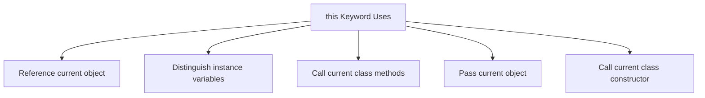
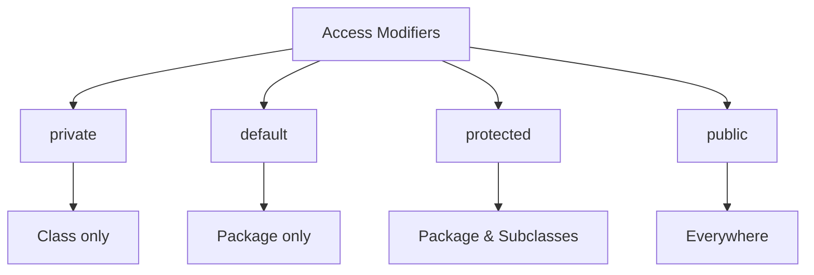
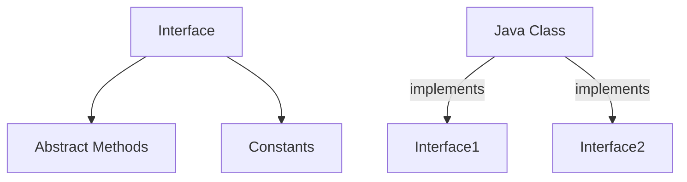
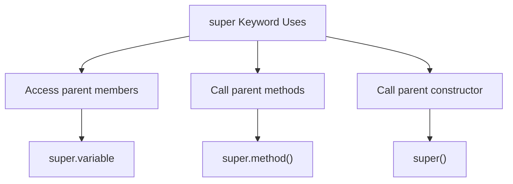
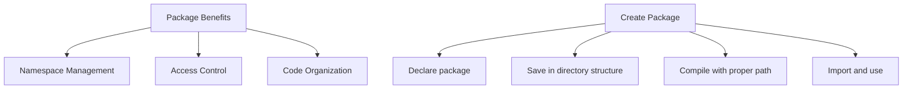
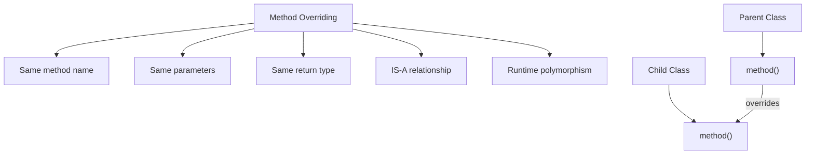

## Question 3(a): Explain this keyword with suitable example. (Marks: 03)

### Answer 3(a):

**'this' keyword** in Java refers to the current object instance.



**Main uses of 'this' keyword**:
* **Resolve variable shadowing**: Differentiate instance variables from parameters
* **Call constructor**: Call another constructor in same class (`this()`)
* **Return current object**: Return current instance for method chaining
* **Pass current object**: Pass current object as parameter

**Example**:
```java
public class Person {
    // Instance variables
    private String name;
    private int age;
    
    // Constructor with parameters
    public Person(String name, int age) {
        // Use 'this' to refer to instance variables
        this.name = name;  // Without 'this', name would refer to parameter
        this.age = age;    // Without 'this', age would refer to parameter
    }
    
    // Method that uses 'this' to call another method
    public void display() {
        System.out.println("Name: " + this.name);
        System.out.println("Age: " + this.age);
        this.greet();  // 'this' is optional here
    }
    
    // Method to be called
    public void greet() {
        System.out.println("Hello from " + this.name);
    }
    
    public static void main(String[] args) {
        Person person = new Person("John", 25);
        person.display();
    }
}
```

**Mnemonic**: "**RICP**" - Reference variables, Instance methods, Constructor call, Pass object

## Question 3(b): Explain different access controls in Java. (Marks: 04)

### Answer 3(b):

**Access Modifiers** in Java control the accessibility and visibility of classes, methods, and variables.



**Java Access Control Levels**:

| Modifier | Class | Package | Subclass | World |
|----------|-------|---------|----------|-------|
| **private** | Yes | No | No | No |
| **default** | Yes | Yes | No | No |
| **protected** | Yes | Yes | Yes | No |
| **public** | Yes | Yes | Yes | Yes |

**Example**:
```java
public class AccessDemo {
    private int privateVar = 10;      // Class only
    int defaultVar = 20;              // Package
    protected int protectedVar = 30;  // Package & subclasses
    public int publicVar = 40;        // Everywhere
    
    public void showValues() {
        // Can access all variables inside its own class
        System.out.println("Private: " + privateVar);
        System.out.println("Default: " + defaultVar);
        System.out.println("Protected: " + protectedVar);
        System.out.println("Public: " + publicVar);
    }
}
```

**Benefits**:
* **Encapsulation**: Hide implementation details
* **Security**: Prevent unauthorized access 
* **Maintainability**: Control what can be modified

**Mnemonic**: "**PDPP**" - Private, Default, Protected, Public

## Question 3(c): What is interface? Explain multiple inheritance using interface with example. (Marks: 07)

### Answer 3(c):

**Interface**: A blueprint of a class that contains abstract methods and constants.



**Key Features**:
* Methods are **public** and **abstract** by default
* Variables are **public**, **static**, and **final**
* Class **implements** interface
* Class can implement **multiple interfaces**

**Example of Multiple Inheritance**:

```java
// First interface
interface Drawable {
    void draw();  // Abstract method
    int SIZE = 10;  // Constant
}

// Second interface
interface Colorable {
    void setColor(String color);
    String getColor();
}

// Class implementing multiple interfaces
class Circle implements Drawable, Colorable {
    private String color;
    
    @Override
    public void draw() {
        System.out.println("Drawing a circle with size " + SIZE);
    }
    
    @Override
    public void setColor(String color) {
        this.color = color;
        System.out.println("Circle color set to " + color);
    }
    
    @Override
    public String getColor() {
        return color;
    }
}

// Main class
public class InterfaceDemo {
    public static void main(String[] args) {
        Circle c = new Circle();
        
        // Using methods from both interfaces
        c.draw();
        c.setColor("Red");
        System.out.println("Color: " + c.getColor());
        
        // Polymorphism with interfaces
        Drawable d = new Circle();
        d.draw();  // Can only access Drawable methods
        
        Colorable col = new Circle();
        col.setColor("Blue");  // Can only access Colorable methods
    }
}
```

**Multiple Inheritance with Interfaces**:
* Java **doesn't allow multiple inheritance** with classes
* Class can **implement multiple interfaces**
* Each interface provides different **behaviors**
* Solves **diamond problem** found in multiple inheritance

**Mnemonic**: "**CALM**" - Constants, Abstract methods, Like multiple inheritance, Methods without implementation

## Question 3(a OR): Explain super keyword with example. (Marks: 03)

### Answer 3(a OR):

**'super' keyword** in Java refers to the parent class (superclass) of the current object.



**Main uses of 'super' keyword**:
* **Access parent class variables**: `super.variable`
* **Call parent class methods**: `super.method()`
* **Call parent class constructor**: `super()` or `super(parameters)`

**Example**:
```java
// Parent class
class Animal {
    String color = "white";
    
    void eat() {
        System.out.println("Animal is eating");
    }
    
    Animal() {
        System.out.println("Animal constructor called");
    }
}

// Child class
class Dog extends Animal {
    String color = "black";
    
    void printColor() {
        // Access parent variable with same name
        System.out.println("Parent color: " + super.color);
        System.out.println("Child color: " + color);
    }
    
    void eat() {
        // Call parent method
        super.eat();
        System.out.println("Dog is eating");
    }
    
    Dog() {
        // Call parent constructor
        super();
        System.out.println("Dog constructor called");
    }
}

// Main class
public class SuperDemo {
    public static void main(String[] args) {
        Dog dog = new Dog();
        dog.printColor();
        dog.eat();
    }
}
```

**Output**:
```
Animal constructor called
Dog constructor called
Parent color: white
Child color: black
Animal is eating
Dog is eating
```

**Mnemonic**: "**VCM**" - Variables (parent), Call methods, Method overriding

## Question 3(b OR): What is package? Write steps to create a package and give example of it. (Marks: 04)

### Answer 3(b OR):

**Package**: A namespace that organizes a set of related classes and interfaces.



**Steps to Create a Package**:
1. **Declare** the package at the beginning of source file
2. **Save** the file in directory structure matching package name
3. **Compile** the file using proper directory structure
4. **Import** and use the package in other classes

**Example**:

**Step 1**: Create a class with package declaration
```java
// File: Calculator.java
package com.mymath.util;

public class Calculator {
    // Methods
    public int add(int a, int b) {
        return a + b;
    }
    
    public int subtract(int a, int b) {
        return a - b;
    }
    
    public int multiply(int a, int b) {
        return a * b;
    }
    
    public double divide(int a, int b) {
        if (b == 0) {
            System.out.println("Cannot divide by zero");
            return 0;
        }
        return (double)a / b;
    }
}
```

**Step 2**: Save file in proper directory structure
```
project_root/
└── com/
    └── mymath/
        └── util/
            └── Calculator.java
```

**Step 3**: Compile the file
```bash
# Navigate to project_root
cd project_root

# Compile
javac com/mymath/util/Calculator.java
```

**Step 4**: Create a class that uses the package
```java
// File: PackageDemo.java
// Import the package
import com.mymath.util.Calculator;

public class PackageDemo {
    public static void main(String[] args) {
        // Create object of the Calculator class
        Calculator calc = new Calculator();
        
        // Use methods
        System.out.println("10 + 5 = " + calc.add(10, 5));
        System.out.println("10 - 5 = " + calc.subtract(10, 5));
        System.out.println("10 * 5 = " + calc.multiply(10, 5));
        System.out.println("10 / 5 = " + calc.divide(10, 5));
    }
}
```

**Step 5**: Compile and run the main class
```bash
# Compile
javac -classpath . PackageDemo.java

# Run
java -classpath . PackageDemo
```

**Output**:
```
10 + 5 = 15
10 - 5 = 5
10 * 5 = 50
10 / 5 = 2.0
```

**Mnemonic**: "**SCIR**" - Save in structure, Compile with path, Import package, Run with classpath

## Question 3(c OR): Define: Method Overriding. List out Rules for method overriding. Write a java program that implements method overriding. (Marks: 07)

### Answer 3(c OR):

**Method Overriding**: Providing a different implementation for a method in a subclass that is already defined in the parent class.



**Rules for Method Overriding**:
* Method must have **same name** as parent class method
* Method must have **same parameters** (number, type, order)
* Return type must be **same or subtype** of parent method's return type
* Access modifier must be **same or less restrictive** than parent method
* Cannot override **static** methods (method hiding occurs instead)
* Cannot override **final** methods
* Cannot override **private** methods (not visible to subclass)
* Overridden method can throw **same, subtype, or no exceptions** compared to parent

**Example of Method Overriding**:

```java
// Parent class
class Vehicle {
    // Method to be overridden
    public void move() {
        System.out.println("Vehicle is moving");
    }
    
    // Final method - cannot be overridden
    public final void stop() {
        System.out.println("Vehicle stopped");
    }
    
    // Method with return type
    public int getMaxSpeed() {
        return 100;
    }
    
    // Static method - cannot be overridden (can be hidden)
    public static void displayInfo() {
        System.out.println("This is a vehicle");
    }
}

// Child class
class Car extends Vehicle {
    // Overriding move() method
    @Override
    public void move() {
        System.out.println("Car is driving");
    }
    
    // Cannot override final method
    // public void stop() { } // Error!
    
    // Overriding with same return type
    @Override
    public int getMaxSpeed() {
        return 200; // Different implementation
    }
    
    // Method hiding (not overriding) - static method
    public static void displayInfo() {
        System.out.println("This is a car");
    }
}

// Another child class
class Bike extends Vehicle {
    // Overriding move() method
    @Override
    public void move() {
        // Call parent method first
        super.move();
        System.out.println("Bike is riding");
    }
    
    // Overriding with covariant return type
    @Override
    public int getMaxSpeed() {
        return 120;
    }
}

// Main class
public class OverridingDemo {
    public static void main(String[] args) {
        // Create parent class object
        Vehicle vehicle = new Vehicle();
        vehicle.move();
        System.out.println("Max speed: " + vehicle.getMaxSpeed());
        Vehicle.displayInfo();
        
        System.out.println("\n----- Car -----");
        // Create child class object
        Car car = new Car();
        car.move();
        car.stop(); // Using parent's method
        System.out.println("Max speed: " + car.getMaxSpeed());
        Car.displayInfo();
        
        System.out.println("\n----- Bike -----");
        // Create another child class object
        Bike bike = new Bike();
        bike.move();
        System.out.println("Max speed: " + bike.getMaxSpeed());
        
        System.out.println("\n----- Runtime Polymorphism -----");
        // Runtime polymorphism (dynamic method dispatch)
        Vehicle v1 = new Car();
        Vehicle v2 = new Bike();
        
        v1.move(); // Calls Car's move method
        v2.move(); // Calls Bike's move method
        
        // Static method called using reference type (not object type)
        v1.displayInfo(); // Calls Vehicle's displayInfo
    }
}
```

**Output**:
```
Vehicle is moving
Max speed: 100
This is a vehicle

----- Car -----
Car is driving
Vehicle stopped
Max speed: 200
This is a car

----- Bike -----
Vehicle is moving
Bike is riding
Max speed: 120

----- Runtime Polymorphism -----
Car is driving
Vehicle is moving
Bike is riding
This is a vehicle
```

**Key Points**:
* Method overriding is the basis for **runtime polymorphism**
* The method called is determined by the **actual object type**, not reference type
* `@Override` annotation helps catch errors if method doesn't actually override
* Use `super.methodName()` to call parent method from overriding method

**Mnemonic**: "**SPAN**" - Same name, Parameters same, Access same/wider, No static/final/private
