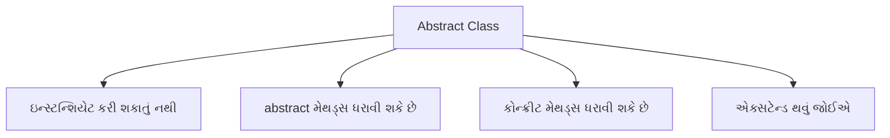
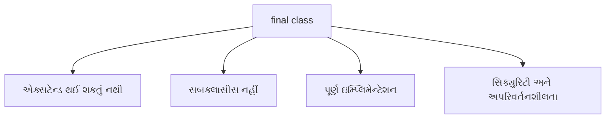

## પ્રશ્ન ૪(અ): યોગ્ય ઉદાહરણ સાથે abstract class સમજાવો. (ગુણ: ૩)

### જવાબ ૪(અ):

**Abstract Class**: એક ક્લાસ જેનું ઇન્સ્ટન્શિયેશન કરી શકાતું નથી અને જેમાં abstract મેથડ્સ હોઈ શકે છે.



**મુખ્ય લક્ષણો**:
* **abstract** કીવર્ડ સાથે ડિક્લેર થાય છે
* **abstract મેથડ્સ** (ઇમ્પ્લિમેન્ટેશન વગર) ધરાવી શકે છે
* સબક્લાસીસે **બધી abstract મેથડ્સ ઇમ્પ્લિમેન્ટ** કરવી જોઈએ
* **કન્સ્ટ્રક્ટર્સ**, **ઇન્સ્ટન્સ વેરિએબલ્સ**, અને **કોન્ક્રીટ મેથડ્સ** ધરાવી શકે છે

**ઉદાહરણ**:
```java
// Abstract class
abstract class Shape {
    // Abstract method - કોઈ ઇમ્પ્લિમેન્ટેશન નથી
    abstract double calculateArea();
    
    // Concrete method
    void display() {
        System.out.println("ક્ષેત્રફળ: " + calculateArea());
    }
}

// Concrete subclass
class Circle extends Shape {
    double radius;
    
    Circle(double radius) {
        this.radius = radius;
    }
    
    // abstract method ઇમ્પ્લિમેન્ટ કરવી
    @Override
    double calculateArea() {
        return Math.PI * radius * radius;
    }
}
```

**યાદ રાખવા માટે**: "**CPAI**" - Cannot instantiate, Partial implementation, Abstract methods, Inherited

## પ્રશ્ન ૪(બ): Thread શું છે? Thread જીવનચક્ર સમજાવો. (ગુણ: ૪)

### જવાબ ૪(બ):

**Thread**: એક હલકા વજનનું સબપ્રોસેસ જે પ્રોગ્રામના એક ભાગને સમાંતર રીતે એક્ઝિક્યુટ કરે છે.

```mermaid
graph LR
    A[New] -->|start()| B[Runnable]
    B -->|શેડ્યુલર પસંદ કરે| C[Running]
    C -->|sleep/wait| D[Blocked/Waiting]
    D -->|notify/timeout| B
    C -->|run() પૂર્ણ| E[Dead]
```

**Thread લાઇફ સાયકલના તબક્કા**:

1. **New**: Thread ઑબ્જેક્ટ બનાવ્યો છે પરંતુ શરૂ થયો નથી
2. **Runnable**: Thread ચાલવા માટે તૈયાર, CPU માટે રાહ જુએ છે
3. **Running**: Thread CPU માં એક્ઝિક્યુટ થઈ રહ્યો છે
4. **Blocked/Waiting**: Thread થોડા સમય માટે અસક્રિય
   * **sleep()**: નિશ્ચિત સમય માટે ફરજિયાત નિષ્ક્રિય
   * **wait()**: નોટિફિકેશનની રાહ જોવી
   * **join()**: બીજી thread પૂર્ણ થવાની રાહ જોવી
   * **I/O blocking**: I/O ઓપરેશનની રાહ જોવી
5. **Dead**: Thread એક્ઝિક્યુશન પૂર્ણ થયું

**Java Thread મેથડ્સ**:
* **start()**: thread એક્ઝિક્યુશન શરૂ કરો
* **sleep()**: નિશ્ચિત સમય માટે thread પોઝ કરો
* **yield()**: બીજા threads ને ચલાવવા વર્તમાન thread પોઝ કરો
* **join()**: બીજી thread પૂર્ણ થાય ત્યાં સુધી રાહ જુઓ

**યાદ રાખવા માટે**: "**NRWBD**" - New, Runnable, Running, Waiting/Blocked, Dead

## પ્રશ્ન ૪(ક): Thread Class નો અમલ કરીને બહુવિધ થ્રેડો બનાવે તેવો java પ્રોગ્રામ લખો. (ગુણ: ૭)

### જવાબ ૪(ક):

```java
// Runnable interface ઇમ્પ્લિમેન્ટ કરીને thread બનાવવી
class CounterThread implements Runnable {
    private String threadName;
    private int counter;
    
    // Constructor
    public CounterThread(String name, int count) {
        this.threadName = name;
        this.counter = count;
    }
    
    // Run મેથડમાં thread લોજિક હોય છે
    @Override
    public void run() {
        try {
            for (int i = 1; i <= counter; i++) {
                System.out.println(threadName + ": ગણતરી " + i);
                
                // ડેમોન્સ્ટ્રેશન માટે પોઝ
                Thread.sleep(500);
            }
            
            System.out.println(threadName + " પૂર્ણ થઈ.");
        } catch (InterruptedException e) {
            System.out.println(threadName + " વિક્ષેપિત થઈ.");
        }
    }
}

// મેઇન ક્લાસ
public class MultiThreadDemo {
    public static void main(String[] args) {
        System.out.println("થ્રેડ્સ બનાવી રહ્યા છીએ...");
        
        // પહેલી thread બનાવો
        Thread thread1 = new Thread(new CounterThread("થ્રેડ-1", 5));
        
        // બીજી thread બનાવો
        Thread thread2 = new Thread(new CounterThread("થ્રેડ-2", 3));
        
        // ત્રીજી thread બનાવો
        Thread thread3 = new Thread(new CounterThread("થ્રેડ-3", 4));
        
        // threads શરૂ કરો
        thread1.start();
        thread2.start();
        thread3.start();
        
        System.out.println("મેઇન થ્રેડ ચાલુ રહે છે...");
        
        try {
            // બધી threads પૂર્ણ થાય ત્યાં સુધી રાહ જુઓ
            thread1.join();
            thread2.join();
            thread3.join();
        } catch (InterruptedException e) {
            System.out.println("મેઇન થ્રેડ વિક્ષેપિત થઈ.");
        }
        
        System.out.println("બધી થ્રેડ્સ પૂર્ણ થઈ. મેઇન થ્રેડ બહાર નીકળી રહી છે.");
    }
}
```

**આઉટપુટ** (thread શેડ્યૂલિંગ ને કારણે બદલાઈ શકે છે):
```
થ્રેડ્સ બનાવી રહ્યા છીએ...
મેઇન થ્રેડ ચાલુ રહે છે...
થ્રેડ-1: ગણતરી 1
થ્રેડ-2: ગણતરી 1
થ્રેડ-3: ગણતરી 1
થ્રેડ-1: ગણતરી 2
થ્રેડ-2: ગણતરી 2
થ્રેડ-3: ગણતરી 2
થ્રેડ-1: ગણતરી 3
થ્રેડ-2: ગણતરી 3
થ્રેડ-3: ગણતરી 3
થ્રેડ-2 પૂર્ણ થઈ.
થ્રેડ-1: ગણતરી 4
થ્રેડ-3: ગણતરી 4
થ્રેડ-1: ગણતરી 5
થ્રેડ-3 પૂર્ણ થઈ.
થ્રેડ-1 પૂર્ણ થઈ.
બધી થ્રેડ્સ પૂર્ણ થઈ. મેઇન થ્રેડ બહાર નીકળી રહી છે.
```

**મુખ્ય ખ્યાલો**:
* **Runnable Interface**: run() મેથડમાં thread વર્તણુક વ્યાખ્યાયિત કરો
* **Thread Object**: runnable કાર્ય માટે રેપર
* **start()**: thread એક્ઝિક્યુશન શરૂ કરો
* **join()**: thread પૂર્ણતાની રાહ જુઓ
* **sleep()**: ઓપરેશન વચ્ચે વિલંબ

**યાદ રાખવા માટે**: "**CROSS**" - Create, Runnable, Override run(), Start threads, Sleep for delay

## પ્રશ્ન ૪(અ OR): યોગ્ય ઉદાહરણ સાથે final class સમજાવો. (ગુણ: ૩)

### જવાબ ૪(અ OR):

**Final Class**: એક ક્લાસ જેને એક્સટેન્ડ (ઇન્હેરિટ) કરી શકાતો નથી.



**મુખ્ય લક્ષણો**:
* **final** કીવર્ડ સાથે ડિક્લેર થાય છે
* **સબક્લાસીસ ધરાવી શકતું નથી**
* **સિક્યુરિટી** અને **અપરિવર્તનશીલતા** માટે વપરાય છે
* સામાન્ય ઉદાહરણો: **String**, **Integer**, **Math** ક્લાસીસ

**ઉદાહરણ**:
```java
// Final class
final class SecureData {
    private String data;
    
    public SecureData(String data) {
        this.data = data;
    }
    
    public String getData() {
        return data;
    }
    
    public void display() {
        System.out.println("સુરક્ષિત ડેટા: " + data);
    }
}

// Final class એક્સટેન્ડ કરવાનો પ્રયાસ - કોમ્પાઇલેશન એરર થશે
// class DataExtension extends SecureData {
//     DataExtension(String data) {
//         super(data);
//     }
// }

// મેઇન ક્લાસ
public class FinalClassDemo {
    public static void main(String[] args) {
        SecureData sd = new SecureData("ગોપનીય");
        sd.display();
    }
}
```

**યાદ રાખવા માટે**: "**NICE**" - No inheritance, Immutable design, Complete implementation, Enhanced security

## પ્રશ્ન ૪(બ OR): યોગ્ય ઉદાહરણ સાથે thread ની પ્રાથમિકતાઓ સમજાવો. (ગુણ: ૪)

### જવાબ ૪(બ OR):

**Thread Priority**: એક મૂલ્ય જે threads ને એક્ઝિક્યુશન માટે શેડ્યૂલ કરવાના ક્રમને પ્રભાવિત કરે છે.

```mermaid
graph TD
    A[Thread Priorities] --> B[MIN_PRIORITY = 1]
    A --> C[NORM_PRIORITY = 5]
    A --> D[MAX_PRIORITY = 10]
    
    E[setPriority()] --> F[Thread priority બદલો]
    G[getPriority()] --> H[વર્તમાન priority મેળવો]
```

**મુખ્ય મુદ્દાઓ**:
* જાવા thread priorities **1 (સૌથી ઓછી)** થી **10 (સૌથી વધુ)** સુધી હોય છે
* ડિફોલ્ટ priority **5 (સામાન્ય)** છે
* ઉચ્ચ priority threads એક્ઝિક્યુશન માટે **પસંદ** કરવામાં આવે છે
* Priorities એ **શેડ્યુલર માટે સૂચનો** છે, ગેરંટી નથી
* વાસ્તવિક વર્તણૂક **ઓપરેટિંગ સિસ્ટમ** પર આધાર રાખે છે

**ઉદાહરણ**:
```java
class PriorityThread extends Thread {
    public PriorityThread(String name) {
        super(name);
    }
    
    public void run() {
        System.out.println("ચાલી રહ્યું છે: " + getName() + 
                           " priority સાથે: " + getPriority());
        for (int i = 1; i <= 3; i++) {
            System.out.println(getName() + ": " + i);
            try {
                Thread.sleep(100);
            } catch (InterruptedException e) {
                System.out.println(getName() + " વિક્ષેપિત થઈ.");
            }
        }
        System.out.println(getName() + " પૂર્ણ થઈ.");
    }
}

public class ThreadPriorityDemo {
    public static void main(String[] args) {
        // Threads બનાવો
        PriorityThread low = new PriorityThread("નીચી Priority");
        PriorityThread norm = new PriorityThread("સામાન્ય Priority");
        PriorityThread high = new PriorityThread("ઉચ્ચ Priority");
        
        // Priorities સેટ કરો
        low.setPriority(Thread.MIN_PRIORITY);     // 1
        // norm ડિફોલ્ટ priority (5) વાપરે છે
        high.setPriority(Thread.MAX_PRIORITY);    // 10
        
        // Threads શરૂ કરો
        low.start();
        norm.start();
        high.start();
    }
}