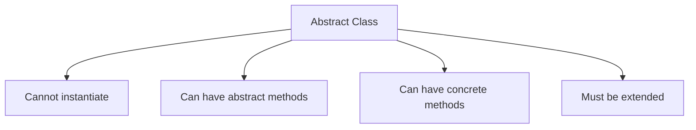
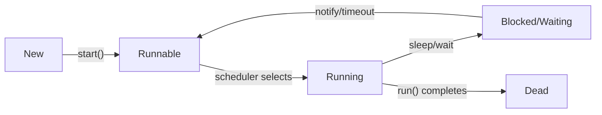
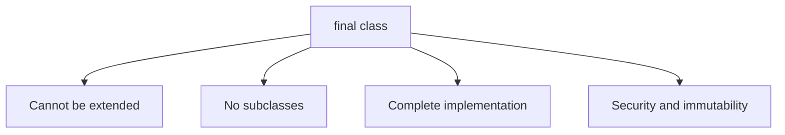
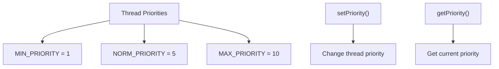
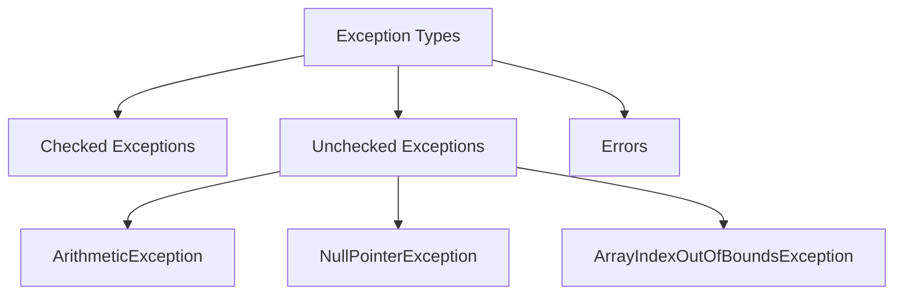

## Question 4(a): Explain abstract class with suitable example. (Marks: 03)

### Answer 4(a):

**Abstract Class**: A class that cannot be instantiated and may contain abstract methods.



**Key Features**:
* Declared with **abstract** keyword
* May contain **abstract methods** (without implementation)
* Subclasses must **implement all abstract methods**
* Can have **constructors**, **instance variables**, and **concrete methods**

**Example**:
```java
// Abstract class
abstract class Shape {
    // Abstract method - no implementation
    abstract double calculateArea();
    
    // Concrete method
    void display() {
        System.out.println("Area: " + calculateArea());
    }
}

// Concrete subclass
class Circle extends Shape {
    double radius;
    
    Circle(double radius) {
        this.radius = radius;
    }
    
    // Implementing abstract method
    @Override
    double calculateArea() {
        return Math.PI * radius * radius;
    }
}
```

**Mnemonic**: "**CPAI**" - Cannot instantiate, Partial implementation, Abstract methods, Inherited

## Question 4(b): What is Thread? Explain Thread life cycle. (Marks: 04)

### Answer 4(b):

**Thread**: A lightweight subprocess that executes a portion of a program concurrently.



**Thread Life Cycle Stages**:

1. **New**: Thread object created but not started
2. **Runnable**: Thread ready to run, waiting for CPU
3. **Running**: Thread executing in CPU
4. **Blocked/Waiting**: Thread temporarily inactive
   * **sleep()**: Forced inactive for specified time
   * **wait()**: Waiting for notification
   * **join()**: Waiting for another thread to complete
   * **I/O blocking**: Waiting for I/O operation
5. **Dead**: Thread execution completed

**Java Thread Methods**:
* **start()**: Begin thread execution
* **sleep()**: Pause thread for specified time
* **yield()**: Pause current thread to let others execute
* **join()**: Wait for another thread to complete

**Mnemonic**: "**NRWBD**" - New, Runnable, Running, Waiting/Blocked, Dead

## Question 4(c): Write a program in java that creates the multiple threads by implementing the Thread class. (Marks: 07)

### Answer 4(c):

```java
// Thread creation by implementing Runnable interface
class CounterThread implements Runnable {
    private String threadName;
    private int counter;
    
    // Constructor
    public CounterThread(String name, int count) {
        this.threadName = name;
        this.counter = count;
    }
    
    // Run method contains the thread logic
    @Override
    public void run() {
        try {
            for (int i = 1; i <= counter; i++) {
                System.out.println(threadName + ": Count " + i);
                
                // Pause for demonstration
                Thread.sleep(500);
            }
            
            System.out.println(threadName + " completed.");
        } catch (InterruptedException e) {
            System.out.println(threadName + " interrupted.");
        }
    }
}

// Main class
public class MultiThreadDemo {
    public static void main(String[] args) {
        System.out.println("Creating threads...");
        
        // Create first thread
        Thread thread1 = new Thread(new CounterThread("Thread-1", 5));
        
        // Create second thread
        Thread thread2 = new Thread(new CounterThread("Thread-2", 3));
        
        // Create third thread
        Thread thread3 = new Thread(new CounterThread("Thread-3", 4));
        
        // Start threads
        thread1.start();
        thread2.start();
        thread3.start();
        
        System.out.println("Main thread continues...");
        
        try {
            // Wait for all threads to complete
            thread1.join();
            thread2.join();
            thread3.join();
        } catch (InterruptedException e) {
            System.out.println("Main thread interrupted.");
        }
        
        System.out.println("All threads completed. Exiting main thread.");
    }
}
```

**Output** (will vary due to thread scheduling):
```
Creating threads...
Main thread continues...
Thread-1: Count 1
Thread-2: Count 1
Thread-3: Count 1
Thread-1: Count 2
Thread-2: Count 2
Thread-3: Count 2
Thread-1: Count 3
Thread-2: Count 3
Thread-3: Count 3
Thread-2 completed.
Thread-1: Count 4
Thread-3: Count 4
Thread-1: Count 5
Thread-3 completed.
Thread-1 completed.
All threads completed. Exiting main thread.
```

**Key Concepts**:
* **Runnable Interface**: Define thread behavior in run() method
* **Thread Object**: Wrapper for runnable task
* **start()**: Begin thread execution
* **join()**: Wait for thread completion
* **sleep()**: Introduce delay between operations

**Mnemonic**: "**CROSS**" - Create, Runnable, Override run(), Start threads, Sleep for delay

## Question 4(a OR): Explain final class with suitable example. (Marks: 03)

### Answer 4(a OR):

**Final Class**: A class that cannot be extended (inherited).



**Key Characteristics**:
* Declared with **final** keyword
* Cannot have **subclasses**
* Used for **security** and **immutability**
* Common examples: **String**, **Integer**, **Math** classes

**Example**:
```java
// Final class
final class SecureData {
    private String data;
    
    public SecureData(String data) {
        this.data = data;
    }
    
    public String getData() {
        return data;
    }
    
    public void display() {
        System.out.println("Secure data: " + data);
    }
}

// Attempt to extend final class - will cause compilation error
// class DataExtension extends SecureData {
//     DataExtension(String data) {
//         super(data);
//     }
// }

// Main class
public class FinalClassDemo {
    public static void main(String[] args) {
        SecureData sd = new SecureData("Confidential");
        sd.display();
    }
}
```

**Mnemonic**: "**NICE**" - No inheritance, Immutable design, Complete implementation, Enhanced security

## Question 4(b OR): Explain thread priorities with suitable example. (Marks: 04)

### Answer 4(b OR):

**Thread Priority**: A value that influences the order in which threads are scheduled for execution.



**Key Points**:
* Java thread priorities range from **1 (lowest)** to **10 (highest)**
* Default priority is **5 (normal)**
* Higher priority threads are **preferred** for execution
* Priorities are **hints to scheduler**, not guarantees
* Actual behavior depends on the **operating system**

**Example**:
```java
class PriorityThread extends Thread {
    public PriorityThread(String name) {
        super(name);
    }
    
    public void run() {
        System.out.println("Running: " + getName() + 
                           " with priority: " + getPriority());
        for (int i = 1; i <= 3; i++) {
            System.out.println(getName() + ": " + i);
            try {
                Thread.sleep(100);
            } catch (InterruptedException e) {
                System.out.println(getName() + " interrupted.");
            }
        }
        System.out.println(getName() + " finished.");
    }
}

public class ThreadPriorityDemo {
    public static void main(String[] args) {
        // Create threads
        PriorityThread low = new PriorityThread("Low Priority");
        PriorityThread norm = new PriorityThread("Normal Priority");
        PriorityThread high = new PriorityThread("High Priority");
        
        // Set priorities
        low.setPriority(Thread.MIN_PRIORITY);     // 1
        // norm uses default priority (5)
        high.setPriority(Thread.MAX_PRIORITY);    // 10
        
        // Start threads
        low.start();
        norm.start();
        high.start();
    }
}
```

**Mnemonic**: "**HOPS**" - Higher values get preference, OS dependent, Priority 1-10, Scheduling hint

## Question 4(c OR): What is Exception? Write a program that shows the use of Arithmetic Exception. (Marks: 07)

### Answer 4(c OR):

**Exception**: An event that disrupts the normal flow of program execution.



**ArithmeticException**: Thrown when an exceptional arithmetic condition occurs, like division by zero.

**Program demonstrating ArithmeticException**:

```java
import java.util.Scanner;

public class ArithmeticExceptionDemo {
    public static void main(String[] args) {
        Scanner input = new Scanner(System.in);
        
        try {
            // Get two numbers from user
            System.out.print("Enter first number: ");
            int num1 = input.nextInt();
            
            System.out.print("Enter second number: ");
            int num2 = input.nextInt();
            
            // Perform division
            System.out.println("\nPerforming division...");
            int result = divideNumbers(num1, num2);
            System.out.println(num1 + " / " + num2 + " = " + result);
            
        } catch (ArithmeticException e) {
            // Handle division by zero
            System.out.println("\nException caught: " + e.getMessage());
            System.out.println("Cannot divide by zero!");
            
        } catch (Exception e) {
            // Handle other exceptions
            System.out.println("\nError: " + e.getMessage());
            
        } finally {
            // Clean up resources
            System.out.println("\nFinally block executed.");
            input.close();
        }
        
        System.out.println("Program completed.");
    }
    
    // Method that may throw ArithmeticException
    public static int divideNumbers(int a, int b) {
        return a / b;  // Throws ArithmeticException if b is 0
    }
}
```

**Sample Output 1** (with valid input):
```
Enter first number: 10
Enter second number: 2

Performing division...
10 / 2 = 5

Finally block executed.
Program completed.
```

**Sample Output 2** (with division by zero):
```
Enter first number: 10
Enter second number: 0

Performing division...

Exception caught: / by zero
Cannot divide by zero!

Finally block executed.
Program completed.
```

**Key Exception Handling Components**:
* **try**: Contains code that might throw exceptions
* **catch**: Handles specific exceptions 
* **finally**: Always executes (for cleanup)
* **throw**: Explicitly throw an exception
* **throws**: Declare exceptions a method may throw

**Mnemonic**: "**ATCF**" - ArithmeticException, Try-catch blocks, Cleanup in finally, Flow control
