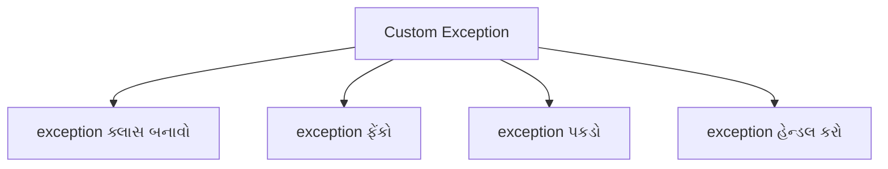
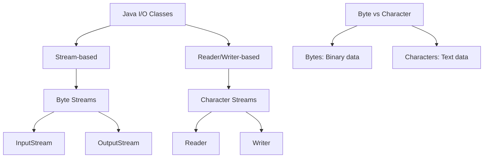
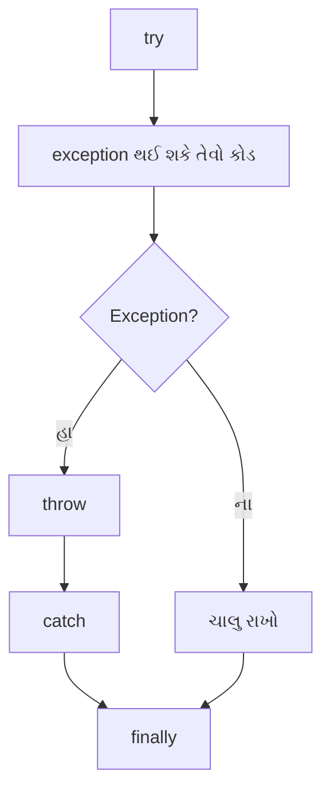

## પ્રશ્ન ૫(અ): એરેની 10 સંખ્યાઓનો સરવાળો અને સરેરાશ શોધવા માટેનો જાવા પ્રોગ્રામ લખો. (ગુણ: ૩)

### જવાબ ૫(અ):

```java
public class ArraySumAverage {
    public static void main(String[] args) {
        // એરે ડિક્લેર અને ઇનિશિયલાઇઝ કરો
        int[] numbers = {23, 45, 67, 89, 10, 12, 34, 56, 78, 90};
        
        // સરવાળા અને સરેરાશ માટે વેરિએબલ્સ
        int sum = 0;
        double average;
        
        // સરવાળો શોધો
        for (int i = 0; i < numbers.length; i++) {
            sum += numbers[i];
        }
        
        // સરેરાશ શોધો
        average = (double) sum / numbers.length;
        
        // પરિણામો પ્રદર્શિત કરો
        System.out.println("એરેના તત્વો: ");
        for (int num : numbers) {
            System.out.print(num + " ");
        }
        System.out.println("\nસરવાળો: " + sum);
        System.out.println("સરેરાશ: " + average);
    }
}
```

**આઉટપુટ**:
```
એરેના તત્વો: 
23 45 67 89 10 12 34 56 78 90 
સરવાળો: 504
સરેરાશ: 50.4
```

**યાદ રાખવા માટે**: "**SALI**" - Sum Array Loop, Initialize array, Iterate through elements

## પ્રશ્ન ૫(બ): 'Divide by Zero' એરર માટે યુઝર ડિફાઈન્ડ Exception હેન્ડલ કરવા માટે જાવા પ્રોગ્રામ લખો. (ગુણ: ૪)

### જવાબ ૫(બ):



```java
// Custom exception ક્લાસ
class DivideByZeroException extends Exception {
    public DivideByZeroException(String message) {
        super(message);
    }
}

public class CustomExceptionDemo {
    // Custom exception ફેંકતી મેથડ
    public static double divide(int a, int b) throws DivideByZeroException {
        if (b == 0) {
            throw new DivideByZeroException("શૂન્ય વડે ભાગી શકાતું નથી!");
        }
        return (double) a / b;
    }
    
    public static void main(String[] args) {
        try {
            // ટેસ્ટ કેસીસ
            System.out.println("10 / 2 = " + divide(10, 2)); // સફળ થશે
            System.out.println("10 / 0 = " + divide(10, 0)); // exception ફેંકશે
        } catch (DivideByZeroException e) {
            System.out.println("ભૂલ: " + e.getMessage());
        } finally {
            System.out.println("પ્રોગ્રામ પૂર્ણ થયો.");
        }
    }
}
```

**આઉટપુટ**:
```
10 / 2 = 5.0
ભૂલ: શૂન્ય વડે ભાગી શકાતું નથી!
પ્રોગ્રામ પૂર્ણ થયો.
```

**યાદ રાખવા માટે**: "**CETH**" - Create exception class, Extend Exception, Throw when condition met, Handle with try-catch

## પ્રશ્ન ૫(ક): ટેક્સ્ટ ફાઇલ બનાવવા માટે જાવા પ્રોગ્રામ લખો અને ટેક્સ્ટ ફાઇલ પર રીડ ઑપરેશન કરો. (ગુણ: ૭)

### જવાબ ૫(ક):


```java
import java.io.BufferedReader;
import java.io.BufferedWriter;
import java.io.FileReader;
import java.io.FileWriter;
import java.io.IOException;

public class FileReadWriteDemo {
    public static void main(String[] args) {
        // ફાઇલ નામ
        String fileName = "sample.txt";
        
        try {
            // ભાગ 1: ફાઇલ બનાવો અને લખો
            System.out.println("ફાઇલ બનાવી અને લખી રહ્યા છીએ: " + fileName);
            
            // FileWriter અને BufferedWriter બનાવો
            FileWriter fileWriter = new FileWriter(fileName);
            BufferedWriter bufferedWriter = new BufferedWriter(fileWriter);
            
            // ફાઇલમાં કન્ટેન્ટ લખો
            bufferedWriter.write("નમસ્તે, આ એક સેમ્પલ ટેક્સ્ટ ફાઇલ છે.");
            bufferedWriter.newLine();
            bufferedWriter.write("જાવા ફાઇલ I/O રસપ્રદ છે!");
            bufferedWriter.newLine();
            bufferedWriter.write("ફાઇલનો અંત.");
            
            // રાઇટર્સ બંધ કરો
            bufferedWriter.close();
            System.out.println("ફાઇલ સફળતાપૂર્વક બનાવવામાં આવી.\n");
            
            // ભાગ 2: ફાઇલમાંથી વાંચો
            System.out.println("ફાઇલમાંથી વાંચી રહ્યા છીએ: " + fileName);
            
            // FileReader અને BufferedReader બનાવો
            FileReader fileReader = new FileReader(fileName);
            BufferedReader bufferedReader = new BufferedReader(fileReader);
            
            // ફાઇલ કન્ટેન્ટ વાંચો અને પ્રદર્શિત કરો
            String line;
            System.out.println("--- ફાઇલ કન્ટેન્ટ ---");
            while ((line = bufferedReader.readLine()) != null) {
                System.out.println(line);
            }
            System.out.println("--------------------");
            
            // રીડર્સ બંધ કરો
            bufferedReader.close();
            
        } catch (IOException e) {
            System.out.println("ભૂલ: " + e.getMessage());
        }
    }
}
```

**આઉટપુટ**:
```
ફાઇલ બનાવી અને લખી રહ્યા છીએ: sample.txt
ફાઇલ સફળતાપૂર્વક બનાવવામાં આવી.

ફાઇલમાંથી વાંચી રહ્યા છીએ: sample.txt
--- ફાઇલ કન્ટેન્ટ ---
નમસ્તે, આ એક સેમ્પલ ટેક્સ્ટ ફાઇલ છે.
જાવા ફાઇલ I/O રસપ્રદ છે!
ફાઇલનો અંત.
--------------------
```

**મુખ્ય સ્ટેપ્સ**:
* **ફાઇલ બનાવો**: FileWriter/BufferedWriter વાપરો
* **કન્ટેન્ટ લખો**: write() અને newLine() મેથડ્સ વાપરો
* **રાઇટર બંધ કરો**: હંમેશા સ્ટ્રીમ્સ બંધ કરો
* **ફાઇલ વાંચો**: FileReader/BufferedReader વાપરો
* **કન્ટેન્ટ પ્રોસેસ કરો**: readLine() સાથે લાઇન બાય લાઇન વાંચો

**યાદ રાખવા માટે**: "**CROWN**" - Create file, Read content, Open streams, Write content, Nullify (close) streams

## પ્રશ્ન ૫(અ OR): Java I/O પ્રક્રિયા સમજાવો. (ગુણ: ૩)

### જવાબ ૫(અ OR):

**Java I/O Process** ઇનપુટ અને આઉટપુટ ઓપરેશન્સ હેન્ડલ કરવા માટે ક્લાસીસ પ્રદાન કરે છે.



**મુખ્ય ઘટકો**:
* **Streams**: સ્ત્રોત અને લક્ષ્ય વચ્ચે ડેટા ફ્લો
* **બે પ્રકાર**:
  * **Byte Streams**: બાઇનરી ડેટા (ઇમેજીસ, ઑડિયો) હેન્ડલ કરે છે
  * **Character Streams**: ટેક્સ્ટ ડેટા (ફાઇલ્સ, ડોક્યુમેન્ટ્સ) હેન્ડલ કરે છે
* **મૂળભૂત પ્રક્રિયા**:
  1. ડેટા સ્ત્રોત/લક્ષ્ય સાથે **કનેક્શન ખોલો**
  2. ડેટા **વાંચો/લખો**
  3. રિસોર્સીસ છોડવા માટે **કનેક્શન બંધ** કરો

**સામાન્ય ક્લાસીસ**:
* **Byte Streams**: FileInputStream, FileOutputStream
* **Character Streams**: FileReader, FileWriter
* **Buffered Operations**: BufferedReader, BufferedWriter

**યાદ રાખવા માટે**: "**IOBC**" - Input/Output, Open connection, Binary/Character streams, Close resources

## પ્રશ્ન ૫(બ OR): Exception Handling માં throw અને finally ઉદાહરણ સાથે સમજાવો. (ગુણ: ૪)

### જવાબ ૫(બ OR):

**throw**: એક્સપ્લિસિટલી exception ફેંકે છે.
**finally**: exception થાય કે ન થાય, ત્યારે પણ હંમેશા એક્ઝિક્યુટ થનારો કોડ ધરાવે છે.



**ઉદાહરણ**:
```java
public class ThrowFinallyDemo {
    public static void main(String[] args) {
        try {
            int age = -5;
            
            // ઉંમર વેલિડેટ કરો
            if (age < 0) {
                // એક્સપ્લિસિટલી exception ફેંકો
                throw new IllegalArgumentException("ઉંમર નકારાત્મક ન હોઈ શકે");
            }
            
            System.out.println("ઉંમર " + age + " છે");
            
        } catch (IllegalArgumentException e) {
            // exception હેન્ડલ કરો
            System.out.println("Exception: " + e.getMessage());
            
        } finally {
            // હંમેશા એક્ઝિક્યુટ થાય છે
            System.out.println("Finally બ્લોક એક્ઝિક્યુટ થયો");
            System.out.println("આ exception થાય કે ન થાય ચાલે છે");
        }
        
        System.out.println("પ્રોગ્રામ ચાલુ રહે છે...");
    }
}
```

**આઉટપુટ**:
```
Exception: ઉંમર નકારાત્મક ન હોઈ શકે
Finally બ્લોક એક્ઝિક્યુટ થયો
આ exception થાય કે ન થાય ચાલે છે
પ્રોગ્રામ ચાલુ રહે છે...
```

**મુખ્ય મુદ્દાઓ**:
* **throw**: નવા exception ઑબ્જેક્ટ બનાવે છે
* **finally**: ક્લીનઅપ ઓપરેશન્સ માટે વપરાય છે
* **finally** બ્લોક try/catch માં **return** સ્ટેટમેન્ટ હોય તો પણ એક્ઝિક્યુટ થાય છે

**યાદ રાખવા માટે**: "**CAFE**" - Create exception, Always execute finally, Finish cleanup, Exception propagation

## પ્રશ્ન ૫(ક OR): ટેક્સ્ટ ફાઇલ ના કન્ટેન્ટ ડિસ્પ્લે કરવા અને ટેક્સ્ટ ફાઇલ પર એપેન્ડ ઓપરેશન કરવા માટે જાવા પ્રોગ્રામ લખો. (ગુણ: ૭)

### જવાબ ૫(ક OR):


```java
import java.io.BufferedReader;
import java.io.BufferedWriter;
import java.io.FileReader;
import java.io.FileWriter;
import java.io.IOException;

public class FileAppendDemo {
    public static void main(String[] args) {
        // ફાઇલ નામ
        String fileName = "sample.txt";
        String appendData = "\nઆ લાઇન પછીથી ઉમેરવામાં આવી હતી.";
        
        try {
            // ભાગ 1: જો ફાઇલ ન હોય તો બનાવો
            boolean fileExists = true;
            try {
                FileReader testReader = new FileReader(fileName);
                testReader.close();
            } catch (IOException e) {
                fileExists = false;
                // પ્રારંભિક કન્ટેન્ટ સાથે ફાઇલ બનાવો
                FileWriter writer = new FileWriter(fileName);
                writer.write("આ એક સેમ્પલ ફાઇલ છે.\nતેમાં થોડો ટેક્સ્ટ છે.");
                writer.close();
                System.out.println("પ્રારંભિક કન્ટેન્ટ સાથે ફાઇલ બનાવી.");
            }
            
            // ભાગ 2: મૂળ કન્ટેન્ટ વાંચો અને ડિસ્પ્લે
            System.out.println("\nમૂળ ફાઇલ કન્ટેન્ટ:");
            System.out.println("---------------------");
            displayFileContent(fileName);
            
            // ભાગ 3: ફાઇલમાં એપેન્ડ
            System.out.println("\nફાઇલમાં એપેન્ડ કરી રહ્યા છીએ...");
            FileWriter fileWriter = new FileWriter(fileName, true); // true = append મોડ
            BufferedWriter bufferedWriter = new BufferedWriter(fileWriter);
            
            bufferedWriter.write(appendData);
            bufferedWriter.close();
            System.out.println("કન્ટેન્ટ સફળતાપૂર્વક એપેન્ડ થયું.");
            
            // ભાગ 4: અપડેટેડ કન્ટેન્ટ વાંચો અને ડિસ્પ્લે
            System.out.println("\nઅપડેટેડ ફાઇલ કન્ટેન્ટ:");
            System.out.println("---------------------");
            displayFileContent(fileName);
            
        } catch (IOException e) {
            System.out.println("ભૂલ: " + e.getMessage());
        }
    }
    
    // ફાઇલ કન્ટેન્ટ વાંચવા અને ડિસ્પ્લે કરવા માટેની મેથડ
    public static void displayFileContent(String fileName) throws IOException {
        FileReader fileReader = new FileReader(fileName);
        BufferedReader bufferedReader = new BufferedReader(fileReader);
        
        String line;
        while ((line = bufferedReader.readLine()) != null) {
            System.out.println(line);
        }
        
        bufferedReader.close();
    }
}
```

**આઉટપુટ** (જો ફાઇલ પહેલેથી ન હોય):
```
પ્રારંભિક કન્ટેન્ટ સાથે ફાઇલ બનાવી.

મૂળ ફાઇલ કન્ટેન્ટ:
---------------------
આ એક સેમ્પલ ફાઇલ છે.
તેમાં થોડો ટેક્સ્ટ છે.

ફાઇલમાં એપેન્ડ કરી રહ્યા છીએ...
કન્ટેન્ટ સફળતાપૂર્વક એપેન્ડ થયું.

અપડેટેડ ફાઇલ કન્ટેન્ટ:
---------------------
આ એક સેમ્પલ ફાઇલ છે.
તેમાં થોડો ટેક્સ્ટ છે.
આ લાઇન પછીથી ઉમેરવામાં આવી હતી.
```

**મુખ્ય મુદ્દાઓ**:
* **Append મોડ**: `FileWriter(fileName, true)` નો ઉપયોગ કરો
* **ફાઇલ વાંચો**: BufferedReader સાથે readLine() વાપરો
* **અલગ મેથડ બનાવો**: કોડ રીયુઝ માટે
* **યોગ્ય એરર હેન્ડલિંગ**: try-catch બ્લોક્સ વાપરો
* **રિસોર્સીસ બંધ કરો**: હંમેશા સ્ટ્રીમ્સ બંધ કરો

**યાદ રાખવા માટે**: "**ARCS**" - Append mode, Read content, Close resources, Separate concerns