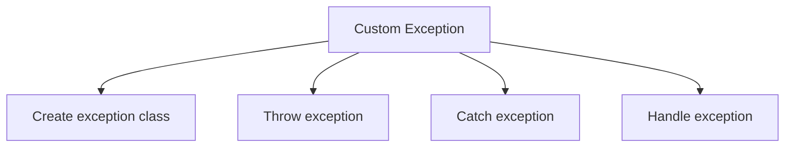
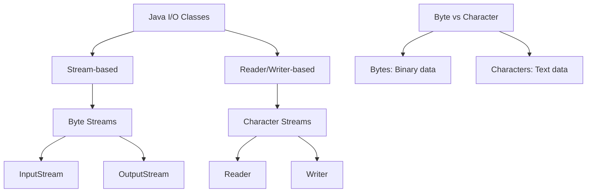
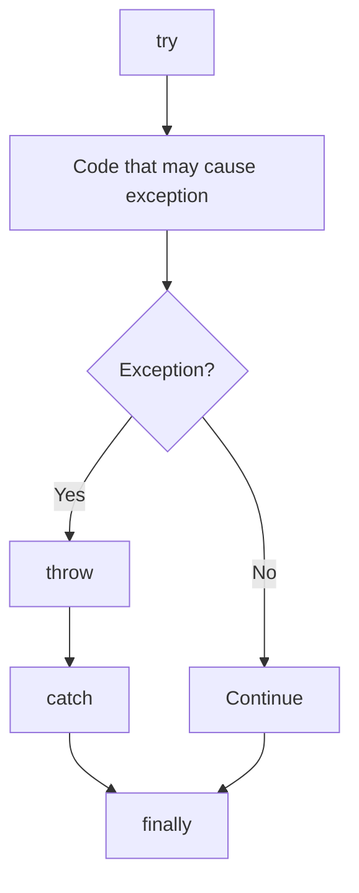

## Question 5(a): Write a Java Program to find sum and average of 10 numbers of an array. (Marks: 03)

### Answer 5(a):

```java
public class ArraySumAverage {
    public static void main(String[] args) {
        // Declare and initialize array
        int[] numbers = {23, 45, 67, 89, 10, 12, 34, 56, 78, 90};
        
        // Variables for sum and average
        int sum = 0;
        double average;
        
        // Calculate sum
        for (int i = 0; i < numbers.length; i++) {
            sum += numbers[i];
        }
        
        // Calculate average
        average = (double) sum / numbers.length;
        
        // Display results
        System.out.println("Array elements: ");
        for (int num : numbers) {
            System.out.print(num + " ");
        }
        System.out.println("\nSum: " + sum);
        System.out.println("Average: " + average);
    }
}
```

**Output**:
```
Array elements: 
23 45 67 89 10 12 34 56 78 90 
Sum: 504
Average: 50.4
```

**Mnemonic**: "**SALI**" - Sum Array Loop, Initialize array, Iterate through elements

## Question 5(b): Write a Java program to handle user defined exception for 'Divide by Zero' error. (Marks: 04)

### Answer 5(b):



```java
// Custom exception class
class DivideByZeroException extends Exception {
    public DivideByZeroException(String message) {
        super(message);
    }
}

public class CustomExceptionDemo {
    // Method that throws custom exception
    public static double divide(int a, int b) throws DivideByZeroException {
        if (b == 0) {
            throw new DivideByZeroException("Cannot divide by zero!");
        }
        return (double) a / b;
    }
    
    public static void main(String[] args) {
        try {
            // Test cases
            System.out.println("10 / 2 = " + divide(10, 2)); // Works fine
            System.out.println("10 / 0 = " + divide(10, 0)); // Throws exception
        } catch (DivideByZeroException e) {
            System.out.println("Error: " + e.getMessage());
        } finally {
            System.out.println("Program completed.");
        }
    }
}
```

**Output**:
```
10 / 2 = 5.0
Error: Cannot divide by zero!
Program completed.
```

**Mnemonic**: "**CETH**" - Create exception class, Extend Exception, Throw when condition met, Handle with try-catch

## Question 5(c): Write a java program to create a text file and perform read operation on the text file. (Marks: 07)

### Answer 5(c):


```java
import java.io.BufferedReader;
import java.io.BufferedWriter;
import java.io.FileReader;
import java.io.FileWriter;
import java.io.IOException;

public class FileReadWriteDemo {
    public static void main(String[] args) {
        // File name
        String fileName = "sample.txt";
        
        try {
            // PART 1: CREATE AND WRITE TO FILE
            System.out.println("Creating and writing to file: " + fileName);
            
            // Create FileWriter and BufferedWriter
            FileWriter fileWriter = new FileWriter(fileName);
            BufferedWriter bufferedWriter = new BufferedWriter(fileWriter);
            
            // Write content to file
            bufferedWriter.write("Hello, this is a sample text file.");
            bufferedWriter.newLine();
            bufferedWriter.write("Java File I/O is interesting!");
            bufferedWriter.newLine();
            bufferedWriter.write("End of file.");
            
            // Close writers
            bufferedWriter.close();
            System.out.println("File created successfully.\n");
            
            // PART 2: READ FROM FILE
            System.out.println("Reading from file: " + fileName);
            
            // Create FileReader and BufferedReader
            FileReader fileReader = new FileReader(fileName);
            BufferedReader bufferedReader = new BufferedReader(fileReader);
            
            // Read and display file content
            String line;
            System.out.println("--- File Content ---");
            while ((line = bufferedReader.readLine()) != null) {
                System.out.println(line);
            }
            System.out.println("--------------------");
            
            // Close readers
            bufferedReader.close();
            
        } catch (IOException e) {
            System.out.println("Error: " + e.getMessage());
        }
    }
}
```

**Output**:
```
Creating and writing to file: sample.txt
File created successfully.

Reading from file: sample.txt
--- File Content ---
Hello, this is a sample text file.
Java File I/O is interesting!
End of file.
--------------------
```

**Key Steps**:
* **Create file**: Use FileWriter/BufferedWriter
* **Write content**: Use write() and newLine() methods
* **Close writer**: Always close streams
* **Read file**: Use FileReader/BufferedReader
* **Process content**: Read line by line with readLine()

**Mnemonic**: "**CROWN**" - Create file, Read content, Open streams, Write content, Nullify (close) streams

## Question 5(a OR): Explain java I/O process. (Marks: 03)

### Answer 5(a OR):

**Java I/O Process** provides classes to handle input and output operations.



**Key Components**:
* **Streams**: Sequence of data flow between source and destination
* **Two Types**:
  * **Byte Streams**: Handle binary data (images, audio)
  * **Character Streams**: Handle text data (files, documents)
* **Basic Process**:
  1. **Open** connection to data source/destination
  2. **Read/Write** data
  3. **Close** connection to release resources

**Common Classes**:
* **Byte Streams**: FileInputStream, FileOutputStream
* **Character Streams**: FileReader, FileWriter
* **Buffered Operations**: BufferedReader, BufferedWriter

**Mnemonic**: "**IOBC**" - Input/Output, Open connection, Binary/Character streams, Close resources

## Question 5(b OR): Explain throw and finally in Exception Handling with example. (Marks: 04)

### Answer 5(b OR):

**throw**: Explicitly throws an exception.
**finally**: Contains code that always executes regardless of exception.



**Example**:
```java
public class ThrowFinallyDemo {
    public static void main(String[] args) {
        try {
            int age = -5;
            
            // Validate age
            if (age < 0) {
                // Explicitly throw exception
                throw new IllegalArgumentException("Age cannot be negative");
            }
            
            System.out.println("Age is " + age);
            
        } catch (IllegalArgumentException e) {
            // Handle the exception
            System.out.println("Exception: " + e.getMessage());
            
        } finally {
            // Always executes
            System.out.println("Finally block executed");
            System.out.println("This runs whether exception occurs or not");
        }
        
        System.out.println("Program continues...");
    }
}
```

**Output**:
```
Exception: Age cannot be negative
Finally block executed
This runs whether exception occurs or not
Program continues...
```

**Key Points**:
* **throw**: Creates a new exception object
* **finally**: Used for cleanup operations
* **finally** block executes even if **return** statement exists in try/catch

**Mnemonic**: "**CAFE**" - Create exception, Always execute finally, Finish cleanup, Exception propagation

## Question 5(c OR): Write a java program to display the content of a text file and perform append operation on the text file. (Marks: 07)

### Answer 5(c OR):


```java
import java.io.BufferedReader;
import java.io.BufferedWriter;
import java.io.FileReader;
import java.io.FileWriter;
import java.io.IOException;

public class FileAppendDemo {
    public static void main(String[] args) {
        // File name
        String fileName = "sample.txt";
        String appendData = "\nThis line was appended later.";
        
        try {
            // PART 1: CREATE FILE IF IT DOESN'T EXIST
            boolean fileExists = true;
            try {
                FileReader testReader = new FileReader(fileName);
                testReader.close();
            } catch (IOException e) {
                fileExists = false;
                // Create file with initial content
                FileWriter writer = new FileWriter(fileName);
                writer.write("This is a sample file.\nIt contains some text.");
                writer.close();
                System.out.println("File created with initial content.");
            }
            
            // PART 2: READ AND DISPLAY ORIGINAL CONTENT
            System.out.println("\nOriginal file content:");
            System.out.println("---------------------");
            displayFileContent(fileName);
            
            // PART 3: APPEND TO FILE
            System.out.println("\nAppending to file...");
            FileWriter fileWriter = new FileWriter(fileName, true); // true = append mode
            BufferedWriter bufferedWriter = new BufferedWriter(fileWriter);
            
            bufferedWriter.write(appendData);
            bufferedWriter.close();
            System.out.println("Content appended successfully.");
            
            // PART 4: READ AND DISPLAY UPDATED CONTENT
            System.out.println("\nUpdated file content:");
            System.out.println("---------------------");
            displayFileContent(fileName);
            
        } catch (IOException e) {
            System.out.println("Error: " + e.getMessage());
        }
    }
    
    // Method to read and display file content
    public static void displayFileContent(String fileName) throws IOException {
        FileReader fileReader = new FileReader(fileName);
        BufferedReader bufferedReader = new BufferedReader(fileReader);
        
        String line;
        while ((line = bufferedReader.readLine()) != null) {
            System.out.println(line);
        }
        
        bufferedReader.close();
    }
}
```

**Output** (if file didn't exist previously):
```
File created with initial content.

Original file content:
---------------------
This is a sample file.
It contains some text.

Appending to file...
Content appended successfully.

Updated file content:
---------------------
This is a sample file.
It contains some text.
This line was appended later.
```

**Key Points**:
* **Append mode**: Use `FileWriter(fileName, true)`
* **Read file**: Use BufferedReader with readLine()
* **Create separate method**: For code reuse
* **Proper error handling**: Use try-catch blocks
* **Close resources**: Always close streams

**Mnemonic**: "**ARCS**" - Append mode, Read content, Close resources, Separate concerns
