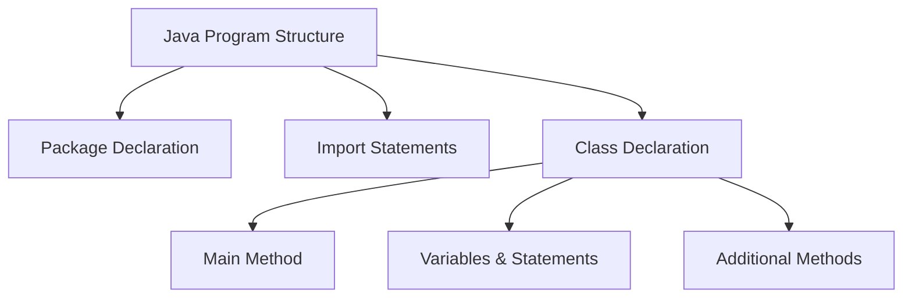
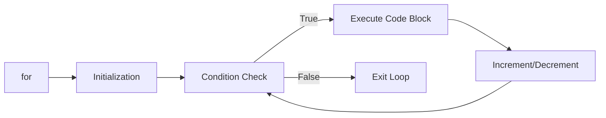

## પ્રશ્ન 1(a): જાવામાં વિવિધ પ્રિમિટિવ ડેટા ટાઇપ્સની યાદી બનાવો. (ગુણ: 03)

### જવાબ 1(a):

જાવામાં 8 પ્રિમિટિવ ડેટા ટાઇપ્સ છે:

| ડેટા ટાઇપ | સાઇઝ | વર્ણન |
|-----------|------|-------------|
| **byte** | 1 byte | -128 થી 127 સુધીના પૂર્ણાંક સંગ્રહ કરે છે |
| **short** | 2 bytes | -32,768 થી 32,767 સુધીના પૂર્ણાંક સંગ્રહ કરે છે |
| **int** | 4 bytes | -2³¹ થી 2³¹-1 સુધીના પૂર્ણાંક સંગ્રહ કરે છે |
| **long** | 8 bytes | -2⁶³ થી 2⁶³-1 સુધીના પૂર્ણાંક સંગ્રહ કરે છે |
| **float** | 4 bytes | 6-7 દશાંશ અંકો સાથે અપૂર્ણાંક સંખ્યાઓ સંગ્રહ કરે છે |
| **double** | 8 bytes | 15 દશાંશ અંકો સાથે અપૂર્ણાંક સંખ્યાઓ સંગ્રહ કરે છે |
| **boolean** | 1 bit | true અથવા false કિંમતો સંગ્રહ કરે છે |
| **char** | 2 bytes | એકલ અક્ષર/કેરેક્ટર અથવા ASCII કિંમત સંગ્રહ કરે છે |

**યાદ રાખવા માટેની ટ્રિક**: "**I See Bears Drinking Chocolate Foam Latte**" (Int, Char, Boolean, Double, Character, Float, Long)

## પ્રશ્ન 1(b): યોગ્ય ઉદાહરણ સાથે જાવા પ્રોગ્રામનું માળખું સમજાવો. (ગુણ: 04)

### જવાબ 1(b):

જાવા પ્રોગ્રામનું માળખું કેટલાક મુખ્ય ઘટકોથી બનેલું છે:



```java
// 1. Package Declaration (વૈકલ્પિક)
package com.example;

// 2. Import Statements (વૈકલ્પિક)
import java.util.Scanner;

// 3. Class Declaration (આવશ્યક)
public class HelloWorld {
    
    // 4. Main Method (એક્ઝિક્યુટેબલ પ્રોગ્રામ માટે આવશ્યક)
    public static void main(String[] args) {
        
        // 5. Variables, Statements, અને Expressions
        String message = "Hello, World!";
        System.out.println(message);
        
    } // End of main method
    
    // 6. Additional Methods (વૈકલ્પિક)
    public static void greet() {
        System.out.println("Welcome!");
    }
    
} // End of class
```

**મુખ્ય ઘટકો**:
* **Package Declaration**: સંબંધિત ક્લાસને વ્યવસ્થિત કરે છે
* **Import Statements**: અન્ય પેકેજમાંથી ક્લાસનો ઉપયોગ કરે છે
* **Class Declaration**: બધા કોડ ધરાવે છે અને ઓબ્જેક્ટના ગુણધર્મો નિર્ધારિત કરે છે
* **Main Method**: પ્રોગ્રામનો શરૂઆતનો બિંદુ (ચોક્કસ જ બતાવ્યા મુજબ હોવો જોઈએ)
* **Statements**: વ્યક્તિગત સૂચનાઓ
* **Methods**: ચોક્કસ કાર્યક્ષમતા સાથે ફરીથી ઉપયોગ કરી શકાય તેવા કોડ બ્લોક્સ

**યાદ રાખવા માટેની ટ્રિક**: "**PICSM**" - Package, Imports, Class, Statements, Methods

## પ્રશ્ન 1(c): જાવામાં એરિથમેટિક ઓપરેટર્સની યાદી બનાવો. કોઈપણ ત્રણ એરિથમેટિક ઓપરેટર્સનો ઉપયોગ કરીને એક જાવા પ્રોગ્રામ બનાવો અને પ્રોગ્રામનું આઉટપુટ બતાવો. (ગુણ: 07)

### જવાબ 1(c):

#### જાવામાં એરિથમેટિક ઓપરેટર્સ:
| ઓપરેટર | વર્ણન | ઉદાહરણ |
|----------|-------------|---------|
| **+** | સરવાળો | a + b |
| **-** | બાદબાકી | a - b |
| **\*** | ગુણાકાર | a * b |
| **/** | ભાગાકાર | a / b |
| **%** | મોડ્યુલસ (બાકી) | a % b |
| **++** | ઇન્ક્રિમેન્ટ | a++ અથવા ++a |
| **--** | ડિક્રિમેન્ટ | a-- અથવા --a |

**યાદ રાખવા માટેની ટ્રિક**: "**MASID++**" (Multiply, Add, Subtract, Increment, Decrement, Divide, Modulus)

#### ત્રણ એરિથમેટિક ઓપરેટર્સનો ઉપયોગ કરતો જાવા પ્રોગ્રામ:

```java
public class ArithmeticDemo {
    public static void main(String[] args) {
        // વેરિએબલ્સ ડિક્લેર કરો
        int num1 = 20;
        int num2 = 5;
        int result1, result2, result3;
        
        // ત્રણ એરિથમેટિક ઓપરેટર્સનો ઉપયોગ
        result1 = num1 + num2;  // સરવાળો
        result2 = num1 - num2;  // બાદબાકી
        result3 = num1 * num2;  // ગુણાકાર
        
        // આઉટપુટ દર્શાવો
        System.out.println("પ્રથમ સંખ્યા: " + num1);
        System.out.println("બીજી સંખ્યા: " + num2);
        System.out.println("સરવાળો: " + result1);       // આઉટપુટ: 25
        System.out.println("બાદબાકી: " + result2);    // આઉટપુટ: 15
        System.out.println("ગુણાકાર: " + result3); // આઉટપુટ: 100
    }
}
```

## પ્રશ્ન 1(c OR): જાવા for લૂપ સ્ટેટમેન્ટનો સિન્ટેક્સ લખો. 1 થી 10 સુધીના પ્રાઇમ નંબર શોધવા માટે એક જાવા પ્રોગ્રામ બનાવો. (ગુણ: 07)

### જવાબ 1(c OR):

#### જાવા for લૂપનો સિન્ટેક્સ:



```java
for (initialization; condition; increment/decrement) {
    // કોડ જે execute થશે
}
```

**મુખ્ય ભાગો**:
* **Initialization**: શરૂઆતમાં એક વખત execute થાય છે
* **Condition**: દરેક iteration પહેલાં ચેક થાય છે
* **Increment/Decrement**: દરેક iteration પછી execute થાય છે

#### 1 થી 10 સુધીના પ્રાઇમ નંબર શોધવા માટેનો જાવા પ્રોગ્રામ:

```java
public class PrimeNumbers {
    public static void main(String[] args) {
        System.out.println("1 થી 10 સુધીના પ્રાઇમ નંબર:");
        
        // આઉટર લૂપ - 1 થી 10 સુધીની દરેક સંખ્યા ચેક કરો
        for (int num = 1; num <= 10; num++) {
            boolean isPrime = true;
            
            // 1 ને સ્કિપ કરો કારણ કે તે પ્રાઇમ નંબર નથી
            if (num == 1) {
                isPrime = false;
            }
            
            // ઇનર લૂપ - કોઈપણ સંખ્યાથી ભાગી શકાય છે કે નહીં તપાસો
            for (int i = 2; i < num; i++) {
                if (num % i == 0) {
                    isPrime = false;
                    break;
                }
            }
            
            // જો પ્રાઇમ હોય તો પ્રિન્ટ કરો
            if (isPrime) {
                System.out.print(num + " ");
            }
        }
        // આઉટપુટ: 2 3 5 7
    }
}
```

**પ્રાઇમ નંબર માટે યાદ રાખવાની ટ્રિક**: "**2357**" - આ 1 અને 10 વચ્ચેના પ્રાઇમ નંબર છે
