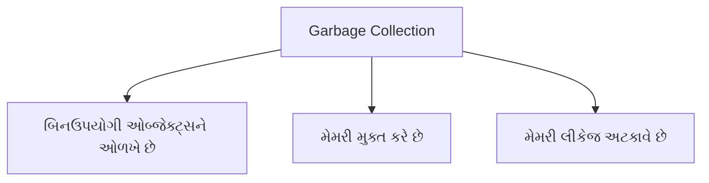
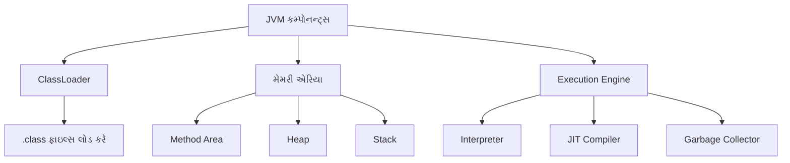

## પ્રશ્ન ૧(અ): જાવામાં Garbage collection સમજાવો. (ગુણ: ૩)

### જવાબ ૧(અ):

**Garbage Collection** જાવામાં ઓટોમેટિક મેમરી મેનેજમેન્ટની પ્રક્રિયા છે:



* **ઉદ્દેશ**: સ્વયંસંચાલિત રીતે **મેમરીમાંથી બિનઉપયોગી ઓબ્જેક્ટ્સ** દૂર કરવા
* **કાર્ય**: 
  * JVM **જે ઓબ્જેક્ટ્સ અસક્રિય** છે તે શોધે છે (કોઈ રેફરન્સ નથી)
  * **મેમરી મુક્ત** કરે છે અને હીપ પર પાછી આપે છે
  * મેન્યુઅલ **મેમરી મેનેજમેન્ટની જરૂરિયાત** ઘટાડે છે
* JVM કાર્યક્ષમતાનો **મહત્વપૂર્ણ ભાગ** છે

**યાદ રાખવા માટે**: "**RUN**" - Reclaim memory, Unused objects, No manual deallocation

## પ્રશ્ન ૧(બ): JVM વિગતવાર સમજાવો. (ગુણ: ૪)

### જવાબ ૧(બ):

**JVM (Java Virtual Machine)** જાવા પ્રોગ્રામ ચલાવવા માટેનું વર્ચ્યુઅલ મશીન છે:



**મુખ્ય કમ્પોનન્ટ્સ**:
* **ClassLoader**: `.class` ફાઇલ્સને લોડ અને વેરિફાય કરે છે
* **મેમરી એરિયા**:
  * **Method Area**: ક્લાસ ડેટા અને સ્ટેટિક વેરિએબલ્સ રાખે છે
  * **Heap**: ઓબ્જેક્ટ્સ સ્ટોર કરે છે, Garbage Collection થાય છે
  * **Stack**: મેથડ કોલ્સ અને લોકલ વેરિએબલ્સ રાખે છે
* **Execution Engine**:
  * **Interpreter**: બાઇટકોડને લાઇન-બાય-લાઇન એક્ઝિક્યુટ કરે છે
  * **JIT Compiler**: વારંવાર વપરાતા કોડને ઓપ્ટિમાઇઝ કરે છે
  * **Garbage Collector**: અનયુઝ્ડ મેમરી ફ્રી કરે છે

**JVM ની મુખ્ય વિશેષતાઓ**:
* **પોર્ટેબિલિટી**: "Write Once, Run Anywhere" ફિલોસોફી
* **સિક્યોરિટી**: સેન્ડબોક્સ એન્વાયર્નમેન્ટમાં કોડ ચલાવે છે
* **ઓટોમેટિક મેમરી મેનેજમેન્ટ**: Garbage Collection દ્વારા

**યાદ રાખવા માટે**: "**CEPS**" - ClassLoader, Execution Engine, Portability, Security

## પ્રશ્ન ૧(ક): Fibonacci series પ્રિન્ટ કરવા માટેનો જાવા પ્રોગ્રામ લખો. (ગુણ: ૭)

### જવાબ ૧(ક):

Fibonacci series એવી સીક્વન્સ છે જેમાં દરેક નંબર તેના અગાઉના બે નંબરના સરવાળા બરાબર હોય છે (0, 1, 1, 2, 3, 5, 8, ...).


**પ્રોગ્રામ**:
```java
import java.util.Scanner;

public class FibonacciSeries {
    public static void main(String[] args) {
        // સ્કેનર ઓબ્જેક્ટ બનાવવો
        Scanner input = new Scanner(System.in);
        
        // યુઝર પાસેથી ટર્મ્સની સંખ્યા માંગવી
        System.out.print("ટર્મ્સની સંખ્યા દાખલ કરો: ");
        int n = input.nextInt();
        
        // પ્રથમ બે ટર્મ્સ ઇનિશિયલાઇઝ કરવા
        int firstTerm = 0;
        int secondTerm = 1;
        
        System.out.println(n + " ટર્મ્સ માટે Fibonacci series:");
        
        // પ્રથમ ટર્મ માટે કેસ હેન્ડલ કરવો
        if (n >= 1) {
            System.out.print(firstTerm + " ");
        }
        
        // બીજા ટર્મ માટે કેસ હેન્ડલ કરવો
        if (n >= 2) {
            System.out.print(secondTerm + " ");
        }
        
        // બાકીના ટર્મ્સ ગણવા
        for (int i = 3; i <= n; i++) {
            int nextTerm = firstTerm + secondTerm;
            System.out.print(nextTerm + " ");
            
            // આગલા ઇટરેશન માટે વેલ્યુઝ અપડેટ કરવી
            firstTerm = secondTerm;
            secondTerm = nextTerm;
        }
        
        // સ્કેનર બંધ કરવું
        input.close();
    }
}
```

**આઉટપુટ (જો ન=7 ની વેલ્યુ આપો):**
```
ટર્મ્સની સંખ્યા દાખલ કરો: 7
7 ટર્મ્સ માટે Fibonacci series:
0 1 1 2 3 5 8
```

**મુખ્ય પોઇન્ટ્સ**:
* **ઇનપુટ લેવું**: Scanner ક્લાસનો ઉપયોગ કરીને
* **પ્રથમ બે ટર્મ્સ**: 0 અને 1 ની ડિફોલ્ટ વેલ્યુ આપવી
* **નવા ટર્મ્સ ગણવા**: અગાઉના બે નંબરનો સરવાળો કરવો
* **સ્પેશિયલ કેસ**: ન=1 અને ન=2 માટે અલગથી હેન્ડલિંગ કરવું
* **વેરિએબલ્સ અપડેટ**: દરેક સ્ટેપમાં અપડેટિંગ કરવું

**યાદ રાખવા માટે**: "**ISUM**" - Input, Special cases, Update variables, Main loop

## પ્રશ્ન ૧(ક OR): કમાન્ડ લાઇન arguments નો ઉપયોગ કરીને કોઈપણ દસ સંખ્યાઓ માંથી ન્યૂનતમ શોધવા માટે જાવા પ્રોગ્રામ લખો. (ગુણ: ૭)

### જવાબ ૧(ક OR):

કમાન્ડ લાઇન આર્ગ્યુમેન્ટ્સ પ્રોગ્રામ રન કરતી વખતે પાસ કરવામાં આવતા પેરામીટર્સ છે.


**પ્રોગ્રામ**:
```java
public class MinimumFinder {
    public static void main(String[] args) {
        // આર્ગ્યુમેન્ટ્સની સંખ્યા ચેક કરવી
        if (args.length != 10) {
            System.out.println("ભૂલ: ચોક્કસ 10 નંબર્સ આપવા જોઈએ.");
            System.out.println("ઉદાહરણ: java MinimumFinder 45 12 67 89 23 5 78 90 34 56");
            return;
        }
        
        try {
            // પ્રથમ નંબરથી મિનિમમ શરૂ કરવું
            int min = Integer.parseInt(args[0]);
            
            // બધા નંબર્સ પ્રિન્ટ કરવા
            System.out.println("આપેલા નંબર્સ:");
            for (String numStr : args) {
                System.out.print(numStr + " ");
                
                // અત્યારનો નંબર પાર્સ કરવો
                int currentNum = Integer.parseInt(numStr);
                
                // મિનિમમ અપડેટ કરવું જો નવો નંબર નાનો હોય
                if (currentNum < min) {
                    min = currentNum;
                }
            }
            
            // પરિણામ પ્રિન્ટ કરવું
            System.out.println("\nન્યૂનતમ મૂલ્ય: " + min);
            
        } catch (NumberFormatException e) {
            System.out.println("ભૂલ: માન્ય નંબર્સ દાખલ કરો.");
        }
    }
}
```

**કમાન્ડ લાઇન પર પ્રોગ્રામ રન કરવું**:
```
java MinimumFinder 45 12 67 89 23 5 78 90 34 56
```

**આઉટપુટ**:
```
આપેલા નંબર્સ:
45 12 67 89 23 5 78 90 34 56 
ન્યૂનતમ મૂલ્ય: 5
```

**મુખ્ય પોઇન્ટ્સ**:
* **Command-line આર્ગ્યુમેન્ટ્સ**: args[] એરેમાં સ્ટોર થાય છે
* **આર્ગ્યુમેન્ટ્સને પાર્સ કરવા**: Integer.parseInt() નો ઉપયોગ કરવો
* **વેલિડેશન**: આર્ગ્યુમેન્ટ્સની સંખ્યા અને ફોર્મેટ ચેક કરવું
* **ન્યૂનતમ શોધવું**: મૂલ્યોની સરખામણી કરી શોધવું
* **Exception હેન્ડલિંગ**: NumberFormatException ને હેન્ડલ કરવું

**યાદ રાખવા માટે**: "**CPVME**" - Command-line, Parse to numbers, Validation, Minimum finding, Error handling