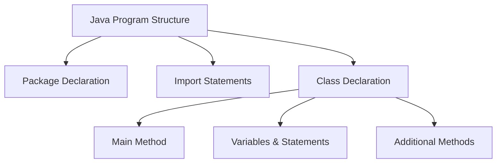
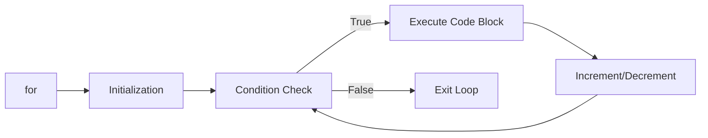

## Question 1(a): List out various Primitive data types in Java. (Marks: 03)

### Answer 1(a):

Java has 8 primitive data types:

| Data Type | Size | Description |
|-----------|------|-------------|
| **byte** | 1 byte | Stores whole numbers from -128 to 127 |
| **short** | 2 bytes | Stores whole numbers from -32,768 to 32,767 |
| **int** | 4 bytes | Stores whole numbers from -2³¹ to 2³¹-1 |
| **long** | 8 bytes | Stores whole numbers from -2⁶³ to 2⁶³-1 |
| **float** | 4 bytes | Stores fractional numbers with 6-7 decimal digits |
| **double** | 8 bytes | Stores fractional numbers with 15 decimal digits |
| **boolean** | 1 bit | Stores true or false values |
| **char** | 2 bytes | Stores a single character/letter or ASCII value |

**Mnemonic**: "**I See Bears Drinking Chocolate Foam Latte**" (Int, Char, Boolean, Double, Character, Float, Long)

## Question 1(b): Explain Structure of Java Program with suitable example. (Marks: 04)

### Answer 1(b):

The structure of a Java program consists of several key components:



```java
// 1. Package Declaration (Optional)
package com.example;

// 2. Import Statements (Optional)
import java.util.Scanner;

// 3. Class Declaration (Required)
public class HelloWorld {
    
    // 4. Main Method (Required for executable programs)
    public static void main(String[] args) {
        
        // 5. Variables, Statements, and Expressions
        String message = "Hello, World!";
        System.out.println(message);
        
    } // End of main method
    
    // 6. Additional Methods (Optional)
    public static void greet() {
        System.out.println("Welcome!");
    }
    
} // End of class
```

**Key Components**:
* **Package Declaration**: Organizes related classes
* **Import Statements**: Access classes from other packages
* **Class Declaration**: Contains all code and defines object properties
* **Main Method**: Entry point of execution (must be exactly as shown)
* **Statements**: Individual instructions
* **Methods**: Reusable blocks of code with specific functionality

**Mnemonic**: "**PICSM**" - Package, Imports, Class, Statements, Methods

## Question 1(c): List arithmetic operators in Java. Develop a Java program using any three arithmetic operators and show the output of program. (Marks: 07)

### Answer 1(c):

#### Arithmetic Operators in Java:
| Operator | Description | Example |
|----------|-------------|---------|
| **+** | Addition | a + b |
| **-** | Subtraction | a - b |
| **\*** | Multiplication | a * b |
| **/** | Division | a / b |
| **%** | Modulus (Remainder) | a % b |
| **++** | Increment | a++ or ++a |
| **--** | Decrement | a-- or --a |

**Mnemonic**: "**MASID++**" (Multiply, Add, Subtract, Increment, Decrement, Divide, Modulus)

#### Java Program using Three Arithmetic Operators:

```java
public class ArithmeticDemo {
    public static void main(String[] args) {
        // Declare variables
        int num1 = 20;
        int num2 = 5;
        int result1, result2, result3;
        
        // Using three arithmetic operators
        result1 = num1 + num2;  // Addition
        result2 = num1 - num2;  // Subtraction
        result3 = num1 * num2;  // Multiplication
        
        // Display output
        System.out.println("Number 1: " + num1);
        System.out.println("Number 2: " + num2);
        System.out.println("Addition: " + result1);       // Output: 25
        System.out.println("Subtraction: " + result2);    // Output: 15
        System.out.println("Multiplication: " + result3); // Output: 100
    }
}
```

## Question 1(c OR): Write syntax of Java for loop statement. Develop a Java program to find out prime number between 1 to 10. (Marks: 07)

### Answer 1(c OR):

#### Java for Loop Syntax:



```java
for (initialization; condition; increment/decrement) {
    // code to be executed
}
```

**Key Parts**:
* **Initialization**: Executes once at the beginning
* **Condition**: Checked before each iteration
* **Increment/Decrement**: Executes after each iteration

#### Java Program to Find Prime Numbers between 1 to 10:

```java
public class PrimeNumbers {
    public static void main(String[] args) {
        System.out.println("Prime Numbers between 1 and 10:");
        
        // Outer loop - check each number from 1 to 10
        for (int num = 1; num <= 10; num++) {
            boolean isPrime = true;
            
            // Skip 1 as it's not a prime number
            if (num == 1) {
                isPrime = false;
            }
            
            // Inner loop - check if divisible by any number
            for (int i = 2; i < num; i++) {
                if (num % i == 0) {
                    isPrime = false;
                    break;
                }
            }
            
            // Print if prime
            if (isPrime) {
                System.out.print(num + " ");
            }
        }
        // Output: 2 3 5 7
    }
}
```

**Mnemonic for Prime Numbers**: "**2357**" - These are the prime numbers between 1 and 10
