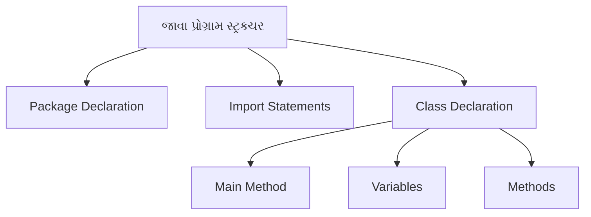
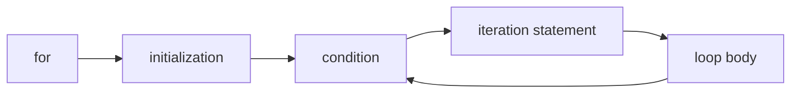

## પ્રશ્ન ૨(અ): જાવા ના વિવિધ Primitive data type ની યાદી આપો. (ગુણ: ૩)

### જવાબ ૨(અ):

જાવામાં 8 Primitive data types છે:

| Data Type | સાઇઝ | વર્ણન |
|-----------|------|-------------|
| **byte** | 1 byte | -128 થી 127 સુધીના આખા નંબર્સ સ્ટોર કરે છે |
| **short** | 2 bytes | -32,768 થી 32,767 સુધીના આખા નંબર્સ સ્ટોર કરે છે |
| **int** | 4 bytes | -2³¹ થી 2³¹-1 સુધીના આખા નંબર્સ સ્ટોર કરે છે |
| **long** | 8 bytes | -2⁶³ થી 2⁶³-1 સુધીના આખા નંબર્સ સ્ટોર કરે છે |
| **float** | 4 bytes | 6-7 દશાંશ અંકો સાથે અપૂર્ણાંક નંબર્સ સ્ટોર કરે છે |
| **double** | 8 bytes | 15 દશાંશ અંકો સાથે અપૂર્ણાંક નંબર્સ સ્ટોર કરે છે |
| **boolean** | 1 bit | true અથવા false વેલ્યુ સ્ટોર કરે છે |
| **char** | 2 bytes | કેરેક્ટર, લેટર અથવા ASCII વેલ્યુ સ્ટોર કરે છે |

**યાદ રાખવા માટે**: "**ચાર બીડુ ફ્લેટમાં સલામત લગે છે**" - char, byte, double, float, int, long, short, boolean

## પ્રશ્ન ૨(બ): યોગ્ય ઉદાહરણ સાથે Java Program નું સ્ટ્રક્ચર સમજાવો. (ગુણ: ૪)

### જવાબ ૨(બ):

જાવા પ્રોગ્રામનું સ્ટ્રક્ચર આ મુજબ છે:



**જાવા પ્રોગ્રામનું સ્ટ્રક્ચર**:

```java
// 1. Package Declaration (Optional)
package com.example;

// 2. Import Statements (Optional)
import java.util.Scanner;

// 3. Class Declaration (Required)
public class HelloWorld {
    
    // 4. Variables
    String message = "Hello, World!";
    
    // 5. Main Method (Entry point)
    public static void main(String[] args) {
        // Create object
        HelloWorld obj = new HelloWorld();
        
        // Call method
        obj.displayMessage();
    }
    
    // 6. Additional Methods
    public void displayMessage() {
        System.out.println(message);
    }
}
```

**મુખ્ય કમ્પોનન્ટ્સ**:
* **Package Declaration**: (વૈકલ્પિક) સંબંધિત ક્લાસીસને ઓર્ગેનાઇઝ કરે છે
* **Import Statements**: (વૈકલ્પિક) અન્ય પેકેજના ક્લાસીસનો ઉપયોગ કરવા માટે
* **Class Declaration**: (જરૂરી) જાવા પ્રોગ્રામમાં ઓછામાં ઓછો એક ક્લાસ હોવો જોઈએ
* **Main Method**: એક્ઝિક્યુટેબલ પ્રોગ્રામનું એન્ટ્રી પોઇન્ટ (ચોક્કસ ફોર્મેટમાં હોવું જોઈએ)
* **Variables**: ડેટા સ્ટોર કરવા માટે
* **Methods**: કોડ બ્લોક્સ જે ચોક્કસ ટાસ્ક પરફોર્મ કરે છે

**યાદ રાખવા માટે**: "**PICMVM**" - Package, Imports, Class, Main, Variables, Methods

## પ્રશ્ન ૨(ક): જાવા ના arithmetic operators ની યાદી આપો. કોઈપણ ત્રણ arithmetic operators નો ઉપયોગ કરીને Java Program વિકસાવો અને તેનું output બતાવો. (ગુણ: ૭)

### જવાબ ૨(ક):

**Arithmetic Operators in Java**:

| Operator | વર્ણન | ઉદાહરણ |
|----------|-------------|---------|
| **+** | એડિશન (સરવાળો) | a + b |
| **-** | સબટ્રેક્શન (બાદબાકી) | a - b |
| **\*** | મલ્ટિપ્લિકેશન (ગુણાકાર) | a * b |
| **/** | ડિવિઝન (ભાગાકાર) | a / b |
| **%** | મોડ્યુલસ (શેષ) | a % b |
| **++** | ઇન્ક્રિમેન્ટ (વધારો) | a++ અથવા ++a |
| **--** | ડિક્રિમેન્ટ (ઘટાડો) | a-- અથવા --a |

**Arithmetic Operators વાપરતો જાવા પ્રોગ્રામ**:

```java
public class ArithmeticDemo {
    public static void main(String[] args) {
        // વેરિએબલ્સ ડિક્લેર કરવા
        int num1 = 20;
        int num2 = 5;
        int result1, result2, result3;
        
        // ત્રણ arithmetic operators નો ઉપયોગ
        result1 = num1 + num2;  // સરવાળો
        result2 = num1 - num2;  // બાદબાકી
        result3 = num1 * num2;  // ગુણાકાર
        
        // આઉટપુટ પ્રદર્શિત કરવું
        System.out.println("પ્રથમ નંબર: " + num1);
        System.out.println("બીજો નંબર: " + num2);
        System.out.println("સરવાળો: " + result1);       // આઉટપુટ: 25
        System.out.println("બાદબાકી: " + result2);      // આઉટપુટ: 15
        System.out.println("ગુણાકાર: " + result3);      // આઉટપુટ: 100
        
        // બોનસ: બીજા operators નો ઉપયોગ કરીને ડેમોન્સ્ટ્રેશન
        System.out.println("ભાગાકાર: " + (num1 / num2));     // આઉટપુટ: 4
        System.out.println("મોડ્યુલસ: " + (num1 % num2));     // આઉટપુટ: 0
        
        // ઇન્ક્રિમેન્ટ અને ડિક્રિમેન્ટ ડેમોન્સ્ટ્રેટ કરવા
        int count = 10;
        System.out.println("મૂળ count: " + count);    // 10
        System.out.println("count++: " + count++);    // 10 (પહેલા value use કરે, પછી increment)
        System.out.println("નવો count: " + count);    // 11
        System.out.println("++count: " + ++count);    // 12 (પહેલા increment, પછી value use કરે)
    }
}
```

**આઉટપુટ**:
```
પ્રથમ નંબર: 20
બીજો નંબર: 5
સરવાળો: 25
બાદબાકી: 15
ગુણાકાર: 100
ભાગાકાર: 4
મોડ્યુલસ: 0
મૂળ count: 10
count++: 10
નવો count: 11
++count: 12
```

**મુખ્ય પોઇન્ટ્સ**:
* **બેઝિક arithmetic operators**: +, -, *, /, %
* **યુનરી operators**: ++, --
* **ગણિતીય ઓપરેશન્સ**: સરવાળો, બાદબાકી, ગુણાકાર, ભાગાકાર, મોડ્યુલસ
* **પોસ્ટફિક્સ vs પ્રીફિક્સ**: a++ vs ++a નો ભિન્ન ઈફેક્ટ (પહેલા use કે પહેલા increment)

**યાદ રાખવા માટે**: "**GSBPM ID**" - ગુણાકાર, સરવાળો, બાદબાકી, ભાગાકાર, મોડ્યુલસ, ઇન્ક્રિમેન્ટ, ડિક્રિમેન્ટ

## પ્રશ્ન ૨(ક OR): Java માં for loop statement ની syntax લખો. 1 થી 10 વચ્ચે પ્રાઈમ નંબર શોધવા માટેનો java કોડ વિકસાવો. (ગુણ: ૭)

### જવાબ ૨(ક OR):

**Java for loop statement ની syntax**:



```java
for (initialization; condition; iteration) {
    // કોડ બ્લોક (લૂપ બોડી)
}
```

* **initialization**: લૂપ શરૂ થતા પહેલા એક વખત એક્ઝિક્યુટ થાય છે
* **condition**: દરેક iteration પહેલા ચેક થાય છે, true હોય તો લૂપ ચાલુ રહે છે
* **iteration**: દરેક iteration પછી એક્ઝિક્યુટ થાય છે

**1 થી 10 વચ્ચે પ્રાઈમ નંબર શોધવાનો પ્રોગ્રામ**:

```java
public class PrimeNumbers {
    public static void main(String[] args) {
        System.out.println("1 થી 10 વચ્ચેના પ્રાઈમ નંબર્સ:");
        
        // દરેક નંબર ચેક કરવા
        for (int num = 1; num <= 10; num++) {
            boolean isPrime = true;
            
            // 1 પ્રાઈમ નથી
            if (num == 1) {
                isPrime = false;
            }
            
            // 2 થી num-1 સુધીના નંબર્સથી ભાગાકાર ચેક કરવો
            for (int i = 2; i < num; i++) {
                // જો સંપૂર્ણ ભાગાકાર થતો હોય તો પ્રાઈમ નથી
                if (num % i == 0) {
                    isPrime = false;
                    break;
                }
            }
            
            // પ્રાઈમ હોય તો પ્રિન્ટ કરવું
            if (isPrime) {
                System.out.print(num + " ");
            }
        }
    }
}
```

**આઉટપુટ**:
```
1 થી 10 વચ્ચેના પ્રાઈમ નંબર્સ:
2 3 5 7
```

**મુખ્ય પોઇન્ટ્સ**:
* **નેસ્ટેડ for લૂપ**: અંદરની લૂપ પ્રાઈમ ચેક કરે છે
* **ફ્લેગ વેરિએબલ**: isPrime ફ્લેગ વડે પ્રાઈમ સ્ટેટસ ટ્રેક કરવું
* **ઓપ્ટિમાઇઝેશન**: પ્રાઈમ ન હોવાનું નક્કી થાય ત્યારે break સ્ટેટમેન્ટ વડે અંદરની લૂપ છોડી દેવી
* **સ્પેશિયલ કેસ**: 1 ને પ્રાઈમ ન ગણવું

**પ્રાઈમ નંબર કેવી રીતે શોધવા**:
1. દરેક નંબર લઈને તેના ડિવાઇઝરો ચેક કરવા
2. જો નંબર 1 થી મોટો હોય અને માત્ર 1 અને પોતાનાથી જ ભાગી શકાતો હોય તો તે પ્રાઈમ છે
3. કોઈ પણ 2 થી પોતે-1 સુધીના નંબરથી ભાગી શકાતો હોય તો તે પ્રાઈમ નથી

**યાદ રાખવા માટે**: "**FLOP**" - For loop, Logic check, Optimization with break, Prime flag variable