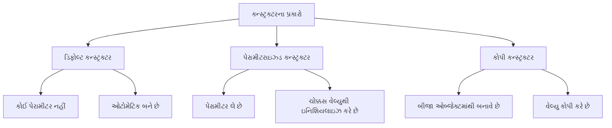
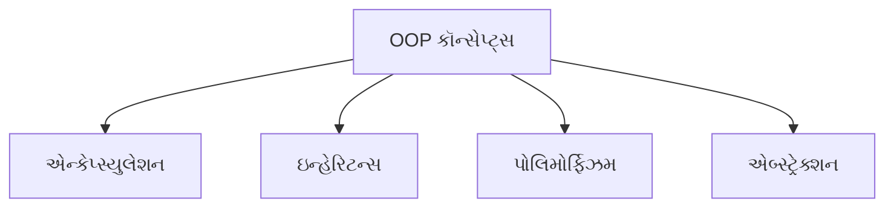

## પ્રશ્ન 2(a): પ્રોસીજર-ઓરિએન્ટેડ પ્રોગ્રામિંગ (POP) અને ઓબ્જેક્ટ-ઓરિએન્ટેડ પ્રોગ્રામિંગ (OOP) વચ્ચેના તફાવતો જણાવો. (ગુણ: 03)

### જવાબ 2(a):

| પ્રોસીજર-ઓરિએન્ટેડ પ્રોગ્રામિંગ (POP) | ઓબ્જેક્ટ-ઓરિએન્ટેડ પ્રોગ્રામિંગ (OOP) |
|-------------------------------------|----------------------------------|
| **ફંક્શન-કેન્દ્રિત** અભિગમ | **ઓબ્જેક્ટ-કેન્દ્રિત** અભિગમ |
| ડેટા ફંક્શન્સ વચ્ચે મુક્તપણે હલનચલન કરે છે | ડેટા ઓબ્જેક્ટ્સમાં **એન્કેપ્સ્યુલેટેડ** થયેલ છે |
| **ટોપ-ડાઉન** અભિગમને અનુસરે છે | **બોટમ-અપ** અભિગમને અનુસરે છે |
| **સુરક્ષા** ઓછી છે (ડેટા ગ્લોબલ છે) | **સુરક્ષા** વધુ છે (ડેટા હાઈડિંગ) |
| **ઇન્હેરિટન્સ**નો કોઈ ખ્યાલ નથી | **ઇન્હેરિટન્સ** અને રીયુઝેબિલિટીને સપોર્ટ કરે છે |
| ઉદાહરણો: C, FORTRAN, Pascal | ઉદાહરણો: Java, C++, Python |

**યાદ રાખવા માટેની ટ્રિક**: "**FEED SI**" - Focus, Encapsulation, Execution, Data access, Security, Inheritance

## પ્રશ્ન 2(b): static કીવર્ડ ઉદાહરણ સાથે સમજાવો. (ગુણ: 04)

### જવાબ 2(b):

જાવામાં **static** કીવર્ડ:

* સભ્યને **ઓબ્જેક્ટને બદલે ક્લાસની માલિકી** બનાવે છે
* **વેરિએબલ્સ**, **મેથડ્સ**, **બ્લોક્સ**, અને **નેસ્ટેડ ક્લાસ**માં લાગુ કરી શકાય છે
* Static સભ્યો ક્લાસ લોડ થાય ત્યારે **મેમરીમાં લોડ** થાય છે
* **ઓબ્જેક્ટ્સ બનાવ્યા વિના ઍક્સેસ** કરી શકાય છે

```java
public class StaticDemo {
    // Static વેરિએબલ - બધા ઇન્સ્ટન્સમાં શેર થાય છે
    static int count = 0;
    
    // ઇન્સ્ટન્સ વેરિએબલ - દરેક ઇન્સ્ટન્સ માટે અનન્ય
    int instanceNum;
    
    // કન્સ્ટ્રક્ટર
    StaticDemo() {
        count++;          // Static કાઉન્ટર વધારો
        instanceNum = count;  // ઇન્સ્ટન્સ નંબર અસાઇન કરો
    }
    
    // Static મેથડ
    static void displayCount() {
        System.out.println("કુલ ઓબ્જેક્ટ્સ: " + count);
    }
    
    public static void main(String[] args) {
        // ઓબ્જેક્ટ વિના static મેથડનો ઍક્સેસ કરો
        StaticDemo.displayCount();  // આઉટપુટ: કુલ ઓબ્જેક્ટ્સ: 0
        
        // ઓબ્જેક્ટ્સ બનાવો
        StaticDemo obj1 = new StaticDemo();
        StaticDemo obj2 = new StaticDemo();
        
        // static મેથડ કૉલ કરો
        StaticDemo.displayCount();  // આઉટપુટ: કુલ ઓબ્જેક્ટ્સ: 2
    }
}
```

## પ્રશ્ન 2(c): કન્સ્ટ્રક્ટર વ્યાખ્યાયિત કરો. કન્સ્ટ્રક્ટરના પ્રકારો જણાવો. પેરામીટરાઇઝ્ડ કન્સ્ટ્રક્ટર સમજાવવા માટે એક જાવા કોડ બનાવો. (ગુણ: 07)

### જવાબ 2(c):

**કન્સ્ટ્રક્ટર**: જ્યારે ઓબ્જેક્ટ્સ બનાવવામાં આવે છે ત્યારે તેને **ઇનિશિયલાઇઝ કરવા** માટે વપરાતી મેથડનો વિશેષ પ્રકાર. તે **ક્લાસના નામ જેવું જ નામ** ધરાવે છે અને તેનો **કોઈ રિટર્ન ટાઇપ નથી**.



**કન્સ્ટ્રક્ટરના પ્રકારો**:
1. **ડિફોલ્ટ કન્સ્ટ્રક્ટર**: કોઈ પેરામીટર નથી, જો કોઈ કન્સ્ટ્રક્ટર ન હોય તો જાવા દ્વારા બનાવવામાં આવે છે
2. **પેરામીટરાઇઝ્ડ કન્સ્ટ્રક્ટર**: ઓબ્જેક્ટને ચોક્કસ વેલ્યુથી ઇનિશિયલાઇઝ કરવા માટે પેરામીટર લે છે
3. **કોપી કન્સ્ટ્રક્ટર**: બીજા ઓબ્જેક્ટમાંથી વેલ્યુ કોપી કરીને ઓબ્જેક્ટ બનાવે છે

**પેરામીટરાઇઝ્ડ કન્સ્ટ્રક્ટર માટે જાવા કોડ**:

```java
public class Student {
    // ઇન્સ્ટન્સ વેરિએબલ્સ
    private int id;
    private String name;
    private double marks;
    
    // પેરામીટરાઇઝ્ડ કન્સ્ટ્રક્ટર
    public Student(int studentId, String studentName, double studentMarks) {
        id = studentId;
        name = studentName;
        marks = studentMarks;
    }
    
    // વિદ્યાર્થીની વિગતો દર્શાવવા માટેની મેથડ
    public void displayDetails() {
        System.out.println("વિદ્યાર્થી ID: " + id);
        System.out.println("વિદ્યાર્થીનું નામ: " + name);
        System.out.println("વિદ્યાર્થીના માર્ક્સ: " + marks);
    }
    
    public static void main(String[] args) {
        // પેરામીટરાઇઝ્ડ કન્સ્ટ્રક્ટરનો ઉપયોગ કરીને ઓબ્જેક્ટ બનાવવા
        Student s1 = new Student(101, "રાજ", 85.5);
        Student s2 = new Student(102, "પ્રિયા", 92.0);
        
        // વિદ્યાર્થીની વિગતો દર્શાવવી
        System.out.println("પ્રથમ વિદ્યાર્થી:");
        s1.displayDetails();
        
        System.out.println("\nબીજો વિદ્યાર્થી:");
        s2.displayDetails();
    }
}
```

**કન્સ્ટ્રક્ટરના પ્રકારો માટે યાદ રાખવાની ટ્રિક**: "**DPC**" - Default, Parameterized, Copy

## પ્રશ્ન 2(a OR): જાવામાં મૂળભૂત OOP કૉન્સેપ્ટ્સની યાદી બનાવો અને કોઈ એક સમજાવો. (ગુણ: 03)

### જવાબ 2(a OR):

**જાવામાં મૂળભૂત OOP કૉન્સેપ્ટ્સ**:



* **એન્કેપ્સ્યુલેશન**: ડેટા અને તેના પર કામ કરતી મેથડ્સને એક સાથે બાંધવાનો પ્રોસેસ
* **ઇન્હેરિટન્સ**: હાલના ક્લાસમાંથી નવા ક્લાસ બનાવવા
* **પોલિમોર્ફિઝમ**: એક જ મેથડ અલગ-અલગ સંદર્ભમાં અલગ રીતે વર્તે છે
* **એબ્સ્ટ્રેક્શન**: જટિલ ઇમ્પ્લિમેન્ટેશન ડિટેલ્સ છુપાવવી, ફક્ત ફંક્શનાલિટી બતાવવી

**એન્કેપ્સ્યુલેશનનું સ્પષ્ટીકરણ**:
એન્કેપ્સ્યુલેશન એ ડેટા અને મેથડ્સને એક એકમ (ક્લાસ) તરીકે **બાંધવાની** અને બહારની દુનિયાથી ડેટાને **છુપાવવાની** પ્રક્રિયા છે. તે આ રીતે હાંસલ થાય છે:
* **પ્રાઇવેટ ડેટા મેમ્બર્સ**: ક્લાસની અંદર એક્સેસ મર્યાદિત
* **પબ્લિક ગેટર/સેટર મેથડ્સ**: પ્રાઇવેટ ડેટાનો નિયંત્રિત એક્સેસ
* **ફાયદા**: વધુ સુરક્ષા, ડેટા છુપાવવો, અને મોડ્યુલર કોડ

**યાદ રાખવા માટેની ટ્રિક**: "**EIPA**" - Encapsulation, Inheritance, Polymorphism, Abstraction

## પ્રશ્ન 2(b OR): final કીવર્ડ ઉદાહરણ સાથે સમજાવો. (ગુણ: 04)

### જવાબ 2(b OR):

જાવામાં **final** કીવર્ડ:

* **કોન્સ્ટન્ટ્સ** બનાવે છે જે બદલી શકાતા નથી
* **વેરિએબલ્સ**, **મેથડ્સ**, અને **ક્લાસ**માં લાગુ કરી શકાય છે
* **Final વેરિએબલ**: ઇનિશિયલાઇઝેશન પછી વેલ્યુ બદલી શકાતી નથી
* **Final મેથડ**: સબક્લાસ દ્વારા ઓવરરાઇડ કરી શકાતી નથી
* **Final ક્લાસ**: એક્સટેન્ડ કરી શકાતી નથી (ઇન્હેરિટન્સ નહીં)

```java
public class FinalDemo {
    // Final વેરિએબલ (કોન્સ્ટન્ટ)
    final double PI = 3.14159;
    
    // Final મેથડ
    final void display() {
        System.out.println("આ મેથડ ઓવરરાઇડ થઈ શકતી નથી");
    }
    
    public static void main(String[] args) {
        FinalDemo obj = new FinalDemo();
        
        // Final વેરિએબલનો ઉપયોગ
        System.out.println("PI ની વેલ્યુ: " + obj.PI);
        
        // Final વેરિએબલ મોડિફાય કરી શકાતી નથી
        // obj.PI = 3.14;  // આ કમ્પાઇલેશન એરર થશે
        
        // Final મેથડ કૉલિંગ
        obj.display();
    }
}

// Final ક્લાસ
final class SecureClass {
    void show() {
        System.out.println("આ ક્લાસ એક્સટેન્ડ થઈ શકતો નથી");
    }
}

// Final ક્લાસ એક્સટેન્ડ કરી શકાતો નથી
// class ChildClass extends SecureClass {} // આ કમ્પાઇલેશન એરર થશે

## પ્રશ્ન 2(c OR): જાવા એક્સેસ મોડિફાયરનો સ્કોપ લખો. public મોડિફાયર સમજાવવા માટે એક જાવા કોડ બનાવો. (ગુણ: 07)

### જવાબ 2(c OR):

**જાવા એક્સેસ મોડિફાયર્સનો સ્કોપ**:

| મોડિફાયર | ક્લાસ | પેકેજ | સબક્લાસ | વર્લ્ડ |
|----------|-------|---------|----------|-------|
| **private** | હા | ના | ના | ના |
| **default** (કોઈ મોડિફાયર નહીં) | હા | હા | ના | ના |
| **protected** | હા | હા | હા | ના |
| **public** | હા | હા | હા | હા |

**યાદ રાખવા માટેની ટ્રિક**: "**Pri-De-Pro-Pub**" (Private-Default-Protected-Public) વધતા એક્સેસિબિલિટી સાથે

**public મોડિફાયર સમજાવવા માટે જાવા કોડ**:

```java
// ફાઇલ: AccessDemo.java
package demo.access;

public class AccessDemo {
    // Public વેરિએબલ
    public int publicVar = 100;
    
    // Public મેથડ
    public void publicMethod() {
        System.out.println("આ એક public મેથડ છે");
        System.out.println("Public વેરિએબલની વેલ્યુ: " + publicVar);
    }
    
    public static void main(String[] args) {
        // એજ ક્લાસનો ઓબ્જેક્ટ બનાવવો
        AccessDemo obj1 = new AccessDemo();
        
        // એજ ક્લાસમાં public મેમ્બર્સ એક્સેસ કરવા
        System.out.println("એજ ક્લાસમાંથી એક્સેસ: " + obj1.publicVar);
        obj1.publicMethod();
    }
}

// ફાઇલ: AccessTester.java
package demo.access;

public class AccessTester {
    public static void main(String[] args) {
        // AccessDemo ક્લાસનો ઓબ્જેક્ટ બનાવવો
        AccessDemo obj = new AccessDemo();
        
        // અલગ ક્લાસમાંથી public મેમ્બર્સ એક્સેસ કરવા
        System.out.println("અલગ ક્લાસમાંથી એક્સેસ: " + obj.publicVar);
        obj.publicMethod();
        
        // કોઈપણ પેકેજ, ક્લાસ, કે સબક્લાસમાંથી એક્સેસ થઈ શકે છે
    }
}
```

**Public મોડિફાયર વિશે મુખ્ય મુદ્દાઓ**:
* **બધે એક્સેસિબલ**: ક્લાસમાં, પેકેજમાં, સબક્લાસમાં, અને પેકેજની બહાર
* **ઇન્ટરફેસ**, **API મેથડ્સ**, અને **જનરલ-પર્પઝ ફંક્શનાલિટી** માટે વપરાય છે
* **મહત્તમ એક્સેસિબિલિટી** ઓછામાં ઓછા પ્રતિબંધ સાથે આપે છે
* **એન્કેપ્સ્યુલેશન** જાળવવા માટે સાવચેતીથી વાપરવું જોઈએ