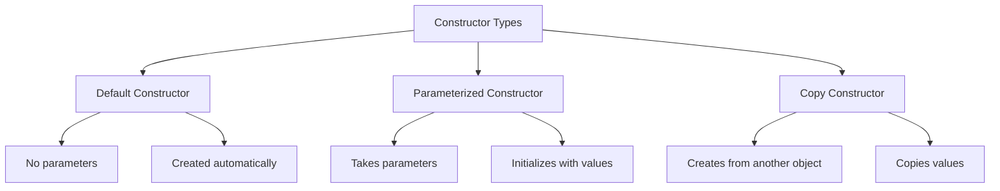
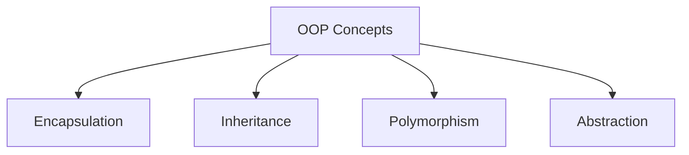

## Question 2(a): List the differences between Procedure-Oriented Programming (POP) and Object-Oriented Programming (OOP). (Marks: 03)

### Answer 2(a):

| Procedure-Oriented Programming (POP) | Object-Oriented Programming (OOP) |
|-------------------------------------|----------------------------------|
| **Function-centered** approach | **Object-centered** approach |
| Data moves freely between functions | Data is **encapsulated** within objects |
| Follows **top-down** approach | Follows **bottom-up** approach |
| **Security** is less (data is global) | **Security** is more (data hiding) |
| No concept of **inheritance** | Supports **inheritance** and reusability |
| Examples: C, FORTRAN, Pascal | Examples: Java, C++, Python |

**Mnemonic**: "**FEED SI**" - Focus, Encapsulation, Execution, Data access, Security, Inheritance

## Question 2(b): Explain static keyword with example. (Marks: 04)

### Answer 2(b):

The **static** keyword in Java:

* Makes a member **belong to the class** rather than to instances (objects)
* Can be applied to **variables**, **methods**, **blocks**, and **nested classes**
* Static members are **loaded into memory** when class is loaded
* Can be **accessed without creating objects**

```java
public class StaticDemo {
    // Static variable - shared across all instances
    static int count = 0;
    
    // Instance variable - unique to each instance
    int instanceNum;
    
    // Constructor
    StaticDemo() {
        count++;          // Increment static counter
        instanceNum = count;  // Assign instance number
    }
    
    // Static method
    static void displayCount() {
        System.out.println("Total objects: " + count);
    }
    
    public static void main(String[] args) {
        // Access static method without object
        StaticDemo.displayCount();  // Output: Total objects: 0
        
        // Create objects
        StaticDemo obj1 = new StaticDemo();
        StaticDemo obj2 = new StaticDemo();
        
        // Call static method
        StaticDemo.displayCount();  // Output: Total objects: 2
    }
}
```

## Question 2(c): Define Constructor. List types of Constructors. Develop a java code to explain Parameterized constructor. (Marks: 07)

### Answer 2(c):

**Constructor**: A special type of method used to **initialize objects** when they are created. It has the **same name as the class** and **no return type**.



**Types of Constructors**:
1. **Default Constructor**: No parameters, created by Java if no constructor is defined
2. **Parameterized Constructor**: Takes parameters to initialize object with specific values
3. **Copy Constructor**: Creates object by copying values from another object

**Java Code for Parameterized Constructor**:

```java
public class Student {
    // Instance variables
    private int id;
    private String name;
    private double marks;
    
    // Parameterized constructor
    public Student(int studentId, String studentName, double studentMarks) {
        id = studentId;
        name = studentName;
        marks = studentMarks;
    }
    
    // Method to display student details
    public void displayDetails() {
        System.out.println("Student ID: " + id);
        System.out.println("Student Name: " + name);
        System.out.println("Student Marks: " + marks);
    }
    
    public static void main(String[] args) {
        // Creating objects using parameterized constructor
        Student s1 = new Student(101, "Raj", 85.5);
        Student s2 = new Student(102, "Priya", 92.0);
        
        // Displaying student details
        System.out.println("First Student:");
        s1.displayDetails();
        
        System.out.println("\nSecond Student:");
        s2.displayDetails();
    }
}
```

**Mnemonic for Constructor Types**: "**DPC**" - Default, Parameterized, Copy

## Question 2(a OR): List the basic OOP concepts in Java and explain any one. (Marks: 03)

### Answer 2(a OR):

**Basic OOP Concepts in Java**:



* **Encapsulation**: Bundling data and methods that operate on that data
* **Inheritance**: Creating new classes from existing ones
* **Polymorphism**: Same method behaving differently in different contexts
* **Abstraction**: Hiding complex implementation details, showing only functionality

**Explanation of Encapsulation**:
Encapsulation is the process of **binding data and methods together** as a single unit (class) and **hiding data** from the outside world. It is achieved through:
* **Private data members**: Access restricted within the class
* **Public getter/setter methods**: Controlled access to private data
* **Benefits**: Improved security, data hiding, and modular code

**Mnemonic**: "**EIPA**" - Encapsulation, Inheritance, Polymorphism, Abstraction

## Question 2(b OR): Explain final keyword with example. (Marks: 04)

### Answer 2(b OR):

The **final** keyword in Java:

* Creates **constants** that cannot be changed
* Can be applied to **variables**, **methods**, and **classes**
* **Final variable**: Value cannot be changed after initialization
* **Final method**: Cannot be overridden by subclasses
* **Final class**: Cannot be extended (no inheritance)

```java
public class FinalDemo {
    // Final variable (constant)
    final double PI = 3.14159;
    
    // Final method
    final void display() {
        System.out.println("This method cannot be overridden");
    }
    
    public static void main(String[] args) {
        FinalDemo obj = new FinalDemo();
        
        // Using final variable
        System.out.println("Value of PI: " + obj.PI);
        
        // Cannot modify final variable
        // obj.PI = 3.14;  // This would cause compilation error
        
        // Calling final method
        obj.display();
    }
}

// Final class
final class SecureClass {
    void show() {
        System.out.println("This class cannot be extended");
    }
}

// Cannot extend final class
// class ChildClass extends SecureClass {} // This would cause compilation error
```

## Question 2(c OR): Write scope of java access modifier. Develop a java code to explain public modifier. (Marks: 07)

### Answer 2(c OR):

**Java Access Modifiers Scope**:

| Modifier | Class | Package | Subclass | World |
|----------|-------|---------|----------|-------|
| **private** | Yes | No | No | No |
| **default** (no modifier) | Yes | Yes | No | No |
| **protected** | Yes | Yes | Yes | No |
| **public** | Yes | Yes | Yes | Yes |

**Mnemonic**: "**Pri-De-Pro-Pub**" (Private-Default-Protected-Public) with increasing accessibility

**Java Code to Explain Public Modifier**:

```java
// File: AccessDemo.java
package demo.access;

public class AccessDemo {
    // Public variable
    public int publicVar = 100;
    
    // Public method
    public void publicMethod() {
        System.out.println("This is a public method");
        System.out.println("Public variable value: " + publicVar);
    }
    
    public static void main(String[] args) {
        // Creating object of the same class
        AccessDemo obj1 = new AccessDemo();
        
        // Accessing public members within the same class
        System.out.println("Accessing from same class: " + obj1.publicVar);
        obj1.publicMethod();
    }
}

// File: AccessTester.java
package demo.access;

public class AccessTester {
    public static void main(String[] args) {
        // Creating object of AccessDemo class
        AccessDemo obj = new AccessDemo();
        
        // Accessing public members from different class
        System.out.println("Accessing from different class: " + obj.publicVar);
        obj.publicMethod();
        
        // Can be accessed from any package, class, or subclass
    }
}
```

**Key Points about Public Modifier**:
* **Accessible everywhere**: within class, package, subclass, and outside package
* Used for **interfaces**, **API methods**, and **general-purpose functionality**
* Allows **maximum accessibility** with minimum restriction
* Should be used carefully to maintain **encapsulation**
