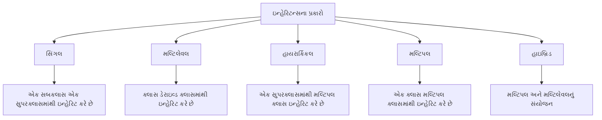

## પ્રશ્ન 3(a): ઇન્હેરિટન્સના વિવિધ પ્રકારો જણાવો અને ઉદાહરણ સાથે કોઈ એક સમજાવો. (ગુણ: 03)

### જવાબ 3(a):

**જાવામાં ઇન્હેરિટન્સના પ્રકારો**:



| પ્રકાર | વર્ણન |
|------|-------------|
| **સિંગલ** | એક સબક્લાસ એક સુપરક્લાસમાંથી ઇન્હેરિટ કરે છે |
| **મલ્ટિલેવલ** | ક્લાસ ડેરાઇવ્ડ ક્લાસમાંથી ઇન્હેરિટ કરે છે |
| **હાયરાર્કિકલ** | એક સુપરક્લાસમાંથી મલ્ટિપલ ક્લાસ ઇન્હેરિટ કરે છે |
| **મલ્ટિપલ** | એક ક્લાસ મલ્ટિપલ ક્લાસમાંથી ઇન્હેરિટ કરે છે (જાવામાં ઇન્ટરફેસ દ્વારા) |
| **હાઇબ્રિડ** | મલ્ટિપલ અને મલ્ટિલેવલ ઇન્હેરિટન્સનું સંયોજન |

**સિંગલ ઇન્હેરિટન્સનું ઉદાહરણ**:
```java
// પેરન્ટ ક્લાસ
class Animal {
    void eat() {
        System.out.println("પ્રાણી ખાઈ રહ્યું છે");
    }
}

// Animal ક્લાસમાંથી ઇન્હેરિટ થતો ચાઇલ્ડ ક્લાસ
class Dog extends Animal {
    void bark() {
        System.out.println("કૂતરો ભસી રહ્યો છે");
    }
}

// ઉપયોગ
class InheritanceDemo {
    public static void main(String[] args) {
        Dog d = new Dog();
        d.eat();  // Animal ક્લાસમાંથી ઇન્હેરિટ કરેલ
        d.bark(); // Dog ક્લાસની પોતાની મેથડ
    }
}
```

**યાદ રાખવા માટેની ટ્રિક**: "**SIMHH**" - Single, Inheritance, Multiple, Hierarchical, Hybrid

## પ્રશ્ન 3(b): StringBuffer ક્લાસની કોઈપણ બે મેથડ્સ યોગ્ય ઉદાહરણ સાથે સમજાવો. (ગુણ: 04)

### જવાબ 3(b):

**StringBuffer ક્લાસની મેથડ્સ**:

1. **append()**: StringBufferના અંતમાં કેરેક્ટર્સ ઉમેરે છે
2. **insert()**: ચોક્કસ પોઝિશન પર કેરેક્ટર્સ દાખલ કરે છે

```java
public class StringBufferDemo {
    public static void main(String[] args) {
        // StringBuffer ઓબ્જેક્ટ બનાવો
        StringBuffer sb = new StringBuffer("Hello");
        
        // 1. append() મેથડ
        sb.append(" World");
        System.out.println("append પછી: " + sb);  // આઉટપુટ: Hello World
        
        // 2. insert() મેથડ
        sb.insert(5, " Java");
        System.out.println("insert પછી: " + sb);  // આઉટપુટ: Hello Java World
        
        // StringBuffer વિશે વધારાની માહિતી
        System.out.println("લંબાઈ: " + sb.length());
        System.out.println("કેપેસિટી: " + sb.capacity());
    }
}
```

**અન્ય મહત્વપૂર્ણ StringBuffer મેથડ્સ**:
* **delete(int start, int end)**: કેરેક્ટર્સ દૂર કરે છે
* **reverse()**: કેરેક્ટર્સને ઉલટાવે છે
* **replace(int start, int end, String str)**: કેરેક્ટર્સ બદલે છે
* **capacity()**: વર્તમાન કેપેસિટી પાછી આપે છે

## પ્રશ્ન 3(c): ઇન્ટરફેસ વ્યાખ્યાયિત કરો. ઇન્ટરફેસનો ઉપયોગ કરીને મલ્ટિપલ ઇન્હેરિટન્સ દર્શાવવા માટે એક જાવા પ્રોગ્રામ લખો. (ગુણ: 07)

### જવાબ 3(c):

**ઇન્ટરફેસ**: ક્લાસનો બ્લૂપ્રિન્ટ જેમાં **એબ્સ્ટ્રેક્ટ મેથડ્સ** અને **કોન્સ્ટન્ટ્સ** હોય છે. તે ક્લાસ "શું" કરે છે તે દર્શાવે છે, "કેવી રીતે" નહીં. તે જાવામાં **મલ્ટિપલ ઇન્હેરિટન્સ**ને સપોર્ટ કરે છે.

**લક્ષણો**:
* બધી મેથડ્સ ડિફોલ્ટ રીતે **public** અને **abstract** છે
* બધા વેરિએબલ્સ ડિફોલ્ટ રીતે **public**, **static**, અને **final** છે
* ઇન્સ્ટન્સિએટ કરી શકાતું નથી (ઓબ્જેક્ટ નહીં)
* **implements** કીવર્ડ વડે ઇમ્પ્લિમેન્ટ થાય છે

```java
// પ્રથમ ઇન્ટરફેસ
interface Drawable {
    void draw();  // એબ્સ્ટ્રેક્ટ મેથડ
    
    // કોન્સ્ટન્ટ
    int SIZE = 10;
}

// બીજો ઇન્ટરફેસ
interface Colorable {
    void setColor(String color);  // એબ્સ્ટ્રેક્ટ મેથડ
}

// મલ્ટિપલ ઇન્ટરફેસ ઇમ્પ્લિમેન્ટ કરતો ક્લાસ (મલ્ટિપલ ઇન્હેરિટન્સ)
class Circle implements Drawable, Colorable {
    private String color;
    
    // Drawable ઇન્ટરફેસની મેથડ ઇમ્પ્લિમેન્ટ કરવી
    @Override
    public void draw() {
        System.out.println(SIZE + " સાઇઝ સાથે સર્કલ દોરી રહ્યા છીએ");
    }
    
    // Colorable ઇન્ટરફેસની મેથડ ઇમ્પ્લિમેન્ટ કરવી
    @Override
    public void setColor(String color) {
        this.color = color;
        System.out.println("સર્કલનો કલર " + color + " સેટ કર્યો");
    }
    
    // વધારાની મેથડ
    public void displayInfo() {
        System.out.println("આ એક " + color + " સર્કલ છે");
    }
}

// મુખ્ય ક્લાસ
public class InterfaceDemo {
    public static void main(String[] args) {
        Circle c = new Circle();
        c.draw();          // Drawable ઇન્ટરફેસથી
        c.setColor("લાલ"); // Colorable ઇન્ટરફેસથી
        c.displayInfo();   // Circle ક્લાસની પોતાની મેથડ
        
        // ઇન્ટરફેસ રેફરન્સ વેરિએબલ્સનો ઉપયોગ
        Drawable d = new Circle();
        d.draw();  // ફક્ત Drawable મેથડ્સ જ કૉલ કરી શકાય
        
        Colorable col = new Circle();
        col.setColor("વાદળી");  // ફક્ત Colorable મેથડ્સ જ કૉલ કરી શકાય
    }
}
```

**ઇન્ટરફેસ માટે યાદ રાખવાની ટ્રિક**: "**CAMP**" - Constants, Abstract methods, Multiple inheritance, Public

## પ્રશ્ન 3(a OR): એબ્સ્ટ્રેક્ટ ક્લાસ અને ઇન્ટરફેસ વચ્ચેના તફાવતો આપો. (ગુણ: 03)

### જવાબ 3(a OR):

| એબ્સ્ટ્રેક્ટ ક્લાસ | ઇન્ટરફેસ |
|----------------|-----------|
| **abstract** કીવર્ડનો ઉપયોગ કરે છે | **interface** કીવર્ડનો ઉપયોગ કરે છે |
| **એબ્સ્ટ્રેક્ટ અને નોન-એબ્સ્ટ્રેક્ટ** મેથડ્સ હોઈ શકે છે | બધી મેથડ્સ ડિફોલ્ટ રીતે **એબ્સ્ટ્રેક્ટ** છે (Java 8 પહેલાં) |
| **કન્સ્ટ્રક્ટર્સ** હોઈ શકે છે | કન્સ્ટ્રક્ટર્સ **ન** હોઈ શકે |
| **આંશિક ઇમ્પ્લિમેન્ટેશન**ને સપોર્ટ કરે છે | **સંપૂર્ણ એબ્સ્ટ્રેક્શન** આપે છે |
| ફક્ત **સિંગલ ઇન્હેરિટન્સ** | **મલ્ટિપલ ઇન્હેરિટન્સ**ને સપોર્ટ કરે છે |
| **ઇન્સ્ટન્સ વેરિએબલ્સ** હોઈ શકે છે | વેરિએબલ્સ ફક્ત **static અને final** જ હોય છે |
| મેથડ્સ **કોઈપણ એક્સેસ મોડિફાયર** ધરાવી શકે છે | મેથડ્સ ડિફોલ્ટ રીતે **public** છે |

**યાદ રાખવા માટેની ટ્રિક**: "**CAMP vs SCIM**" 
* ઇન્ટરફેસ માટે: Constants, Abstract methods, Multiple inheritance, Public
* એબ્સ્ટ્રેક્ટ માટે: Some implementation, Constructors, Instance variables, Mixed access

## પ્રશ્ન 3(b OR): String ક્લાસની કોઈપણ બે મેથડ્સ યોગ્ય ઉદાહરણ સાથે સમજાવો. (ગુણ: 04)

### જવાબ 3(b OR):

**String ક્લાસની મેથડ્સ**:

1. **substring()**: સ્ટ્રિંગનો એક ભાગ કાઢે છે
2. **equals()**: સ્ટ્રિંગ કન્ટેન્ટ સરખાવે છે

```java
public class StringMethodsDemo {
    public static void main(String[] args) {
        String str = "Hello Java Programming";
        
        // 1. substring() મેથડ
        String sub1 = str.substring(6);       // ઇન્ડેક્સ 6 થી અંત સુધી
        String sub2 = str.substring(6, 10);   // ઇન્ડેક્સ 6 થી 9 સુધી
        
        System.out.println("ઓરિજિનલ: " + str);
        System.out.println("substring(6): " + sub1);      // આઉટપુટ: Java Programming
        System.out.println("substring(6, 10): " + sub2);  // આઉટપુટ: Java
        
        // 2. equals() મેથડ
        String s1 = "Java";
        String s2 = "java";
        String s3 = "Java";
        String s4 = new String("Java");
        
        System.out.println("s1.equals(s2): " + s1.equals(s2));         // false
        System.out.println("s1.equals(s3): " + s1.equals(s3));         // true
        System.out.println("s1.equals(s4): " + s1.equals(s4));         // true
        System.out.println("s1.equalsIgnoreCase(s2): " + s1.equalsIgnoreCase(s2)); // true
        System.out.println("s1 == s3: " + (s1 == s3));                 // true
        System.out.println("s1 == s4: " + (s1 == s4));                 // false (અલગ ઓબ્જેક્ટ્સ)
    }
}
```

**અન્ય મહત્વપૂર્ણ String મેથડ્સ**:
* **length()**: સ્ટ્રિંગની લંબાઈ પાછી આપે છે
* **charAt()**: ચોક્કસ પોઝિશન પર કેરેક્ટર પાછો આપે છે
* **indexOf()**: સબસ્ટ્રિંગનો ઇન્ડેક્સ પાછો આપે છે
* **concat()**: સ્ટ્રિંગ્સને જોડે છે
* **replace()**: કેરેક્ટર્સ/સબસ્ટ્રિંગ્સ બદલે છે

## પ્રશ્ન 3(c OR): પેકેજ સમજાવો અને યોગ્ય ઉદાહરણ સાથે પેકેજ બનાવવાના પગલાં જણાવો. (ગુણ: 07)

### જવાબ 3(c OR):

**પેકેજ**: એક નેમસ્પેસ જે સંબંધિત ક્લાસ અને ઇન્ટરફેસને વ્યવસ્થિત કરે છે. તે **નેમિંગ કોન્ફ્લિક્ટ્સ ટાળવા** અને **એક્સેસ કંટ્રોલ મેનેજ કરવા**માં મદદ કરે છે.

**પેકેજના ફાયદા**:
* **નેમસ્પેસ મેનેજમેન્ટ**: નેમિંગ કોન્ફ્લિક્ટ્સ ટાળે છે
* **એક્સેસ કંટ્રોલ**: ક્લાસની વિઝિબિલિટી નિયંત્રિત કરે છે
* **કોડ ઓર્ગેનાઇઝેશન**: સંબંધિત ક્લાસને સમૂહમાં રાખે છે

**પેકેજ બનાવવા અને વાપરવાના પગલાં**:

1. ફાઇલની શરૂઆતમાં પેકેજ **ડિક્લેર** કરો
2. યોગ્ય ડિરેક્ટરી સ્ટ્રક્ચર સાથે ફાઇલ **સેવ** કરો
3. યોગ્ય પેકેજ સ્ટ્રક્ચર સાથે ફાઇલ **કમ્પાઇલ** કરો
4. પેકેજને ઇમ્પોર્ટ કરીને **ઉપયોગ** કરો

```java
// પગલું 1: પેકેજ ડિક્લેર કરો (Calculator.java તરીકે સેવ કરો)
package com.mymath.util;

public class Calculator {
    // Calculator મેથડ્સ
    public int add(int a, int b) {
        return a + b;
    }
    
    public int subtract(int a, int b) {
        return a - b;
    }
    
    public int multiply(int a, int b) {
        return a * b;
    }
    
    public int divide(int a, int b) {
        if (b == 0) {
            System.out.println("શૂન્યથી ભાગી શકાતું નથી");
            return 0;
        }
        return a / b;
    }
}

// પગલું 4: પેકેજનો ઉપયોગ કરો (PackageDemo.java તરીકે સેવ કરો)
// પેકેજનો ઉપયોગ કરતી અલગ ફાઇલ
import com.mymath.util.Calculator;

public class PackageDemo {
    public static void main(String[] args) {
        // Calculator ક્લાસનો ઓબ્જેક્ટ બનાવો
        Calculator calc = new Calculator();
        
        // મેથડ્સનો ઉપયોગ કરો
        System.out.println("10 + 5 = " + calc.add(10, 5));
        System.out.println("10 - 5 = " + calc.subtract(10, 5));
        System.out.println("10 * 5 = " + calc.multiply(10, 5));
        System.out.println("10 / 5 = " + calc.divide(10, 5));
    }
}
```

**પગલાં 2 & 3 માટે ટર્મિનલ કમાન્ડ્સ**:
```
# ડિરેક્ટરી સ્ટ્રક્ચર બનાવો
mkdir -p com/mymath/util

# સોર્સ ફાઇલને યોગ્ય ડિરેક્ટરીમાં મૂવ કરો
mv Calculator.java com/mymath/util/

# યોગ્ય ડિરેક્ટરી સ્ટ્રક્ચર સાથે કમ્પાઇલ કરો
javac com/mymath/util/Calculator.java

# મુખ્ય ક્લાસ કમ્પાઇલ અને રન કરો
javac PackageDemo.java
java PackageDemo
```

**પેકેજ બનાવવા માટે યાદ રાખવાની ટ્રિક**: "**DCCU**" - Declare, Create directory, Compile, Use/import