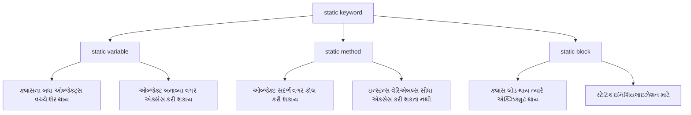
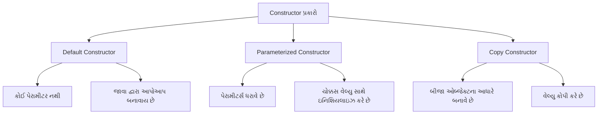
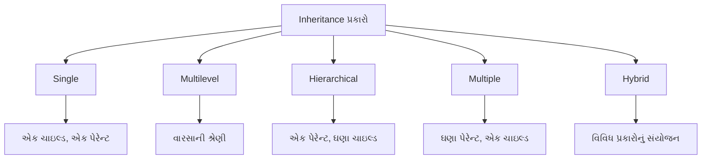
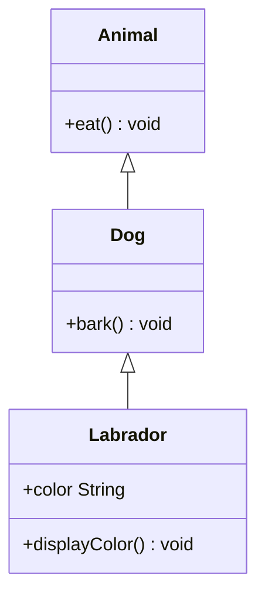
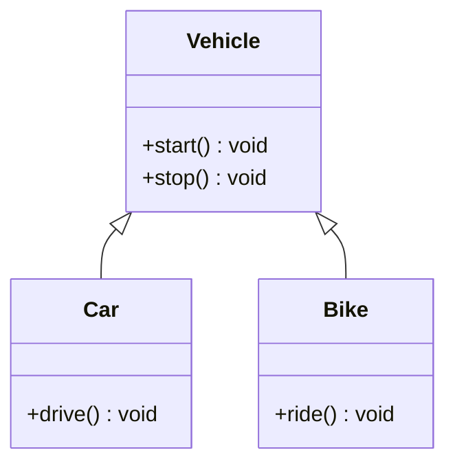

## પ્રશ્ન ૩(અ): Procedure-Oriented Programming (POP) અને Object-Oriented Programming (OOP) ના તફાવતોની યાદી આપો. (ગુણ: ૩)

### જવાબ ૩(અ):

Procedure-Oriented Programming (POP) અને Object-Oriented Programming (OOP) વચ્ચેના મુખ્ય તફાવતો:

| Procedure-Oriented Programming (POP) | Object-Oriented Programming (OOP) |
|-------------------------------------|----------------------------------|
| **ફંક્શન-કેન્દ્રિત** અભિગમ | **ઓબ્જેક્ટ-કેન્દ્રિત** અભિગમ |
| ડેટા ફંક્શન્સ વચ્ચે **મુક્તપણે ફરે** છે | ડેટા ઓબ્જેક્ટ્સમાં **એન્કેપ્સ્યુલેટેડ** હોય છે |
| **ટોપ-ડાઉન** અભિગમ અનુસરે છે | **બોટમ-અપ** અભિગમ અનુસરે છે |
| **સિક્યોરિટી** ઓછી (ડેટા ગ્લોબલ છે) | **સિક્યોરિટી** વધારે (ડેટા છુપાયેલો છે) |
| **ઇન્હેરિટન્સ**નો કોઈ ખ્યાલ નથી | **ઇન્હેરિટન્સ** અને રીયુઝેબિલિટીને સપોર્ટ કરે છે |
| ઉદાહરણ: C, FORTRAN, Pascal | ઉદાહરણ: Java, C++, Python |

**યાદ રાખવા માટે**: "**FEDSI**" - Function vs Object, Encapsulation, Design approach, Security, Inheritance

## પ્રશ્ન ૩(બ): યોગ્ય ઉદાહરણ સાથે static keyword સમજાવો. (ગુણ: ૪)

### જવાબ ૩(બ):

**static keyword** જાવામાં:



```java
public class StaticDemo {
    // Static variable - બધા ઓબ્જેક્ટ્સ શેર કરે છે
    static int count = 0;
    
    // Instance variable - દરેક ઓબ્જેક્ટ પાસે પોતાનું હોય છે
    int instanceNum;
    
    // Constructor
    StaticDemo() {
        count++;          // Static કાઉન્ટર વધારે
        instanceNum = count;  // ઇન્સ્ટન્સ નંબર એસાઇન કરે
    }
    
    // Static method
    static void displayCount() {
        System.out.println("કુલ ઓબ્જેક્ટ્સ: " + count);
        // instanceNum અહીં એક્સેસ થઈ શકતું નથી (static context)
    }
    
    public static void main(String[] args) {
        // ઓબ્જેક્ટ બનાવ્યા વગર static method કૉલ કરવી
        StaticDemo.displayCount();  // આઉટપુટ: કુલ ઓબ્જેક્ટ્સ: 0
        
        // ઓબ્જેક્ટ્સ બનાવવા
        StaticDemo obj1 = new StaticDemo();
        StaticDemo obj2 = new StaticDemo();
        
        // Static method ફરીથી કૉલ કરવી
        StaticDemo.displayCount();  // આઉટપુટ: કુલ ઓબ્જેક્ટ્સ: 2
        
        // ઓબ્જેક્ટ દ્વારા પણ static method કૉલ કરી શકાય છે
        obj1.displayCount();  // પણ આ રીતે કરવું સારું નથી
    }
}
```

**static keyword ના લાભો**:
* **મેમરી ઇફિશિયન્સી**: દરેક ઓબ્જેક્ટ માટે નવા કોપી બનાવવાની જરૂર નથી
* **આસાન એક્સેસ**: ઓબ્જેક્ટ બનાવ્યા વગર એક્સેસ થઈ શકે છે
* **શેર્ડ ડેટા**: બધા ઓબ્જેક્ટ્સ વચ્ચે ડેટા શેર કરવા માટે ઉપયોગી
* **યુટિલિટી મેથડ્સ**: ઓબ્જેક્ટ બનાવ્યા વગર કોમન ફંક્શનાલિટી પૂરી પાડે છે

**static ક્યારે વાપરવું**:
* **કોન્સ્ટન્ટ્સ** (final સાથે): PI, MAX_VALUE વગેરે
* **કાઉન્ટર્સ**: ઓબ્જેક્ટ્સની ગણતરી રાખવા
* **યુટિલિટી ક્લાસીસ**: Math ક્લાસ જેવા
* **મેઇન મેથડ**: પ્રોગ્રામનું એન્ટ્રી પોઇન્ટ

**યાદ રાખવા માટે**: "**MOCS**" - Memory efficient, Object independent, Class level, Shared

## પ્રશ્ન ૩(ક): Constructor શું છે? Constructor ના પ્રકારો જણાવો. Parameterized constructor સમજાવવા માટેનો java code વિકસાવો. (ગુણ: ૭)

### જવાબ ૩(ક):

**Constructor**: એક વિશેષ પ્રકારની મેથડ જે ઓબ્જેક્ટ બનાવાય ત્યારે તેને **ઇનિશિયલાઇઝ** કરવા માટે વપરાય છે. તે **ક્લાસના નામ** જેવું જ નામ ધરાવે છે અને **કોઈ રિટર્ન ટાઇપ** ધરાવતી નથી.



**Constructor ના પ્રકારો**:
1. **Default Constructor**: પેરામીટર્સ ધરાવતું નથી, જો કોઈ constructor ન લખો તો જાવા આપોઆપ બનાવે છે
2. **Parameterized Constructor**: પેરામીટર્સ ધરાવે છે, ઓબ્જેક્ટને ચોક્કસ વેલ્યુ સાથે ઇનિશિયલાઇઝ કરે છે
3. **Copy Constructor**: એક ઓબ્જેક્ટના આધારે બીજો ઓબ્જેક્ટ બનાવે છે

**Parameterized Constructor નો ઉદાહરણ**:

```java
public class Student {
    // ઇન્સ્ટન્સ વેરિએબલ્સ
    private int rollNo;
    private String name;
    private double marks;
    
    // Default Constructor
    public Student() {
        rollNo = 0;
        name = "Unknown";
        marks = 0.0;
        System.out.println("Default Constructor કૉલ થયો");
    }
    
    // Parameterized Constructor
    public Student(int rollNo, String name, double marks) {
        this.rollNo = rollNo;
        this.name = name;
        this.marks = marks;
        System.out.println("Parameterized Constructor કૉલ થયો");
    }
    
    // Copy Constructor
    public Student(Student other) {
        this.rollNo = other.rollNo;
        this.name = other.name;
        this.marks = other.marks;
        System.out.println("Copy Constructor કૉલ થયો");
    }
    
    // વિદ્યાર્થીની માહિતી દર્શાવવા માટેની મેથડ
    public void displayInfo() {
        System.out.println("Roll No: " + rollNo);
        System.out.println("Name: " + name);
        System.out.println("Marks: " + marks);
    }
    
    // મેઇન મેથડ
    public static void main(String[] args) {
        // Default Constructor વાપરીને ઓબ્જેક્ટ બનાવવો
        Student s1 = new Student();
        System.out.println("s1 વિદ્યાર્થીની માહિતી:");
        s1.displayInfo();
        
        System.out.println();
        
        // Parameterized Constructor વાપરીને ઓબ્જેક્ટ બનાવવો
        Student s2 = new Student(101, "રાહુલ", 85.5);
        System.out.println("s2 વિદ્યાર્થીની માહિતી:");
        s2.displayInfo();
        
        System.out.println();
        
        // Copy Constructor વાપરીને ઓબ્જેક્ટ બનાવવો
        Student s3 = new Student(s2);
        System.out.println("s3 વિદ્યાર્થીની માહિતી (s2 નકલ):");
        s3.displayInfo();
    }
}
```

**આઉટપુટ**:
```
Default Constructor કૉલ થયો
s1 વિદ્યાર્થીની માહિતી:
Roll No: 0
Name: Unknown
Marks: 0.0

Parameterized Constructor કૉલ થયો
s2 વિદ્યાર્થીની માહિતી:
Roll No: 101
Name: રાહુલ
Marks: 85.5

Copy Constructor કૉલ થયો
s3 વિદ્યાર્થીની માહિતી (s2 નકલ):
Roll No: 101
Name: રાહુલ
Marks: 85.5
```

**Constructor ની વિશેષતાઓ**:
* ક્લાસના નામ જેવું જ નામ ધરાવે છે
* કોઈ રિટર્ન ટાઇપ હોતો નથી (void પણ નહીં)
* ઓબ્જેક્ટ બનાવવામાં આવે ત્યારે આપોઆપ કૉલ થાય છે
* ઇન્સ્ટન્સ વેરિએબલ્સ ઇનિશિયલાઇઝ કરવા માટે વપરાય છે
* 'this' કીવર્ડ વાપરીને પેરામીટર અને ઇન્સ્ટન્સ વેરિએબલ્સ વચ્ચે ભેદ પાડી શકાય છે

**યાદ રાખવા માટે**: "**CONE**" - Class name, Object initialization, No return type, Executes automatically

## પ્રશ્ન ૩(ક OR): Define Inheritance. List out types of it. Explain multilevel and hierarchical inheritance with suitable example. (ગુણ: ૭)

### જવાબ ૩(ક OR):

**Inheritance (વારસો)**: એક OOP કોન્સેપ્ટ છે જેમાં એક ક્લાસ (ચાઇલ્ડ/સબક્લાસ) બીજા ક્લાસ (પેરેન્ટ/સુપરક્લાસ) ના ગુણધર્મો અને વિધિઓ મેળવે છે.



**Inheritance ના પ્રકારો**:
1. **Single Inheritance**: એક ચાઇલ્ડ ક્લાસ એક પેરેન્ટ ક્લાસથી વારસો મેળવે છે
2. **Multilevel Inheritance**: ક્લાસોની શ્રેણી જેમાં ચાઇલ્ડ પોતે પેરેન્ટ બને (A → B → C)
3. **Hierarchical Inheritance**: એક પેરેન્ટથી ઘણા ચાઇલ્ડ ક્લાસો વારસો મેળવે છે
4. **Multiple Inheritance**: એક ચાઇલ્ડ ક્લાસ ઘણા પેરેન્ટથી વારસો મેળવે છે (જાવામાં ફક્ત ઇન્ટરફેસ દ્વારા)
5. **Hybrid Inheritance**: ઉપરના ઘણા પ્રકારોનું સંયોજન

**Multilevel Inheritance ઉદાહરણ**:



```java
// પેરેન્ટ ક્લાસ
class Animal {
    void eat() {
        System.out.println("પ્રાણી ખાય છે");
    }
}

// મધ્યવર્તી ક્લાસ (પેરેન્ટથી વારસો મેળવે છે અને ચાઇલ્ડનો પેરેન્ટ બને છે)
class Dog extends Animal {
    void bark() {
        System.out.println("કૂતરો ભસે છે");
    }
}

// ચાઇલ્ડ ક્લાસ
class Labrador extends Dog {
    String color;
    
    Labrador(String color) {
        this.color = color;
    }
    
    void displayColor() {
        System.out.println("લેબ્રાડોરનો રંગ " + color + " છે");
    }
}

// મેઇન ક્લાસ
public class MultilevelInheritanceDemo {
    public static void main(String[] args) {
        // Labrador ઓબ્જેક્ટ બનાવવો
        Labrador lab = new Labrador("બ્રાઉન");
        
        // Animal ક્લાસથી મેળવેલી મેથડ
        lab.eat();
        
        // Dog ક્લાસથી મેળવેલી મેથડ
        lab.bark();
        
        // Labrador ની પોતાની મેથડ
        lab.displayColor();
    }
}
```

**Hierarchical Inheritance ઉદાહરણ**:



```java
// પેરેન્ટ ક્લાસ
class Vehicle {
    void start() {
        System.out.println("વાહન શરૂ થયું");
    }
    
    void stop() {
        System.out.println("વાહન બંધ થયું");
    }
}

// ચાઇલ્ડ ક્લાસ 1
class Car extends Vehicle {
    void drive() {
        System.out.println("કાર ચલાવવામાં આવી રહી છે");
    }
}

// ચાઇલ્ડ ક્લાસ 2
class Bike extends Vehicle {
    void ride() {
        System.out.println("બાઇક ચલાવવામાં આવી રહી છે");
    }
}

// મેઇન ક્લાસ
public class HierarchicalInheritanceDemo {
    public static void main(String[] args) {
        // Car ઓબ્જેક્ટ બનાવવો
        Car car = new Car();
        System.out.println("કાર:");
        car.start();  // Vehicle ક્લાસથી મેળવેલી મેથડ
        car.drive();  // Car ની પોતાની મેથડ
        car.stop();   // Vehicle ક્લાસથી મેળવેલી મેથડ
        
        System.out.println();
        
        // Bike ઓબ્જેક્ટ બનાવવો
        Bike bike = new Bike();
        System.out.println("બાઇક:");
        bike.start();  // Vehicle ક્લાસથી મેળવેલી મેથડ
        bike.ride();   // Bike ની પોતાની મેથડ
        bike.stop();   // Vehicle ક્લાસથી મેળવેલી મેથડ
    }
}
```

**Inheritance ના ફાયદા**:
* **કોડ રીયુઝેબિલિટી**: એક વાર લખો, વારંવાર વાપરો
* **કોડ ઓર્ગેનાઇઝેશન**: લોજિકલ હાયરાર્કી બનાવે છે
* **IS-A રિલેશનશિપ**: વાસ્તવિક દુનિયાના સંબંધોનું મોડેલિંગ
* **મેથડ ઓવરરાઇડિંગ**: પેરેન્ટની મેથડથી અલગ વર્તન

**યાદ રાખવા માટે**: "**SMILE H**" - Single, Multilevel, Inheritance, Logical hierarchy, Extends keyword, Hierarchical