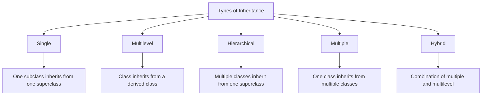

## Question 3(a): List out different types of inheritance and explain any one with example. (Marks: 03)

### Answer 3(a):

**Types of Inheritance in Java**:



| Type | Description |
|------|-------------|
| **Single** | One subclass inherits from one superclass |
| **Multilevel** | Class inherits from a derived class |
| **Hierarchical** | Multiple classes inherit from one superclass |
| **Multiple** | One class inherits from multiple classes (through interfaces in Java) |
| **Hybrid** | Combination of multiple and multilevel inheritance |

**Single Inheritance Example**:
```java
// Parent class
class Animal {
    void eat() {
        System.out.println("Animal is eating");
    }
}

// Child class inheriting from Animal
class Dog extends Animal {
    void bark() {
        System.out.println("Dog is barking");
    }
}

// Usage
class InheritanceDemo {
    public static void main(String[] args) {
        Dog d = new Dog();
        d.eat();  // Inherited from Animal class
        d.bark(); // Dog's own method
    }
}
```

**Mnemonic**: "**SIMHH**" - Single, Inheritance, Multiple, Hierarchical, Hybrid

## Question 3(b): Explain any two String buffer class methods with suitable example. (Marks: 04)

### Answer 3(b):

**StringBuffer Class Methods**:

1. **append()**: Adds characters to the end of StringBuffer
2. **insert()**: Inserts characters at specified position

```java
public class StringBufferDemo {
    public static void main(String[] args) {
        // Create StringBuffer object
        StringBuffer sb = new StringBuffer("Hello");
        
        // 1. append() method
        sb.append(" World");
        System.out.println("After append: " + sb);  // Output: Hello World
        
        // 2. insert() method
        sb.insert(5, " Java");
        System.out.println("After insert: " + sb);  // Output: Hello Java World
        
        // Additional information about StringBuffer
        System.out.println("Length: " + sb.length());
        System.out.println("Capacity: " + sb.capacity());
    }
}
```

**Other Important StringBuffer Methods**:
* **delete(int start, int end)**: Removes characters
* **reverse()**: Reverses the characters
* **replace(int start, int end, String str)**: Replaces characters
* **capacity()**: Returns current capacity

## Question 3(c): Define Interface. Write a java program to demonstrate multiple inheritance using interface. (Marks: 07)

### Answer 3(c):

**Interface**: A blueprint of a class that contains **abstract methods** and **constants**. It represents "what" a class does, not "how". It supports **multiple inheritance** in Java.

**Characteristics**:
* All methods are **public** and **abstract** by default
* All variables are **public**, **static**, and **final** by default
* Cannot be instantiated (no objects)
* Implemented using the **implements** keyword

```java
// First interface
interface Drawable {
    void draw();  // Abstract method
    
    // Constant
    int SIZE = 10;
}

// Second interface
interface Colorable {
    void setColor(String color);  // Abstract method
}

// Class implementing multiple interfaces (multiple inheritance)
class Circle implements Drawable, Colorable {
    private String color;
    
    // Implementing Drawable interface method
    @Override
    public void draw() {
        System.out.println("Drawing a circle with size " + SIZE);
    }
    
    // Implementing Colorable interface method
    @Override
    public void setColor(String color) {
        this.color = color;
        System.out.println("Circle color set to " + color);
    }
    
    // Additional method
    public void displayInfo() {
        System.out.println("This is a " + color + " circle");
    }
}

// Main class
public class InterfaceDemo {
    public static void main(String[] args) {
        Circle c = new Circle();
        c.draw();          // From Drawable interface
        c.setColor("Red"); // From Colorable interface
        c.displayInfo();   // Circle's own method
        
        // Using interface reference variables
        Drawable d = new Circle();
        d.draw();  // Can call only Drawable methods
        
        Colorable col = new Circle();
        col.setColor("Blue");  // Can call only Colorable methods
    }
}
```

**Mnemonic for Interface**: "**CAMP**" - Constants, Abstract methods, Multiple inheritance, Public

## Question 3(a OR): Give differences between Abstract class and Interface. (Marks: 03)

### Answer 3(a OR):

| Abstract Class | Interface |
|----------------|-----------|
| Uses **abstract** keyword | Uses **interface** keyword |
| Can have **abstract and non-abstract** methods | All methods are **abstract** by default (prior to Java 8) |
| Can have **constructors** | **Cannot** have constructors |
| Supports **partial implementation** | Provides **full abstraction** |
| **Single inheritance** only | Supports **multiple inheritance** |
| Can have **instance variables** | Variables are **static and final** only |
| Methods can have **any access modifier** | Methods are **public** by default |

**Mnemonic**: "**CAMP vs SCIM**" 
* For Interface: Constants, Abstract methods, Multiple inheritance, Public
* For Abstract: Some implementation, Constructors, Instance variables, Mixed access

## Question 3(b OR): Explain any two String class methods with suitable example. (Marks: 04)

### Answer 3(b OR):

**String Class Methods**:

1. **substring()**: Extracts a portion of a string
2. **equals()**: Compares string content

```java
public class StringMethodsDemo {
    public static void main(String[] args) {
        String str = "Hello Java Programming";
        
        // 1. substring() method
        String sub1 = str.substring(6);       // From index 6 to end
        String sub2 = str.substring(6, 10);   // From index 6 to 9
        
        System.out.println("Original: " + str);
        System.out.println("substring(6): " + sub1);      // Output: Java Programming
        System.out.println("substring(6, 10): " + sub2);  // Output: Java
        
        // 2. equals() method
        String s1 = "Java";
        String s2 = "java";
        String s3 = "Java";
        String s4 = new String("Java");
        
        System.out.println("s1.equals(s2): " + s1.equals(s2));         // false
        System.out.println("s1.equals(s3): " + s1.equals(s3));         // true
        System.out.println("s1.equals(s4): " + s1.equals(s4));         // true
        System.out.println("s1.equalsIgnoreCase(s2): " + s1.equalsIgnoreCase(s2)); // true
        System.out.println("s1 == s3: " + (s1 == s3));                 // true
        System.out.println("s1 == s4: " + (s1 == s4));                 // false (different objects)
    }
}
```

**Other Important String Methods**:
* **length()**: Returns string length
* **charAt()**: Returns character at specific position
* **indexOf()**: Returns index of a substring
* **concat()**: Concatenates strings
* **replace()**: Replaces characters/substrings

## Question 3(c OR): Explain package and list out steps to create package with suitable example. (Marks: 07)

### Answer 3(c OR):

**Package**: A namespace that organizes a set of related classes and interfaces. It helps in **avoiding naming conflicts** and **managing access control**.

**Benefits of Packages**:
* **Namespace management**: Prevents naming conflicts
* **Access control**: Controls visibility of classes
* **Code organization**: Groups related classes

**Steps to Create and Use Package**:

1. **Declare** the package at the beginning of the file
2. **Save** the file with proper directory structure
3. **Compile** the file with proper package structure
4. **Use** the package by importing it

```java
// Step 1: Declare package (save as Calculator.java)
package com.mymath.util;

public class Calculator {
    // Calculator methods
    public int add(int a, int b) {
        return a + b;
    }
    
    public int subtract(int a, int b) {
        return a - b;
    }
    
    public int multiply(int a, int b) {
        return a * b;
    }
    
    public int divide(int a, int b) {
        if (b == 0) {
            System.out.println("Cannot divide by zero");
            return 0;
        }
        return a / b;
    }
}

// Step 4: Use the package (save as PackageDemo.java)
// Different file that uses the package
import com.mymath.util.Calculator;

public class PackageDemo {
    public static void main(String[] args) {
        // Create object of the Calculator class
        Calculator calc = new Calculator();
        
        // Use methods
        System.out.println("10 + 5 = " + calc.add(10, 5));
        System.out.println("10 - 5 = " + calc.subtract(10, 5));
        System.out.println("10 * 5 = " + calc.multiply(10, 5));
        System.out.println("10 / 5 = " + calc.divide(10, 5));
    }
}
```

**Terminal Commands for Steps 2 & 3**:
```
# Create directory structure
mkdir -p com/mymath/util

# Move source file to appropriate directory
mv Calculator.java com/mymath/util/

# Compile with proper directory structure
javac com/mymath/util/Calculator.java

# Compile and run the main class
javac PackageDemo.java
java PackageDemo
```

**Mnemonic for Package Creation**: "**DCCU**" - Declare, Create directory, Compile, Use/import
