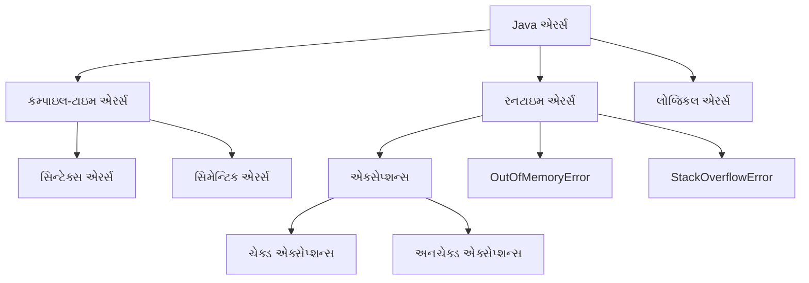
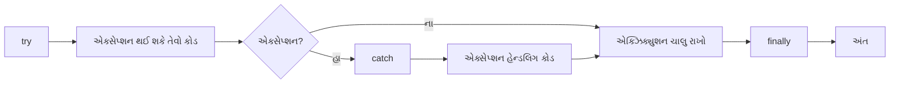
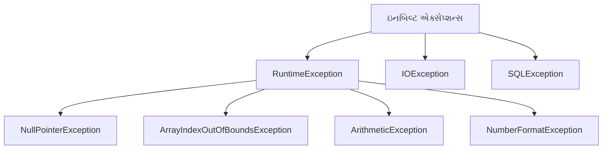
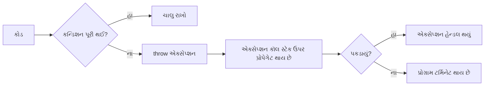
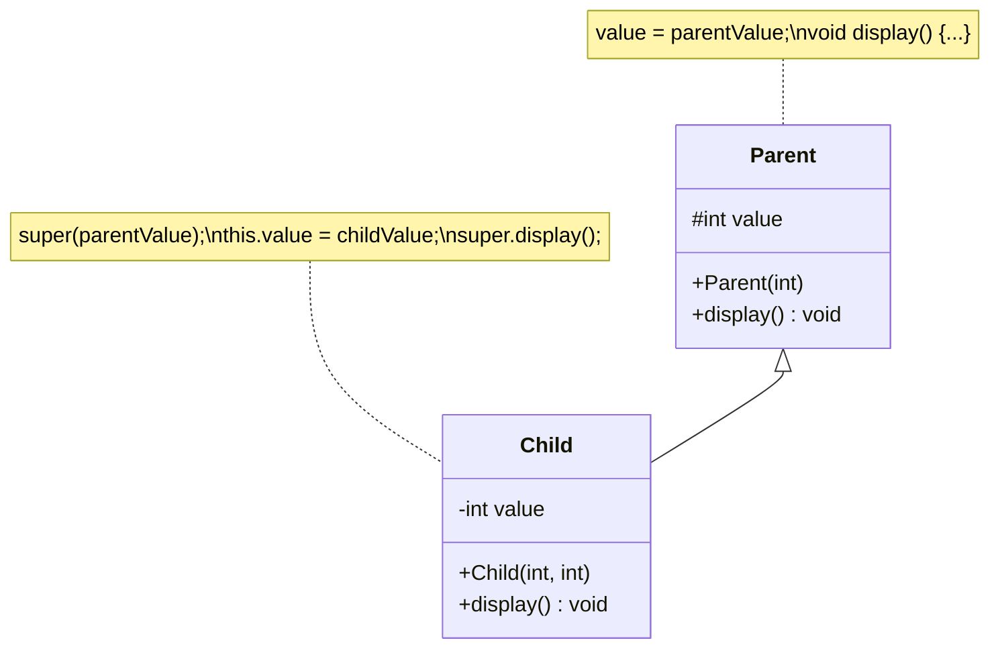

## પ્રશ્ન 4(a): જાવામાં એરર્સના પ્રકારો જણાવો. (ગુણ: 03)

### જવાબ 4(a):

**જાવામાં એરર્સના પ્રકારો**:



**ટૂંકું વર્ણન**:
* **કમ્પાઇલ-ટાઇમ એરર્સ**: કમ્પાઇલેશન દરમિયાન શોધાય છે
  * **સિન્ટેક્સ એરર્સ**: ખોટો સિન્ટેક્સ/ગ્રામર
  * **સિમેન્ટિક એરર્સ**: ખોટા ટાઇપ્સ, ઘોષિત ન કરેલા વેરિએબલ્સ
* **રનટાઇમ એરર્સ**: પ્રોગ્રામ એક્ઝિક્યુશન દરમિયાન થાય છે
  * **એક્સેપ્શન્સ**: IOException, NullPointerException
* **લોજિકલ એરર્સ**: પ્રોગ્રામ ચાલે છે પરંતુ ખોટાં પરિણામો આપે છે

**યાદ રાખવા માટેની ટ્રિક**: "**CRL**" - Compile-time, Runtime, Logical

## પ્રશ્ન 4(b): try catch બ્લોક ઉદાહરણ સાથે સમજાવો. (ગુણ: 04)

### જવાબ 4(b):

**Try-Catch બ્લોક**: પ્રોગ્રામ એક્ઝિક્યુશન દરમિયાન થઈ શકે તેવા રનટાઇમ એક્સેપ્શન્સને હેન્ડલ કરવાનો એક મેકેનિઝમ.



**ઉદાહરણ કોડ**:
```java
public class TryCatchDemo {
    public static void main(String[] args) {
        try {
            // એક્સેપ્શન થઈ શકે તેવો કોડ
            int[] numbers = {1, 2, 3};
            System.out.println("એલિમેન્ટ ઍક્સેસ કરી રહ્યા છીએ: " + numbers[5]); // ArrayIndexOutOfBoundsException
            
            // જો ઉપર એક્સેપ્શન થાય તો આ લાઇન એક્ઝિક્યુટ નહીં થાય
            System.out.println("આ પ્રિન્ટ નહીં થાય");
        } 
        catch (ArrayIndexOutOfBoundsException e) {
            // એક્સેપ્શન હેન્ડલિંગ કોડ
            System.out.println("એક્સેપ્શન પકડાયું: એરે ઇન્ડેક્સ બાઉન્ડ્સની બહાર છે");
            System.out.println("એરર મેસેજ: " + e.getMessage());
        }
        
        // પ્રોગ્રામ એક્ઝિક્યુશન ચાલુ રાખે છે
        System.out.println("એક્સેપ્શન હેન્ડલિંગ પછી પ્રોગ્રામ ચાલુ રહે છે");
    }
}
```

**મુખ્ય મુદ્દાઓ**:
* **try**: એવો કોડ ધરાવે છે જે એક્સેપ્શન થ્રો કરી શકે છે
* **catch**: try બ્લોકમાં થતા ચોક્કસ એક્સેપ્શન્સને હેન્ડલ કરે છે
* **finally**: (વૈકલ્પિક) એક્સેપ્શન થાય કે ન થાય, હંમેશા એક્ઝિક્યુટ થાય છે
* અલગ અલગ એક્સેપ્શન ટાઇપ્સને હેન્ડલ કરવા માટે મલ્ટિપલ catch બ્લોક્સ હોઈ શકે છે

## પ્રશ્ન 4(c): મેથડ ઓવરલોડિંગ અને ઓવરરાઇડિંગ વચ્ચેના કોઈપણ ચાર તફાવતો જણાવો. મેથડ ઓવરરાઇડિંગ સમજાવવા માટે એક જાવા કોડ લખો. (ગુણ: 07)

### જવાબ 4(c):

**મેથડ ઓવરલોડિંગ અને ઓવરરાઇડિંગ વચ્ચેના તફાવતો**:

| મેથડ ઓવરલોડિંગ | મેથડ ઓવરરાઇડિંગ |
|-------------------|-------------------|
| **એક જ ક્લાસ**માં | **પેરન્ટ-ચાઇલ્ડ ક્લાસ**નો સંબંધ |
| **અલગ પેરામીટર્સ** (સંખ્યા, ટાઇપ, ક્રમ) | **સરખા પેરામીટર્સ** અને રિટર્ન ટાઇપ |
| **કમ્પાઇલ-ટાઇમ** પર રિઝોલ્વ થાય છે | **રનટાઇમ** પર રિઝોલ્વ થાય છે |
| મેથડ **રીડેબિલિટી** વધારે છે | **પોલિમોર્ફિઝમ**ને સપોર્ટ કરે છે |

```mermaid
classDiagram
    class Animal {
        +makeSound() void
    }
    class Dog {
        +makeSound() void
    }
    class Cat {
        +makeSound() void
    }
    Animal <|-- Dog
    Animal <|-- Cat
    
    note for Animal "public void makeSound(){\n  System.out.println(\"Animal sound\");\n}"
    note for Dog "public void makeSound(){\n  System.out.println(\"Woof\");\n}"
    note for Cat "public void makeSound(){\n  System.out.println(\"Meow\");\n}"
```

**મેથડ ઓવરરાઇડિંગ સમજાવવા માટે જાવા કોડ**:

```java
// પેરન્ટ ક્લાસ
class Animal {
    // ઓવરરાઇડ થનારી મેથડ
    public void makeSound() {
        System.out.println("પ્રાણી અવાજ કરે છે");
    }
}

// ચાઇલ્ડ ક્લાસ 1
class Dog extends Animal {
    // પેરન્ટ ક્લાસની મેથડ ઓવરરાઇડ કરવી
    @Override
    public void makeSound() {
        System.out.println("કૂતરો ભસે છે: ભૌ! ભૌ!");
    }
}

// ચાઇલ્ડ ક્લાસ 2
class Cat extends Animal {
    // પેરન્ટ ક્લાસની મેથડ ઓવરરાઇડ કરવી
    @Override
    public void makeSound() {
        System.out.println("બિલાડી મ્યાઉં કરે છે: મ્યાઉં!");
    }
}

// મુખ્ય ક્લાસ
public class OverridingDemo {
    public static void main(String[] args) {
        // પેરન્ટ ક્લાસ રેફરન્સ અને ઓબ્જેક્ટ
        Animal a1 = new Animal();
        a1.makeSound();  // આઉટપુટ: પ્રાણી અવાજ કરે છે
        
        // ચાઇલ્ડ ક્લાસ ઓબ્જેક્ટ્સ
        Dog d1 = new Dog();
        d1.makeSound();  // આઉટપુટ: કૂતરો ભસે છે: ભૌ! ભૌ!
        
        Cat c1 = new Cat();
        c1.makeSound();  // આઉટપુટ: બિલાડી મ્યાઉં કરે છે: મ્યાઉં!
        
        // પોલિમોર્ફિક બિહેવિયર - પેરન્ટ રેફરન્સ, ચાઇલ્ડ ઓબ્જેક્ટ્સ
        Animal a2 = new Dog();
        a2.makeSound();  // આઉટપુટ: કૂતરો ભસે છે: ભૌ! ભૌ!
        
        Animal a3 = new Cat();
        a3.makeSound();  // આઉટપુટ: બિલાડી મ્યાઉં કરે છે: મ્યાઉં!
    }
}
```

**મેથડ ઓવરરાઇડિંગ માટે યાદ રાખવાની ટ્રિક**: "**SOAP**" - Same method, Object of child, After inheritance, Polymorphism

## પ્રશ્ન 4(a OR): કોઈપણ ચાર ઇનબિલ્ટ એક્સેપ્શન્સ જણાવો. (ગુણ: 03)

### જવાબ 4(a OR):

**જાવામાં ઇનબિલ્ટ એક્સેપ્શન્સ**:



**સામાન્ય ઇનબિલ્ટ એક્સેપ્શન્સ**:
1. **NullPointerException**: જ્યારે null ઓબ્જેક્ટ રેફરન્સનો ઉપયોગ કરવાનો પ્રયાસ કરવામાં આવે
2. **ArrayIndexOutOfBoundsException**: જ્યારે અમાન્ય એરે ઇન્ડેક્સ ઍક્સેસ કરવામાં આવે
3. **ArithmeticException**: શૂન્યથી ભાગાકાર જેવી ગાણિતિક ભૂલો માટે
4. **NumberFormatException**: જ્યારે અમાન્ય સ્ટ્રિંગને નંબરમાં કન્વર્ટ કરવાનો પ્રયાસ કરવામાં આવે
5. **IOException**: જ્યારે I/O ઓપરેશન નિષ્ફળ જાય
6. **ClassNotFoundException**: જ્યારે અસ્તિત્વમાં ન હોય તેવા ક્લાસને ઍક્સેસ કરવાનો પ્રયાસ કરવામાં આવે
7. **IllegalArgumentException**: જ્યારે મેથડમાં અમાન્ય આર્ગ્યુમેન્ટ પાસ કરવામાં આવે

**યાદ રાખવા માટેની ટ્રિક**: "**NANI-CIL**" - NullPointer, ArrayIndexOutOfBounds, NumberFormat, IOException, ClassNotFound, IllegalArgument

## પ્રશ્ન 4(b OR): "throw" કીવર્ડ યોગ્ય ઉદાહરણ સાથે સમજાવો. (ગુણ: 04)

### જવાબ 4(b OR):

**Throw કીવર્ડ**: મેથડ અથવા કોડ બ્લોકમાંથી એક્સેપ્શન સ્પષ્ટપણે થ્રો કરવા માટે વપરાય છે.



**ઉદાહરણ કોડ**:
```java
public class ThrowDemo {
    // એક્સેપ્શન થ્રો કરતી મેથડ
    static void checkAge(int age) {
        if (age < 18) {
            // સ્પષ્ટપણે એક્સેપ્શન થ્રો કરો
            throw new ArithmeticException("એક્સેસ નામંજૂર - તમારી ઉંમર ઓછામાં ઓછી 18 વર્ષ હોવી જોઈએ.");
        } else {
            System.out.println("એક્સેસ મંજૂર - તમે પૂરતા મોટા છો!");
        }
    }
    
    public static void main(String[] args) {
        try {
            // checkAge મેથડ ટેસ્ટ કરો
            checkAge(15);  // આ એક્સેપ્શન થ્રો કરશે
        } catch (ArithmeticException e) {
            System.out.println("એક્સેપ્શન પકડાયું: " + e.getMessage());
        }
        
        System.out.println("પ્રોગ્રામ ચાલુ રહે છે...");
    }
}
```

**આઉટપુટ**:
```
એક્સેપ્શન પકડાયું: એક્સેસ નામંજૂર - તમારી ઉંમર ઓછામાં ઓછી 18 વર્ષ હોવી જોઈએ.
પ્રોગ્રામ ચાલુ રહે છે...
```

**મુખ્ય મુદ્દાઓ**:
* **throw** નવો એક્સેપ્શન ઓબ્જેક્ટ બનાવે છે અને થ્રો કરે છે
* **બિલ્ટ-ઇન** અથવા **કસ્ટમ એક્સેપ્શન્સ** થ્રો કરી શકાય છે
* **try-catch** દ્વારા હેન્ડલ કરવું જોઈએ અથવા **throws** સાથે ડિક્લેર કરવું જોઈએ
* **કસ્ટમ વેલિડેશન** અને એરર હેન્ડલિંગ માટે વપરાય છે

## પ્રશ્ન 4(c OR): 'this' કીવર્ડ અને 'super' કીવર્ડની તુલના કરો. યોગ્ય ઉદાહરણ સાથે super કીવર્ડ સમજાવો. (ગુણ: 07)

### જવાબ 4(c OR):

**'this' અને 'super' કીવર્ડની તુલના**:

| 'this' કીવર્ડ | 'super' કીવર્ડ |
|----------------|-----------------|
| **વર્તમાન ક્લાસના ઓબ્જેક્ટ**નો સંદર્ભ આપે છે | **પેરન્ટ ક્લાસના ઓબ્જેક્ટ**નો સંદર્ભ આપે છે |
| **વર્તમાન ક્લાસના મેમ્બર્સ** ઍક્સેસ કરવા વપરાય છે | **પેરન્ટ ક્લાસના મેમ્બર્સ** ઍક્સેસ કરવા વપરાય છે |
| **કન્સ્ટ્રક્ટર્સ**, **મેથડ્સ**, **વેરિએબલ્સ** સાથે વપરાય છે | **કન્સ્ટ્રક્ટર્સ**, **મેથડ્સ**, **વેરિએબલ્સ** સાથે વપરાય છે |
| **સ્ટેટિક કોન્ટેક્સ્ટ**માં વાપરી શકાતું નથી | **સ્ટેટિક કોન્ટેક્સ્ટ**માં વાપરી શકાતું નથી |
| **વેરિએબલ શેડોઇંગ દૂર કરવા** વપરાય છે | **ઓવરરાઇડેડ મેથડ્સ ઍક્સેસ** કરવા વપરાય છે |



**'super' કીવર્ડ સમજાવવા માટે જાવા કોડ**:

```java
// પેરન્ટ ક્લાસ
class Person {
    // ઇન્સ્ટન્સ વેરિએબલ્સ
    String name;
    int age;
    
    // કન્સ્ટ્રક્ટર
    Person(String name, int age) {
        this.name = name;
        this.age = age;
    }
    
    // મેથડ
    void display() {
        System.out.println("નામ: " + name);
        System.out.println("ઉંમર: " + age);
    }
}

// ચાઇલ્ડ ક્લાસ
class Student extends Person {
    // વધારાનું ઇન્સ્ટન્સ વેરિએબલ
    String course;
    
    // super વાપરતો કન્સ્ટ્રક્ટર
    Student(String name, int age, String course) {
        // પેરન્ટ કન્સ્ટ્રક્ટર કૉલ કરો
        super(name, age);
        this.course = course;
    }
    
    // પેરન્ટ મેથડ ઓવરરાઇડ કરવી
    @Override
    void display() {
        // પેરન્ટ મેથડ કૉલ કરો
        super.display();
        // વધારાની માહિતી ઉમેરો
        System.out.println("કોર્સ: " + course);
    }
    
    // વેરિએબલ શેડોઇંગ બતાવવા માટે મેથડ
    void displayAge(int age) {
        System.out.println("લોકલ ઉંમર: " + age);
        System.out.println("આ ઓબ્જેક્ટની ઉંમર: " + this.age);
        System.out.println("પેરન્ટ ક્લાસની ઉંમર: " + super.age); // આ કેસમાં this.age જેવું જ છે
    }
}

// મુખ્ય ક્લાસ
public class SuperDemo {
    public static void main(String[] args) {
        // Student ઓબ્જેક્ટ બનાવો
        Student s = new Student("જોન", 20, "જાવા પ્રોગ્રામિંગ");
        
        // ઓવરરાઇડેડ મેથડ કૉલ કરો
        s.display();
        
        // લોકલ વેરિએબલ શેડોઇંગ સાથે મેથડ ટેસ્ટ કરો
        s.displayAge(25);
    }
}
```

**આઉટપુટ**:
```
નામ: જોન
ઉંમર: 20
કોર્સ: જાવા પ્રોગ્રામિંગ
લોકલ ઉંમર: 25
આ ઓબ્જેક્ટની ઉંમર: 20
પેરન્ટ ક્લાસની ઉંમર: 20
```

**'super' કીવર્ડના ઉપયોગો**:
* **super()**: પેરન્ટ કન્સ્ટ્રક્ટર કૉલ કરવા
* **super.variable**: પેરન્ટ વેરિએબલ ઍક્સેસ કરવા
* **super.method()**: પેરન્ટ મેથડ કૉલ કરવા

**યાદ રાખવા માટેની ટ્રિક**: "**CVM**" - Constructor, Variables, Methods (this અને super બંને માટે)