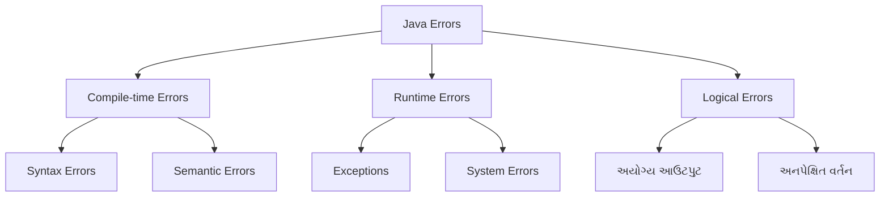
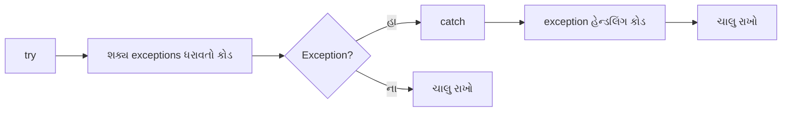
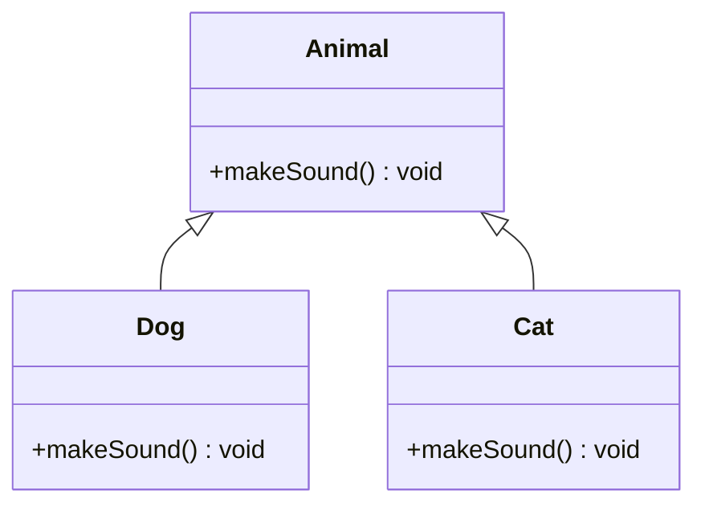
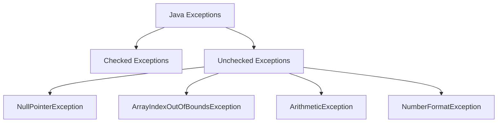
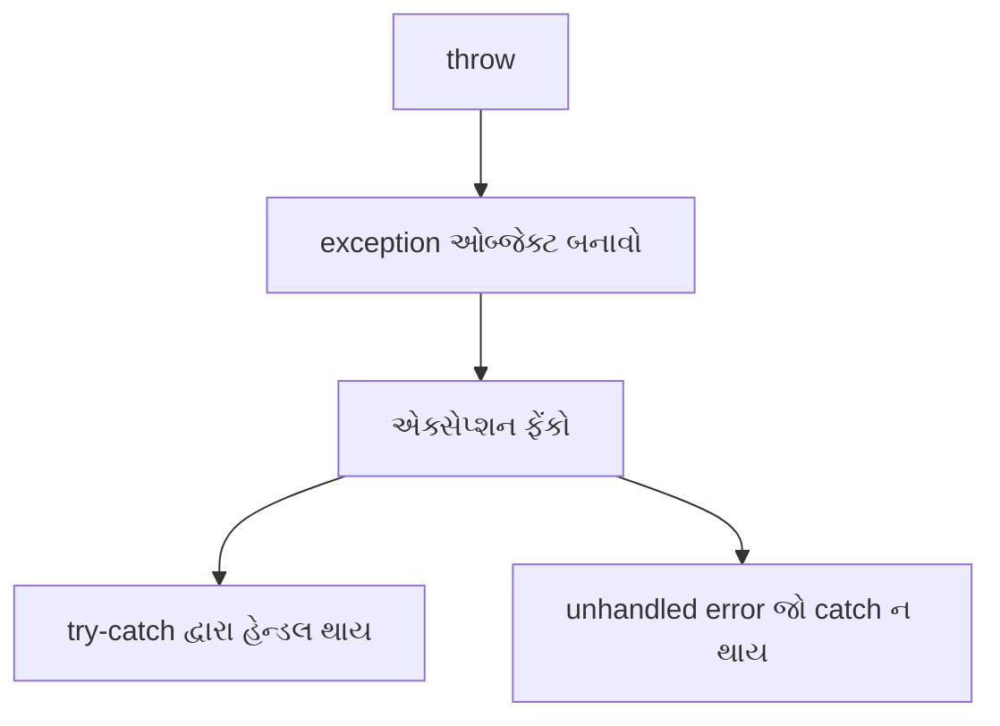
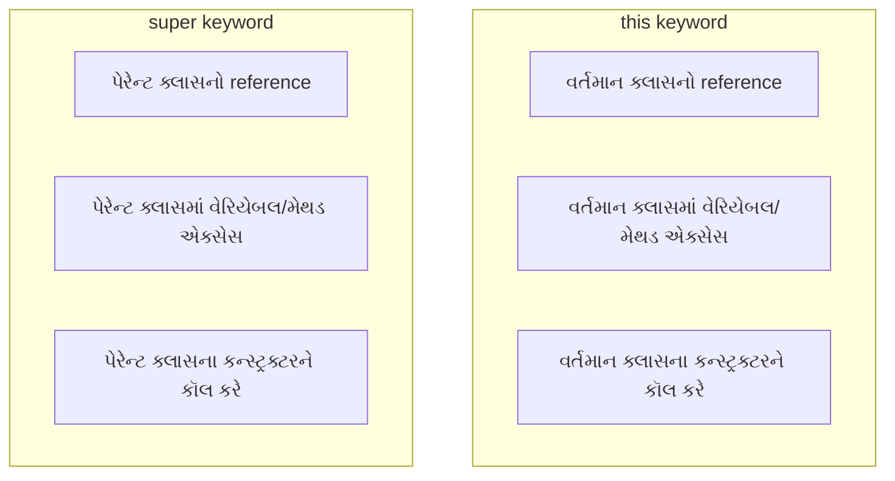

## પ્રશ્ન ૪(અ): જાવામાં error ના પ્રકારોની યાદી આપો. (ગુણ: ૩)

### જવાબ ૪(અ):

જાવામાં ત્રણ મુખ્ય પ્રકારના errors હોય છે:



**1. Compile-time Errors (કમ્પાઇલ-ટાઇમ ભૂલો)**:
* **Syntax Errors**: જાવાના વ્યાકરણની ભૂલો જેમ કે સેમિકોલન ભૂલવું, બ્રેકેટ્સ મેચ ન થવા
* **Semantic Errors**: અયોગ્ય ટાઇપનો ઉપયોગ, અવ્યાખ્યાયિત વેરિએબલ્સનો ઉપયોગ, type casting ભૂલો

**2. Runtime Errors (રનટાઇમ ભૂલો)**:
* **Exceptions**: પ્રોગ્રામ એક્ઝિક્યુશન દરમિયાન થતી ભૂલો (ArrayIndexOutOfBoundsException, NullPointerException)
* **System Errors**: સિસ્ટમ રિસોર્સ સાથે સંબંધિત ભૂલો (OutOfMemoryError, StackOverflowError)

**3. Logical Errors (લોજિકલ ભૂલો)**:
* તકઃનિકી રીતે સાચું પરંતુ કોડ અયોગ્ય આઉટપુટ દે છે
* પ્રોગ્રામની લોજિક સાથે સંબંધિત ભૂલો, જેવી કે ખોટી ફોર્મ્યુલા વાપરવી
* ડિબગિંગ દ્વારા શોધવી સૌથી અઘરી ભૂલો

**યાદ રાખવા માટે**: "**CRL**" - Compile-time, Runtime, Logical

## પ્રશ્ન ૪(બ): try catch block યોગ્ય ઉદાહરણ સાથે સમજાવો. (ગુણ: ૪)

### જવાબ ૪(બ):

**try-catch block** એ જાવામાં એક્સેપ્શન હેન્ડલિંગ માટે વપરાતી મેકેનિઝમ છે.



**વિસ્તૃત સમજૂતી**:
* **try block**: એક્સેપ્શન થઈ શકે તેવો કોડ ધરાવે છે
* **catch block**: try block માં થયેલા ચોક્કસ એક્સેપ્શનને પકડે અને હેન્ડલ કરે છે
* **finally block**: (વૈકલ્પિક) એક્સેપ્શન થાય કે ન થાય, હંમેશાં ચાલે છે

**ઉદાહરણ**:
```java
public class TryCatchDemo {
    public static void main(String[] args) {
        try {
            // Exception થઈ શકે તેવો કોડ
            int[] numbers = {1, 2, 3};
            System.out.println("એલિમેન્ટ એક્સેસ કરી રહ્યાં છીએ: " + numbers[5]); // ArrayIndexOutOfBoundsException
            
            // જો ઉપર exception થાય તો આ લાઇન એક્ઝિક્યુટ નહીં થાય
            System.out.println("આ પ્રિન્ટ નહીં થાય");
        } 
        catch (ArrayIndexOutOfBoundsException e) {
            // Exception હેન્ડલિંગ કોડ
            System.out.println("Exception પકડાયું: એરે ઇન્ડેક્સ રેન્જ બહાર છે");
            System.out.println("એરર મેસેજ: " + e.getMessage());
        }
        catch (Exception e) {
            // અન્ય કોઈ પણ exception માટે જનરલ હેન્ડલર
            System.out.println("અન્ય exception પકડાયું: " + e.getMessage());
        }
        finally {
            // હંમેશાં એક્ઝિક્યુટ થશે
            System.out.println("finally block એક્ઝિક્યુટ થયો");
            // રિસોર્સીસ ક્લોઝ કરવા માટે વપરાય છે
        }
        
        // પ્રોગ્રામ એક્ઝિક્યુશન ચાલુ રહે છે
        System.out.println("exception હેન્ડલિંગ પછી પ્રોગ્રામ ચાલુ રહે છે");
    }
}
```

**આઉટપુટ**:
```
Exception પકડાયું: એરે ઇન્ડેક્સ રેન્જ બહાર છે
એરર મેસેજ: Index 5 out of bounds for length 3
finally block એક્ઝિક્યુટ થયો
exception હેન્ડલિંગ પછી પ્રોગ્રામ ચાલુ રહે છે
```

**નોંધ**: try-catch block દ્વારા કોઈપણ પ્રોગ્રામમાં શક્ય exceptions ને સુવ્યવસ્થિત રીતે હેન્ડલ કરી શકાય છે, જેથી પ્રોગ્રામ અચાનક ક્રેશ ન થાય.

**યાદ રાખવા માટે**: "**TCF**" - Try risky code, Catch specific exceptions, Finally clean up

## પ્રશ્ન ૪(ક): method overloading અને overriding વચ્ચેના કોઈપણ ચાર તફાવત આપો. method overriding સમજાવવા માટેનો java program લખો. (ગુણ: ૭)

### જવાબ ૪(ક):

**Method Overloading અને Method Overriding વચ્ચેના તફાવતો**:

| Method Overloading | Method Overriding |
|-------------------|-------------------|
| **એક જ ક્લાસમાં** થાય છે | **પેરેન્ટ-ચાઇલ્ડ ક્લાસ** સંબંધમાં થાય છે |
| **અલગ પેરામીટર્સ** (સંખ્યા, પ્રકાર, ક્રમ) | **સમાન પેરામીટર્સ** અને રિટર્ન ટાઇપ |
| **કમ્પાઇલ-ટાઇમે** રિઝોલ્વ થાય છે | **રનટાઇમે** રિઝોલ્વ થાય છે |
| **મેથડ વાંચવામાં** આસાની માટે | **પોલીમોર્ફિઝમ** સપોર્ટ કરે છે |
| **static, final, private** મેથડ્સ ઓવરલોડ થઈ શકે છે | **static, final, private** મેથડ્સ ઓવરરાઇડ થઈ શકતી નથી |
| ઇન્હેરિટન્સની **જરૂર નથી** | ઇન્હેરિટન્સ **જરૂરી છે** |



**Method Overriding દર્શાવતો Java Program**:

```java
// પેરેન્ટ ક્લાસ
class Vehicle {
    // ઓવરરાઇડ થનારી મેથડ
    public void move() {
        System.out.println("વાહન હલનચલન કરે છે");
    }
    
    // final મેથડ - ઓવરરાઇડ થઈ શકતી નથી
    public final void stop() {
        System.out.println("વાહન થંભી જાય છે");
    }
    
    // static મેથડ - ઓવરરાઇડ થઈ શકતી નથી (method hiding થશે)
    public static void info() {
        System.out.println("આ એક વાહન છે");
    }
}

// સબક્લાસ-1
class Car extends Vehicle {
    // પેરેન્ટ ક્લાસની move મેથડ ઓવરરાઇડ કરવી
    @Override
    public void move() {
        System.out.println("કાર ચલાવવામાં આવે છે");
    }
    
    // static મેથડ hiding (ઓવરરાઇડિંગ નહીં)
    public static void info() {
        System.out.println("આ એક કાર છે");
    }
}

// સબક્લાસ-2
class Bike extends Vehicle {
    // પેરેન્ટ ક્લાસની move મેથડ ઓવરરાઇડ કરવી
    @Override
    public void move() {
        // super કીવર્ડ દ્વારા પેરેન્ટ મેથડને કૉલ કરવી
        super.move();
        System.out.println("બાઇક ચલાવવામાં આવે છે");
    }
}

// મુખ્ય ક્લાસ
public class MethodOverridingDemo {
    public static void main(String[] args) {
        // Vehicle ઓબ્જેક્ટ
        Vehicle vehicle = new Vehicle();
        System.out.println("Vehicle ઓબ્જેક્ટ:");
        vehicle.move();
        vehicle.stop();
        Vehicle.info();
        
        System.out.println("\nCar ઓબ્જેક્ટ:");
        Car car = new Car();
        car.move();  // ઓવરરાઇડ મેથડ કૉલ થશે
        car.stop();  // Vehicle ની મેથડ કૉલ થશે (final)
        Car.info();  // Car ની static મેથડ કૉલ થશે (hiding)
        
        System.out.println("\nBike ઓબ્જેક્ટ:");
        Bike bike = new Bike();
        bike.move();  // ઓવરરાઇડ મેથડ કૉલ થશે
        
        // Runtime Polymorphism ડેમોન્સ્ટ્રેશન
        System.out.println("\nPolymorphism ડેમોન્સ્ટ્રેશન:");
        Vehicle v1 = new Car();
        Vehicle v2 = new Bike();
        
        v1.move();  // Car ની move મેથડ કૉલ થશે
        v2.move();  // Bike ની move મેથડ કૉલ થશે
    }
}
```

**આઉટપુટ**:
```
Vehicle ઓબ્જેક્ટ:
વાહન હલનચલન કરે છે
વાહન થંભી જાય છે
આ એક વાહન છે

Car ઓબ્જેક્ટ:
કાર ચલાવવામાં આવે છે
વાહન થંભી જાય છે
આ એક કાર છે

Bike ઓબ્જેક્ટ:
વાહન હલનચલન કરે છે
બાઇક ચલાવવામાં આવે છે

Polymorphism ડેમોન્સ્ટ્રેશન:
કાર ચલાવવામાં આવે છે
વાહન હલનચલન કરે છે
બાઇક ચલાવવામાં આવે છે
```

**Method Overriding ની મુખ્ય લાક્ષણિક્તાઓ**:
* **@Override એનોટેશન**: કમ્પાઇલરને જણાવે છે કે મેથડ ઓવરરાઇડ થાય છે
* **સમાન સિગ્નેચર**: પેરામીટર સંખ્યા, પ્રકાર અને ક્રમ સમાન હોવા જોઈએ
* **સમાન/કોવેરિયન્ટ રિટર્ન ટાઇપ**: સમાન અથવા સબક્લાસનો રિટર્ન ટાઇપ હોવો જોઈએ
* **super કીવર્ડ**: પેરેન્ટ ક્લાસની મેથડને એક્સેસ કરવા માટે
* **Runtime Polymorphism**: રિફરન્સ પેરેન્ટનો હોય પણ ઑબ્જેક્ટ ચાઇલ્ડનો હોય તો પણ ચાઇલ્ડની ઓવરરાઇડ મેથડ કૉલ થાય છે

**યાદ રાખવા માટે**: "**SPARE**" - Same name and parameters, Parent-child relationship, Access level same/wider, Return type same/covariant, Extended functionality

## પ્રશ્ન ૪(અ OR): કોઈપણ ચાર inbuilt exceptions ની યાદી આપો. (ગુણ: ૩)

### જવાબ ૪(અ OR):

જાવામાં ઘણા inbuilt (બિલ્ટ-ઇન) exceptions છે:



**મુખ્ય Inbuilt Exceptions**:

1. **NullPointerException**: જ્યારે null ઓબ્જેક્ટનો ઉપયોગ કરવાનો પ્રયત્ન કરવામાં આવે છે
   ```java
   String text = null;
   int length = text.length(); // NullPointerException
   ```

2. **ArrayIndexOutOfBoundsException**: જ્યારે એરેની સીમાની બહારના ઇન્ડેક્સને એક્સેસ કરવામાં આવે
   ```java
   int[] numbers = {1, 2, 3};
   int value = numbers[5]; // ArrayIndexOutOfBoundsException
   ```

3. **ArithmeticException**: ગણિતીય ઓપરેશનમાં ભૂલ, જેમ કે શૂન્યથી ભાગાકાર
   ```java
   int result = 10 / 0; // ArithmeticException: / by zero
   ```

4. **NumberFormatException**: અયોગ્ય સ્ટ્રિંગને સંખ્યામાં રૂપાંતરિત કરવાનો પ્રયાસ
   ```java
   int number = Integer.parseInt("abc"); // NumberFormatException
   ```

**અન્ય સામાન્ય Exceptions**:
* **IOException**: ઇનપુટ/આઉટપુટ ઓપરેશન નિષ્ફળ થાય
* **ClassNotFoundException**: ક્લાસ મળી નથી
* **IllegalArgumentException**: મેથડને અયોગ્ય આર્ગ્યુમેન્ટ પાસ કરવામાં આવે
* **ClassCastException**: અયોગ્ય ક્લાસ કાસ્ટિંગ

**યાદ રાખવા માટે**: "**NANI**" - NullPointer, ArrayIndexOutOfBounds, NumberFormat, IllegalArgument

## પ્રશ્ન ૪(બ OR): "throw" કીવર્ડ યોગ્ય ઉદાહરણ સાથે સમજાવો. (ગુણ: ૪)

### જવાબ ૪(બ OR):

**throw** કીવર્ડ કોડમાંથી એક્સપ્લિસિટલી exception ફેંકવા માટે વપરાય છે.



**throw કીવર્ડનો ઉપયોગ**:
* **કસ્ટમ વેલિડેશન** માટે
* **ચોક્કસ કન્ડિશન** પર error જનરેટ કરવા
* **પ્રોગ્રામ ફ્લો** નિયંત્રિત કરવા

**ઉદાહરણ**:
```java
public class ThrowDemo {
    // વેલિડેશન સાથે મેથડ
    public static void validateAge(int age) {
        if (age < 18) {
            // Exception ફેંકવી
            throw new ArithmeticException("ઉંમર માન્ય નથી - ઓછામાં ઓછા 18 વર્ષ હોવા જોઈએ");
        } else {
            System.out.println("વેલિડેશન પાસ - તમારી ઉંમર પૂરતી છે!");
        }
    }
    
    public static void main(String[] args) {
        try {
            // validateAge મેથડને ટેસ્ટ કરવી
            System.out.println("15 વર્ષની ઉંમર ચેક કરી રહ્યાં છીએ:");
            validateAge(15);  // Exception ફેંકશે
        } catch (ArithmeticException e) {
            System.out.println("Exception પકડાયું: " + e.getMessage());
        }
        
        try {
            System.out.println("\n20 વર્ષની ઉંમર ચેક કરી રહ્યાં છીએ:");
            validateAge(20);  // વેલિડેશન પાસ થશે
        } catch (ArithmeticException e) {
            System.out.println("Exception પકડાયું: " + e.getMessage());
        }
        
        System.out.println("\nપ્રોગ્રામ ચાલુ રહે છે...");
    }
}
```

**આઉટપુટ**:
```
15 વર્ષની ઉંમર ચેક કરી રહ્યાં છીએ:
Exception પકડાયું: ઉંમર માન્ય નથી - ઓછામાં ઓછા 18 વર્ષ હોવા જોઈએ

20 વર્ષની ઉંમર ચેક કરી રહ્યાં છીએ:
વેલિડેશન પાસ - તમારી ઉંમર પૂરતી છે!

પ્રોગ્રામ ચાલુ રહે છે...
```

**throw કીવર્ડ વિશેની મહત્ત્વપૂર્ણ માહિતી**:
* **new** કીવર્ડ સાથે વપરાય છે (નવો exception ઓબ્જેક્ટ બનાવવા)
* **try-catch** દ્વારા હેન્ડલ થવું જોઈએ અથવા **throws** ક્લોઝ સાથે ડિક્લેર થવું જોઈએ
* **checked** અને **unchecked** બંને પ્રકારના exceptions ફેંકી શકાય
* **chained exceptions** માટે પણ વપરાય છે

**યાદ રાખવા માટે**: "**NEVE**" - New exception, Explicit throw, Validation, Error messages

## પ્રશ્ન ૪(ક OR): 'this' keyword Vs 'Super' keyword સરખાવો. super keyword યોગ્ય ઉદાહરણ સાથે સમજાવો. (ગુણ: ૭)

### જવાબ ૪(ક OR):

**'this' અને 'super' keywords નો તુલનાત્મક અભ્યાસ**:



| this keyword | super keyword |
|--------------|---------------|
| **વર્તમાન ક્લાસના ઓબ્જેક્ટ**નો reference | **પેરેન્ટ ક્લાસના ઓબ્જેક્ટ**નો reference |
| **વર્તમાન ક્લાસના મેમ્બર્સ** એક્સેસ કરે | **પેરેન્ટ ક્લાસના મેમ્બર્સ** એક્સેસ કરે |
| **કન્સ્ટ્રક્ટર્સ**, **મેથડ્સ**, **વેરિએબલ્સ** સાથે વપરાય | **કન્સ્ટ્રક્ટર્સ**, **મેથડ્સ**, **વેરિએબલ્સ** સાથે વપરાય |
| **static context**માં વાપરી શકાતું નથી | **static context**માં વાપરી શકાતું નથી |
| **વેરિએબલ શેડોઇંગ** દૂર કરવા વપરાય | **ઓવરરાઇડ મેથડ્સ** એક્સેસ કરવા વપરાય |

**super keyword ઉદાહરણ**:

```java
// પેરેન્ટ ક્લાસ
class Animal {
    // વેરિએબલ
    String color = "સફેદ";
    
    // કન્સ્ટ્રક્ટર
    Animal() {
        System.out.println("Animal કન્સ્ટ્રક્ટર કૉલ થયો");
    }
    
    // મેથડ
    void eat() {
        System.out.println("પ્રાણી ખાય છે");
    }
}

// ચાઇલ્ડ ક્લાસ
class Dog extends Animal {
    // શેડોઇંગ વેરિએબલ (પેરેન્ટમાં પણ color છે)
    String color = "કાળો";
    
    // કન્સ્ટ્રક્ટર
    Dog() {
        // પેરેન્ટ કન્સ્ટ્રક્ટર કૉલ (પ્રથમ લાઇન પર જ હોવું જોઈએ)
        super();
        System.out.println("Dog કન્સ્ટ્રક્ટર કૉલ થયો");
    }
    
    // શેડોઇંગ વેરિએબલ્સ દર્શાવતી મેથડ
    void printColors() {
        System.out.println("Dog નો રંગ: " + this.color);  // વર્તમાન ક્લાસનો color
        System.out.println("Animal નો રંગ: " + super.color);  // પેરેન્ટ ક્લાસનો color
    }
    
    // ઓવરરાઇડિંગ મેથડ
    void eat() {
        // પેરેન્ટ ક્લાસની મેથડને કૉલ કરવી
        super.eat();
        System.out.println("કૂતરો ખાય છે");
    }
}

// મેઇન ક્લાસ
public class SuperKeywordDemo {
    public static void main(String[] args) {
        // Dog ઓબ્જેક્ટ બનાવવો
        Dog dog = new Dog();
        
        System.out.println("\nરંગોની પ્રિન્ટ:");
        dog.printColors();
        
        System.out.println("\nઓવરરાઇડિંગ મેથડ:");
        dog.eat();
    }
}
```

**આઉટપુટ**:
```
Animal કન્સ્ટ્રક્ટર કૉલ થયો
Dog કન્સ્ટ્રક્ટર કૉલ થયો

રંગોની પ્રિન્ટ:
Dog નો રંગ: કાળો
Animal નો રંગ: સફેદ

ઓવરરાઇડિંગ મેથડ:
પ્રાણી ખાય છે
કૂતરો ખાય છે
```

**super keyword ના ઉપયોગો**:
1. **super()** - પેરેન્ટ ક્લાસના કન્સ્ટ્રક્ટરને કૉલ કરવા (કન્સ્ટ્રક્ટરની પ્રથમ લાઇન પર)
2. **super.variable** - પેરેન્ટ ક્લાસના વેરિએબલને એક્સેસ કરવા (જ્યારે શેડોઇંગ હોય)
3. **super.method()** - પેરેન્ટ ક્લાસની મેથડને કૉલ કરવા (ખાસ કરીને ઓવરરાઇડિંગ મેથડમાં)

**super keyword નું મહત્વ**:
* **ઇન્હેરિટન્સ** સાથે કામ કરવામાં મદદ કરે છે
* પેરેન્ટ ક્લાસમાં **શેડોઇંગ વેરિએબલ્સ** એક્સેસ કરવા માટે આવશ્યક
* ઓવરરાઇડિંગ મેથડમાં **પેરેન્ટની ફંક્શનાલિટી** જાળવી રાખવામાં મદદ કરે છે

**યાદ રાખવા માટે**: "**CPM**" - Constructor call, Parent variables, Method access## પ્રશ્ન ૪(અ): જાવામાં error ના પ્રકારોની યાદી આપો. (ગુણ: ૩)

### જવાબ ૪(અ):

જાવામાં ત્રણ મુખ્ય પ્રકારના errors હોય છે:


**1. Compile-time Errors (કમ્પાઇલ-ટાઇમ ભૂલો)**:
* **Syntax Errors**: જાવાના વ્યાકરણની ભૂલો જેમ કે સેમિકોલન ભૂલવું, બ્રેકેટ્સ મેચ ન થવા
* **Semantic Errors**: અયોગ્ય ટાઇપનો ઉપયોગ, અવ્યાખ્યાયિત વેરિએબલ્સનો ઉપયોગ, type casting ભૂલો

**2. Runtime Errors (રનટાઇમ ભૂલો)**:
* **Exceptions**: પ્રોગ્રામ એક્ઝિક્યુશન દરમિયાન થતી ભૂલો (ArrayIndexOutOfBoundsException, NullPointerException)
* **System Errors**: સિસ્ટમ રિસોર્સ સાથે સંબંધિત ભૂલો (OutOfMemoryError, StackOverflowError)

**3. Logical Errors (લોજિકલ ભૂલો)**:
* તકઃનિકી રીતે સાચું પરંતુ કોડ અયોગ્ય આઉટપુટ દે છે
* પ્રોગ્રામની લોજિક સાથે સંબંધ