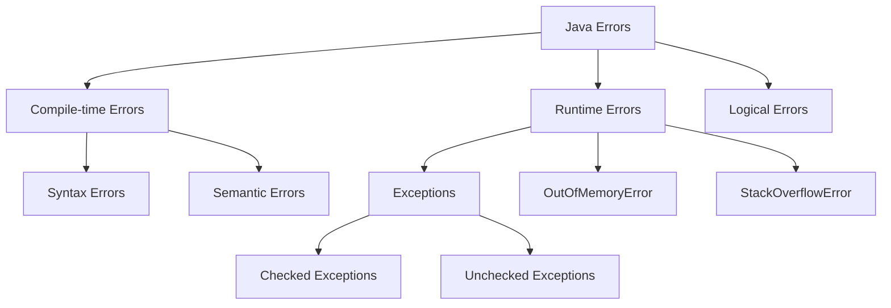
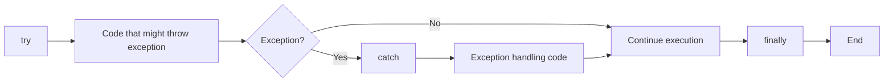
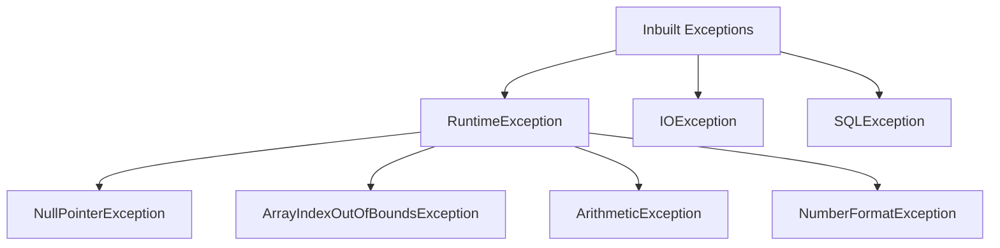
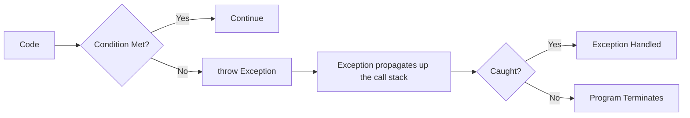
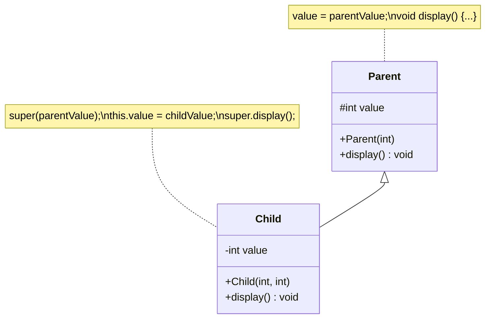

## Question 4(a): List types of errors in Java. (Marks: 03)

### Answer 4(a):

**Types of Errors in Java**:



**Brief Description**:
* **Compile-time Errors**: Detected during compilation
  * **Syntax Errors**: Incorrect syntax/grammar
  * **Semantic Errors**: Wrong types, undeclared variables
* **Runtime Errors**: Occur during program execution
  * **Exceptions**: IOException, NullPointerException
* **Logical Errors**: Program runs but produces incorrect results

**Mnemonic**: "**CRL**" - Compile-time, Runtime, Logical

## Question 4(b): Explain try catch block with example. (Marks: 04)

### Answer 4(b):

**Try-Catch Block**: A mechanism to handle runtime exceptions that may occur during program execution.



**Example Code**:
```java
public class TryCatchDemo {
    public static void main(String[] args) {
        try {
            // Code that might throw exception
            int[] numbers = {1, 2, 3};
            System.out.println("Accessing element: " + numbers[5]); // ArrayIndexOutOfBoundsException
            
            // This line won't execute if exception occurs above
            System.out.println("This won't be printed");
        } 
        catch (ArrayIndexOutOfBoundsException e) {
            // Exception handling code
            System.out.println("Exception caught: Array index out of bounds");
            System.out.println("Error message: " + e.getMessage());
        }
        
        // Program continues execution
        System.out.println("Program continues after exception handling");
    }
}
```

**Key Points**:
* **try**: Contains code that might throw exceptions
* **catch**: Handles specific exceptions that occur in try block
* **finally**: (optional) Always executes, regardless of exception
* Multiple catch blocks can handle different exception types

## Question 4(c): List out any four differences between method overloading and overriding. Write a java code to explain method overriding. (Marks: 07)

### Answer 4(c):

**Differences between Method Overloading and Overriding**:

| Method Overloading | Method Overriding |
|-------------------|-------------------|
| **Same class** | **Parent-child class** relationship |
| **Different parameters** (number, type, order) | **Same parameters** and return type |
| Resolved at **compile-time** | Resolved at **runtime** |
| Increases method **readability** | Supports **polymorphism** |

```mermaid
classDiagram
    class Animal {
        +makeSound() void
    }
    class Dog {
        +makeSound() void
    }
    class Cat {
        +makeSound() void
    }
    Animal <|-- Dog
    Animal <|-- Cat
    
    note for Animal "public void makeSound(){\n  System.out.println(\"Animal sound\");\n}"
    note for Dog "public void makeSound(){\n  System.out.println(\"Woof\");\n}"
    note for Cat "public void makeSound(){\n  System.out.println(\"Meow\");\n}"
```

**Java Code to Explain Method Overriding**:

```java
// Parent class
class Animal {
    // Method to be overridden
    public void makeSound() {
        System.out.println("Animal makes a sound");
    }
}

// Child class 1
class Dog extends Animal {
    // Overriding the parent class method
    @Override
    public void makeSound() {
        System.out.println("Dog barks: Woof! Woof!");
    }
}

// Child class 2
class Cat extends Animal {
    // Overriding the parent class method
    @Override
    public void makeSound() {
        System.out.println("Cat meows: Meow!");
    }
}

// Main class
public class OverridingDemo {
    public static void main(String[] args) {
        // Parent class reference and object
        Animal a1 = new Animal();
        a1.makeSound();  // Output: Animal makes a sound
        
        // Child class objects
        Dog d1 = new Dog();
        d1.makeSound();  // Output: Dog barks: Woof! Woof!
        
        Cat c1 = new Cat();
        c1.makeSound();  // Output: Cat meows: Meow!
        
        // Polymorphic behavior - Parent reference, child objects
        Animal a2 = new Dog();
        a2.makeSound();  // Output: Dog barks: Woof! Woof!
        
        Animal a3 = new Cat();
        a3.makeSound();  // Output: Cat meows: Meow!
    }
}
```

**Mnemonic for Method Overriding**: "**SOAP**" - Same method, Object of child, After inheritance, Polymorphism

## Question 4(a OR): List any four inbuilt exceptions. (Marks: 03)

### Answer 4(a OR):

**Inbuilt Exceptions in Java**:



**Common Inbuilt Exceptions**:
1. **NullPointerException**: When attempting to use null object reference
2. **ArrayIndexOutOfBoundsException**: When accessing invalid array index
3. **ArithmeticException**: For arithmetic errors like division by zero
4. **NumberFormatException**: When attempting to convert invalid string to number
5. **IOException**: When I/O operation fails
6. **ClassNotFoundException**: When trying to access a class that doesn't exist
7. **IllegalArgumentException**: When illegal argument is passed to a method

**Mnemonic**: "**NANI-CIL**" - NullPointer, ArrayIndexOutOfBounds, NumberFormat, IOException, ClassNotFound, IllegalArgument

## Question 4(b OR): Explain "throw" keyword with suitable example. (Marks: 04)

### Answer 4(b OR):

**Throw Keyword**: Used to explicitly throw an exception from a method or block of code.



**Example Code**:
```java
public class ThrowDemo {
    // Method that throws an exception
    static void checkAge(int age) {
        if (age < 18) {
            // Explicitly throw exception
            throw new ArithmeticException("Access denied - You must be at least 18 years old.");
        } else {
            System.out.println("Access granted - You are old enough!");
        }
    }
    
    public static void main(String[] args) {
        try {
            // Test the checkAge method
            checkAge(15);  // This will throw exception
        } catch (ArithmeticException e) {
            System.out.println("Exception caught: " + e.getMessage());
        }
        
        System.out.println("Program continues...");
    }
}
```

**Output**:
```
Exception caught: Access denied - You must be at least 18 years old.
Program continues...
```

**Key Points**:
* **throw** creates a new exception object and throws it
* Can throw **built-in** or **custom exceptions**
* Must be handled by **try-catch** or declared with **throws**
* Used for **custom validation** and error handling

## Question 4(c OR): Compare 'this' keyword Vs 'Super' keyword. Explain super keyword with suitable Example. (Marks: 07)

### Answer 4(c OR):

**Comparison between 'this' and 'super' keywords**:

| 'this' Keyword | 'super' Keyword |
|----------------|-----------------|
| Refers to **current class object** | Refers to **parent class object** |
| Used to access **current class members** | Used to access **parent class members** |
| Used with **constructors**, **methods**, **variables** | Used with **constructors**, **methods**, **variables** |
| Cannot be used in **static context** | Cannot be used in **static context** |
| Used to **eliminate variable shadowing** | Used to **access overridden methods** |



**Java Code to Explain 'super' Keyword**:

```java
// Parent class
class Person {
    // Instance variables
    String name;
    int age;
    
    // Constructor
    Person(String name, int age) {
        this.name = name;
        this.age = age;
    }
    
    // Method
    void display() {
        System.out.println("Name: " + name);
        System.out.println("Age: " + age);
    }
}

// Child class
class Student extends Person {
    // Additional instance variable
    String course;
    
    // Constructor using super
    Student(String name, int age, String course) {
        // Call parent constructor
        super(name, age);
        this.course = course;
    }
    
    // Overriding parent method
    @Override
    void display() {
        // Call parent method
        super.display();
        // Add additional info
        System.out.println("Course: " + course);
    }
    
    // Method to show variable shadowing
    void displayAge(int age) {
        System.out.println("Local age: " + age);
        System.out.println("This object's age: " + this.age);
        System.out.println("Parent class age: " + super.age); // Same as this.age in this case
    }
}

// Main class
public class SuperDemo {
    public static void main(String[] args) {
        // Create Student object
        Student s = new Student("John", 20, "Java Programming");
        
        // Call overridden method
        s.display();
        
        // Test method with local variable shadowing
        s.displayAge(25);
    }
}
```

**Output**:
```
Name: John
Age: 20
Course: Java Programming
Local age: 25
This object's age: 20
Parent class age: 20
```

**Uses of 'super' Keyword**:
* **super()**: Call parent constructor
* **super.variable**: Access parent variable
* **super.method()**: Call parent method

**Mnemonic**: "**CVM**" - Constructor, Variables, Methods (for both this and super)
