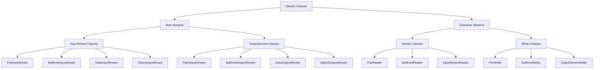
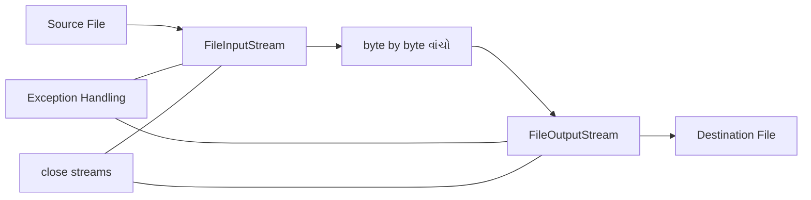
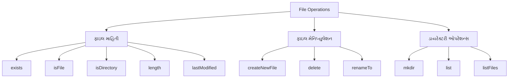

## પ્રશ્ન ૫(અ): વિવિધ Stream Classes ની યાદી આપો. (ગુણ: ૩)

### જવાબ ૫(અ):

જાવામાં I/O માટે વિવિધ Stream Classes છે:



**મુખ્ય Stream Classes**:

1. **Byte Stream Classes**:
   * **InputStream**: FileInputStream, BufferedInputStream, DataInputStream, ObjectInputStream
   * **OutputStream**: FileOutputStream, BufferedOutputStream, DataOutputStream, ObjectOutputStream
   
2. **Character Stream Classes**:
   * **Reader**: FileReader, BufferedReader, InputStreamReader, StringReader
   * **Writer**: FileWriter, BufferedWriter, OutputStreamWriter, StringWriter

3. **બફર્ડ ક્લાસિસ**:
   * BufferedInputStream, BufferedOutputStream, BufferedReader, BufferedWriter

**યાદ રાખવા માટે**: "**BRIC**" - Byte streams, Reader/Writer, Input/Output, Character streams

## પ્રશ્ન ૫(બ): 'Divide by Zero' error માટે user defined exception માટે જાવા પ્રોગ્રામ લખો. (ગુણ: ૪)

### જવાબ ૫(બ):

```java
// કસ્ટમ exception ક્લાસ
class DivideByZeroException extends Exception {
    // કન્સ્ટ્રક્ટર
    public DivideByZeroException(String message) {
        // parent class (Exception) ના કન્સ્ટ્રક્ટરને કૉલ કરે
        super(message);
    }
}

public class UserDefinedException {
    // divide ફંક્શન જે exception ફેંકી શકે
    public static double divide(int numerator, int denominator) throws DivideByZeroException {
        // ડિનોમિનેટર ચેક
        if (denominator == 0) {
            // user defined exception ફેંકો
            throw new DivideByZeroException("શૂન્ય વડે ભાગાકાર થઈ શકતો નથી!");
        }
        
        // ભાગાકાર કરો અને પરિણામ પાછું આપો
        return (double) numerator / denominator;
    }
    
    public static void main(String[] args) {
        // ટેસ્ટ કેસીસ
        int[] numerators = {10, 20, 30};
        int[] denominators = {2, 0, 5};
        
        for (int i = 0; i < numerators.length; i++) {
            try {
                // divide ફંક્શન કૉલ કરો
                double result = divide(numerators[i], denominators[i]);
                System.out.println(numerators[i] + " / " + denominators[i] + " = " + result);
            } 
            catch (DivideByZeroException e) {
                // exception મેસેજ દર્શાવો
                System.out.println("એરર: " + e.getMessage());
                System.out.println("ભાગાકાર: " + numerators[i] + " / " + denominators[i]);
            }
        }
        
        System.out.println("પ્રોગ્રામ સફળતાપૂર્વક પૂર્ણ થયો!");
    }
}
```

**આઉટપુટ**:
```
10 / 2 = 5.0
એરર: શૂન્ય વડે ભાગાકાર થઈ શકતો નથી!
ભાગાકાર: 20 / 0
30 / 5 = 6.0
પ્રોગ્રામ સફળતાપૂર્વક પૂર્ણ થયો!
```

**પ્રોગ્રામનો ફ્લો**:
1. **DivideByZeroException** નામનો કસ્ટમ exception ક્લાસ બનાવો
2. **divide()** મેથડ બનાવો જે 0 દ્વારા ભાગાકાર માટે ચેક કરે
3. **try-catch** બ્લોક્સનો ઉપયોગ કરીને exception હેન્ડલ કરો
4. વિવિધ કેસ ટેસ્ટ કરો અને યોગ્ય મેસેજ દર્શાવો

**યાદ રાખવા માટે**: "**CHET**" - Custom class, Handling with try-catch, Extends Exception, Throw explicitly

## પ્રશ્ન ૫(ક): જાવામાં એક પ્રોગ્રામ લખો જે ફાઇલના કન્ટેન્ટને byte by byte વાંચે અને તેને બીજી ફાઇલમાં કોપી કરે. (ગુણ: ૭)

### જવાબ ૫(ક):



```java
import java.io.FileInputStream;
import java.io.FileOutputStream;
import java.io.IOException;

public class FileCopyByteByByte {
    public static void main(String[] args) {
        // સોર્સ અને ડેસ્ટિનેશન ફાઇલ્સના પાથ
        String sourceFile = "source.txt";
        String destFile = "destination.txt";
        
        // સ્ટ્રીમ્સ ડિક્લેર કરવા
        FileInputStream fis = null;
        FileOutputStream fos = null;
        
        try {
            // સોર્સ ફાઇલ ઓપન કરવી
            fis = new FileInputStream(sourceFile);
            
            // ડેસ્ટિનેશન ફાઇલ ઓપન/ક્રિએટ કરવી
            fos = new FileOutputStream(destFile);
            
            System.out.println("ફાઇલને byte by byte કોપી કરી રહ્યા છીએ...");
            
            int totalBytes = 0;
            int byteData;
            
            // byte by byte વાંચો અને લખો
            // read() મેથડ એક બાઇટ વાંચે છે અને તેને int વેલ્યુ તરીકે પાછો આપે છે
            // જો ફાઇલનો અંત આવી જાય, તો -1 પાછું આપે છે
            while ((byteData = fis.read()) != -1) {
                // વાંચેલા બાઇટને ડેસ્ટિનેશન ફાઇલમાં લખો
                fos.write(byteData);
                totalBytes++;
            }
            
            System.out.println("ફાઇલ સફળતાપૂર્વક કોપી થઈ ગઈ!");
            System.out.println("કુલ " + totalBytes + " બાઇટ્સ કોપી કરવામાં આવ્યા.");
            
        } catch (IOException e) {
            // IO એરર્સ હેન્ડલ કરવા
            System.out.println("ફાઇલ હેન્ડલિંગ એરર: " + e.getMessage());
            e.printStackTrace();
        } finally {
            // હંમેશા સ્ટ્રીમ્સ ક્લોઝ કરવી, પછી ભલે એરર આવી હોય
            try {
                // ઇનપુટ સ્ટ્રીમ ક્લોઝ કરવી
                if (fis != null) {
                    fis.close();
                }
                
                // આઉટપુટ સ્ટ્રીમ ક્લોઝ કરવી
                if (fos != null) {
                    fos.close();
                }
                
                System.out.println("બધી સ્ટ્રીમ્સ ક્લોઝ કરવામાં આવી.");
            } catch (IOException e) {
                System.out.println("સ્ટ્રીમ્સ ક્લોઝ કરતી વખતે એરર: " + e.getMessage());
            }
        }
    }
}
```

**પ્રોગ્રામનો ફ્લો**:
1. **FileInputStream** અને **FileOutputStream** ઓબ્જેક્ટ્સ બનાવવા
2. **read()** મેથડથી એક-એક બાઇટ વાંચવા
3. **write()** મેથડથી એક-એક બાઇટ લખવા
4. **-1** વેલ્યુ ફાઇલના અંતને દર્શાવે છે
5. **finally** બ્લોકમાં સ્ટ્રીમ્સ ક્લોઝ કરવી

**ધ્યાનમાં રાખવાની બાબતો**:
* **એરર હેન્ડલિંગ**: try-catch-finally બ્લોક્સ વાપરવા
* **રિસોર્સ મેનેજમેન્ટ**: હંમેશા સ્ટ્રીમ્સ ક્લોઝ કરવી
* **પરફોર્મન્સ**: બાઇટ-બાય-બાઇટ કોપીંગ ધીમું છે, મોટી ફાઇલ્સ માટે બફર્ડ સ્ટ્રીમ્સ વાપરવી જોઈએ

**યાદ રાખવા માટે**: "**RIOC**" - Read byte by byte, IO streams, One byte at a time, Close resources

## પ્રશ્ન ૫(અ OR): જાવાના વિવિધ file operations ની યાદી આપો. (ગુણ: ૩)

### જવાબ ૫(અ OR):

જાવામાં File operations માટે java.io પેકેજની File ક્લાસ વપરાય છે:



**જાવામાં મુખ્ય File Operations**:

1. **ફાઇલ માહિતી મેળવવી**:
   * `exists()`: ફાઇલ અસ્તિત્વમાં છે કે નહીં
   * `isFile()`: ઓબ્જેક્ટ ફાઇલ છે કે નહીં
   * `isDirectory()`: ઓબ્જેક્ટ ડાયરેક્ટરી છે કે નહીં
   * `length()`: ફાઇલનું કદ (બાઇટ્સમાં)
   * `canRead()`, `canWrite()`: પરમિશન્સ ચેક કરવા
   * `lastModified()`: છેલ્લા ફેરફારનો સમય

2. **ફાઇલ બનાવવી/મોડિફાય કરવી**:
   * `createNewFile()`: નવી ફાઇ## પ્રશ્ન ૫(અ): વિવિધ Stream Classes ની યાદી આપો. (ગુણ: ૩)

### જવાબ ૫(અ):

જાવામાં I/O માટે વિવિધ Stream Classes છે:


**મુખ્ય Stream Classes**:

1. **Byte Stream Classes**:
   * **InputStream**: FileInputStream, BufferedInputStream, DataInputStream, ObjectInputStream
   * **OutputStream**: FileOutputStream, BufferedOutputStream, DataOutputStream, ObjectOutputStream
   
2. **Character Stream Classes**:
   * **Reader**: FileReader, BufferedReader, InputStreamReader, StringReader
   * **Writer**: FileWriter, BufferedWriter, OutputStreamWriter, StringWriter

3. **બફર્ડ ક્લાસિસ**:
   * BufferedInputStream, BufferedOutputStream, BufferedReader, BufferedWriter

**યાદ રાખવા માટે**: "**BRIC**" - Byte streams, Reader/Writer, Input/Output, Character streams

## પ્રશ્ન ૫(બ): 'Divide by Zero' error માટે user defined exception માટે જાવા પ્રોગ્રામ લખો. (ગુણ: ૪)

### જવાબ ૫(બ):

```java
// કસ્ટમ exception ક્લાસ
class DivideByZeroException extends Exception {
    // કન્સ્ટ્રક્ટર
    public DivideByZeroException(String message) {
        // parent class (Exception) ના કન્સ્ટ્રક્ટરને કૉલ કરે
        super(message);
    }
}

public class UserDefinedException {
    // divide ફંક્શન જે exception ફેંકી શકે
    public static double divide(int numerator, int denominator) throws DivideByZeroException {
        // ડિનોમિનેટર ચેક
        if (denominator == 0) {
            // user defined exception ફેંકો
            throw new DivideByZeroException("શૂન્ય વડે ભાગાકાર થઈ શકતો નથી!");
        }
        
        // ભાગાકાર કરો અને પરિણામ પાછું આપો
        return (double) numerator / denominator;
    }
    
    public static void main(String[] args) {
        // ટેસ્ટ કેસીસ
        int[] numerators = {10, 20, 30};
        int[] denominators = {2, 0, 5};
        
        for (int i = 0; i < numerators.length; i++) {
            try {
                // divide ફંક્શન કૉલ કરો
                double result = divide(numerators[i], denominators[i]);
                System.out.println(numerators[i] + " / " + denominators[i] + " = " + result);
            } 
            catch (DivideByZeroException e) {
                // exception મેસેજ દર્શાવો
                System.out.println("એરર: " + e.getMessage());
                System.out.println("ભાગાકાર: " + numerators[i] + " / " + denominators[i]);
            }
        }
        
        System.out.println("પ્રોગ્રામ સફળતાપૂર્વક પૂર્ણ થયો!");
    }
}
```

**આઉટપુટ**:
```
10 / 2 = 5.0
એરર: શૂન્ય વડે ભાગાકાર થઈ શકતો નથી!
ભાગાકાર: 20 / 0
30 / 5 = 6.0
પ્રોગ્રામ સફળતાપૂર્વક પૂર્ણ થયો!
```

**પ્રોગ્રામનો ફ્લો**:
1. **DivideByZeroException** નામનો કસ્ટમ exception ક્લાસ બનાવો
2. **divide()** મેથડ બનાવો જે 0 દ્વારા ભાગાકાર માટે ચેક કરે
3. **try-catch** બ્લોક્સનો ઉપયોગ કરીને exception હેન્ડલ કરો
4. વિવિધ કેસ ટેસ્ટ કરો અને યોગ્ય મેસેજ દર્શાવો

**યાદ રાખવા માટે**: "**CHET**" - Custom class, Handling with try-catch, Extends Exception, Throw explicitly

## પ્રશ્ન ૫(ક): જાવામાં એક પ્રોગ્રામ લખો જે ફાઇલના કન્ટેન્ટને byte by byte વાંચે અને તેને બીજી ફાઇલમાં કોપી કરે. (ગુણ: ૭)

### જવાબ ૫(ક):


```java
import java.io.FileInputStream;
import java.io.FileOutputStream;
import java.io.IOException;

public class FileCopyByteByByte {
    public static void main(String[] args) {
        // સોર્સ અને ડેસ્ટિનેશન ફાઇલ્સના પાથ
        String sourceFile = "source.txt";
        String destFile = "destination.txt";
        
        // સ્ટ્રીમ્સ ડિક્લેર કરવા
        FileInputStream fis = null;
        FileOutputStream fos = null;
        
        try {
            // સોર્સ ફાઇલ ઓપન કરવી
            fis = new FileInputStream(sourceFile);
            
            // ડેસ્ટિનેશન ફાઇલ ઓપન/ક્રિએટ કરવી
            fos = new FileOutputStream(destFile);
            
            System.out.println("ફાઇલને byte by byte કોપી કરી રહ્યા છીએ...");
            
            int totalBytes = 0;
            int byteData;
            
            // byte by byte વાંચો અને લખો
            // read() મેથડ એક બાઇટ વાંચે છે અને તેને int વેલ્યુ તરીકે પાછો આપે છે
            // જો ફાઇલનો અંત આવી જાય, તો -1 પાછું આપે છે
            while ((byteData = fis.read()) != -1) {
                // વાંચેલા બાઇટને ડેસ્ટિનેશન ફાઇલમાં લખો
                fos.write(byteData);
                totalBytes++;
            }
            
            System.out.println("ફાઇલ સફળતાપૂર્વક કોપી થઈ ગઈ!");
            System.out.println("કુલ " + totalBytes + " બાઇટ્સ કોપી કરવામાં આવ્યા.");
            
        } catch (IOException e) {
            // IO એરર્સ હેન્ડલ કરવા
            System.out.println("ફાઇલ હેન્ડલિંગ એરર: " + e.getMessage());
            e.printStackTrace();
        } finally {
            // હંમેશા સ્ટ્રીમ્સ ક્લોઝ કરવી, પછી ભલે એરર આવી હોય
            try {
                // ઇનપુટ સ્ટ્રીમ ક્લોઝ કરવી
                if (fis != null) {
                    fis.close();
                }
                
                // આઉટપુટ સ્ટ્રીમ ક્લોઝ કરવી
                if (fos != null) {
                    fos.close();
                }
                
                System.out.println("બધી સ્ટ્રીમ્સ ક્લોઝ કરવામાં આવી.");
            } catch (IOException e) {
                System.out.println("સ્ટ્રીમ્સ ક્લોઝ કરતી વખતે એરર: " + e.getMessage());
            }
        }
    }
}
```

**પ્રોગ્રામનો ફ્લો**:
1. **FileInputStream** અને **FileOutputStream** ઓબ્જેક્ટ્સ બનાવવા
2. **read()** મેથડથી એક-એક બાઇટ વાંચવા
3. **write()** મેથડથી એક-એક બાઇટ લખવા
4. **-1** વેલ્યુ ફાઇલના અંતને દર્શાવે છે
5. **finally** બ્લોકમાં સ્ટ્રીમ્સ ક્લોઝ કરવી

**ધ્યાનમાં રાખવાની બાબતો**:
* **એરર હેન્ડલિંગ**: try-catch-finally બ્લોક્સ વાપરવા
* **રિસોર્સ મેનેજમેન્ટ**: હંમેશા સ્ટ્રીમ્સ ક્લોઝ કરવી
* **પરફોર્મન્સ**: બાઇટ-બાય-બાઇટ કોપીંગ ધીમું છે, મોટી ફાઇલ્સ માટે બફર્ડ સ્ટ્રીમ્સ વાપરવી જોઈએ

**યાદ રાખવા માટે**: "**RIOC**" - Read byte by byte, IO streams, One byte at a time, Close resources

## પ્રશ્ન ૫(અ OR): જાવાના વિવિધ file operations ની યાદી આપો. (ગુણ: ૩)

### જવાબ ૫(અ OR):

જાવામાં File operations માટે java.io પેકેજની File ક્લાસ વપરાય છે:

```mermaid
graph TD
    A[File Operations] --> B[ફાઇલ માહિતી]
    A --> C[ફાઇલ મેનિપ્યુલેશન]
    A --> D[ડાયરેક્ટરી ઓપરેશન્સ]
    
    B --> B1[exists]
    B --> B2[isFile]
    B --> B3[isDirectory]
    B --> B4[length]
    B --> B5[lastModified]
    
    C --> C1[createNewFile]
    C --> C2[delete]
    C --> C3[renameTo]
    
    D --> D1[mkdir]
    D --> D2[list]
    D --> D3[listFiles]
