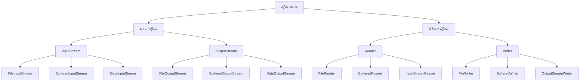
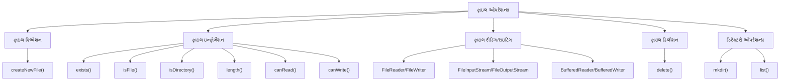
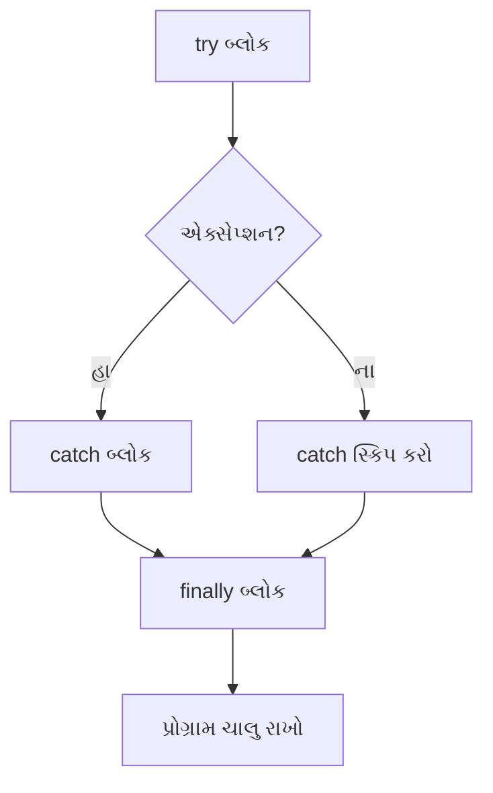
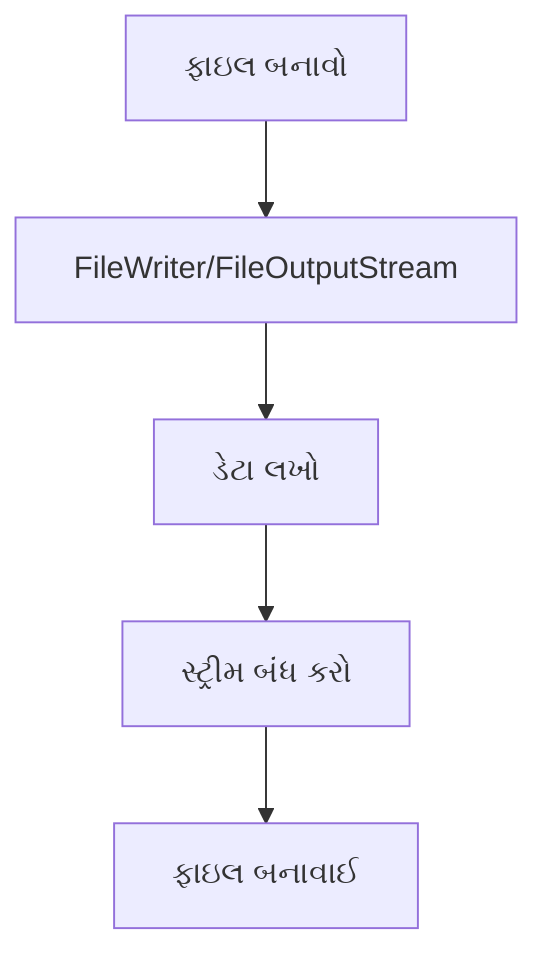

## પ્રશ્ન 5(a): વિવિધ સ્ટ્રીમ ક્લાસની યાદી આપો. (ગુણ: 03)

### જવાબ 5(a):

**જાવા સ્ટ્રીમ ક્લાસ**:



**મુખ્ય સ્ટ્રીમ ક્લાસ**:
* **બાઇટ સ્ટ્રીમ્સ**: ડેટાને બાઇટ બાય બાઇટ (8 બિટ્સ) પ્રોસેસ કરે છે
  * **InputStream**: બાઇટ્સ વાંચવા માટેનો એબ્સ્ટ્રેક્ટ ક્લાસ
  * **OutputStream**: બાઇટ્સ લખવા માટેનો એબ્સ્ટ્રેક્ટ ક્લાસ
* **કેરેક્ટર સ્ટ્રીમ્સ**: ડેટાને કેરેક્ટર બાય કેરેક્ટર (16 બિટ્સ) પ્રોસેસ કરે છે
  * **Reader**: કેરેક્ટર્સ વાંચવા માટેનો એબ્સ્ટ્રેક્ટ ક્લાસ
  * **Writer**: કેરેક્ટર્સ લખવા માટેનો એબ્સ્ટ્રેક્ટ ક્લાસ

**યાદ રાખવા માટેની ટ્રિક**: "**BIOS-RW**" - Byte Input/Output Streams, Reader/Writer

## પ્રશ્ન 5(b): "Divide by zero" એરર માટે યુઝર ડિફાઇન્ડ એક્સેપ્શન ડેવલપ કરવા માટે એક જાવા પ્રોગ્રામ લખો. (ગુણ: 04)

### જવાબ 5(b):

**"Divide by Zero" એરર માટે યુઝર-ડિફાઇન્ડ એક્સેપ્શન**:

```java
// કસ્ટમ એક્સેપ્શન ક્લાસ
class DivideByZeroException extends Exception {
    // કન્સ્ટ્રક્ટર
    public DivideByZeroException(String message) {
        // પેરન્ટ કન્સ્ટ્રક્ટર કૉલ કરો
        super(message);
    }
}

// મુખ્ય ક્લાસ
public class CustomExceptionDemo {
    // કસ્ટમ એક્સેપ્શન થ્રો કરતી મેથડ
    public static double divide(int a, int b) throws DivideByZeroException {
        if (b == 0) {
            // કસ્ટમ એક્સેપ્શન થ્રો કરો
            throw new DivideByZeroException("શૂન્યથી ભાગી શકાતું નથી!");
        }
        return (double) a / b;
    }
    
    public static void main(String[] args) {
        try {
            // divide મેથડ ટેસ્ટ કરો
            System.out.println("10 / 2 = " + divide(10, 2));  // બરાબર કામ કરશે
            System.out.println("10 / 0 = " + divide(10, 0));  // એક્સેપ્શન થ્રો કરશે
        } catch (DivideByZeroException e) {
            System.out.println("કસ્ટમ એક્સેપ્શન: " + e.getMessage());
        } finally {
            System.out.println("પ્રોગ્રામ એક્ઝિક્યુશન પૂર્ણ");
        }
    }
}
```

**આઉટપુટ**:
```
10 / 2 = 5.0
કસ્ટમ એક્સેપ્શન: શૂન્યથી ભાગી શકાતું નથી!
પ્રોગ્રામ એક્ઝિક્યુશન પૂર્ણ
```

**યુઝર-ડિફાઇન્ડ એક્સેપ્શન બનાવવાના પગલાં**:
1. Exception **એક્સટેન્ડ કરતો ક્લાસ બનાવો**
2. પેરન્ટને મેસેજ પાસ કરવા માટે **કન્સ્ટ્રક્ટર ડિફાઇન** કરો
3. જ્યારે કન્ડિશન મળે ત્યારે **એક્સેપ્શન થ્રો** કરો
4. try-catch બ્લોક સાથે **એક્સેપ્શન હેન્ડલ** કરો

## પ્રશ્ન 5(c): જાવામાં એક પ્રોગ્રામ લખો જે ફાઇલની સામગ્રીને બાઇટ બાય બાઇટ વાંચે અને તેને બીજી ફાઇલમાં કોપી કરે. (ગુણ: 07)

### જવાબ 5(c):


**બાઇટ બાય બાઇટ ફાઇલ કોપી કરવા માટે જાવા પ્રોગ્રામ**:

```java
import java.io.FileInputStream;
import java.io.FileOutputStream;
import java.io.IOException;

public class FileCopyByteByByte {
    public static void main(String[] args) {
        // સોર્સ અને ડેસ્ટિનેશન ફાઇલ પાથ
        String sourceFile = "source.txt";
        String destFile = "destination.txt";
        
        // ફાઇલ સ્ટ્રીમ્સ ડિક્લેર કરો
        FileInputStream fis = null;
        FileOutputStream fos = null;
        
        try {
            // ઇનપુટ સ્ટ્રીમ ઇનિશિયલાઇઝ કરો
            fis = new FileInputStream(sourceFile);
            
            // આઉટપુટ સ્ટ્રીમ ઇનિશિયલાઇઝ કરો
            fos = new FileOutputStream(destFile);
            
            // દરેક બાઇટ સ્ટોર કરવા માટે વેરિએબલ
            int byteData;
            
            // બાઇટ બાય બાઇટ વાંચો અને લખો
            System.out.println("બાઇટ બાય બાઇટ ફાઇલ કોપી કરી રહ્યા છીએ...");
            while ((byteData = fis.read()) != -1) {
                // બાઇટને ડેસ્ટિનેશન ફાઇલમાં લખો
                fos.write(byteData);
            }
            
            System.out.println("ફાઇલ સફળતાપૂર્વક કોપી થઈ ગઈ!");
            
        } catch (IOException e) {
            System.out.println("એરર: " + e.getMessage());
            e.printStackTrace();
        } finally {
            // સ્ટ્રીમ્સ બંધ કરો
            try {
                if (fis != null) {
                    fis.close();
                }
                if (fos != null) {
                    fos.close();
                }
            } catch (IOException e) {
                System.out.println("સ્ટ્રીમ્સ બંધ કરવામાં એરર: " + e.getMessage());
            }
        }
    }
}
```

**ફાઇલ હેન્ડલિંગ વિશે મુખ્ય મુદ્દાઓ**:
* સ્ટ્રીમ્સ **હંમેશા finally બ્લોકમાં બંધ** કરો
* Java 7+ માં ઓટોમેટિક બંધ કરવા માટે **try-with-resources** વાપરો
* **BufferedInputStream/BufferedOutputStream** પરફોર્મન્સ સુધારે છે
* **બાઇટ-બાય-બાઇટ** કોપીઇંગ બધા ફાઇલ ટાઇપ્સ (ટેક્સ્ટ અને બાઇનરી) માટે કામ કરે છે

**ફાઇલ કોપી કરવાના પગલાં માટે યાદ રાખવાની ટ્રિક**: "**CROW**" - Create streams, Read source, Output to destination, Wrap up (close)

## પ્રશ્ન 5(a OR): જાવામાં વિવિધ ફાઇલ ઓપરેશન્સની યાદી આપો. (ગુણ: 03)

### જવાબ 5(a OR):

**જાવામાં ફાઇલ ઓપરેશન્સ**:



**સામાન્ય ફાઇલ ઓપરેશન્સ**:
* **ફાઇલ ક્રિએશન**: નવી ફાઇલ્સ બનાવવી
* **ફાઇલ ઇન્ફોર્મેશન**: ફાઇલ એટ્રિબ્યુટ્સ ચેક કરવા
* **ફાઇલ રીડિંગ**: ફાઇલમાંથી ડેટા વાંચવો
* **ફાઇલ રાઇટિંગ**: ફાઇલમાં ડેટા લખવો 
* **ફાઇલ ડિલીશન**: ફાઇલ્સ ડિલીટ કરવી
* **ડિરેક્ટરી ઓપરેશન્સ**: ડિરેક્ટરી બનાવવી અને મેનેજ કરવી

**ફાઇલ ઓપરેશન્સ માટે મેથડ્સ**:
* **createNewFile()**: નવી ફાઇલ બનાવે છે
* **exists()**: ફાઇલ અસ્તિત્વમાં છે કે નહીં તે ચેક કરે છે
* **delete()**: ફાઇલ ડિલીટ કરે છે
* **mkdir()**: ડિરેક્ટરી બનાવે છે
* **list()**: ડિરેક્ટરીમાં ફાઇલ્સની યાદી આપે છે
* **length()**: ફાઇલનું સાઇઝ મેળવે છે

**યાદ રાખવા માટેની ટ્રિક**: "**CIRDWD**" - Create, Info, Read, Delete, Write, Directory

## પ્રશ્ન 5(b OR): એક્સેપ્શન હેન્ડલિંગમાં finally બ્લોક સમજાવવા માટે એક જાવા પ્રોગ્રામ લખો. (ગુણ: 04)

### જવાબ 5(b OR):

**Finally બ્લોક**: એવો બ્લોક જે એક્સેપ્શન થ્રો થાય કે ન થાય, **હંમેશા એક્ઝિક્યુટ** થાય છે, સામાન્ય રીતે ક્લીનઅપ ઓપરેશન્સ માટે વપરાય છે.



**Finally બ્લોક સમજાવવા માટે જાવા પ્રોગ્રામ**:

```java
import java.io.FileInputStream;
import java.io.FileNotFoundException;
import java.io.IOException;

public class FinallyBlockDemo {
    public static void main(String[] args) {
        FileInputStream fis = null;
        
        try {
            // ફાઇલ ખોલવાનો પ્રયાસ કરો
            System.out.println("try બ્લોકની અંદર");
            fis = new FileInputStream("nonexistent.txt");  // એક્સેપ્શન થ્રો કરશે
            
            // જો ઉપર એક્સેપ્શન થાય તો આ એક્ઝિક્યુટ નહીં થાય
            System.out.println("ફાઇલ સફળતાપૂર્વક ખોલી");
            
        } catch (FileNotFoundException e) {
            // એક્સેપ્શન હેન્ડલ કરો
            System.out.println("catch બ્લોકની અંદર");
            System.out.println("એક્સેપ્શન: " + e.getMessage());
            
        } finally {
            // હંમેશા એક્ઝિક્યુટ થાય છે
            System.out.println("finally બ્લોકની અંદર");
            
            // રિસોર્સ બંધ કરો
            try {
                if (fis != null) {
                    fis.close();
                }
                System.out.println("ફાઇલ સ્ટ્રીમ બંધ કરી");
            } catch (IOException e) {
                System.out.println("ફાઇલ બંધ કરવામાં એરર: " + e.getMessage());
            }
            
            System.out.println("finally બ્લોક એક્ઝિક્યુટ થયો");
        }
        
        System.out.println("try-catch-finally પછી પ્રોગ્રામ ચાલુ રહે છે");
    }
}
```

**આઉટપુટ**:
```
try બ્લોકની અંદર
catch બ્લોકની અંદર
એક્સેપ્શન: nonexistent.txt (આવી કોઈ ફાઇલ કે ડિરેક્ટરી નથી)
finally બ્લોકની અંદર
ફાઇલ સ્ટ્રીમ બંધ કરી
finally બ્લોક એક્ઝિક્યુટ થયો
try-catch-finally પછી પ્રોગ્રામ ચાલુ રહે છે
```

**Finally બ્લોક વિશે મુખ્ય મુદ્દાઓ**:
* એક્સેપ્શન થાય કે ન થાય, **હંમેશા એક્ઝિક્યુટ** થાય છે
* **રિસોર્સ ક્લીનઅપ** (ફાઇલ્સ, કનેક્શન્સ બંધ કરવા) માટે વપરાય છે
* મેથડ રિટર્ન થાય તે **પહેલાં એક્ઝિક્યુટ** થાય છે
* catch બ્લોક **વિના પણ અસ્તિત્વમાં** હોઈ શકે છે (try-finally)

## પ્રશ્ન 5(c OR): ફાઇલ બનાવવા અને તેના પર રાઇટ ઓપરેશન કરવા માટે એક જાવા પ્રોગ્રામ લખો. (ગુણ: 07)

### જવાબ 5(c OR):



**ફાઇલ બનાવવા અને લખવા માટે જાવા પ્રોગ્રામ**:

```java
import java.io.BufferedWriter;
import java.io.File;
import java.io.FileWriter;
import java.io.IOException;

public class FileCreateAndWrite {
    public static void main(String[] args) {
        // ફાઇલ પાથ
        String filePath = "myfile.txt";
        
        // લખવાની સામગ્રી
        String content = "હેલો, આ સેમ્પલ ટેક્સ્ટ છે.\n";
        content += "આ ફાઇલ જાવા I/O ઓપરેશન્સનો ઉપયોગ કરીને બનાવવામાં આવી છે.\n";
        content += "જાવા ફાઇલ હેન્ડલિંગને સરળ બનાવે છે!";
        
        // ફાઇલ રાઇટર ઓબ્જેક્ટ્સ
        FileWriter fw = null;
        BufferedWriter bw = null;
        
        try {
            // પગલું 1: File ઓબ્જેક્ટ બનાવો
            File file = new File(filePath);
            
            // ચેક કરો કે ફાઇલ પહેલેથી અસ્તિત્વમાં છે કે નહીં
            if (file.exists()) {
                System.out.println("ફાઇલ પહેલેથી અસ્તિત્વમાં છે: " + filePath);
            } else {
                // નવી ફાઇલ બનાવો
                if (file.createNewFile()) {
                    System.out.println("ફાઇલ બનાવી: " + filePath);
                } else {
                    System.out.println("ફાઇલ બનાવવામાં નિષ્ફળતા");
                    return;
                }
            }
            
            // પગલું 2: FileWriter બનાવો
            fw = new FileWriter(file);
            
            // પગલું 3: બેટર પરફોર્મન્સ માટે BufferedWriter બનાવો
            bw = new BufferedWriter(fw);
            
            // પગલું 4: ફાઇલમાં સામગ્રી લખો
            bw.write(content);
            
            System.out.println("ફાઇલમાં સફળતાપૂર્વક લખાણ થયું");
            
        } catch (IOException e) {
            System.out.println("એરર આવી: " + e.getMessage());
            e.printStackTrace();
        } finally {
            try {
                // પગલું 5: રિસોર્સ બંધ કરો
                if (bw != null) {
                    bw.close();
                }
                if (fw != null) {
                    fw.close();
                }
            } catch (IOException e) {
                System.out.println("રિસોર્સ બંધ કરવામાં એરર: " + e.getMessage());
            }
        }
        
        // ફાઇલ ઇન્ફોર્મેશન વેરિફાય કરો
        File file = new File(filePath);
        if (file.exists()) {
            System.out.println("\nફાઇલ ઇન્ફોર્મેશન:");
            System.out.println("પાથ: " + file.getAbsolutePath());
            System.out.println("સાઇઝ: " + file.length() + " બાઇટ્સ");
            System.out.println("વાંચી શકાય: " + file.canRead());
            System.out.println("લખી શકાય: " + file.canWrite());
        }
    }
}
```

**ફાઇલ બનાવવા અને લખવાના પગલાં**:
1. **File ઓબ્જેક્ટ બનાવો**: ફાઇલ પાથનું પ્રતિનિધિત્વ કરે છે
2. **ફાઇલ બનાવો**: createNewFile() મેથડનો ઉપયોગ કરો
3. **રાઇટર ઇનિશિયલાઇઝ કરો**: FileWriter અથવા FileOutputStream
4. **ડેટા લખો**: ફાઇલમાં સામગ્રી લખો
5. **રિસોર્સ બંધ કરો**: સિસ્ટમ રિસોર્સ છોડો

**ફાઇલ રાઇટર મેથડ્સ**:
* **write(String)**: સ્ટ્રિંગને ફાઇલમાં લખે છે
* **write(char[])**: કેરેક્ટર એરેને લખે છે
* **newLine()**: નવી લાઇન ઉમેરે છે (ફક્ત BufferedWriter)
* **append(char)**: અંતમાં કેરેક્ટર જોડે છે
* **flush()**: ડિસ્કમાં લખવા માટે ફોર્સ કરે છે

**ફાઇલ રાઇટિંગના પગલાં માટે યાદ રાખવાની ટ્રિક**: "**FICRW**" - File object, Initialize, Create, Resource, Write