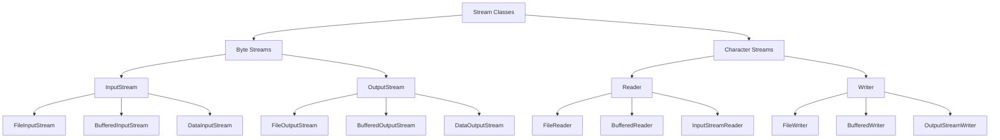
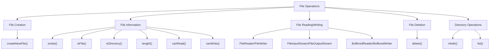
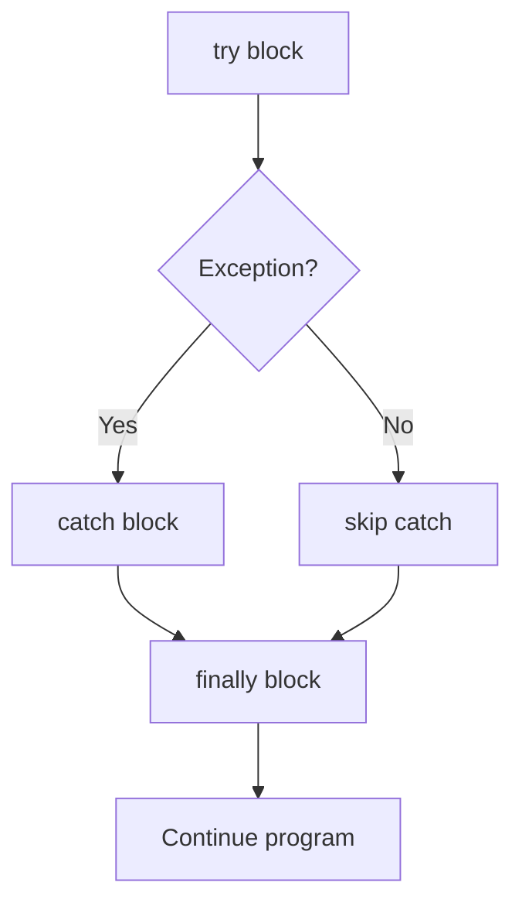
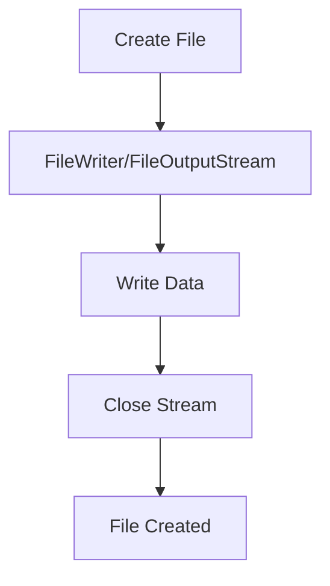

## Question 5(a): List Different Stream Classes. (Marks: 03)

### Answer 5(a):

**Java Stream Classes**:



**Key Stream Classes**:
* **Byte Streams**: Process data byte by byte (8 bits)
  * **InputStream**: Abstract class for reading bytes
  * **OutputStream**: Abstract class for writing bytes
* **Character Streams**: Process data character by character (16 bits)
  * **Reader**: Abstract class for reading characters
  * **Writer**: Abstract class for writing characters

**Mnemonic**: "**BIOS-RW**" - Byte Input/Output Streams, Reader/Writer

## Question 5(b): Write a java program to develop user defined exception for "Divide by zero" error. (Marks: 04)

### Answer 5(b):

**User-Defined Exception for "Divide by Zero" Error**:

```java
// Custom exception class
class DivideByZeroException extends Exception {
    // Constructor
    public DivideByZeroException(String message) {
        // Call parent constructor
        super(message);
    }
}

// Main class
public class CustomExceptionDemo {
    // Method that throws custom exception
    public static double divide(int a, int b) throws DivideByZeroException {
        if (b == 0) {
            // Throw custom exception
            throw new DivideByZeroException("Cannot divide by zero!");
        }
        return (double) a / b;
    }
    
    public static void main(String[] args) {
        try {
            // Test the divide method
            System.out.println("10 / 2 = " + divide(10, 2));  // Works fine
            System.out.println("10 / 0 = " + divide(10, 0));  // Throws exception
        } catch (DivideByZeroException e) {
            System.out.println("Custom Exception: " + e.getMessage());
        } finally {
            System.out.println("Program execution complete");
        }
    }
}
```

**Output**:
```
10 / 2 = 5.0
Custom Exception: Cannot divide by zero!
Program execution complete
```

**Steps to Create User-Defined Exception**:
1. **Create class** extending Exception
2. **Define constructor** to pass message to parent
3. **Throw exception** when condition is met
4. **Handle exception** with try-catch block

## Question 5(c): Write a program in Java that reads the content of a file byte by byte and copy it into another file. (Marks: 07)

### Answer 5(c):


**Java Program to Copy File Byte by Byte**:

```java
import java.io.FileInputStream;
import java.io.FileOutputStream;
import java.io.IOException;

public class FileCopyByteByByte {
    public static void main(String[] args) {
        // Source and destination file paths
        String sourceFile = "source.txt";
        String destFile = "destination.txt";
        
        // Declare file streams
        FileInputStream fis = null;
        FileOutputStream fos = null;
        
        try {
            // Initialize input stream
            fis = new FileInputStream(sourceFile);
            
            // Initialize output stream
            fos = new FileOutputStream(destFile);
            
            // Variable to store each byte
            int byteData;
            
            // Read and write byte by byte
            System.out.println("Copying file byte by byte...");
            while ((byteData = fis.read()) != -1) {
                // Write the byte to destination file
                fos.write(byteData);
            }
            
            System.out.println("File copied successfully!");
            
        } catch (IOException e) {
            System.out.println("Error: " + e.getMessage());
            e.printStackTrace();
        } finally {
            // Close streams
            try {
                if (fis != null) {
                    fis.close();
                }
                if (fos != null) {
                    fos.close();
                }
            } catch (IOException e) {
                System.out.println("Error closing streams: " + e.getMessage());
            }
        }
    }
}
```

**Key Points about File Handling**:
* **Always close** streams in finally block
* Use **try-with-resources** in Java 7+ for automatic closing
* **BufferedInputStream/BufferedOutputStream** improve performance
* **Byte-by-byte** copying works for all file types (text and binary)

**Mnemonic for File Copying Steps**: "**CROW**" - Create streams, Read source, Output to destination, Wrap up (close)

## Question 5(a OR): List different file operations in Java. (Marks: 03)

### Answer 5(a OR):

**File Operations in Java**:



**Common File Operations**:
* **File Creation**: Create new files
* **File Information**: Check file attributes
* **File Reading**: Read data from files
* **File Writing**: Write data to files 
* **File Deletion**: Delete files
* **Directory Operations**: Create and manage directories

**Methods for File Operations**:
* **createNewFile()**: Creates new file
* **exists()**: Checks if file exists
* **delete()**: Deletes file
* **mkdir()**: Creates directory
* **list()**: Lists files in directory
* **length()**: Gets file size

**Mnemonic**: "**CIRDWD**" - Create, Info, Read, Delete, Write, Directory

## Question 5(b OR): Write a java program to explain finally block in exception handling. (Marks: 04)

### Answer 5(b OR):

**Finally Block**: A block that **always executes** regardless of whether an exception is thrown or caught, typically used for cleanup operations.



**Java Program to Explain Finally Block**:

```java
import java.io.FileInputStream;
import java.io.FileNotFoundException;
import java.io.IOException;

public class FinallyBlockDemo {
    public static void main(String[] args) {
        FileInputStream fis = null;
        
        try {
            // Try to open file
            System.out.println("Inside try block");
            fis = new FileInputStream("nonexistent.txt");  // Will throw exception
            
            // This won't execute if exception occurs
            System.out.println("File opened successfully");
            
        } catch (FileNotFoundException e) {
            // Handle the exception
            System.out.println("Inside catch block");
            System.out.println("Exception: " + e.getMessage());
            
        } finally {
            // Always executes
            System.out.println("Inside finally block");
            
            // Close resource
            try {
                if (fis != null) {
                    fis.close();
                }
                System.out.println("File stream closed");
            } catch (IOException e) {
                System.out.println("Error closing file: " + e.getMessage());
            }
            
            System.out.println("Finally block executed");
        }
        
        System.out.println("Program continues after try-catch-finally");
    }
}
```

**Output**:
```
Inside try block
Inside catch block
Exception: nonexistent.txt (No such file or directory)
Inside finally block
File stream closed
Finally block executed
Program continues after try-catch-finally
```

**Key Points about Finally Block**:
* **Always executes** whether exception occurs or not
* Used for **cleanup resources** (close files, connections)
* Executes **before method returns**
* Can exist **without catch** block (try-finally)

## Question 5(c OR): Write a java program to create a file and perform write operation on this file. (Marks: 07)

### Answer 5(c OR):



**Java Program to Create and Write to a File**:

```java
import java.io.BufferedWriter;
import java.io.File;
import java.io.FileWriter;
import java.io.IOException;

public class FileCreateAndWrite {
    public static void main(String[] args) {
        // File path
        String filePath = "myfile.txt";
        
        // Content to write
        String content = "Hello, this is a sample text.\n";
        content += "This file was created using Java I/O operations.\n";
        content += "Java makes file handling easy!";
        
        // File writer objects
        FileWriter fw = null;
        BufferedWriter bw = null;
        
        try {
            // Step 1: Create File object
            File file = new File(filePath);
            
            // Check if file already exists
            if (file.exists()) {
                System.out.println("File already exists: " + filePath);
            } else {
                // Create new file
                if (file.createNewFile()) {
                    System.out.println("File created: " + filePath);
                } else {
                    System.out.println("Failed to create file");
                    return;
                }
            }
            
            // Step 2: Create FileWriter
            fw = new FileWriter(file);
            
            // Step 3: Create BufferedWriter for better performance
            bw = new BufferedWriter(fw);
            
            // Step 4: Write content to file
            bw.write(content);
            
            System.out.println("Successfully wrote to the file");
            
        } catch (IOException e) {
            System.out.println("An error occurred: " + e.getMessage());
            e.printStackTrace();
        } finally {
            try {
                // Step 5: Close resources
                if (bw != null) {
                    bw.close();
                }
                if (fw != null) {
                    fw.close();
                }
            } catch (IOException e) {
                System.out.println("Error closing resources: " + e.getMessage());
            }
        }
        
        // Verify file information
        File file = new File(filePath);
        if (file.exists()) {
            System.out.println("\nFile Information:");
            System.out.println("Path: " + file.getAbsolutePath());
            System.out.println("Size: " + file.length() + " bytes");
            System.out.println("Readable: " + file.canRead());
            System.out.println("Writable: " + file.canWrite());
        }
    }
}
```

**Steps to Create and Write to a File**:
1. **Create File object**: Represents the file path
2. **Create file**: Use createNewFile() method
3. **Initialize writer**: FileWriter or FileOutputStream
4. **Write data**: Write content to file
5. **Close resources**: Release system resources

**File Writer Methods**:
* **write(String)**: Writes string to file
* **write(char[])**: Writes character array
* **newLine()**: Adds new line (BufferedWriter only)
* **append(char)**: Appends character to end
* **flush()**: Forces write to disk

**Mnemonic for File Writing Steps**: "**FICRW**" - File object, Initialize, Create, Resource, Write
